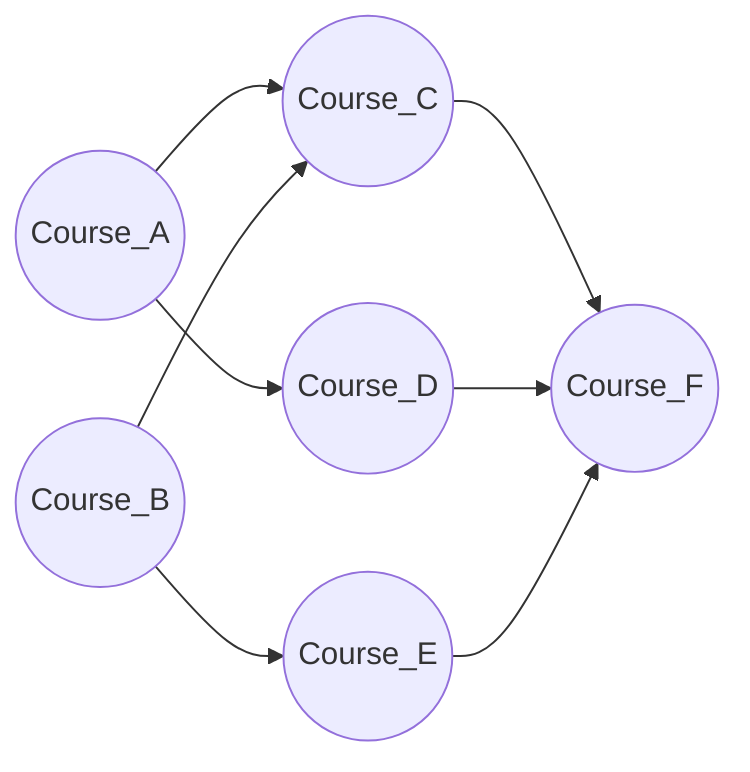

---
title: Topological Sort
aliases: [Topological Ordering, Kahn's Algorithm, Topo Sort]
tags: [DSA, Graphs, TopologicalSort, DAG, BFS, DFS]
domain: DSA
difficulty: Intermediate
created: 2026-07-26
related: [DFS, BFS, Graph_Representation, Union_Find]
status: complete
---

# 📋 Topological Sort

> [!abstract] TL;DR
> Topological sort produces a **linear ordering of vertices in a DAG** such that for every directed edge (u → v), vertex u appears before v. Two algorithms: **Kahn's** (BFS with in-degree queue, naturally detects cycles) and **DFS-based** (reverse of finish order). Only works on Directed Acyclic Graphs — if a cycle exists, no topological order exists.

---

## Intuition — Analogy First

Getting dressed in the morning has dependencies: you must put on **underwear before pants**, **socks before shoes**, **shirt before jacket**. But it doesn't matter whether you put on socks before or after your shirt. A topological sort gives you **one valid order** to satisfy all constraints.

- **Kahn's Algorithm:** Start with whatever you can do right now (no prerequisites). Do one task, which might unlock new tasks. Repeat. If you can't complete everything, there's a circular dependency (cycle).
- **DFS-based:** Go as deep as possible in the dependency chain, finish the leaf first, then backtrack. The reverse of the finish order is a valid topological ordering.

---

## How It Works + Mermaid

### Kahn's Algorithm (BFS-based)
1. Compute **in-degree** (number of incoming edges) for every node.
2. Initialize a queue with all nodes of in-degree 0 (no prerequisites).
3. Repeat: dequeue a node u, add to result, decrease in-degree of all neighbors. If any neighbor's in-degree reaches 0, enqueue it.
4. If result has < V nodes → **cycle detected** (those nodes are stuck in the cycle).

### DFS-based Topological Sort
1. For each unvisited node, run DFS.
2. When DFS finishes a node (all descendants processed), **push to a stack**.
3. Reverse the stack → topological order.
4. Cycle detection: if you reach a node currently on the DFS call stack (gray node), a cycle exists.



**Kahn's steps on above graph:**

| Step | Queue       | Result                    | In-degrees updated         |
|------|-------------|---------------------------|----------------------------|
| Init | [A, B]      | []                        | C:2, D:1, E:1, F:3         |
| 1    | [B]         | [A]                       | C:1, D:0 → enqueue D       |
| 2    | [D]         | [A, B]                    | C:0→enqueue, E:0→enqueue   |
| 3    | [C, E]      | [A, B, D]                 | F:2                        |
| 4    | [E]         | [A, B, D, C]              | F:1                        |
| 5    | []          | [A, B, D, C, E]           | F:0→enqueue                |
| 6    | []          | [A, B, D, C, E, F]        | Done                       |

---

## Complexity Analysis

| Algorithm      | Time   | Space  | Cycle Detection | Notes                                 |
|----------------|--------|--------|-----------------|---------------------------------------|
| Kahn's (BFS)   | O(V+E) | O(V+E) | Yes (natural)   | If result.len < V, cycle exists       |
| DFS-based      | O(V+E) | O(V)   | Yes (gray nodes)| Stack space O(V) for recursion        |
| Both           | O(V+E) | O(V+E) | Yes             | Same asymptotic; Kahn's often simpler |

Both algorithms are linear in the graph size. The choice comes down to:
- **Kahn's:** More intuitive, iterative (no recursion stack overflow), cycle detection built-in.
- **DFS:** More natural when you're already doing DFS traversal; sometimes easier to implement for certain problem variants.

---

## Implementation (Python)

```python
from collections import deque
from typing import List, Optional

# =========================================================
# 1. KAHN'S ALGORITHM (BFS-based)
# =========================================================
def topological_sort_kahns(n: int, prerequisites: List[List[int]]) -> List[int]:
    """
    Returns topological order, or [] if cycle detected.
    prerequisites: [[a, b]] means b -> a (b must come before a).
    """
    in_degree = [0] * n
    graph = [[] for _ in range(n)]

    for course, prereq in prerequisites:
        graph[prereq].append(course)
        in_degree[course] += 1

    # Start with all nodes that have no prerequisites
    queue = deque(i for i in range(n) if in_degree[i] == 0)
    result = []

    while queue:
        node = queue.popleft()
        result.append(node)

        for neighbor in graph[node]:
            in_degree[neighbor] -= 1
            if in_degree[neighbor] == 0:
                queue.append(neighbor)

    # If we couldn't process all nodes, there's a cycle
    return result if len(result) == n else []


# =========================================================
# 2. DFS-BASED TOPOLOGICAL SORT
# =========================================================
def topological_sort_dfs(n: int, prerequisites: List[List[int]]) -> List[int]:
    """
    Returns topological order using DFS, or [] if cycle detected.
    """
    graph = [[] for _ in range(n)]
    for course, prereq in prerequisites:
        graph[prereq].append(course)

    # States: 0=unvisited, 1=visiting (on stack), 2=visited
    state = [0] * n
    result = []
    has_cycle = [False]

    def dfs(node: int):
        if has_cycle[0]:
            return
        state[node] = 1  # mark as visiting

        for neighbor in graph[node]:
            if state[neighbor] == 1:  # back edge → cycle!
                has_cycle[0] = True
                return
            if state[neighbor] == 0:
                dfs(neighbor)

        state[node] = 2  # mark as fully processed
        result.append(node)  # add to stack (will be reversed)

    for i in range(n):
        if state[i] == 0:
            dfs(i)

    if has_cycle[0]:
        return []
    return result[::-1]  # reverse gives topological order


# =========================================================
# 3. COURSE SCHEDULE I — Can you finish all courses?
# =========================================================
def canFinish(numCourses: int, prerequisites: List[List[int]]) -> bool:
    order = topological_sort_kahns(numCourses, prerequisites)
    return len(order) == numCourses


# =========================================================
# 4. COURSE SCHEDULE II — Return one valid order
# =========================================================
def findOrder(numCourses: int, prerequisites: List[List[int]]) -> List[int]:
    return topological_sort_kahns(numCourses, prerequisites)


# =========================================================
# 5. ALIEN DICTIONARY — derive character ordering
# =========================================================
def alienOrder(words: List[str]) -> str:
    # Build graph from adjacent words in the dictionary
    chars = set(c for word in words for c in word)
    graph = {c: set() for c in chars}
    in_degree = {c: 0 for c in chars}

    for i in range(len(words) - 1):
        w1, w2 = words[i], words[i+1]
        min_len = min(len(w1), len(w2))
        # Check invalid: "abc" before "ab" is impossible
        if len(w1) > len(w2) and w1[:min_len] == w2[:min_len]:
            return ""
        for j in range(min_len):
            if w1[j] != w2[j]:
                if w2[j] not in graph[w1[j]]:
                    graph[w1[j]].add(w2[j])
                    in_degree[w2[j]] += 1
                break

    # Kahn's on character graph
    queue = deque(c for c in in_degree if in_degree[c] == 0)
    result = []
    while queue:
        c = queue.popleft()
        result.append(c)
        for neighbor in graph[c]:
            in_degree[neighbor] -= 1
            if in_degree[neighbor] == 0:
                queue.append(neighbor)

    return "".join(result) if len(result) == len(chars) else ""
```

---

## Dry Run / Example Trace

**Course Schedule: n=4, prerequisites = [[1,0],[2,0],[3,1],[3,2]]**
(meaning: 0→1, 0→2, 1→3, 2→3)

```
Build graph:
  graph[0] = [1, 2]
  graph[1] = [3]
  graph[2] = [3]

in_degree = [0, 1, 1, 2]

Initial queue: [0]  (only node 0 has in_degree 0)

Step 1: pop 0, result=[0]
  neighbor 1: in_degree[1] = 1-1 = 0 → enqueue 1
  neighbor 2: in_degree[2] = 1-1 = 0 → enqueue 2
  queue = [1, 2]

Step 2: pop 1, result=[0,1]
  neighbor 3: in_degree[3] = 2-1 = 1
  queue = [2]

Step 3: pop 2, result=[0,1,2]
  neighbor 3: in_degree[3] = 1-1 = 0 → enqueue 3
  queue = [3]

Step 4: pop 3, result=[0,1,2,3]
  no neighbors
  queue = []

len(result)=4 == n=4 → NO cycle. Valid order: [0,1,2,3]
```

---

## Patterns & LeetCode Applications

| Problem                      | LC #  | Key Insight                                                      |
|------------------------------|-------|------------------------------------------------------------------|
| Course Schedule I            | 207   | Cycle detection via topo sort — if cycle, can't finish           |
| Course Schedule II           | 210   | Return the topological order itself                              |
| Alien Dictionary             | 269   | Build character ordering graph from adjacent word comparisons    |
| Sequence Reconstruction      | 444   | Check if topo order is unique (queue size never > 1)            |
| Minimum Height Trees         | 310   | Topological pruning from leaves inward                          |
| Parallel Courses             | 1136  | Longest path in DAG = minimum semesters needed                  |
| Build a Matrix With Conditions| 2392 | Two separate topo sorts for row and column ordering              |

**Unique topological order check:** At each step, if the BFS queue has exactly 1 element, the order is forced. If it ever has > 1 element, multiple valid orderings exist.

---

## Common Pitfalls

1. **Directed vs undirected:** Topological sort is only defined for **directed** graphs. Undirected graphs don't have a topological ordering.
2. **Cycle = no valid order:** If `len(result) < n` after Kahn's, the graph has a cycle — return empty or indicate impossibility.
3. **Edge direction in prerequisites:** LeetCode's `[a, b]` usually means "b is a prerequisite for a" (b→a). Double-check the problem statement.
4. **DFS color confusion:** Use 3 states (unvisited/visiting/visited), not just visited/unvisited. You need to distinguish nodes currently on the DFS stack from fully processed nodes.
5. **Isolated nodes:** Nodes with no edges still appear in the topological order — don't forget to initialize their in-degrees to 0.
6. **Multiple valid orderings:** Topo sort is not unique — there can be many valid orderings. Only the constraints matter.

---

## Related Concepts

- [[_MOC_Graphs|↑ Section MOC]]
- [[DFS]] — the foundation of DFS-based topological sort
- [[BFS]] — used in Kahn's algorithm
- [[Graph_Representation]] — adjacency list + in-degree array
- [[Union_Find]] — alternative for cycle detection in undirected graphs

---

## Review Questions

1. **Kahn's algorithm naturally detects cycles. Explain the mechanism — why does the algorithm produce a result with fewer than V nodes when a cycle exists?**
2. **In the DFS-based approach, why is the topological order the reverse of the DFS finish order?** Trace through a 3-node DAG to demonstrate.
3. **The Alien Dictionary problem requires deriving character ordering from a word list. What edge case makes the result invalid that isn't about a cycle?** (Hint: think about word length ordering.)

---

## Sources

- CLRS — Introduction to Algorithms, Ch. 22.4 (Topological Sort)
- [CP-Algorithms — Topological Sort](https://cp-algorithms.com/graph/topological-sort.html)
- LeetCode #207, #210, #269
- [NeetCode — Advanced Graphs](https://neetcode.io)

#topologicalsort #graphs #dag #kahns #dfs #courseSchedule #cycledetection
