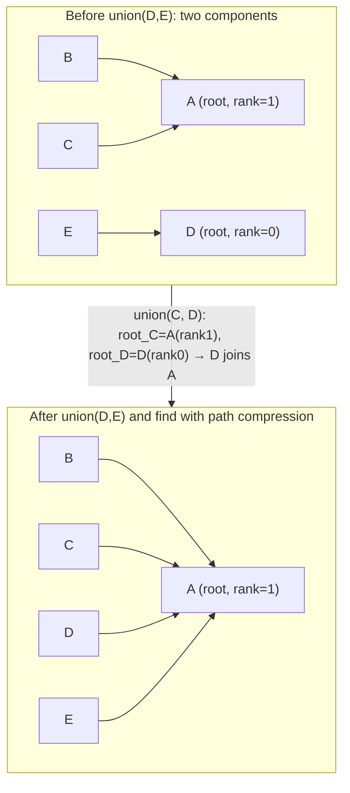

---
title: Union-Find (Disjoint Set Union)
aliases: [Union Find, DSU, Disjoint Set Union]
tags: [DSA, Graphs, UnionFind, DSU, ConnectedComponents]
domain: DSA
difficulty: Intermediate
created: 2026-07-26
related: [Graph_Representation, Minimum_Spanning_Tree, DFS]
status: complete
---

# 🔗 Union-Find (Disjoint Set Union)

> [!abstract] TL;DR
> Union-Find (DSU) tracks which elements belong to the same group/component. `find(x)` returns x's component root; `union(x, y)` merges two components. With **path compression** + **union by rank**, nearly every operation is O(α(n)) — the inverse Ackermann function, effectively O(1) for all practical n. Use it for: connected components, Kruskal's MST, cycle detection in undirected graphs, and dynamic connectivity.

---

## Intuition — Analogy First

Imagine a university with many departments. When two departments **merge**, one becomes a sub-unit of the other. Any student in either department now belongs to the same merged entity.

**Path Compression:** When you ask "which department does student X belong to?", you might have to follow a chain: X → Team A → Division 2 → Department Head. After answering, you update X's record to point directly to the Department Head, and same for Team A. Next time anyone asks about X or Team A, it's a one-step lookup.

**Union by Rank:** When two departments merge, the smaller department joins the larger — not vice versa. This keeps the chain shallow. If they're equal size, pick either and increment its rank.

Together, these two optimizations make every operation essentially O(1), no matter how many merges you do.

---

## How It Works

### Core Data Structure
- `parent[i]`: parent of element i. Initially `parent[i] = i` (each element is its own root).
- `rank[i]` (or `size[i]`): upper bound on height of the subtree rooted at i, used for union decisions.

### `find(x)` — Path Compression
Recursively find the root of x's component, then **flatten** the path by pointing every node directly to the root.

```
find(x):
    if parent[x] != x:
        parent[x] = find(parent[x])   # Path compression
    return parent[x]
```

### `union(x, y)` — Union by Rank
Find the roots of x and y. If they differ (different components), merge the shallower tree under the deeper one.

```
union(x, y):
    root_x = find(x)
    root_y = find(y)
    if root_x == root_y: return False   # Already same component
    if rank[root_x] < rank[root_y]: swap
    parent[root_y] = root_x             # root_y joins root_x
    if rank[root_x] == rank[root_y]:
        rank[root_x] += 1
    return True
```

### Amortized Complexity
- **With path compression alone:** O(log n) amortized per operation.
- **With union by rank alone:** O(log n) worst case.
- **Both together:** O(α(n)) amortized, where α is the **inverse Ackermann function**.

α(n) ≤ 4 for any n < 2^(2^(2^(2^16))) — for all practical purposes, α(n) ≤ 4. This is effectively O(1).



---

## Complexity Analysis

| Operation             | Naive    | Path Compression Only | Union by Rank Only | Both (Optimal) |
|----------------------|----------|----------------------|-------------------|----------------|
| find                 | O(n)     | O(log n) amortized   | O(log n)          | O(α(n))        |
| union                | O(n)     | O(log n) amortized   | O(log n)          | O(α(n))        |
| n operations         | O(n²)    | O(n log n)           | O(n log n)        | O(n α(n)) ≈ O(n)|
| Space                | O(n)     | O(n)                 | O(n)              | O(n)           |

α(n) = inverse Ackermann function ≤ 4 for n < 10^(10^19683). Treat as O(1).

---

## Implementation (Python)

```python
# ─── 1. Full Union-Find class (path compression + union by rank) ─────────────

class UnionFind:
    def __init__(self, n):
        self.parent = list(range(n))  # parent[i] = i initially (self-loops)
        self.rank   = [0] * n         # height upper bound
        self.size   = [1] * n         # component size (alternative to rank)
        self.components = n           # Track number of distinct components

    def find(self, x):
        """Find root of x's component with path compression."""
        if self.parent[x] != x:
            self.parent[x] = self.find(self.parent[x])  # Path compression
        return self.parent[x]

    def union(self, x, y):
        """
        Merge components of x and y.
        Returns True if they were in different components (merge occurred).
        """
        root_x = self.find(x)
        root_y = self.find(y)

        if root_x == root_y:
            return False  # Already same component

        # Union by rank: attach smaller tree under larger
        if self.rank[root_x] < self.rank[root_y]:
            root_x, root_y = root_y, root_x   # Ensure root_x has higher rank

        self.parent[root_y] = root_x           # root_y joins root_x
        self.size[root_x] += self.size[root_y]

        if self.rank[root_x] == self.rank[root_y]:
            self.rank[root_x] += 1             # Only increment if equal rank

        self.components -= 1
        return True

    def connected(self, x, y):
        """Check if x and y are in the same component."""
        return self.find(x) == self.find(y)

    def get_size(self, x):
        """Return the size of the component containing x."""
        return self.size[self.find(x)]


# ─── 2. Connected Components ─────────────────────────────────────────────────

def count_components(n, edges):
    """Count connected components in an undirected graph."""
    uf = UnionFind(n)
    for u, v in edges:
        uf.union(u, v)
    return uf.components

print(count_components(5, [(0,1),(1,2),(3,4)]))  # 2 components


# ─── 3. Cycle Detection in Undirected Graph ──────────────────────────────────

def has_cycle(n, edges):
    """
    Returns True if the undirected graph has a cycle.
    A cycle exists if we try to union two nodes already in the same component.
    """
    uf = UnionFind(n)
    for u, v in edges:
        if not uf.union(u, v):
            return True   # u and v already connected → cycle
    return False

print(has_cycle(4, [(0,1),(1,2),(2,0)]))  # True (cycle: 0-1-2-0)
print(has_cycle(4, [(0,1),(1,2),(2,3)]))  # False (tree)


# ─── 4. Redundant Connection (LC 684) ───────────────────────────────────────
# Find the edge that creates a cycle in an undirected graph

def find_redundant_connection(edges):
    n = len(edges)
    uf = UnionFind(n + 1)  # Nodes 1-indexed

    for u, v in edges:
        if not uf.union(u, v):
            return [u, v]   # This edge creates a cycle

    return []

print(find_redundant_connection([[1,2],[1,3],[2,3]]))  # [2, 3]


# ─── 5. Accounts Merge (LC 721) ─────────────────────────────────────────────
# Union accounts sharing an email address

def accounts_merge(accounts):
    uf = UnionFind(len(accounts))
    email_to_account = {}   # email → first account index that owns it

    # Union accounts sharing emails
    for i, account in enumerate(accounts):
        for email in account[1:]:
            if email in email_to_account:
                uf.union(i, email_to_account[email])
            else:
                email_to_account[email] = i

    # Group emails by their root account
    root_to_emails = {}
    for email, acc_idx in email_to_account.items():
        root = uf.find(acc_idx)
        root_to_emails.setdefault(root, set()).add(email)

    # Build result
    result = []
    for root, emails in root_to_emails.items():
        result.append([accounts[root][0]] + sorted(emails))

    return result


# ─── 6. Dynamic Connectivity / Number of Islands II ────────────────────────
# Add cells one at a time; after each addition, report component count

def num_islands_ii(m, n, positions):
    """
    LC 305. Add land cells one at a time.
    Returns island count after each addition.
    """
    uf = UnionFind(m * n)
    is_land = set()
    result = []
    directions = [(0,1),(0,-1),(1,0),(-1,0)]

    for r, c in positions:
        if (r, c) in is_land:
            result.append(uf.components - (m * n - len(is_land)))
            continue

        is_land.add((r, c))
        uf.components += 1   # Pretend it started as water (compensate initialization)

        cell = r * n + c
        for dr, dc in directions:
            nr, nc = r + dr, c + dc
            if (nr, nc) in is_land:
                uf.union(cell, nr * n + nc)

        # Adjust: total components minus water cells
        result.append(uf.components - (m * n - len(is_land)))

    return result


# ─── 7. Kruskal's MST skeleton using Union-Find ─────────────────────────────

def kruskal_mst(n, edges):
    """
    edges: list of (weight, u, v)
    Returns (total_weight, mst_edges)
    """
    uf = UnionFind(n)
    edges_sorted = sorted(edges)   # Sort by weight
    mst_weight = 0
    mst_edges = []

    for weight, u, v in edges_sorted:
        if uf.union(u, v):         # Only add edge if it doesn't create a cycle
            mst_weight += weight
            mst_edges.append((u, v, weight))
            if len(mst_edges) == n - 1:
                break              # MST has n-1 edges

    return mst_weight, mst_edges
```

---

## Dry Run / Example Trace

**Operations on n=6 nodes, edges: union(0,1), union(2,3), union(4,5), union(1,4), find(0)**

Initial: `parent = [0,1,2,3,4,5]`, `rank = [0,0,0,0,0,0]`

| Operation  | Action                    | parent after          | rank after          | Components |
|-----------|---------------------------|-----------------------|---------------------|------------|
| union(0,1) | root_0=0, root_1=1, same rank → 1 joins 0, rank[0]++ | [0,0,2,3,4,5] | [1,0,0,0,0,0] | 5 |
| union(2,3) | root_2=2, root_3=3, same rank → 3 joins 2, rank[2]++ | [0,0,2,2,4,5] | [1,0,1,0,0,0] | 4 |
| union(4,5) | root_4=4, root_5=5, same rank → 5 joins 4, rank[4]++ | [0,0,2,2,4,4] | [1,0,1,0,1,0] | 3 |
| union(1,4) | root_1=find(1)=0 (rank 1), root_4=4 (rank 1), same rank → 4 joins 0, rank[0]++ | [0,0,2,2,0,4] | [2,0,1,0,1,0] | 2 |
| find(0)   | parent[0]=0, return 0 | (no change) | | — |
| find(5)   | parent[5]=4, parent[4]=0. Path compress: parent[5]=0 | [0,0,2,2,0,0] | (no change) | — |

After path compression on find(5): nodes 4 and 5 both point directly to 0. Next find(5) = O(1).

---

## Patterns & LeetCode Applications

| Problem | # | Key Pattern |
|---------|---|-------------|
| Number of Connected Components | 323 | Basic Union-Find |
| Redundant Connection | 684 | Cycle detection — edge that causes union failure |
| Accounts Merge | 721 | Map strings → indices, union by shared email |
| Satisfiability of Equality Equations | 990 | Process == first, then check != |
| Most Stones Removed | 947 | Union stones sharing row or column |
| Smallest String with Swaps | 1202 | Union swappable indices; sort within each component |
| Making a Large Island | 827 | Color islands, union, check boundaries |
| Number of Islands II | 305 | Dynamic connectivity (add cells one by one) |
| Kruskal's MST | — | Core algorithm: add edges in weight order, skip if same component |
| Friend Circles | 547 | Same as Connected Components |

---

## Common Pitfalls

1. **Forgetting to call `find()` before comparing roots in `union()`**: Never compare `parent[x]` and `parent[y]` directly — always `find(x)` and `find(y)`. `parent[x]` is a raw pointer, not the root.

2. **Initializing with wrong size**: If node IDs are 1-indexed (common in LeetCode), initialize `UnionFind(n+1)` and ignore index 0, or re-index to 0-based.

3. **String/non-integer node IDs**: Map strings/tuples to integers first using a dictionary, then use the integer Union-Find. Alternatively, use a dict-based parent map.

4. **Not using path compression**: Without it, find is O(log n) amortized — still correct, but misses the near-O(1) guarantee. Always include the compression line.

5. **Cycle detection for directed vs undirected**: Union-Find naturally detects cycles in **undirected** graphs (a redundant union = cycle). For **directed** graphs, use DFS with 3-color marking — Union-Find doesn't track edge direction.

6. **Tracking component count**: Initialize `components = n`. Decrement by 1 every time `union()` returns `True` (a merge actually happened). Check `uf.components` for the current number of distinct groups.

---

## Related Concepts

- [[_MOC_Graphs|↑ Section MOC]]
- [[Graph_Representation]] — Union-Find operates on the same graph problem; adjacency list is the input
- [[DFS]] — alternative for connected components (static graphs); DFS is simpler but Union-Find handles dynamic edge additions
- [[Minimum_Spanning_Tree]] — Kruskal's algorithm relies on Union-Find for cycle detection
- [[BFS]] — another traversal alternative; BFS/DFS are better for path queries, Union-Find for component membership
- [[Topological_Sort]] — for directed acyclic graphs; Union-Find doesn't apply here

---

## Review Questions

1. Explain the inverse Ackermann function α(n) in plain terms. Why is it "effectively O(1)"? What would n need to be for α(n) > 4, and why does this make Union-Find's amortized complexity practically the same as O(1)?

2. Union-Find naturally detects cycles in undirected graphs but not in directed graphs. Explain why the same algorithm fails to detect a cycle in a directed graph, and provide a concrete directed graph example that would be a false negative.

3. In the Accounts Merge problem (LC 721), accounts are given as `[name, email1, email2, ...]`. Describe step by step how you would use Union-Find to merge accounts that share at least one email, including how you handle the fact that account indices (integers) are the Union-Find elements, not the emails themselves.

---

## Sources

- CLRS Chapter 21 — Data Structures for Disjoint Sets
- [Wikipedia — Disjoint-set data structure](https://en.wikipedia.org/wiki/Disjoint-set_data_structure)
- [NeetCode — Union-Find](https://neetcode.io/roadmap)
- LeetCode 684 — [Redundant Connection](https://leetcode.com/problems/redundant-connection/)
- LeetCode 721 — [Accounts Merge](https://leetcode.com/problems/accounts-merge/)
- [CP-Algorithms — Disjoint Set Union](https://cp-algorithms.com/data_structures/disjoint_set_union.html)

#DSA #Graphs #UnionFind #DSU #ConnectedComponents #Intermediate
