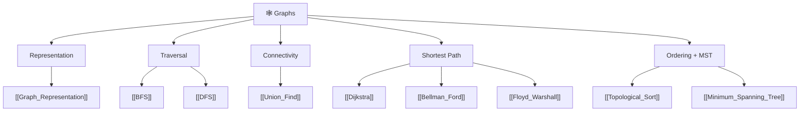

# 🕸️ Graphs — Map of Content

> [!abstract] What This Section Covers
> Graphs are the most general data structure in DSA — any relationship between entities can be modelled as a graph. This section moves from representation choices (adjacency list vs matrix) through traversal (BFS, DFS), connectivity (Union-Find), shortest paths (Dijkstra, Bellman-Ford, Floyd-Warshall), ordering (topological sort), and spanning trees (MST). Together these nine notes cover the algorithm families that appear most often in interviews and competitive programming graph problems.

## Concept Map

## Learning Path

1. [[Graph_Representation]] — Adjacency list vs matrix; directed vs undirected; weighted vs unweighted
2. [[BFS]] — Level-order traversal, shortest path in unweighted graphs, visited tracking
3. [[DFS]] — Recursive and iterative DFS, cycle detection, connected components
4. [[Union_Find]] — Disjoint set union with path compression and union by rank
5. [[Dijkstra]] — Greedy single-source shortest path for non-negative weights
6. [[Topological_Sort]] — Kahn's BFS-based algorithm and DFS post-order for DAGs
7. [[Bellman_Ford]] — Dynamic programming SSSP; handles negative weights, detects negative cycles
8. [[Floyd_Warshall]] — All-pairs shortest path via DP in O(V³)
9. [[Minimum_Spanning_Tree]] — Prim's and Kruskal's algorithms; spanning tree cost minimisation

## All Notes at a Glance

| Note | Summary | Difficulty |
|------|---------|------------|
| [[Graph_Representation]] | Adjacency list / matrix tradeoffs, edge list | Beginner |
| [[BFS]] | Queue-based level traversal, SSSP in unweighted graphs | Beginner |
| [[DFS]] | Stack/recursion traversal, cycle detection, components | Beginner |
| [[Union_Find]] | DSU with path compression; O(α) operations | Intermediate |
| [[Dijkstra]] | Priority-queue greedy SSSP; O((V+E) log V) | Intermediate |
| [[Bellman_Ford]] | Relax-all-edges V-1 times; O(VE) | Intermediate |
| [[Floyd_Warshall]] | DP matrix for all-pairs shortest paths; O(V³) | Intermediate |
| [[Topological_Sort]] | Linear ordering of DAG nodes; cycle detection | Intermediate |
| [[Minimum_Spanning_Tree]] | Prim (greedy) + Kruskal (Union-Find) | Intermediate |

## Key Questions This Section Answers

- When should you use BFS vs DFS — what problem property decides it?
- Why does Dijkstra fail with negative-weight edges, and how does Bellman-Ford fix this?
- When is Union-Find preferable to a DFS connectivity check?
- What property of the graph makes topological sort possible, and what breaks it?
- How do Prim's and Kruskal's algorithms differ in implementation and best use case?
- What is the complexity tradeoff between adjacency list and adjacency matrix?

## Related Sections

- [[_MOC_DSA_Master|↑ DSA Master MOC]]
- [[_MOC_Trees]] — Trees are a special case of graphs (acyclic connected)
- [[_MOC_Heaps]] — Heaps power Dijkstra's priority queue
- [[_MOC_Competitive_Programming]] — Advanced graph techniques (Fenwick Tree, Segment Tree on graphs)

#MOC #DSA #graphs
