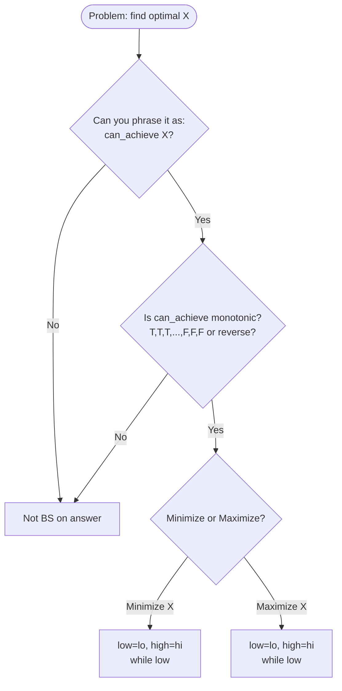

---
title: Binary Search Patterns — Search on Answer
aliases: [BS on Answer, Parametric Search, Binary Search on Value]
tags: [DSA, Searching, BinarySearch, Patterns, Advanced]
domain: DSA
difficulty: Intermediate
created: 2026-07-26
related: [Binary_Search, Two_Pointers, Greedy_Fundamentals]
status: complete
---

# 🎯 Binary Search Patterns — Search on Answer

> [!abstract] TL;DR
> "Binary search on the answer" applies when you can't search a sorted array directly, but the **answer space is monotonic**: if answer X is feasible, then X±1 is also feasible (in one direction). You binary search the feasible threshold. The key is writing a `can_achieve(mid)` function that checks if a candidate answer works. Used for "minimize the maximum" and "maximize the minimum" problems. O(log(range) × f(n)) where f(n) is verification cost.

---

## Intuition — Analogy First

Classic binary search finds a value in a sorted array. But what if you can't enumerate the sorted array? What if the answer is just a number in some range, and you can test whether a given number "works"?

Imagine a dial that goes from 1 to 10^9. At some threshold T, the answer changes from "Yes" to "No" (or vice versa). Because the answer is monotonic — "Yes" for all values ≤ T, "No" for all > T — you can binary search for exactly where "Yes" flips to "No."

The trick: **reformulate the problem** from "find the best answer" to "can we achieve answer X?" If you can answer the "can we achieve X?" question efficiently, binary search finds the optimal X in O(log(range)) calls.

**Core template:**
```
low, high = min_possible_answer, max_possible_answer
while low < high:
    mid = (low + high) // 2
    if can_achieve(mid):
        high = mid        # mid works, try to do better (minimize)
    else:
        low = mid + 1     # mid doesn't work, need bigger
return low
```

---

## How It Works + Mermaid

### When Can You Apply BS on Answer?

**Three conditions:**
1. The answer is a **value** (speed, days, capacity) in a bounded range.
2. The predicate `can_achieve(x)` is **monotonic**: once it becomes True, it stays True as x increases (or vice versa).
3. You can **verify** a candidate answer efficiently (typically O(n) or O(n log n)).

**Minimize vs Maximize:**
- **Minimize X** (smallest X that satisfies condition): Use `high = mid` when feasible, `low = mid + 1` when not. Return `low`.
- **Maximize X** (largest X that satisfies condition): Use `low = mid` when feasible, `high = mid - 1` when not. Use `mid = (low + high + 1) // 2` to avoid infinite loop. Return `low`.



---

## Complexity Analysis

| Problem Type                     | Search Space    | Verify Cost | Total Complexity      |
|----------------------------------|-----------------|-------------|-----------------------|
| Koko Eating Bananas (minimize)   | O(max(piles))   | O(n)        | O(n log(max))         |
| Ship Packages (minimize)         | O(sum(weights)) | O(n)        | O(n log(sum))         |
| Split Array Largest Sum (min)    | O(sum)          | O(n)        | O(n log(sum))         |
| Minimum Days to Bloom (min)      | O(max_days)     | O(n)        | O(n log(max_days))    |
| Aggressive Cows (maximize)       | O(max_pos)      | O(n log n)  | O(n log n log(max))   |

General: **O(log(answer_range) × verification_cost)**

---

## Implementation (Python)

```python
from typing import List
import math

# =========================================================
# 1. KOKO EATING BANANAS (LC 875) — Minimize eating speed
# =========================================================
def minEatingSpeed(piles: List[int], h: int) -> int:
    """
    Koko eats at speed k bananas/hour. Can she eat all piles in h hours?
    Minimize k. Answer space: [1, max(piles)].
    Monotonic: if speed k works, k+1 also works.
    """
    def can_finish(speed: int) -> bool:
        # Hours needed = sum of ceil(pile/speed) for each pile
        return sum(math.ceil(pile / speed) for pile in piles) <= h

    low, high = 1, max(piles)

    while low < high:
        mid = (low + high) // 2
        if can_finish(mid):
            high = mid        # speed mid works, try smaller
        else:
            low = mid + 1     # too slow, need faster

    return low


# =========================================================
# 2. CAPACITY TO SHIP PACKAGES (LC 1011) — Minimize capacity
# =========================================================
def shipWithinDays(weights: List[int], days: int) -> int:
    """
    Ship must carry packages in order within 'days' days.
    Minimize ship capacity. Answer space: [max(weights), sum(weights)].
    """
    def can_ship(capacity: int) -> bool:
        day_count = 1
        current_load = 0
        for w in weights:
            if current_load + w > capacity:
                day_count += 1       # need a new day
                current_load = 0
            current_load += w
        return day_count <= days

    low, high = max(weights), sum(weights)

    while low < high:
        mid = (low + high) // 2
        if can_ship(mid):
            high = mid
        else:
            low = mid + 1

    return low


# =========================================================
# 3. SPLIT ARRAY LARGEST SUM (LC 410) — Minimize maximum sum
# =========================================================
def splitArray(nums: List[int], k: int) -> int:
    """
    Split nums into k non-empty subarrays.
    Minimize the largest subarray sum.
    Answer space: [max(nums), sum(nums)].
    """
    def can_split(max_sum: int) -> bool:
        """Can we split into k subarrays each with sum <= max_sum?"""
        parts = 1
        current = 0
        for num in nums:
            if current + num > max_sum:
                parts += 1
                current = 0
            current += num
        return parts <= k

    low, high = max(nums), sum(nums)

    while low < high:
        mid = (low + high) // 2
        if can_split(mid):
            high = mid
        else:
            low = mid + 1

    return low


# =========================================================
# 4. MINIMUM DAYS TO MAKE M BOUQUETS (LC 1482) — Minimize days
# =========================================================
def minDays(bloomDay: List[int], m: int, k: int) -> int:
    """
    Need m bouquets, each requiring k adjacent bloomed flowers.
    Minimize the day on which this is possible. Return -1 if impossible.
    """
    n = len(bloomDay)
    if m * k > n:
        return -1  # impossible

    def can_make(day: int) -> bool:
        bouquets = consecutive = 0
        for d in bloomDay:
            if d <= day:
                consecutive += 1
                if consecutive == k:
                    bouquets += 1
                    consecutive = 0
            else:
                consecutive = 0
        return bouquets >= m

    low, high = min(bloomDay), max(bloomDay)

    while low < high:
        mid = (low + high) // 2
        if can_make(mid):
            high = mid
        else:
            low = mid + 1

    return low


# =========================================================
# 5. MINIMIZE MAXIMUM OF DIVIDED ARRAY (LC 2064) — Maximize X
# =========================================================
def minimizeMax(nums: List[int], p: int) -> int:
    """
    Pick p pairs from nums. Minimize the maximum absolute difference
    across all chosen pairs. (After sorting, optimal pairs are adjacent.)
    """
    nums.sort()
    n = len(nums)

    def can_form_pairs(max_diff: int) -> bool:
        """Can we form p non-overlapping pairs with diff <= max_diff?"""
        count = i = 0
        while i < n - 1:
            if nums[i+1] - nums[i] <= max_diff:
                count += 1
                i += 2  # use this pair, skip both elements
            else:
                i += 1
        return count >= p

    low, high = 0, nums[-1] - nums[0]

    while low < high:
        mid = (low + high) // 2
        if can_form_pairs(mid):
            high = mid
        else:
            low = mid + 1

    return low


# =========================================================
# 6. AGGRESSIVE COWS — Maximize minimum distance (classic)
# =========================================================
def aggressiveCows(stalls: List[int], k: int) -> int:
    """
    Place k cows in stalls. Maximize the minimum distance between any two cows.
    This is a MAXIMIZE problem → use mid = (low+high+1)//2.
    """
    stalls.sort()
    n = len(stalls)

    def can_place(min_dist: int) -> bool:
        count = 1
        last_pos = stalls[0]
        for i in range(1, n):
            if stalls[i] - last_pos >= min_dist:
                count += 1
                last_pos = stalls[i]
        return count >= k

    low, high = 1, stalls[-1] - stalls[0]

    while low < high:
        mid = (low + high + 1) // 2   # +1 to avoid infinite loop when maximizing
        if can_place(mid):
            low = mid         # min_dist works, try larger
        else:
            high = mid - 1   # too large, shrink

    return low
```

---

## Dry Run / Example Trace

**Koko Eating Bananas: piles=[3,6,7,11], h=8**

```
Answer space: [1, 11]

low=1, high=11
  mid=6
  can_finish(6): ceil(3/6)+ceil(6/6)+ceil(7/6)+ceil(11/6) = 1+1+2+2 = 6 ≤ 8 → True
  high=6

low=1, high=6
  mid=3
  can_finish(3): ceil(3/3)+ceil(6/3)+ceil(7/3)+ceil(11/3) = 1+2+3+4 = 10 > 8 → False
  low=4

low=4, high=6
  mid=5
  can_finish(5): ceil(3/5)+ceil(6/5)+ceil(7/5)+ceil(11/5) = 1+2+2+3 = 8 ≤ 8 → True
  high=5

low=4, high=5
  mid=4
  can_finish(4): ceil(3/4)+ceil(6/4)+ceil(7/4)+ceil(11/4) = 1+2+2+3 = 8 ≤ 8 → True
  high=4

low=4, high=4 → exit. Return 4 ✓
```

---

## Patterns & LeetCode Applications

| Problem                              | LC #  | Type     | can_achieve(X)                                   |
|--------------------------------------|-------|----------|--------------------------------------------------|
| Koko Eating Bananas                  | 875   | Minimize | Can eat all piles at speed X in h hours?         |
| Capacity to Ship Packages            | 1011  | Minimize | Can ship all packages with capacity X in D days? |
| Split Array Largest Sum              | 410   | Minimize | Can split into k parts each with sum ≤ X?        |
| Minimum Days to Make M Bouquets     | 1482  | Minimize | Can make m bouquets by day X?                    |
| Minimize Maximum of Divided Array   | 2064  | Minimize | Can form p pairs all with diff ≤ X?              |
| Sqrt(x)                              | 69    | Maximize | Is k² ≤ x? (find largest k)                     |
| Find the Smallest Divisor           | 1283  | Minimize | Does sum of ceil(n/divisor) ≤ threshold?         |
| Maximum Candies Allocated            | 2226  | Maximize | Can give each child exactly X candies?            |
| Aggressive Cows (SPOJ)              | —     | Maximize | Can place k cows with min gap ≥ X?               |

**Recognition pattern:** Problems involving "minimum ... days/speed/capacity" or "maximum ... minimum distance/difference/share" are strong signals for BS on answer.

---

## Common Pitfalls

1. **Maximize vs Minimize — infinite loop:** When maximizing, use `mid = (low + high + 1) // 2`. Without the +1, `mid == low` when high == low+1, and if `can_achieve(low)` is True, `low = mid = low` — infinite loop.
2. **Wrong answer space bounds:** `low` must be the minimum possible answer (not 0 if 0 is invalid), `high` must be the maximum possible (often `max(arr)` or `sum(arr)`).
3. **Off-by-one in verification:** The `can_achieve` function must handle edge cases — empty partitions, minimum 1 required, etc.
4. **Non-monotonic predicate:** BS on answer only works if the predicate is monotonic. Always verify: "if X works, does X+1 also work?" before applying the template.
5. **Integer math in `can_achieve`:** Use `math.ceil(a/b)` or the integer ceiling `(a + b - 1) // b` — don't use float division in the verification function.
6. **Mixing up the template direction:** Minimizing → `high = mid`, `low = mid + 1`. Maximizing → `low = mid`, `high = mid - 1`, `mid = (l+r+1)//2`. Keep a reference.

---

## Related Concepts

- [[_MOC_Sorting_Searching|↑ Section MOC]]
- [[Binary_Search]] — foundation: exact, lower_bound, upper_bound templates
- [[Two_Pointers]] — related narrowing technique; doesn't require monotonic search space
- [[Greedy_Fundamentals]] — the `can_achieve` verification often uses a greedy scan

---

## Review Questions

1. **What are the three conditions a problem must satisfy before you can apply "binary search on the answer"?** Give an example of a problem that looks like it might qualify but fails one of the conditions.
2. **When maximizing an answer with binary search, why must you use `mid = (low + high + 1) // 2` instead of `mid = (low + high) // 2`?** Construct a minimal example where the standard formula causes an infinite loop.
3. **In Koko Eating Bananas (LC 875), why is the `can_achieve` predicate monotonic?** Formally state: if speed k is sufficient, what can you say about speed k+1, and why?**

---

## Sources

- [LeetCode — Binary Search on Answer Patterns](https://leetcode.com/discuss/study-guide/1322500/)
- LeetCode #875, #1011, #410, #1482
- [CP-Algorithms — Binary Search](https://cp-algorithms.com/num_methods/binary_search.html)
- [Errichto — Binary Search](https://www.youtube.com/c/Errichto)
- [NeetCode — Advanced Binary Search](https://neetcode.io)

#binarysearch #parametricsearch #bsonanswer #minimizemaximum #maximizeminimum #patterns
