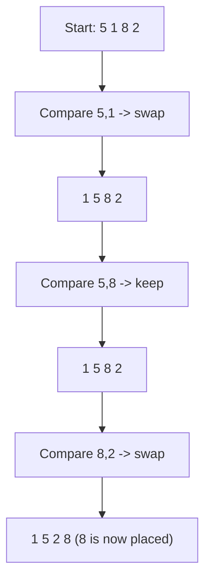

# 🫧 Bubble Sort

> [!abstract] TL;DR
> Bubble Sort repeatedly steps through the list, compares **adjacent** elements, and swaps them if they are out of order. After each full pass the largest remaining element "bubbles up" to its final position at the end. It is **stable**, **in-place**, and **O(n²)** on average — with an early-exit optimization it becomes **O(n)** on already-sorted input. It exists almost entirely for teaching; **never ship it to production**.

---

## Intuition — Analogy First

Imagine a column of water with bubbles of different sizes trapped at the bottom. The **biggest bubble rises fastest** to the surface. Bubble Sort works the same way: on each sweep from left to right, you keep comparing two neighbors and letting the heavier (larger) one sink one step right, so the single largest value keeps getting nudged rightward until it "surfaces" at the far end.

Once the largest is parked at the end, you sweep again over the remaining unsorted front — the second-largest surfaces, and so on. After `n-1` sweeps everything is in place.

The key mental hook: **Bubble Sort only ever looks at neighbors.** It never jumps. That locality is why it is simple, stable, and slow.

---

## How It Works + Mermaid

**Algorithm:**
1. Walk from the start to the end of the unsorted portion.
2. Compare each pair of adjacent elements `arr[j]` and `arr[j+1]`.
3. If `arr[j] > arr[j+1]`, **swap** them.
4. After one full pass, the largest element is guaranteed to sit at the end — shrink the unsorted region by one.
5. **Optimization:** track a `swapped` flag. If a whole pass makes **zero swaps**, the array is already sorted → stop early.

The diagram shows **one pass** bubbling the maximum (`8`) to the end of `[5, 1, 8, 2]`:



After this pass, `8` is locked at the end; the next pass only sweeps `[1, 5, 2]`.

---

## Complexity Analysis

| Case                    | Time     | Space | Stable | In-Place | Notes                                          |
|-------------------------|----------|-------|--------|----------|------------------------------------------------|
| Best (sorted, optimized)| O(n)     | O(1)  | Yes    | Yes      | One clean pass, `swapped` stays false → exit   |
| Average                 | O(n²)    | O(1)  | Yes    | Yes      | ~n²/4 swaps, ~n²/2 comparisons                 |
| Worst (reverse sorted)  | O(n²)    | O(1)  | Yes    | Yes      | Every comparison forces a swap                 |

- **Stable:** ties are never swapped (`>` not `>=`), so equal keys keep their relative order.
- **In-place:** only a constant amount of extra memory (a temp variable + a flag).
- **Adaptive (with the flag):** nearly-sorted data finishes fast because passes short-circuit.
- **Comparisons vs swaps:** comparisons are always ~O(n²) even in the optimized version; only the *number of passes* shrinks for sorted input.

---

## Python Implementation

```python
from typing import List

# =========================================================
# 1. NAIVE BUBBLE SORT
# =========================================================
def bubble_sort_naive(arr: List[int]) -> None:
    """Sort in-place. Always does n-1 passes (no early exit)."""
    n = len(arr)
    for i in range(n - 1):
        # After i passes, the last i elements are already sorted.
        for j in range(n - 1 - i):
            if arr[j] > arr[j + 1]:          # '>' (not '>=') keeps it STABLE
                arr[j], arr[j + 1] = arr[j + 1], arr[j]


# =========================================================
# 2. OPTIMIZED BUBBLE SORT (early-exit swapped flag)
# =========================================================
def bubble_sort(arr: List[int]) -> None:
    """
    In-place, stable. Early-exits when a full pass makes no swaps,
    giving O(n) best case on already-sorted / nearly-sorted input.
    """
    n = len(arr)
    for i in range(n - 1):
        swapped = False
        for j in range(n - 1 - i):
            if arr[j] > arr[j + 1]:
                arr[j], arr[j + 1] = arr[j + 1], arr[j]
                swapped = True
        if not swapped:      # nothing moved this pass → already sorted
            break


if __name__ == "__main__":
    data = [5, 1, 8, 2]
    bubble_sort(data)
    print(data)              # [1, 2, 5, 8]

    already = [1, 2, 3, 4]
    bubble_sort(already)     # exits after a single pass (O(n))
    print(already)           # [1, 2, 3, 4]
```

---

## Dry Run / Trace

Sorting `[5, 1, 8, 2]` with the **optimized** version:

```
Pass 1 (i=0, sweep j=0..2):
  j=0: 5 > 1 → swap → [1, 5, 8, 2]  (swapped=True)
  j=1: 5 > 8 ? no
  j=2: 8 > 2 → swap → [1, 5, 2, 8]  (8 placed at end)
Pass 2 (i=1, sweep j=0..1):
  j=0: 1 > 5 ? no
  j=1: 5 > 2 → swap → [1, 2, 5, 8]  (5 placed)
Pass 3 (i=2, sweep j=0..0):
  j=0: 1 > 2 ? no  → swapped=False → EARLY EXIT
Result: [1, 2, 5, 8]
```

Note how the unsorted window shrinks each pass (`n-1-i`) and how the `swapped=False` flag ends things as soon as the array is confirmed sorted.

---

## Patterns & LeetCode Applications

| Use / Problem                     | LC #  | Why Bubble Sort matters                                    |
|-----------------------------------|-------|------------------------------------------------------------|
| Sort an Array                     | 912   | Accepted conceptually, but **TLE** on large inputs — use it only to learn |
| Understanding stability           | —     | Canonical example of a *stable* comparison sort            |
| Counting adjacent swaps           | —     | Number of swaps == number of **inversions** in the array   |
| Teaching swap/pass invariants     | —     | Best first algorithm to reason about loop invariants       |

**Interview reality:** Bubble Sort is almost never the intended answer. Its value is pedagogical — it makes *stability*, *in-place*, *adaptivity*, and *invariants* concrete. If asked to sort, reach for `sorted()` / [[Merge_Sort]] / [[Quick_Sort]] instead.

---

## Common Pitfalls

1. **Using `>=` instead of `>`** in the comparison — this swaps equal elements and **destroys stability**.
2. **Forgetting to shrink the inner loop** (`range(n-1-i)`) — re-scanning the already-placed tail wastes work (still correct, just slower).
3. **Believing the flag makes it "fast."** The early-exit only helps *sorted / nearly-sorted* inputs; average and worst cases remain O(n²).
4. **Off-by-one on the inner bound:** `arr[j+1]` reads one ahead, so `j` must stop at `n-2` (i.e. `range(n-1-i)`), not `n-1`.
5. **Using it in production.** For any n beyond a few dozen, [[Insertion_Sort]] is faster in practice and the same complexity class, and library sorts crush both.

---

## Related Concepts

- [[_MOC_Sorting_Searching|↑ Section MOC]]
- [[Sorting_Overview]] — comparison table of all sorts and when to pick each
- [[Insertion_Sort]] — same O(n²) class but consistently faster in practice on nearly-sorted data
- [[Selection_Sort]] — the other classic O(n²) sort; minimizes swaps instead of comparisons
- [[Merge_Sort]] — the O(n log n) stable sort you should actually use
- [[Complexity_Cheat_Sheet]] — quick reference for Big-O of common operations
- [[Time_Complexity_Classes]] — where O(n²) sits among growth rates

---

## Review Questions

1. **The optimized Bubble Sort has an O(n) best case. Exactly what input triggers it, and which line of code is responsible for the early exit?**
2. **Bubble Sort is stable. Which single character in the comparison guarantees stability, and what happens if you change it?**
3. **After k complete passes of Bubble Sort, what can you say with certainty about the last k elements of the array? Use this to justify the `range(n-1-i)` bound.**

---

## Sources

- CLRS — Introduction to Algorithms (comparison sorts overview)
- [Visualgo — Bubble Sort](https://visualgo.net/en/sorting)
- LeetCode #912 (Sort an Array)
- [Wikipedia — Bubble sort](https://en.wikipedia.org/wiki/Bubble_sort)

#bubblesort #sorting #stable #inplace #educational #comparisonsort
