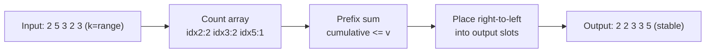

# 🧮 Counting Sort

> [!abstract] TL;DR
> Counting Sort is a **non-comparison** sort for integers (or discrete keys) drawn from a **small bounded range**. It counts how many times each value occurs, turns those counts into **prefix sums** (final positions), then places each element directly into its slot. It runs in **O(n + k)** time and space where `k` is the range of values. Made stable via prefix-sum positioning, it is the workhorse subroutine inside **Radix Sort**. It only works when keys are integers in a bounded range — it cannot sort arbitrary comparables.

---

## Intuition — Analogy First

Imagine tallying votes. You have 200 ballots, each marked with a candidate number from 1 to 5. You do **not** compare ballots to each other. Instead you make five buckets and drop a tally mark into a bucket for each ballot. Now you know candidate 1 got 40 votes, candidate 2 got 55, etc. To produce a sorted list, you simply write out "1" forty times, then "2" fifty-five times, and so on.

That is Counting Sort. Because it **never compares two elements**, it sidesteps the O(n log n) lower bound that binds all comparison sorts. The catch: it only works when the keys live in a *known, small* range — you need one bucket per possible value. Sorting 32-bit integers this way would need 4 billion buckets, which is why we usually pair it with [[Radix_Sort]] to handle wide keys digit by digit.

---

## How It Works + Mermaid

**Algorithm (stable, prefix-sum version):**
1. Find the value range `[min_val, max_val]`; let `k = max_val - min_val + 1`.
2. **Count:** build `count[v]` = number of elements equal to `v`.
3. **Prefix sum:** transform `count` so `count[v]` = number of elements `<= v` (i.e. the *end position* of value `v` in the output).
4. **Place:** iterate the input **right to left**, decrement `count[value]`, and write each element to `output[count[value]]`. Right-to-left + prefix positions = **stable**.



---

## Complexity Analysis

| Aspect      | Value        | Notes                                                          |
|-------------|--------------|----------------------------------------------------------------|
| Best time   | O(n + k)     | k = size of the value range (max - min + 1)                    |
| Average time| O(n + k)     | Independent of input order                                     |
| Worst time  | O(n + k)     | No worst case beyond the range size                            |
| Space       | O(n + k)     | Count array O(k) + output array O(n)                           |
| Stable      | Yes          | With prefix sums + right-to-left placement                     |
| In-place    | No           | Needs the count array and (typically) an output array          |

- **When it wins:** `k = O(n)` (range comparable to element count) → effectively **O(n)**, beating O(n log n) comparison sorts.
- **When it loses:** if `k >> n` (e.g. sorting a few 64-bit integers), the O(k) count array dominates and wastes huge memory — use [[Radix_Sort]] or a comparison sort instead.
- **Not a comparison sort:** it never executes `a < b`; hence the O(n log n) lower bound does not apply.

---

## Python Implementation

```python
from typing import List

# =========================================================
# 1. STABLE COUNTING SORT (prefix-sum positioning)
# =========================================================
def counting_sort(arr: List[int]) -> List[int]:
    """
    Stable counting sort for integers. O(n + k) time and space,
    where k = (max - min + 1). Returns a new sorted list.
    """
    if not arr:
        return []

    min_val, max_val = min(arr), max(arr)
    k = max_val - min_val + 1

    # 1) Count occurrences (offset by min_val to handle negatives)
    count = [0] * k
    for x in arr:
        count[x - min_val] += 1

    # 2) Prefix sums → count[i] becomes the END index for that value
    for i in range(1, k):
        count[i] += count[i - 1]

    # 3) Place right-to-left to preserve stability
    output = [0] * len(arr)
    for x in reversed(arr):
        count[x - min_val] -= 1
        output[count[x - min_val]] = x

    return output


# =========================================================
# 2. COUNTING SORT BY DIGIT (subroutine for Radix Sort)
# =========================================================
def counting_sort_by_digit(arr: List[int], exp: int) -> List[int]:
    """
    Stable counting sort keyed on one decimal digit (base 10).
    'exp' selects the digit: 1 → ones, 10 → tens, 100 → hundreds.
    Used by LSD Radix Sort. k = 10 (fixed).
    """
    n = len(arr)
    output = [0] * n
    count = [0] * 10

    for x in arr:
        count[(x // exp) % 10] += 1
    for i in range(1, 10):
        count[i] += count[i - 1]
    for x in reversed(arr):          # right-to-left keeps it stable
        d = (x // exp) % 10
        count[d] -= 1
        output[count[d]] = x
    return output


if __name__ == "__main__":
    print(counting_sort([2, 5, 3, 2, 3]))   # [2, 2, 3, 3, 5]
    print(counting_sort([-2, 0, -5, 3]))     # [-5, -2, 0, 3]
```

---

## Dry Run / Trace

Sorting `[2, 5, 3, 2, 3]` (min=2, max=5, k=4; index i maps to value i+2):

```
1) COUNT (value → tally):
   value: 2  3  4  5
   count: 2  2  0  1        (two 2s, two 3s, no 4, one 5)

2) PREFIX SUM (cumulative ≤ value → end position):
   value: 2  3  4  5
   count: 2  4  4  5

3) PLACE right-to-left:
   x=3 → count[3]=4-1=3 → output[3]=3   → [_,_,_,3,_]
   x=2 → count[2]=2-1=1 → output[1]=2   → [_,2,_,3,_]
   x=3 → count[3]=3-1=2 → output[2]=3   → [_,2,3,3,_]
   x=5 → count[5]=5-1=4 → output[4]=5   → [_,2,3,3,5]
   x=2 → count[2]=1-1=0 → output[0]=2   → [2,2,3,3,5]

Result: [2, 2, 3, 3, 5]
```

Reading input **right-to-left** while decrementing prefix positions is exactly what keeps equal keys in original relative order (stability), which is essential for Radix Sort's correctness.

---

## Patterns & LeetCode Applications

| Problem                          | LC #  | Why Counting Sort fits                                      |
|----------------------------------|-------|-------------------------------------------------------------|
| Sort Colors (Dutch flag)         | 75    | Only 3 keys {0,1,2} → counting sort in one pass             |
| Sort an Array                    | 912   | Fast when value range is small (constraints bound values)   |
| Maximum Gap                      | 164   | Bucket/counting ideas give linear-time sort of bounded ints |
| Relative Sort Array              | 1122  | Count frequencies then emit in a custom order               |
| H-Index                          | 274   | Counting buckets of citation counts → O(n)                  |
| Radix Sort subroutine            | —     | Stable per-digit counting is the engine of [[Radix_Sort]]   |

**Pattern signal:** whenever constraints say values are integers within a small range (e.g. `0 <= nums[i] <= 100`, or "colors 0/1/2", or "ages 0–150"), counting/bucket sort turns an O(n log n) problem into O(n).

---

## Common Pitfalls

1. **Ignoring negatives / non-zero minimum.** Offset every index by `min_val` (`x - min_val`) or you get negative indices / oversized arrays.
2. **Applying it when `k` is huge.** If the range dwarfs `n` (e.g. arbitrary 32-bit ints), the O(k) memory explodes — use [[Radix_Sort]] instead.
3. **Placing left-to-right with prefix sums → unstable.** Stability requires the **right-to-left** placement pass; get the direction wrong and Radix Sort silently breaks.
4. **Forgetting the prefix-sum step** and trying to reconstruct by iterating buckets — that works for a standalone sort but loses the positional info Radix Sort needs.
5. **Using it on floats or arbitrary objects.** Keys must be discrete integers (or mappable to them). It cannot sort general comparables.

---

## Related Concepts

- [[_MOC_Sorting_Searching|↑ Section MOC]]
- [[Sorting_Overview]] — comparison table showing where non-comparison sorts fit
- [[Radix_Sort]] — calls stable Counting Sort per digit to sort wide keys in O(d(n+k))
- [[Merge_Sort]] — the go-to stable comparison sort when keys are not bounded integers
- [[Complexity_Cheat_Sheet]] — Big-O quick reference
- [[Time_Complexity_Classes]] — why O(n + k) can beat the O(n log n) comparison-sort bound

---

## Review Questions

1. **Comparison sorts have a proven Ω(n log n) lower bound, yet Counting Sort runs in O(n + k). Why does the lower bound not apply to it?**
2. **Explain exactly why the placement pass iterates the input from right to left, and what breaks if you go left to right.**
3. **You must sort 10 million 64-bit integers. Why is plain Counting Sort a poor choice, and what algorithm uses Counting Sort as a subroutine to fix this?**

---

## Sources

- CLRS — Introduction to Algorithms, Ch. 8.2 (Counting Sort)
- [Visualgo — Counting Sort](https://visualgo.net/en/sorting)
- LeetCode #75, #164, #274, #912, #1122
- [Wikipedia — Counting sort](https://en.wikipedia.org/wiki/Counting_sort)

#countingsort #sorting #noncomparison #stable #linear #radix
