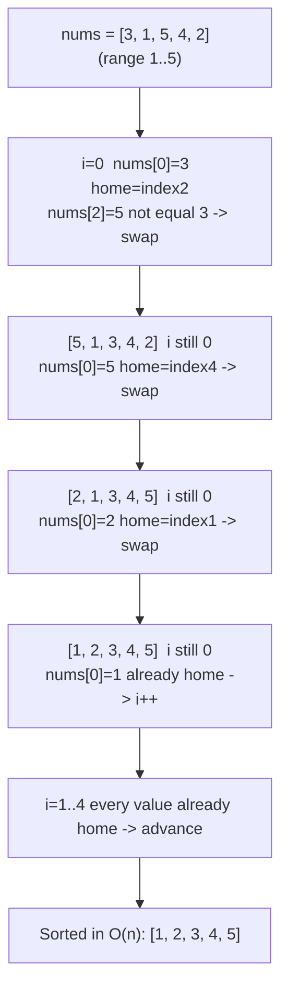
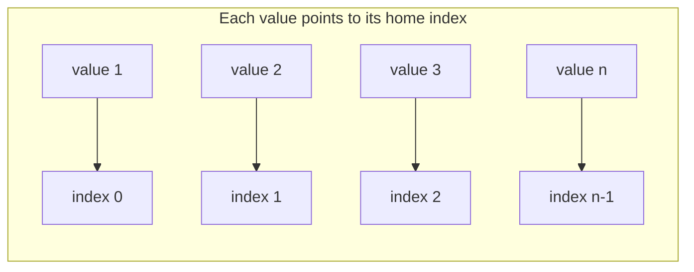

# 🔁 Cyclic Sort

> [!abstract] TL;DR
> When an array holds `n` numbers drawn from a **known contiguous range** — `[1..n]` or `[0..n-1]` — you can sort it in **O(n) time and O(1) space** without any comparison sort. The trick: every value has exactly one "home" index (value `v` belongs at index `v-1`). Walk the array and repeatedly **swap each element to its home** until it is already correct, then move on. After one pass, any index whose value is *not* home reveals a missing, duplicate, or out-of-place number — which is why this pattern dominates "find the missing / duplicate number" problems.

---

## Intuition — Analogy First

Picture a **theatre with numbered seats 1 to n** and exactly `n` ticket-holders who wandered in and sat down randomly. You want everyone in their assigned seat, and you refuse to keep a seating chart on paper (O(1) space).

Simple rule: walk to seat 1. Look at who is sitting there. If it's the right person, great — move to seat 2. If it's the person whose ticket says "seat 7," don't argue — **send them directly to seat 7**, evicting whoever was in seat 7 back to you. Look at the new person now in front of you and repeat. Each person you send home is home *for good* — you never have to move them again. After walking past every seat once, everyone is seated, and each swap placed at least one person permanently. That is O(n) total moves.

Now the payoff: if after this process **seat 5 still has the wrong person**, that immediately tells you number 5 is missing (and the person sitting there is the duplicate). The sort *is* the diagnostic.

---

## How It Works + Mermaid

The invariant: value `v` belongs at index `v - 1` (for a `[1..n]` range) or index `v` (for a `[0..n-1]` range).

1. Start `i = 0`.
2. Compute the correct home index for `nums[i]`.
3. If `nums[i]` is **not** already at its home **and** the home slot does not already hold the same value, **swap** `nums[i]` into its home. Do *not* advance `i` — the element that swapped in still needs placing.
4. Otherwise (already home, or a duplicate blocks the home), advance `i`.

The "don't advance on a productive swap" rule is what keeps it O(n): each swap fixes at least one element permanently, so there can be at most `n` swaps total across the whole scan.





---

## When to Recognize This Pattern (signal keywords)

- "An array of **n** numbers **in the range 1..n**" (or `0..n-1`).
- "Find the **missing** number / all missing numbers."
- "Find the **duplicate** number / all duplicates."
- "Find the **first missing positive** integer."
- "Numbers may be **out of place** but the value set is a permutation of a range."
- Constraints demand **O(1) extra space** *and* **O(n) time** — ruling out a hash set and a comparison sort.
- The values themselves can be used as **indices** (they are small, dense, and bounded by `n`).

If the range is *not* `[1..n]`/`[0..n-1]`, cyclic sort does not apply — reach for a hash set, sorting, or [[Binary_Search]] instead.

---

## Python Implementation / Template

```python
from typing import List

# ── Core template: sort a permutation of 1..n in place ────────────────────────
def cyclic_sort(nums: List[int]) -> None:
    """
    Places every value v at index v-1. Assumes nums is a permutation of 1..n.
    Time: O(n)  Space: O(1)
    """
    i = 0
    while i < len(nums):
        home = nums[i] - 1                 # correct index for value nums[i]
        if nums[i] != nums[home]:          # not already home (and not a dup collision)
            nums[i], nums[home] = nums[home], nums[i]   # send it home; DON'T advance i
        else:
            i += 1                          # this slot is settled; move on


# ── Missing Number (LeetCode 268) — range 0..n, one value missing ─────────────
def missing_number(nums: List[int]) -> int:
    """
    n numbers from 0..n with exactly one missing. Home of value v is index v.
    Time: O(n)  Space: O(1)
    """
    i, n = 0, len(nums)
    while i < n:
        home = nums[i]
        if nums[i] < n and nums[i] != nums[home]:
            nums[i], nums[home] = nums[home], nums[i]
        else:
            i += 1
    # After placement, index i should hold value i. The first mismatch is missing.
    for idx in range(n):
        if nums[idx] != idx:
            return idx
    return n                                # all 0..n-1 present -> n is missing


# ── Find All Numbers Disappeared (LeetCode 448) ───────────────────────────────
def find_disappeared(nums: List[int]) -> List[int]:
    """Range 1..n, some numbers missing (others duplicated). Time O(n), Space O(1)."""
    i, n = 0, len(nums)
    while i < n:
        home = nums[i] - 1
        if nums[i] != nums[home]:
            nums[i], nums[home] = nums[home], nums[i]
        else:
            i += 1
    return [idx + 1 for idx in range(n) if nums[idx] != idx + 1]


# ── Find the Duplicate (LeetCode 287) — cyclic-sort flavor ────────────────────
def find_duplicate(nums: List[int]) -> int:
    """Range 1..n, exactly one value duplicated. Time O(n), Space O(1)."""
    i, n = 0, len(nums)
    while i < n:
        if nums[i] != i + 1:                 # value not at its home index
            home = nums[i] - 1
            if nums[i] != nums[home]:
                nums[i], nums[home] = nums[home], nums[i]
            else:
                return nums[i]               # home already occupied by same value = duplicate
        else:
            i += 1
    return -1


# ── First Missing Positive (LeetCode 41) — hard, but same engine ──────────────
def first_missing_positive(nums: List[int]) -> int:
    """
    Smallest positive integer absent from nums. Ignore values outside 1..n.
    Time: O(n)  Space: O(1)
    """
    i, n = 0, len(nums)
    while i < n:
        home = nums[i] - 1
        if 0 <= home < n and nums[i] != nums[home]:   # only place valid, in-range values
            nums[i], nums[home] = nums[home], nums[i]
        else:
            i += 1
    for idx in range(n):
        if nums[idx] != idx + 1:
            return idx + 1
    return n + 1


# ── Set Mismatch (LeetCode 645) — the duplicate AND the missing ───────────────
def set_mismatch(nums: List[int]) -> List[int]:
    """One number is duplicated (replacing another that goes missing). Returns [dup, missing]."""
    i, n = 0, len(nums)
    while i < n:
        home = nums[i] - 1
        if nums[i] != nums[home]:
            nums[i], nums[home] = nums[home], nums[i]
        else:
            i += 1
    for idx in range(n):
        if nums[idx] != idx + 1:
            return [nums[idx], idx + 1]      # [duplicated value, missing value]
    return [-1, -1]
```

---

## Dry Run / Trace

**`first_missing_positive([3, 4, -1, 1])` → `2`** (n = 4)

| i | nums (before) | nums[i] | home | Action | nums (after) |
|---|---------------|---------|------|--------|--------------|
| 0 | [3, 4, -1, 1] | 3 | 2 | in-range, nums[2]=-1≠3 → swap | [-1, 4, 3, 1] |
| 0 | [-1, 4, 3, 1] | -1 | -2 | home out of range → i++ | [-1, 4, 3, 1] |
| 1 | [-1, 4, 3, 1] | 4 | 3 | in-range, nums[3]=1≠4 → swap | [-1, 1, 3, 4] |
| 1 | [-1, 1, 3, 4] | 1 | 0 | in-range, nums[0]=-1≠1 → swap | [1, -1, 3, 4] |
| 1 | [1, -1, 3, 4] | -1 | -2 | home out of range → i++ | [1, -1, 3, 4] |
| 2 | [1, -1, 3, 4] | 3 | 2 | already home (nums[2]=3) → i++ | [1, -1, 3, 4] |
| 3 | [1, -1, 3, 4] | 4 | 3 | already home → i++ | [1, -1, 3, 4] |

Final scan: index 0 holds 1 ✓, index 1 holds -1 ≠ 2 → **return 2**. Total swaps ≤ 4 despite the nested-looking logic — O(n).

---

## Patterns & LeetCode Applications

| Pattern | Range | Key Insight | LeetCode |
|---------|-------|-------------|----------|
| Missing number | 0..n | index that ends up wrong = missing | 268 |
| All disappeared numbers | 1..n | scan for `nums[i] != i+1` | 448 |
| Find the duplicate | 1..n | home already holds same value | 287 |
| Find all duplicates | 1..n | values that never reach home | 442 |
| First missing positive | 1..n (ignore rest) | only place in-range positives | 41 |
| Set mismatch | 1..n | first wrong index gives both dup + missing | 645 |

**Sibling techniques for the same problems:** [[Bit_Manipulation|XOR trick]] / Gauss sum (for a *single* missing number, 268), [[Fast_Slow_Pointers|Floyd's cycle detection]] (for 287 when the array is read-only), and a boolean/negation-marking pass (for 448/442 when you may mutate signs instead of positions).

---

## Common Pitfalls

1. **Advancing `i` after a productive swap.** You must keep `i` fixed after swapping — the value that just arrived at `i` still needs to be routed home. Advancing early leaves elements misplaced and breaks the O(n) guarantee's correctness.
2. **Comparing to the home *value* vs the home *index*.** The loop condition is `nums[i] != nums[home]` (compare against what already sits at the home), **not** `nums[i] != home + 1`. Using the value comparison is what lets duplicates terminate the loop instead of swapping forever.
3. **Infinite loop on duplicates.** If two equal values both want the same home and you only check `nums[i] != home + 1`, they ping-pong forever. The `nums[i] != nums[home]` guard is the fix.
4. **Wrong home formula for the range.** `[1..n]` → home is `nums[i] - 1`; `[0..n-1]` → home is `nums[i]`. Mixing these off-by-one corrupts everything.
5. **Not bounds-checking in First Missing Positive.** Values ≤ 0 or > n have no valid home — you must skip them with `0 <= home < n`, or you'll index out of range.
6. **Assuming the input is safe to mutate.** Cyclic sort rearranges the array in place. If the caller needs the original order or the array is read-only (e.g., LC 287 variant), copy first or switch to Floyd's cycle detection.

---

## Related Concepts

- [[_MOC_Sorting_Searching|↑ Section MOC]]
- [[Two_Pointers]] — another O(1)-space in-place index-manipulation technique
- [[Array_Operations]] — the in-place swap primitive that powers this pattern
- [[Binary_Search]] — the alternative when values are *not* a dense `[1..n]` range
- [[Quick_Sort]] — general comparison sort; cyclic sort beats it only for ranged integer keys

---

## Review Questions (3)

1. Cyclic sort achieves O(n) time even though each element may be swapped multiple times inside the `while` loop. Give the amortized argument for why the total number of swaps across the entire array is bounded by `n`.
2. "Find the Duplicate Number" (LC 287) can be solved with cyclic sort in O(n)/O(1) **if you may mutate the array**, but the classic constraint forbids mutation. What technique replaces cyclic sort there, and what array property lets you model the problem as cycle detection?
3. Why does cyclic sort require the values to form a *dense* range like `[1..n]` rather than any arbitrary set of distinct integers? What breaks if the values were, say, `{10, 4000, 7, 999999}`?

---

## Sources

- LeetCode 268 — [Missing Number](https://leetcode.com/problems/missing-number/)
- LeetCode 448 — [Find All Numbers Disappeared in an Array](https://leetcode.com/problems/find-all-numbers-disappeared-in-an-array/)
- LeetCode 287 — [Find the Duplicate Number](https://leetcode.com/problems/find-the-duplicate-number/)
- LeetCode 41 — [First Missing Positive](https://leetcode.com/problems/first-missing-positive/)
- Grokking the Coding Interview — Cyclic Sort pattern

#DSA #Patterns #cyclic-sort #in-place #O-n #missing-number #duplicate
