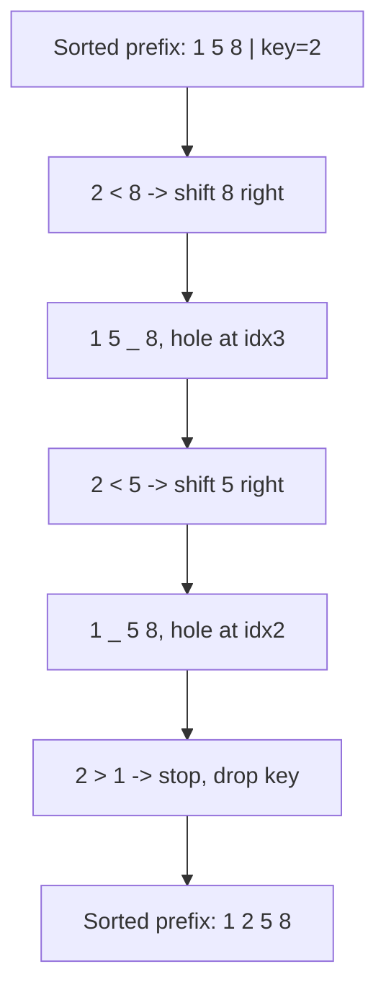

# 🃏 Insertion Sort

> [!abstract] TL;DR
> Insertion Sort grows a **sorted prefix** one element at a time: it takes the next element and slides it leftward into its correct slot among the already-sorted elements — exactly how you sort a hand of playing cards. It is **stable**, **in-place**, and **adaptive**: O(n) on nearly-sorted data and O(n²) worst case. Because of that adaptivity and low overhead, real hybrid sorts like **Timsort** use Insertion Sort on small subarrays (typically runs of < 64 elements).

---

## Intuition — Analogy First

You are dealt playing cards one at a time. You hold a **sorted fan** in your left hand. Each new card you pick up, you slide from the right end leftward past every card larger than it, then drop it into the gap. Your hand is *always* sorted; it just grows by one card each time.

That is the whole algorithm. The array is split into a **sorted prefix** (left) and an **unsorted suffix** (right). Repeatedly take the first unsorted element (the "key") and shift the bigger sorted elements one step right to open a hole, then drop the key into the hole.

The magic property: if the key is already ≥ everything to its left, **no shifting happens** — one comparison and you move on. That is why nearly-sorted arrays fly through in O(n).

---

## How It Works + Mermaid

**Algorithm:**
1. Treat `arr[0]` as a sorted prefix of length 1.
2. For each `i` from `1` to `n-1`, let `key = arr[i]`.
3. Compare `key` with elements to its left, moving right-to-left; **shift** each element that is `> key` one position right.
4. Drop `key` into the opened gap.
5. The sorted prefix has now grown by one.

The diagram shows inserting `key = 2` into the sorted prefix `[1, 5, 8]`:



---

## Complexity Analysis

| Case                     | Time  | Space | Stable | In-Place | Notes                                        |
|--------------------------|-------|-------|--------|----------|----------------------------------------------|
| Best (already sorted)    | O(n)  | O(1)  | Yes    | Yes      | Each key needs one comparison, zero shifts   |
| Average                  | O(n²) | O(1)  | Yes    | Yes      | ~n²/4 shifts on random data                   |
| Worst (reverse sorted)   | O(n²) | O(1)  | Yes    | Yes      | Every key shifts the entire prefix           |

- **Stable:** we stop shifting as soon as we hit an element `<= key` (loop uses `arr[j] > key`), so equal keys never leapfrog.
- **In-place:** shifts happen within the array; O(1) extra memory.
- **Adaptive:** runtime is O(n + d) where `d` = number of inversions. Nearly-sorted → few inversions → nearly linear.
- **Online:** it can sort a stream — each new element is inserted into the already-sorted portion as it arrives.

---

## Python Implementation

```python
from typing import List

# =========================================================
# 1. INSERTION SORT (shift-based, stable, adaptive)
# =========================================================
def insertion_sort(arr: List[int]) -> None:
    """Sort in-place. Stable and adaptive: O(n) on nearly-sorted input."""
    for i in range(1, len(arr)):
        key = arr[i]
        j = i - 1
        # Shift every element greater than key one slot to the right.
        # '> key' (not '>= key') is what keeps the sort STABLE.
        while j >= 0 and arr[j] > key:
            arr[j + 1] = arr[j]
            j -= 1
        arr[j + 1] = key          # drop key into the opened gap


# =========================================================
# 2. BINARY INSERTION SORT (fewer comparisons, same shifts)
# =========================================================
import bisect

def binary_insertion_sort(arr: List[int]) -> None:
    """
    Use binary search to FIND the insertion point in O(log i),
    reducing comparisons. Shifting is still O(n), so total is O(n^2).
    """
    for i in range(1, len(arr)):
        key = arr[i]
        # bisect_right keeps stability (inserts after equal elements)
        pos = bisect.bisect_right(arr, key, 0, i)
        # shift arr[pos:i] right by one, then place key
        arr[pos + 1:i + 1] = arr[pos:i]
        arr[pos] = key


if __name__ == "__main__":
    data = [1, 5, 8, 2, 4]
    insertion_sort(data)
    print(data)               # [1, 2, 4, 5, 8]
```

---

## Dry Run / Trace

Sorting `[1, 5, 8, 2, 4]`:

```
i=1 key=5: prefix [1]        → 1 > 5? no       → [1, 5, 8, 2, 4]
i=2 key=8: prefix [1,5]      → 5 > 8? no       → [1, 5, 8, 2, 4]
i=3 key=2: prefix [1,5,8]
    8 > 2 → shift 8:  [1, 5, _, 8, 4]
    5 > 2 → shift 5:  [1, _, 5, 8, 4]
    1 > 2? no → drop 2 at idx1 → [1, 2, 5, 8, 4]
i=4 key=4: prefix [1,2,5,8]
    8 > 4 → shift 8:  [1, 2, 5, _, 8]
    5 > 4 → shift 5:  [1, 2, _, 5, 8]
    2 > 4? no → drop 4 at idx2 → [1, 2, 4, 5, 8]
Result: [1, 2, 4, 5, 8]
```

Notice `i=1` and `i=2` cost only **one** comparison each — that is the adaptivity that makes nearly-sorted input O(n).

---

## Patterns & LeetCode Applications

| Problem / Use                    | LC #  | Why Insertion Sort fits                                     |
|----------------------------------|-------|-------------------------------------------------------------|
| Insertion Sort List              | 147   | Direct implementation on a linked list                      |
| Sort an Array                    | 912   | Educational; fine for tiny n, TLE on large n                |
| Timsort small-run sort           | —     | Python's / Java's built-in sort insertion-sorts runs < 64   |
| Nearly-sorted / streaming data   | —     | O(n + inversions) makes it ideal when data is almost ordered|

**Hybrid sorting insight:** the reason `list.sort()` (Timsort) and `std::sort` (introsort) drop into Insertion Sort for small chunks is that its **low constant factors** beat the recursion/partition overhead of merge/[[Quick_Sort|quick sort]] once the subarray is tiny (roughly < 16–64 elements). This is a very common interview follow-up.

---

## Common Pitfalls

1. **Using `>=` instead of `>`** in the while condition — this shifts equal elements too and **breaks stability**.
2. **Overwriting the key before saving it.** You must capture `key = arr[i]` *before* the shifting loop, or you lose the value while making room.
3. **Wrong final placement index:** after the loop `j` points one slot *left* of the gap, so the key goes to `arr[j + 1]`, not `arr[j]`.
4. **Thinking binary insertion sort is faster asymptotically.** It cuts *comparisons* to O(n log n) total but *shifts* stay O(n²) — no asymptotic win on arrays.
5. **Using it on large random arrays.** It is O(n²); only competitive for small or nearly-sorted inputs.

---

## Related Concepts

- [[_MOC_Sorting_Searching|↑ Section MOC]]
- [[Sorting_Overview]] — full comparison table and selection guide
- [[Bubble_Sort]] — same complexity class, but Insertion Sort shifts instead of swapping and is faster in practice
- [[Selection_Sort]] — the third classic O(n²) sort; minimizes swaps but is not adaptive
- [[Merge_Sort]] — the O(n log n) sort Timsort combines *with* Insertion Sort
- [[Complexity_Cheat_Sheet]] — Big-O quick reference
- [[Time_Complexity_Classes]] — growth-rate context for O(n) vs O(n²)

---

## Review Questions

1. **Insertion Sort is "adaptive." Precisely define what that means and give the runtime in terms of the number of inversions in the input.**
2. **Timsort insertion-sorts subarrays smaller than ~64 elements before merging. Why is Insertion Sort the right choice there instead of, say, Merge Sort?**
3. **What is the difference in comparison count and shift count between standard and binary Insertion Sort, and why does binary insertion still fail to improve the overall time complexity on an array?**

---

## Sources

- CLRS — Introduction to Algorithms, Ch. 2.1 (Insertion Sort, loop invariants)
- [Visualgo — Insertion Sort](https://visualgo.net/en/sorting)
- [CPython listsort.txt — Timsort description](https://github.com/python/cpython/blob/main/Objects/listsort.txt)
- LeetCode #147, #912

#insertionsort #sorting #stable #adaptive #inplace #timsort
