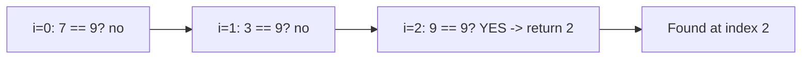

# 🔎 Linear Search

> [!abstract] TL;DR
> Linear Search scans elements **one by one** until it finds the target or exhausts the list. It runs in **O(n)** and needs **no preconditions** — it is the *only* option for **unsorted** data, linked lists, or streams. It is beaten by [[Binary_Search]] (O(log n)) only when the data is **sorted and randomly accessible**. A small tweak, the **sentinel** variant, removes the bounds check from the inner loop to shave constant factors.

---

## Intuition — Analogy First

You lost your keys and have no idea where they are. You check the first drawer, then the second, then the third — **in order, one at a time** — until you find them or run out of drawers. You cannot "jump to the middle and rule out half," because there is no ordering that tells you which half to skip. That is Linear Search.

Contrast this with looking up a word in a **physical dictionary**: because it is *sorted*, you can open to the middle, decide "earlier" or "later," and discard half each time — that is [[Binary_Search]]. The single deciding factor between the two is whether the data is **ordered and indexable**. No order ⇒ you must look at everything ⇒ Linear Search.

---

## How It Works + Mermaid

**Algorithm:**
1. Start a pointer at index `0`.
2. Compare `arr[i]` with the `target`.
3. If equal → return `i` (found).
4. Otherwise advance the pointer.
5. If the pointer passes the end → return "not found" (`-1`).

The diagram shows the scan pointer sweeping `[7, 3, 9, 4]` looking for `9`:



---

## Complexity Analysis

| Case                  | Time  | Space | Sorted Needed? | Random Access? | Notes                         |
|-----------------------|-------|-------|----------------|----------------|-------------------------------|
| Best (target first)   | O(1)  | O(1)  | No             | No             | Match on the first element    |
| Average               | O(n)  | O(1)  | No             | No             | ~n/2 comparisons              |
| Worst (absent / last) | O(n)  | O(1)  | No             | No             | Scans the entire collection   |

- **No preconditions:** works on unsorted arrays, linked lists, generators/streams, and files being read once.
- **Sequential access only:** unlike [[Binary_Search]], it never needs `arr[mid]` random indexing, so it works on linked lists where jumping to the middle is O(n) anyway.
- **In-place / O(1) space:** just a moving index.

---

## Python Implementation

```python
from typing import List, Optional

# =========================================================
# 1. BASIC LINEAR SEARCH
# =========================================================
def linear_search(arr: List[int], target: int) -> int:
    """Return the index of target, or -1 if absent. O(n)."""
    for i, x in enumerate(arr):
        if x == target:
            return i
    return -1


# =========================================================
# 2. SENTINEL LINEAR SEARCH (removes the i < n bound check)
# =========================================================
def sentinel_search(arr: List[int], target: int) -> int:
    """
    Append the target as a 'sentinel' so the loop is GUARANTEED
    to terminate on a match — dropping the per-iteration bounds
    check. Faster constant factor; still O(n).
    """
    n = len(arr)
    last = arr[n - 1]
    arr.append(target)              # sentinel guarantees a hit

    i = 0
    while arr[i] != target:         # no 'i < n' test needed
        i += 1

    arr.pop()                       # restore original array
    # A real match happens only if i < n, OR the true last element matched
    if i < n or last == target:
        return i if i < n else n - 1
    return -1


# =========================================================
# 3. LINEAR SEARCH ON A LINKED LIST (no random access)
# =========================================================
class Node:
    def __init__(self, val, nxt=None):
        self.val, self.next = val, nxt

def search_linked_list(head: Optional[Node], target: int) -> Optional[Node]:
    node = head
    while node:
        if node.val == target:
            return node
        node = node.next
    return None


if __name__ == "__main__":
    print(linear_search([7, 3, 9, 4], 9))   # 2
    print(linear_search([7, 3, 9, 4], 5))   # -1
    print(sentinel_search([7, 3, 9, 4], 4)) # 3
```

---

## Dry Run / Trace

Searching for `9` in `[7, 3, 9, 4]`:

```
i=0: arr[0]=7 == 9? no  → advance
i=1: arr[1]=3 == 9? no  → advance
i=2: arr[2]=9 == 9? YES → return 2
```

Searching for `5` (absent):

```
i=0: 7==5? no → i=1: 3==5? no → i=2: 9==5? no → i=3: 4==5? no
i=4: past end → return -1   (full O(n) scan, worst case)
```

---

## Linear vs Binary Search — When Each Wins

| Factor                        | Linear Search        | [[Binary_Search]]         |
|-------------------------------|----------------------|---------------------------|
| Data must be sorted           | No                   | **Yes**                   |
| Time complexity               | O(n)                 | O(log n)                  |
| Access pattern                | Sequential           | Random (index `mid`)      |
| Works on linked lists         | Yes (natural)        | No (mid access is O(n))   |
| Setup cost                    | None                 | Must sort first: O(n log n)|
| Best for                      | Small / unsorted / one-shot data | Large, sorted, repeatedly queried |

**When Linear Search actually beats Binary Search:**
- **Unsorted data** — Binary Search is not even applicable.
- **Small arrays** — for tiny n, Linear Search's simpler branch-free scan often outruns Binary Search's overhead (cache-friendly, no `mid` recomputation).
- **Linked lists** — no O(1) random access, so Binary Search's `mid` jump costs O(n) anyway, erasing its advantage.
- **One-shot search** — if you search once, paying O(n log n) to sort just to do an O(log n) lookup is a net loss; a single O(n) scan is cheaper.

---

## Patterns & LeetCode Applications

| Problem                          | LC #  | Why Linear Search fits                                     |
|----------------------------------|-------|-------------------------------------------------------------|
| Search Insert Position           | 35    | Trivial linearly; binary search is the intended upgrade     |
| Find Numbers with Even # Digits  | 1295  | Simple full scan with a predicate                           |
| Maximum Subarray (scan)          | 53    | Single linear pass ([[Kadane_Algorithm|Kadane]]) — the "scan and track" pattern  |
| Find the Duplicate (small n)     | 287   | Linear scan viable, though better methods exist             |
| Contains / membership checks     | —     | Any "does x exist in this unsorted collection?" query       |

**Pattern signal:** Linear Search is the baseline for any "traverse and check a condition" pass — max/min, count, first-match, membership. Many array problems are secretly a single linear scan while maintaining running state.

---

## Common Pitfalls

1. **Reaching for Binary Search on unsorted data.** It silently returns wrong indices — Binary Search *requires* a sorted, monotonic structure.
2. **Sorting just to search once.** Paying O(n log n) to enable an O(log n) lookup is wasteful for a single query; a lone O(n) scan wins.
3. **Sentinel side effects.** The sentinel variant *mutates* the array (append/pop). Restore it, and be careful in concurrent contexts.
4. **Returning the value instead of the index** (or vice-versa) — decide the contract; `-1` is the conventional "not found" sentinel value.
5. **Assuming O(n) is always slow.** For small or one-shot inputs the constant factors make it the *fastest* practical choice.

---

## Related Concepts

- [[_MOC_Sorting_Searching|↑ Section MOC]]
- [[Binary_Search]] — the O(log n) alternative that requires sorted, random-access data
- [[Sorting_Overview]] — sorting is the precondition that unlocks Binary Search over Linear Search
- [[Complexity_Cheat_Sheet]] — Big-O quick reference for search/sort operations
- [[Time_Complexity_Classes]] — O(1) vs O(n) vs O(log n) growth-rate context

---

## Review Questions

1. **Give three concrete situations where Linear Search is the correct choice over Binary Search, and justify each.**
2. **How does the sentinel variant improve performance, and what is its cost or side effect? Does it change the asymptotic complexity?**
3. **You will query the same collection thousands of times. What determines whether you should keep using Linear Search or invest in sorting + Binary Search first?**

---

## Sources

- CLRS — Introduction to Algorithms (searching fundamentals)
- [Visualgo — Searching](https://visualgo.net/en/list)
- LeetCode #35, #53, #1295
- [Wikipedia — Linear search](https://en.wikipedia.org/wiki/Linear_search)

#linearsearch #searching #sequential #sentinel #beginner
