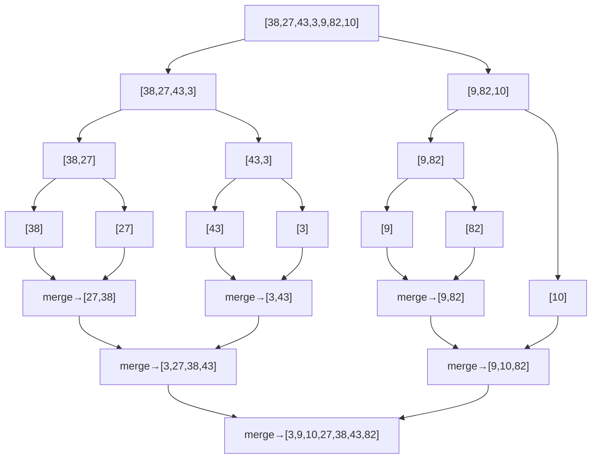

---
title: Merge Sort
aliases: [MergeSort, Divide and Conquer Sort, External Sort]
tags: [DSA, Sorting, DivideAndConquer, Stable, Recursive]
domain: DSA
difficulty: Intermediate
created: 2026-07-26
related: [Sorting_Overview, Quick_Sort, Divide_and_Conquer]
status: complete
---

# 🔀 Merge Sort

> [!abstract] TL;DR
> Merge Sort is a stable, divide-and-conquer sort that guarantees O(n log n) in all cases at the cost of O(n) extra space. It recursively splits the array in half, sorts each half, then merges them. It's the algorithm of choice for **linked lists**, **counting inversions**, and **external sorting** where you can't fit data in memory.

---

## Intuition — Analogy First

Picture two librarians sorting a library. Librarian A takes the left half of all unsorted books; Librarian B takes the right half. Each sorts their pile. Then they sit across a table and **interleave** their sorted piles into one sorted collection — whoever has the smaller current book puts it on the shared pile first.

The key insight: **merging two sorted halves is O(n)**. And you only need O(log n) levels of splitting. Together: O(n log n).

Unlike QuickSort, Merge Sort never has a bad pivot day — its split is always exactly in half, so performance is guaranteed. The price is memory: you need a temporary array to hold the merged result.

---

## How It Works + Mermaid

**Algorithm:**
1. **Divide:** If array has ≤ 1 element, return (base case). Otherwise, find midpoint `mid = (left + right) // 2` and recurse on `arr[left:mid]` and `arr[mid:right]`.
2. **Conquer:** Recursively sort both halves.
3. **Combine (Merge):** Merge the two sorted halves using two pointers — compare the front elements of each half, take the smaller, advance that pointer. Copy remaining elements.

**Recurrence:** T(n) = 2T(n/2) + O(n)

By the Master Theorem (case 2: a=2, b=2, f(n)=n, log_b(a)=1 → n^1 = f(n)): **T(n) = O(n log n)**



---

## Complexity Analysis

| Variant               | Time        | Space     | Stable | Notes                                      |
|-----------------------|-------------|-----------|--------|--------------------------------------------|
| Recursive Merge Sort  | O(n log n)  | O(n)      | Yes    | Extra O(n) for temp array; O(log n) stack  |
| Iterative (bottom-up) | O(n log n)  | O(n)      | Yes    | No recursion stack; same work              |
| Linked List Merge Sort| O(n log n)  | O(log n)  | Yes    | No extra array needed; only pointers       |
| External Merge Sort   | O(n log n)  | O(B)      | Yes    | B = buffer size; sorts data larger than RAM |

**Why O(n) space?** The merge step needs a temporary buffer to hold the merged result — you can't merge in-place efficiently while maintaining stability.

**External Sort:** When sorting terabytes of data that don't fit in RAM, split into chunks that fit in memory, sort each chunk, then do a k-way merge using a min-heap. The merge reads from disk sequentially (efficient) and writes the sorted output sequentially.

---

## Implementation (Python)

```python
from typing import List

# =========================================================
# 1. RECURSIVE MERGE SORT (classic)
# =========================================================
def merge_sort(arr: List[int]) -> List[int]:
    if len(arr) <= 1:
        return arr

    mid = len(arr) // 2
    left = merge_sort(arr[:mid])
    right = merge_sort(arr[mid:])
    return merge(left, right)


def merge(left: List[int], right: List[int]) -> List[int]:
    result = []
    i = j = 0
    while i < len(left) and j < len(right):
        if left[i] <= right[j]:  # <= ensures stability
            result.append(left[i])
            i += 1
        else:
            result.append(right[j])
            j += 1
    result.extend(left[i:])
    result.extend(right[j:])
    return result


# =========================================================
# 2. IN-PLACE RECURSIVE MERGE SORT (avoids extra list creation)
# =========================================================
def merge_sort_inplace(arr: List[int], left: int, right: int):
    """Sort arr[left:right+1] in-place using O(n) temp buffer."""
    if left >= right:
        return
    mid = (left + right) // 2
    merge_sort_inplace(arr, left, mid)
    merge_sort_inplace(arr, mid + 1, right)
    merge_inplace(arr, left, mid, right)


def merge_inplace(arr: List[int], left: int, mid: int, right: int):
    temp = arr[left:right+1]
    i = 0            # pointer into left half of temp
    j = mid - left + 1  # pointer into right half of temp
    k = left         # pointer into original arr

    while i <= mid - left and j <= right - left:
        if temp[i] <= temp[j]:
            arr[k] = temp[i]; i += 1
        else:
            arr[k] = temp[j]; j += 1
        k += 1
    while i <= mid - left:
        arr[k] = temp[i]; i += 1; k += 1
    while j <= right - left:
        arr[k] = temp[j]; j += 1; k += 1


# =========================================================
# 3. ITERATIVE (BOTTOM-UP) MERGE SORT
# =========================================================
def merge_sort_iterative(arr: List[int]) -> List[int]:
    """
    Bottom-up: start with sub-arrays of size 1, then merge pairs
    into size 2, then 4, 8, etc. No recursion stack needed.
    """
    n = len(arr)
    result = arr[:]
    size = 1

    while size < n:
        for left in range(0, n, 2 * size):
            mid = min(left + size, n)
            right = min(left + 2 * size, n)
            if mid < right:
                merged = merge(result[left:mid], result[mid:right])
                result[left:right] = merged
        size *= 2

    return result


# =========================================================
# 4. COUNTING INVERSIONS (merge sort variation)
# =========================================================
def count_inversions(arr: List[int]) -> int:
    """
    Count pairs (i,j) where i < j but arr[i] > arr[j].
    Uses merge sort: during merge, when right[j] < left[i],
    it forms inversions with all remaining left elements.
    O(n log n).
    """
    if len(arr) <= 1:
        return 0

    mid = len(arr) // 2
    left = arr[:mid]
    right = arr[mid:]

    count = count_inversions(left) + count_inversions(right)

    # Merge and count
    i = j = k = 0
    while i < len(left) and j < len(right):
        if left[i] <= right[j]:
            arr[k] = left[i]; i += 1
        else:
            # right[j] < left[i]: all remaining left elements form inversions
            arr[k] = right[j]; j += 1
            count += len(left) - i  # <-- inversion count
        k += 1
    while i < len(left):
        arr[k] = left[i]; i += 1; k += 1
    while j < len(right):
        arr[k] = right[j]; j += 1; k += 1

    return count


# =========================================================
# 5. MERGE SORTED ARRAY (LC 88) — no extra array
# =========================================================
def merge_sorted_arrays(nums1: List[int], m: int, nums2: List[int], n: int) -> None:
    """
    Merge nums2 into nums1 in-place. nums1 has extra space at end.
    Merge from RIGHT to LEFT to avoid overwriting unprocessed elements.
    """
    p1 = m - 1      # pointer for nums1 (valid part)
    p2 = n - 1      # pointer for nums2
    p = m + n - 1   # write pointer (end of nums1)

    while p1 >= 0 and p2 >= 0:
        if nums1[p1] > nums2[p2]:
            nums1[p] = nums1[p1]; p1 -= 1
        else:
            nums1[p] = nums2[p2]; p2 -= 1
        p -= 1
    # Copy remaining nums2 (nums1's remaining elements are already in place)
    nums1[:p2+1] = nums2[:p2+1]
```

---

## Dry Run / Example Trace

**Counting Inversions on [3, 1, 2]:**

```
count_inversions([3, 1, 2])
  left = [3], right = [1, 2]
  count_inversions([3]) = 0
  count_inversions([1, 2]):
    left=[1], right=[2]
    merge: 1 ≤ 2 → take 1; then take 2. No inversions.
    return 0
  Now merge [3] and [1, 2]:
    i=0, j=0: left[0]=3 > right[0]=1
      → arr[0] = 1, j=1, count += len(left)-i = 1-0 = 1
    i=0, j=1: left[0]=3 > right[1]=2
      → arr[1] = 2, j=2, count += 1-0 = 1
    Remaining left: arr[2] = 3
  count from merge = 2
Total: 0 + 0 + 2 = 2 inversions: (3,1) and (3,2) ✓
```

---

## Patterns & LeetCode Applications

| Problem                          | LC #  | Key Insight                                               |
|----------------------------------|-------|-----------------------------------------------------------|
| Sort an Array                    | 912   | Pure merge sort implementation                            |
| Merge Sorted Array               | 88    | Two-pointer merge from right (no extra space)             |
| Sort List (Linked List)          | 148   | Merge sort on linked list — O(n log n) O(log n) space     |
| Count of Smaller Numbers After Self | 315 | Count inversions variant; merge sort with index tracking |
| Reverse Pairs                    | 493   | Count inversions where arr[i] > 2*arr[j]                 |
| Count of Range Sum               | 327   | Merge sort on prefix sums to count valid ranges           |

**Inversion counting template:** Any problem asking "how many pairs (i,j) satisfy i<j and f(arr[i], arr[j])" where f defines an ordering can often be solved by adapting the merge step of merge sort.

---

## Common Pitfalls

1. **Stability:** Use `<=` (not `<`) when comparing left vs right in the merge step. Using `<` makes right elements preferred on ties → unstable.
2. **Slice copies:** `arr[:mid]` creates a copy in Python — this contributes to the O(n log n) total copy operations. Use index-based merge for in-place.
3. **Off-by-one in mid:** `mid = len(arr) // 2` ensures left half is ≤ right half in size. For index-based: `mid = left + (right - left) // 2`.
4. **Linked list merge sort:** Use slow/fast pointer (Floyd's) to find the midpoint; no indexing available.
5. **Inversion counting side effects:** `count_inversions` sorts the array in-place as a side effect — pass a copy if you need the original.
6. **Bottom-up size calculation:** In iterative version, `right = min(left + 2*size, n)` — must clamp to n to avoid index out of bounds.

---

## Related Concepts

- [[_MOC_Sorting_Searching|↑ Section MOC]]
- [[Sorting_Overview]] — comparison table and algorithm selection guide
- [[Quick_Sort]] — in-place alternative; faster average but unstable and O(n²) worst case
- [[Divide_and_Conquer]] — the paradigm: split, recurse, combine

---

## Review Questions

1. **Merge sort is stable but Quick Sort (basic) is not. What property of the merge step ensures stability, and what specific line of code is responsible?**
2. **Why is Merge Sort preferred over Quick Sort for sorting a linked list?** What property of linked lists makes Quick Sort impractical and Merge Sort natural?
3. **The count inversions problem can be solved in O(n log n) using merge sort. Explain the key observation during the merge step — when does an inversion get counted, and how many inversions does each such event represent?**

---

## Sources

- CLRS — Introduction to Algorithms, Ch. 2.3 and Ch. 4 (Merge Sort, Master Theorem)
- [Visualgo — Merge Sort](https://visualgo.net/en/sorting)
- LeetCode #88, #148, #912, #315
- [NeetCode — Sort List](https://neetcode.io)

#mergesort #sorting #divideandconquer #stable #inversions #linkedlist
