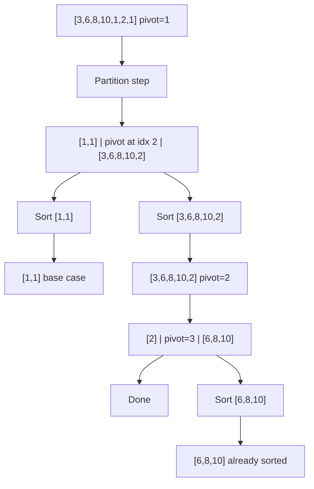

---
title: Quick Sort
aliases: [QuickSort, Partition Sort, QuickSelect]
tags: [DSA, Sorting, DivideAndConquer, InPlace, Partition]
domain: DSA
difficulty: Intermediate
created: 2026-07-26
related: [Sorting_Overview, Merge_Sort, Top_K_Pattern]
status: complete
---

# ⚡ Quick Sort

> [!abstract] TL;DR
> Quick Sort partitions an array around a pivot — smaller elements left, larger right — then recursively sorts both sides. **O(n log n) average, O(n²) worst case** (sorted input + naive pivot). In-place (O(log n) stack space). Fastest in practice for random data due to excellent cache performance. Use randomized pivot to avoid worst case.

---

## Intuition — Analogy First

Imagine sorting a shuffled deck of cards. You pick one card at random — say, the 7 of hearts. Place all cards with value ≤ 7 in a left pile and all > 7 in a right pile. The 7 is now in its final position — you'll never need to move it again. Repeat this for the left pile and the right pile independently. Each card eventually lands in its correct "final spot" after being the pivot once.

The genius: **each pivot is placed in its final position permanently**. No card ever moves more than O(log n) piles deep on average. The danger: if you always pick the smallest card as pivot, you get O(n) piles each of size n-1 → O(n²).

---

## How It Works + Mermaid

### Lomuto Partition (simpler to understand)
- Pivot = last element.
- Maintain a boundary `i` (elements ≤ pivot are in `arr[left..i]`).
- Scan `j` from left to right. If `arr[j] ≤ pivot`, swap `arr[i+1]` with `arr[j]`, advance i.
- Swap pivot into position `i+1`.

### Hoare Partition (faster, 3x fewer swaps)
- Pivot = first element (or middle).
- Two pointers from ends, moving inward. Swap when out of order.
- Correct but trickier — pivot doesn't land at `mid` directly.

### 3-Way Partition (Dutch National Flag — handles duplicates)
- Three regions: `< pivot | == pivot | > pivot`
- Elements equal to pivot are already in final position after one pass.
- Essential when data has many duplicate values — avoids O(n²) on arrays of all equal elements.



**Complexity analysis:**

- **Best/Average case:** Pivot always near median → balanced split → T(n) = 2T(n/2) + O(n) → O(n log n).
- **Worst case:** Pivot always min or max → T(n) = T(n-1) + O(n) → O(n²). Happens with sorted/reverse-sorted input and naive pivot.

**Average case derivation:** Expected number of comparisons = 2n·H(n) ≈ 1.386 n log n (where H(n) is the harmonic series). Randomized pivot achieves this expected value regardless of input order.

---

## Complexity Analysis

| Variant                   | Time (Best) | Time (Avg) | Time (Worst) | Space      | Stable |
|---------------------------|-------------|------------|--------------|------------|--------|
| Lomuto (last pivot)       | O(n log n)  | O(n log n) | O(n²)        | O(log n)   | No     |
| Hoare (first pivot)       | O(n log n)  | O(n log n) | O(n²)        | O(log n)   | No     |
| Randomized pivot          | O(n log n)  | O(n log n) | O(n²) rare   | O(log n)   | No     |
| 3-way partition           | O(n)        | O(n log n) | O(n²)        | O(log n)   | No     |
| QuickSelect (kth element) | O(n)        | O(n)       | O(n²)        | O(log n)   | N/A    |

Space is O(log n) on average (recursion call stack depth for balanced splits), O(n) worst case.

---

## Implementation (Python)

```python
import random
from typing import List

# =========================================================
# 1. LOMUTO PARTITION — cleaner to understand
# =========================================================
def quicksort_lomuto(arr: List[int], left: int, right: int):
    if left >= right:
        return

    pivot_idx = partition_lomuto(arr, left, right)
    quicksort_lomuto(arr, left, pivot_idx - 1)
    quicksort_lomuto(arr, pivot_idx + 1, right)


def partition_lomuto(arr: List[int], left: int, right: int) -> int:
    # Randomize pivot to avoid O(n²) on sorted input
    rand_idx = random.randint(left, right)
    arr[rand_idx], arr[right] = arr[right], arr[rand_idx]

    pivot = arr[right]
    i = left - 1  # boundary: arr[left..i] <= pivot

    for j in range(left, right):
        if arr[j] <= pivot:
            i += 1
            arr[i], arr[j] = arr[j], arr[i]

    arr[i+1], arr[right] = arr[right], arr[i+1]
    return i + 1


# =========================================================
# 2. 3-WAY PARTITION (Dutch National Flag)
# =========================================================
def quicksort_3way(arr: List[int], left: int, right: int):
    """
    3-way partition: arr[left..lt-1] < pivot, arr[lt..gt] == pivot,
    arr[gt+1..right] > pivot. Essential for arrays with many duplicates.
    """
    if left >= right:
        return

    pivot = arr[random.randint(left, right)]
    lt = left    # arr[left..lt-1] < pivot
    gt = right   # arr[gt+1..right] > pivot
    i = left     # current element

    while i <= gt:
        if arr[i] < pivot:
            arr[lt], arr[i] = arr[i], arr[lt]
            lt += 1; i += 1
        elif arr[i] > pivot:
            arr[gt], arr[i] = arr[i], arr[gt]
            gt -= 1  # don't advance i (need to re-examine swapped elem)
        else:
            i += 1  # equal to pivot: leave in place, advance

    # arr[left..lt-1] < pivot, arr[lt..gt] == pivot, arr[gt+1..right] > pivot
    quicksort_3way(arr, left, lt - 1)
    quicksort_3way(arr, gt + 1, right)


# =========================================================
# 3. SORT COLORS — Dutch National Flag (LC 75)
# =========================================================
def sortColors(nums: List[int]) -> None:
    """Sort array of 0s, 1s, 2s in-place. Exactly 3-way partition with pivot=1."""
    low = mid = 0
    high = len(nums) - 1

    while mid <= high:
        if nums[mid] == 0:
            nums[low], nums[mid] = nums[mid], nums[low]
            low += 1; mid += 1
        elif nums[mid] == 1:
            mid += 1
        else:  # nums[mid] == 2
            nums[mid], nums[high] = nums[high], nums[mid]
            high -= 1  # don't increment mid


# =========================================================
# 4. QUICKSELECT — Kth Largest Element (LC 215)
# =========================================================
def findKthLargest(nums: List[int], k: int) -> int:
    """
    QuickSelect: O(n) average. Partial sort — only recurse on the
    side containing the kth element. Like quicksort but only one branch.
    """
    target = len(nums) - k  # kth largest = (n-k)th smallest (0-indexed)

    def quickselect(left: int, right: int) -> int:
        pivot_idx = partition_lomuto(nums, left, right)

        if pivot_idx == target:
            return nums[pivot_idx]
        elif pivot_idx < target:
            return quickselect(pivot_idx + 1, right)  # target is in right half
        else:
            return quickselect(left, pivot_idx - 1)   # target is in left half

    return quickselect(0, len(nums) - 1)


# =========================================================
# 5. MEDIAN OF 3 PIVOT — avoids worst case on sorted arrays
# =========================================================
def median_of_three(arr: List[int], left: int, right: int) -> int:
    """Returns index of median of arr[left], arr[mid], arr[right]."""
    mid = (left + right) // 2
    # Sort these three elements and use median as pivot
    if arr[left] > arr[mid]:
        arr[left], arr[mid] = arr[mid], arr[left]
    if arr[left] > arr[right]:
        arr[left], arr[right] = arr[right], arr[left]
    if arr[mid] > arr[right]:
        arr[mid], arr[right] = arr[right], arr[mid]
    # arr[left] ≤ arr[mid] ≤ arr[right]; use mid as pivot
    arr[mid], arr[right] = arr[right], arr[mid]  # move pivot to end
    return right
```

---

## Dry Run / Example Trace

**Lomuto partition on arr=[3,1,4,1,5,9,2,6], pivot=arr[7]=6**

```
Initial: [3, 1, 4, 1, 5, 9, 2, 6], i=-1, pivot=6

j=0: arr[0]=3 ≤ 6 → i=0, swap(arr[0],arr[0]) → [3,1,4,1,5,9,2,6]
j=1: arr[1]=1 ≤ 6 → i=1, swap(arr[1],arr[1]) → [3,1,4,1,5,9,2,6]
j=2: arr[2]=4 ≤ 6 → i=2, swap(arr[2],arr[2]) → [3,1,4,1,5,9,2,6]
j=3: arr[3]=1 ≤ 6 → i=3, swap(arr[3],arr[3]) → [3,1,4,1,5,9,2,6]
j=4: arr[4]=5 ≤ 6 → i=4, swap(arr[4],arr[4]) → [3,1,4,1,5,9,2,6]
j=5: arr[5]=9 > 6 → skip
j=6: arr[6]=2 ≤ 6 → i=5, swap(arr[5],arr[6]) → [3,1,4,1,5,2,9,6]

Place pivot: swap(arr[i+1=6],arr[right=7]) → [3,1,4,1,5,2,6,9]
Pivot 6 is at index 6 (its final position ✓).

Recurse on [3,1,4,1,5,2] and [9].
```

---

## Patterns & LeetCode Applications

| Problem                         | LC #  | Key Insight                                              |
|---------------------------------|-------|----------------------------------------------------------|
| Sort Colors                     | 75    | Dutch National Flag (3-way partition with pivot=1)       |
| Kth Largest Element in Array    | 215   | QuickSelect: O(n) average, only recurse on one side      |
| Top K Frequent Elements         | 347   | QuickSelect on frequency; or heap                        |
| Wiggle Sort II                  | 324   | Find median with QuickSelect, then interleave            |
| K Closest Points to Origin      | 973   | QuickSelect by distance                                  |
| Largest Number                  | 179   | Custom comparator sort (not quicksort-specific)          |

**QuickSelect pattern:** When you need the k-th smallest/largest element and don't need the full sorted array, QuickSelect gives O(n) average vs O(n log n) for full sort.

---

## Common Pitfalls

1. **Naive pivot on sorted input:** Picking first/last element as pivot on already-sorted data gives O(n²). Always randomize or use median-of-3.
2. **3-way partition when not advancing i:** When `arr[i] > pivot`, don't increment `i` — the swapped element from `gt` hasn't been examined yet.
3. **Lomuto vs Hoare confusion:** Hoare's partition doesn't place the pivot at its final position after partitioning — it returns a split index, not the pivot's final index. Recursive calls must be `left..pivot_idx` and `pivot_idx+1..right` (different from Lomuto).
4. **Not stable:** Quick Sort moves non-adjacent elements — equal elements can end up in any order. Don't rely on stability.
5. **Stack overflow on degenerate input:** O(n) recursion depth for sorted input. Mitigate with randomization or switch to heap sort for large subproblems (Introsort).
6. **QuickSelect modifies the array:** If you need the original array intact, pass a copy.

---

## Related Concepts

- [[_MOC_Sorting_Searching|↑ Section MOC]]
- [[Sorting_Overview]] — comparison table and when to use each sort
- [[Merge_Sort]] — stable, guaranteed O(n log n), O(n) space alternative
- [[Top_K_Pattern]] — QuickSelect fits naturally into "Top K" patterns

---

## Review Questions

1. **Explain the worst case for Quick Sort. On what type of input does it occur with a naive pivot strategy? How does randomized pivot prevent this?**
2. **Hoare's partition scheme is faster than Lomuto's (3x fewer swaps on average) but trickier to implement. What is the key difference in how the recursive calls are made after Hoare's partition vs Lomuto's?**
3. **QuickSelect finds the kth element in O(n) average time. Why is it O(n) rather than O(n log n)? Trace through the recurrence to show the expected work at each level.**

---

## Sources

- CLRS — Introduction to Algorithms, Ch. 7 (Quicksort)
- Sedgewick & Wayne — Algorithms, 4th ed., Ch. 2.3
- LeetCode #75, #215, #347
- [CP-Algorithms — Quick Sort](https://cp-algorithms.com/sorting/quick_sort.html)
- [NeetCode — Kth Largest Element](https://neetcode.io)

#quicksort #sorting #partition #dutchnationalflag #quickselect #divideandconquer #topk
