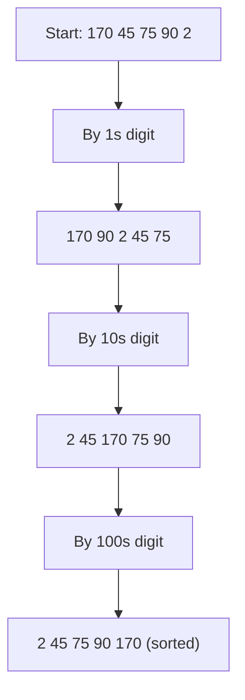

# 🔢 Radix Sort

> [!abstract] TL;DR
> Radix Sort sorts integers (or fixed-width strings) **one digit at a time** using a **stable** sort — usually [[Counting_Sort]] — as the per-digit engine. The **LSD** (least-significant-digit-first) variant processes the ones digit, then tens, then hundreds; because each pass is stable, earlier passes are preserved and the array ends fully sorted. It runs in **O(d·(n + k))** where `d` = number of digits and `k` = digit base. When `d` is small and keys are bounded, it **beats O(n log n)** comparison sorts.

---

## Intuition — Analogy First

Think of a mechanical **card-sorting machine** from the punch-card era. To sort thousands of cards by a multi-digit ID, the operator sorts by the **rightmost digit** into 10 bins, stacks the bins back in order, then sorts the *whole deck* by the next digit, and so on. After sorting by the leftmost digit, the deck is fully ordered.

Why does this work? Because each pass is **stable** — cards that tie on the current digit keep the order established by the previous (less significant) digits. So the ones-digit pass orders numbers within each shared tens-group, the tens-digit pass orders the groups, and the significance builds up leftward. You never compare two numbers directly; you only *bucket by a single digit*. That is why Radix Sort escapes the comparison-sort O(n log n) barrier.

---

## How It Works + Mermaid

**Algorithm (LSD, base 10):**
1. Find the maximum value to know the digit count `d`.
2. For each digit position `exp` = 1, 10, 100, … up to the max:
   - Run a **stable** counting sort keyed on `(x // exp) % 10`.
3. After the most-significant digit pass, the array is sorted.

**Critical requirement:** the per-digit sort **must be stable**, or lower-digit orderings get scrambled.

The diagram sorts `[170, 45, 75, 90, 2]` by ones, then tens, then hundreds:



---

## Complexity Analysis

| Aspect      | Value            | Notes                                                       |
|-------------|------------------|-------------------------------------------------------------|
| Best time   | O(d·(n + k))     | d = number of digits, k = base (10 here)                    |
| Average time| O(d·(n + k))     | Independent of input order                                  |
| Worst time  | O(d·(n + k))     | No degenerate case                                          |
| Space       | O(n + k)         | Counting-sort buffers reused each pass                      |
| Stable      | Yes              | Inherits stability from the per-digit stable sort           |
| In-place    | No               | Needs the counting-sort output buffer                       |

- **When it beats O(n log n):** if `d` is a small constant and `k = O(n)`, total is O(n) — faster than comparison sorts.
- **The hidden cost:** `d = log_k(max_value)`. For truly arbitrary/unbounded integers, `d` grows and the advantage shrinks. It shines on **fixed-width** keys (32-bit ints, dates, fixed-length strings).
- **Base tuning:** larger base `k` → fewer passes `d` but bigger count arrays. There is a sweet spot (often base 256 for byte-wise sorting).

---

## Python Implementation

```python
from typing import List

# =========================================================
# LSD RADIX SORT (base 10) using stable counting sort per digit
# =========================================================
def counting_sort_by_digit(arr: List[int], exp: int) -> List[int]:
    """Stable counting sort keyed on one base-10 digit selected by exp."""
    n = len(arr)
    output = [0] * n
    count = [0] * 10

    for x in arr:
        count[(x // exp) % 10] += 1
    for i in range(1, 10):               # prefix sums → end positions
        count[i] += count[i - 1]
    for x in reversed(arr):              # right-to-left → STABLE
        d = (x // exp) % 10
        count[d] -= 1
        output[count[d]] = x
    return output


def radix_sort(arr: List[int]) -> List[int]:
    """
    LSD radix sort for NON-NEGATIVE integers.
    O(d * (n + k)) where d = #digits of max, k = 10.
    """
    if not arr:
        return []

    max_val = max(arr)
    exp = 1
    result = arr[:]
    while max_val // exp > 0:            # loop once per digit
        result = counting_sort_by_digit(result, exp)
        exp *= 10
    return result


# =========================================================
# HANDLING NEGATIVES: split, sort magnitudes, recombine
# =========================================================
def radix_sort_signed(arr: List[int]) -> List[int]:
    neg = [-x for x in arr if x < 0]     # magnitudes of negatives
    pos = [x for x in arr if x >= 0]
    neg_sorted = [-x for x in reversed(radix_sort(neg))]  # reverse + negate
    return neg_sorted + radix_sort(pos)


if __name__ == "__main__":
    print(radix_sort([170, 45, 75, 90, 2, 802, 24, 66]))
    # [2, 24, 45, 66, 75, 90, 170, 802]
    print(radix_sort_signed([-5, 3, -1, 0, 8, -12]))
    # [-12, -5, -1, 0, 3, 8]
```

---

## Dry Run / Trace

Sorting `[170, 45, 75, 90, 2]` (max=170 → d=3 digits):

```
exp=1  (ones digit): keys 0,5,5,0,2
   stable bucket by ones → [170, 90, 2, 45, 75]
   (170 before 90 because both end in 0 and 170 came first → stability)

exp=10 (tens digit): of [170,90,2,45,75] → keys 7,9,0,4,7
   stable bucket by tens → [2, 45, 170, 75, 90]
   (170 before 75 — both tens=7 — preserving prior ones-order)

exp=100 (hundreds): of [2,45,170,75,90] → keys 0,0,1,0,0
   stable bucket by hundreds → [2, 45, 75, 90, 170]

Result: [2, 45, 75, 90, 170]
```

Watch the stability at `exp=1`: `170` and `90` both end in `0`, and `170` appears first in the input, so it stays first — that preserved order is what makes the later passes correct.

---

## Patterns & LeetCode Applications

| Problem                          | LC #  | Why Radix Sort fits                                        |
|----------------------------------|-------|-------------------------------------------------------------|
| Maximum Gap                      | 164   | Linear-time sort of bounded integers to find the max gap    |
| Sort an Array                    | 912   | O(d·n) when values are bounded (beats comparison sorts)     |
| Sort integers / fixed-width keys | —     | IDs, timestamps, fixed-length strings sort in linear time   |
| [[Suffix_Array|Suffix array]] construction        | —     | Radix sort of rotations/ranks is a classic building block   |

**Pattern signal:** keys are integers or fixed-width strings with a **bounded number of digits/characters**, and you want to beat O(n log n). Radix Sort (with [[Counting_Sort]] inside) is the tool. For general string sorting, MSD (most-significant-digit) radix variants prune shared prefixes.

---

## Common Pitfalls

1. **Using an unstable per-digit sort.** Stability is *mandatory* — an unstable inner sort scrambles the ordering from previous digit passes and produces wrong output.
2. **Forgetting negatives.** Plain LSD radix assumes non-negative keys. Split negatives, sort magnitudes, reverse-and-negate, then concatenate (see `radix_sort_signed`).
3. **Assuming it is always O(n).** It is O(d·(n+k)); for arbitrary/unbounded integers `d = O(log max)`, so it can degrade toward O(n log n)-ish behavior.
4. **Ignoring the k-vs-d trade-off.** Bigger base → fewer passes but larger count arrays; picking base = 10 is didactic, base 256 is often faster in practice.
5. **Applying it to floats naively.** IEEE-754 floats need bit-level reinterpretation (and sign handling) before radix sorting — not a drop-in.
6. **MSD vs LSD confusion.** LSD (shown here) starts from the least significant digit and is simplest for fixed-width integers; MSD recurses per bucket and suits variable-length strings.

---

## Related Concepts

- [[_MOC_Sorting_Searching|↑ Section MOC]]
- [[Counting_Sort]] — the stable per-digit engine Radix Sort calls repeatedly
- [[Sorting_Overview]] — where non-comparison sorts sit relative to comparison sorts
- [[Merge_Sort]] — the fallback stable O(n log n) sort for unbounded / non-integer keys
- [[Complexity_Cheat_Sheet]] — Big-O quick reference
- [[Time_Complexity_Classes]] — why O(d·(n+k)) can beat O(n log n)

---

## Review Questions

1. **Why must the per-digit sort inside Radix Sort be stable? Walk through what goes wrong if it is not.**
2. **Radix Sort is O(d·(n+k)). Under what conditions on d and k does it actually beat an O(n log n) comparison sort, and when does the advantage disappear?**
3. **LSD Radix Sort assumes non-negative integers. Describe a correct strategy to sort a mix of positive and negative integers with it.**

---

## Sources

- CLRS — Introduction to Algorithms, Ch. 8.3 (Radix Sort)
- [Visualgo — Radix Sort](https://visualgo.net/en/sorting)
- LeetCode #164 (Maximum Gap), #912 (Sort an Array)
- [Wikipedia — Radix sort](https://en.wikipedia.org/wiki/Radix_sort)

#radixsort #sorting #noncomparison #stable #linear #countingsort
