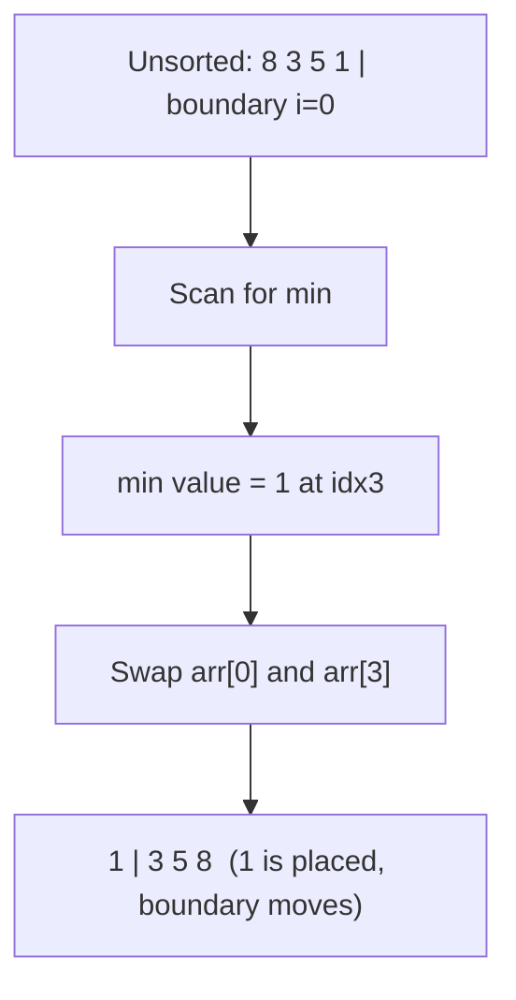

# 🎯 Selection Sort

> [!abstract] TL;DR
> Selection Sort repeatedly **finds the minimum** of the unsorted portion and **swaps it to the front**, growing a sorted prefix one element per pass. It is **in-place** but **not stable** (standard version) and **not adaptive** — it is always **O(n²)** comparisons regardless of input. Its one redeeming property: it performs at most **n-1 swaps**, so it wins when *writes are expensive* (e.g. flash memory) even though it reads a lot.

---

## Intuition — Analogy First

You are lining people up by height. You scan the entire crowd to find the **single shortest person**, pull them out, and stand them at position 1. Then you scan the *remaining* crowd for the next shortest and put them at position 2. Repeat. Each pass you commit exactly one person to their final spot.

Contrast this with [[Insertion_Sort]] (which inserts each new card into a sorted hand) and [[Bubble_Sort]] (which nudges neighbors). Selection Sort is different: it **scans the whole remainder to pick the extreme**, then makes a *single* decisive swap. That is why it does the fewest swaps of the three classic O(n²) sorts.

The trade-off: even if the array is already sorted, Selection Sort still scans the entire unsorted region every pass to *confirm* the minimum — so it can never be faster than O(n²). It is blind to existing order.

---

## How It Works + Mermaid

**Algorithm:**
1. Let the sorted boundary start at index `0`.
2. Scan the unsorted region `arr[i..n-1]` to find the index of its minimum, `min_idx`.
3. **Swap** `arr[i]` with `arr[min_idx]`.
4. Advance the sorted boundary (`i += 1`).
5. Repeat until only one element remains (it is already the max).

The diagram shows the first pass on `[8, 3, 5, 1]`: find the min (`1`) and swap it to the sorted boundary (index 0):



---

## Complexity Analysis

| Case                   | Time  | Space | Stable | In-Place | Swaps   | Notes                                    |
|------------------------|-------|-------|--------|----------|---------|------------------------------------------|
| Best                   | O(n²) | O(1)  | No     | Yes      | O(n)    | Not adaptive — always full scans         |
| Average                | O(n²) | O(1)  | No     | Yes      | O(n)    | ~n²/2 comparisons                        |
| Worst                  | O(n²) | O(1)  | No     | Yes      | O(n)    | Same as best/average                     |

- **Not stable (standard version):** the long-distance swap can jump an element past an equal-valued one, reordering equal keys. (A shift-based variant can be made stable at extra cost.)
- **Not adaptive:** it does the same number of comparisons for sorted, reverse, or random input.
- **Minimal writes:** exactly `n-1` swaps in the worst case — the *fewest* of any comparison sort. This is its niche: when a write (to disk / flash / EEPROM) costs far more than a read.
- **In-place:** O(1) auxiliary memory.

---

## Python Implementation

```python
from typing import List

# =========================================================
# 1. SELECTION SORT (standard, swap-based — NOT stable)
# =========================================================
def selection_sort(arr: List[int]) -> None:
    """Sort in-place. Always O(n^2) comparisons, at most n-1 swaps."""
    n = len(arr)
    for i in range(n - 1):
        min_idx = i
        # Find the minimum in the unsorted region arr[i..n-1]
        for j in range(i + 1, n):
            if arr[j] < arr[min_idx]:
                min_idx = j
        # One decisive swap brings the min to the sorted boundary
        if min_idx != i:                       # skip the no-op swap
            arr[i], arr[min_idx] = arr[min_idx], arr[i]


# =========================================================
# 2. STABLE SELECTION SORT (shift instead of swap)
# =========================================================
def selection_sort_stable(arr: List[int]) -> None:
    """
    Insert the minimum by SHIFTING the gap instead of swapping.
    This preserves the relative order of equal elements (stable),
    but costs O(n) writes per pass instead of O(1).
    """
    n = len(arr)
    for i in range(n - 1):
        min_idx = i
        for j in range(i + 1, n):
            if arr[j] < arr[min_idx]:
                min_idx = j
        key = arr[min_idx]
        # shift arr[i..min_idx-1] right by one, then drop key at i
        while min_idx > i:
            arr[min_idx] = arr[min_idx - 1]
            min_idx -= 1
        arr[i] = key


if __name__ == "__main__":
    data = [8, 3, 5, 1, 3]
    selection_sort(data)
    print(data)               # [1, 3, 3, 5, 8]
```

---

## Dry Run / Trace

Sorting `[8, 3, 5, 1]` with the standard version:

```
i=0: scan [8,3,5,1] → min=1 at idx3 → swap(0,3) → [1, 3, 5, 8]
i=1: scan [3,5,8]   → min=3 at idx1 → already there, no swap → [1, 3, 5, 8]
i=2: scan [5,8]     → min=5 at idx2 → already there, no swap → [1, 3, 5, 8]
     (i stops at n-2; last element 8 is trivially in place)
Result: [1, 3, 5, 8]   with only ONE actual swap
```

**Instability demo** on `[3a, 3b, 1]` (subscripts mark equal keys):
```
i=0: min=1 at idx2 → swap(0,2) → [1, 3b, 3a]
The 3a jumped BEHIND 3b → relative order of equal keys reversed → NOT stable.
```

---

## Patterns & LeetCode Applications

| Use / Problem                   | LC #  | Why Selection Sort matters                                 |
|---------------------------------|-------|-------------------------------------------------------------|
| Sort an Array                   | 912   | Educational; O(n²) → TLE on large inputs                    |
| Minimize writes / swaps         | —     | Fewest writes of any sort; good for wear-limited memory     |
| Selection idea → Heap Sort      | —     | [[Heap_Sort_Algorithm]] is "selection sort with a heap": it selects the max in O(log n) instead of O(n) |
| Partial sort / [[Top_K_Pattern|top-k]] (first k)  | —     | Running only k passes yields the k smallest in O(nk)        |

**Conceptual bridge:** Selection Sort's core idea — *repeatedly extract the extreme* — is exactly what a heap accelerates. Replace the O(n) linear min-scan with an O(log n) heap extraction and you get [[Heap_Sort_Algorithm]] at O(n log n). Understanding this makes Heap Sort click.

---

## Common Pitfalls

1. **Assuming it is stable.** The standard swap-based version is **not** stable; the long-distance swap reorders equal keys. Use the shift-based variant if stability matters.
2. **Expecting it to be fast on sorted input.** It is *not adaptive* — sorted input still costs O(n²) comparisons.
3. **Swapping when `min_idx == i`.** Harmless but wasteful; guard with `if min_idx != i`.
4. **Confusing "few swaps" with "fast."** Few *swaps* (O(n)), but many *comparisons* (O(n²)). It is only a win when writes dominate cost.
5. **Off-by-one on the outer loop:** iterate `i` to `n-2` (`range(n-1)`) — the final single element is automatically the maximum.

---

## Related Concepts

- [[_MOC_Sorting_Searching|↑ Section MOC]]
- [[Sorting_Overview]] — comparison table and selection guide
- [[Heap_Sort_Algorithm]] — "selection sort upgraded with a heap": O(n log n) extraction of the extreme
- [[Bubble_Sort]] — other O(n²) sort; more swaps, but stable and adaptive
- [[Insertion_Sort]] — O(n²) but adaptive and stable; usually the better small-n choice
- [[Complexity_Cheat_Sheet]] — Big-O quick reference
- [[Time_Complexity_Classes]] — where O(n²) sits among growth rates

---

## Review Questions

1. **Selection Sort makes at most n-1 swaps yet is still O(n²). Explain the discrepancy and name a scenario where minimizing swaps makes it the right choice.**
2. **Give a concrete 3-element array showing that standard Selection Sort is not stable, and describe how to make it stable.**
3. **How does replacing the linear minimum-scan with a heap transform Selection Sort into Heap Sort, and what does that do to the time complexity?**

---

## Sources

- CLRS — Introduction to Algorithms (comparison sorts, exercises)
- [Visualgo — Selection Sort](https://visualgo.net/en/sorting)
- LeetCode #912 (Sort an Array)
- [Wikipedia — Selection sort](https://en.wikipedia.org/wiki/Selection_sort)

#selectionsort #sorting #inplace #unstable #comparisonsort
