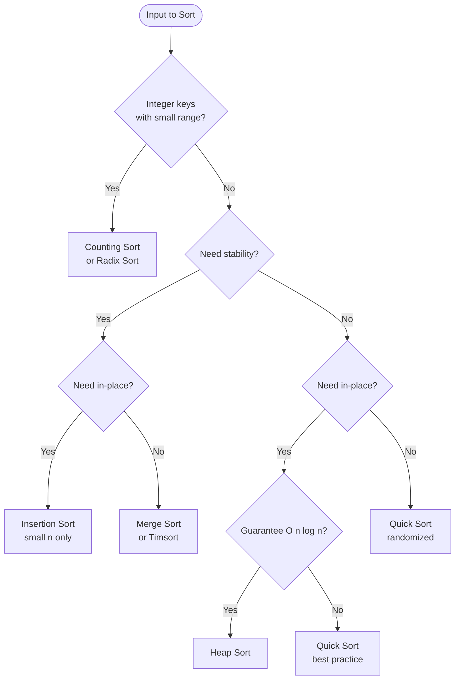

---
title: Sorting Algorithms — Overview & Decision Guide
aliases: [Sorting Reference, Sorting Comparison, Sorting Cheatsheet]
tags: [DSA, Sorting, Reference, Algorithms]
domain: DSA
difficulty: Beginner
created: 2026-07-26
related: [Merge_Sort, Quick_Sort, Heap_Sort_Algorithm]
status: complete
---

# 📊 Sorting Algorithms — Overview & Decision Guide

> [!abstract] TL;DR
> A reference note covering all major sorting algorithms, their complexities, trade-offs, and when to use each. Python's built-in `sort()` / `sorted()` uses **Timsort** — stable, adaptive, O(n log n) worst-case — and should be your default. Choose a different algorithm only when specific constraints demand it.

---

## Intuition — The Big Picture

Sorting algorithms differ on axes that matter in practice:
- **Time complexity:** How does runtime scale with input size?
- **Space:** Can we sort in-place or do we need extra memory?
- **Stability:** Do equal elements preserve their original relative order?
- **Adaptivity:** Does the algorithm run faster on nearly-sorted input?
- **Access pattern:** Sequential (good for linked lists) or random (arrays)?

No single algorithm wins on all axes — the right choice depends on your constraints.

---

## Comprehensive Comparison Table

| Algorithm      | Best        | Average     | Worst       | Space  | Stable | In-Place | Notes                                     |
|----------------|-------------|-------------|-------------|--------|--------|----------|-------------------------------------------|
| Bubble Sort    | O(n)        | O(n²)       | O(n²)       | O(1)   | Yes    | Yes      | Best only if already sorted; avoid in prod|
| Selection Sort | O(n²)       | O(n²)       | O(n²)       | O(1)   | No     | Yes      | Min swaps (O(n)); not adaptive            |
| Insertion Sort | O(n)        | O(n²)       | O(n²)       | O(1)   | Yes    | Yes      | Fast for small/nearly-sorted; used by Timsort for small chunks |
| Merge Sort     | O(n log n)  | O(n log n)  | O(n log n)  | O(n)   | Yes    | No       | Guaranteed O(n log n); good for linked lists |
| Quick Sort     | O(n log n)  | O(n log n)  | O(n²)       | O(log n) | No  | Yes      | Best practical performance; avoid sorted input with bad pivot |
| Heap Sort      | O(n log n)  | O(n log n)  | O(n log n)  | O(1)   | No     | Yes      | Guaranteed O(n log n) in-place; poor cache performance |
| Timsort        | O(n)        | O(n log n)  | O(n log n)  | O(n)   | Yes    | No       | Python's built-in; adaptive to real-world data |
| Counting Sort  | O(n+k)      | O(n+k)      | O(n+k)      | O(k)   | Yes    | No       | k = range of values; non-comparison based |
| Radix Sort     | O(nk)       | O(nk)       | O(nk)       | O(n+k) | Yes    | No       | k = number of digits; non-comparison based |
| Bucket Sort    | O(n+k)      | O(n+k)      | O(n²)       | O(n+k) | Yes    | No       | Best when data is uniformly distributed    |

*Space for Quick Sort is O(log n) average (recursion stack); O(n) worst case (degenerate).*
*Timsort: O(n) for nearly-sorted input (runs detection + insertion sort). Python's CPython implementation.*

---

## Decision Guide

```
Need to sort? Start here:
│
├── Are you using Python?
│   └── YES → Use list.sort() or sorted() (Timsort). Done.
│
├── Special constraints?
│   ├── Must be STABLE (preserve equal element order)?
│   │   └── Merge Sort or Timsort
│   │
│   ├── Must be IN-PLACE (O(1) extra space)?
│   │   ├── Guaranteed O(n log n) needed → Heap Sort
│   │   └── Best average case → Quick Sort (randomized)
│   │
│   ├── Input is NEARLY SORTED?
│   │   └── Insertion Sort (O(n) best) or Timsort
│   │
│   ├── SMALL input (n < 20)?
│   │   └── Insertion Sort
│   │
│   ├── INTEGER KEYS with bounded range k?
│   │   └── Counting Sort (k small) or Radix Sort
│   │
│   ├── FLOATING POINT, uniformly distributed?
│   │   └── Bucket Sort
│   │
│   └── LINKED LIST (no random access)?
│       └── Merge Sort (works with sequential access)
│
└── General purpose → Quick Sort (randomized) or Timsort
```

---

## How It Works + Mermaid (Decision Tree)



---

## Algorithm Sketches

**Bubble Sort:** Repeatedly swap adjacent elements if out of order. Bubbles the max to the end each pass.
```python
def bubble_sort(arr):
    n = len(arr)
    for i in range(n):
        swapped = False
        for j in range(0, n-i-1):
            if arr[j] > arr[j+1]:
                arr[j], arr[j+1] = arr[j+1], arr[j]
                swapped = True
        if not swapped:
            break  # early termination if already sorted
```

**Insertion Sort:** Build sorted portion left to right; insert each element in its correct position.
```python
def insertion_sort(arr):
    for i in range(1, len(arr)):
        key = arr[i]
        j = i - 1
        while j >= 0 and arr[j] > key:
            arr[j+1] = arr[j]
            j -= 1
        arr[j+1] = key
```

---

## Implementation (Python) — Built-ins

```python
from functools import cmp_to_key
from typing import List

# ---- Basic sort and sorted ----
nums = [3, 1, 4, 1, 5, 9, 2, 6]
nums.sort()              # in-place, stable, Timsort
sorted_nums = sorted(nums)  # returns new list, stable

# ---- Sort with key function ----
words = ["banana", "apple", "cherry", "date"]
words.sort(key=len)               # sort by length
words.sort(key=lambda w: (-len(w), w))  # length desc, then alpha asc

# ---- Sort tuples / objects ----
students = [("Alice", 85), ("Bob", 72), ("Carol", 85)]
students.sort(key=lambda s: (-s[1], s[0]))  # grade desc, name asc

# ---- Custom comparator (when key isn't enough) ----
def compare(a, b):
    # Returns negative if a < b, positive if a > b, 0 if equal
    # Example: sort numbers such that combined string is largest
    if a + b > b + a:
        return -1
    elif a + b < b + a:
        return 1
    return 0

nums_str = ["3", "30", "34", "5", "9"]
nums_str.sort(key=cmp_to_key(compare))
print("".join(nums_str))  # "9534330" — Largest Number problem

# ---- Sort with multiple criteria ----
intervals = [[1, 3], [2, 6], [8, 10], [1, 2]]
# Sort by start time, then by end time ascending
intervals.sort(key=lambda x: (x[0], x[1]))

# ---- Counting Sort (for small integer ranges) ----
def counting_sort(arr: List[int], max_val: int) -> List[int]:
    count = [0] * (max_val + 1)
    for x in arr:
        count[x] += 1
    result = []
    for val, freq in enumerate(count):
        result.extend([val] * freq)
    return result

# ---- Radix Sort ----
def radix_sort(arr: List[int]) -> List[int]:
    if not arr:
        return arr
    max_val = max(arr)
    exp = 1
    while max_val // exp > 0:
        arr = counting_sort_by_digit(arr, exp)
        exp *= 10
    return arr

def counting_sort_by_digit(arr: List[int], exp: int) -> List[int]:
    n = len(arr)
    output = [0] * n
    count = [0] * 10
    for num in arr:
        digit = (num // exp) % 10
        count[digit] += 1
    for i in range(1, 10):
        count[i] += count[i-1]
    for i in range(n-1, -1, -1):  # right to left for stability
        digit = (arr[i] // exp) % 10
        count[digit] -= 1
        output[count[digit]] = arr[i]
    return output
```

---

## Dry Run / Example Trace

**Insertion Sort on [5, 2, 4, 6, 1, 3]:**
```
i=1: key=2, [5,5,4,6,1,3] → [2,5,4,6,1,3]
i=2: key=4, [2,5,5,6,1,3] → [2,4,5,6,1,3]
i=3: key=6, no moves     → [2,4,5,6,1,3]
i=4: key=1, [2,4,5,6,6,3]→[2,4,5,5,6,3]→...→[1,2,4,5,6,3]
i=5: key=3, → [1,2,3,4,5,6]
```

---

## Patterns & LeetCode Applications

| Problem                      | LC #  | Algorithm Used                            |
|------------------------------|-------|-------------------------------------------|
| Sort an Array                | 912   | Merge Sort or Quick Sort implementation   |
| Largest Number               | 179   | Custom comparator sort                    |
| Sort Colors (Dutch Flag)     | 75    | 3-way partition (counting sort variant)   |
| Meeting Rooms II             | 253   | Sort start/end times separately           |
| Merge Intervals              | 56    | Sort by start time, then merge            |
| H-Index                      | 274   | Sort descending, find h-index             |
| Maximum Gap                  | 164   | Bucket sort (pigeonhole principle)        |

---

## Common Pitfalls

1. **Stability confusion:** Selection sort, heap sort, and basic quicksort are NOT stable. Sorting tuples `(value, index)` is a workaround to make any sort stable.
2. **QuickSort on sorted input:** O(n²) with a naive pivot — always use randomized pivot or median-of-3.
3. **Counting sort range:** Requires knowing the maximum value; large ranges (e.g., 10⁹) make it infeasible.
4. **In-place vs stable:** No comparison sort can be both in-place (O(1) space) and stable with O(n log n) worst case (in theory — Timsort uses O(n) extra space for stability).
5. **Python's sort is stable:** You can rely on multi-key sorts: sort by secondary key first, then primary key.

---

## Related Concepts

- [[_MOC_Sorting_Searching|↑ Section MOC]]
- [[Merge_Sort]] — deep dive on divide and conquer stable sort
- [[Quick_Sort]] — deep dive on in-place partition-based sort
- [[Heap_Sort_Algorithm]] — deep dive on in-place heap-based sort

---

## Review Questions

1. **Timsort is Python's built-in sorting algorithm. What two simpler algorithms does it combine, and why is this combination well-suited to real-world data?**
2. **Counting sort runs in O(n+k). When does it become impractical, and what alternative non-comparison sort handles large values better?**
3. **You need to sort a list of (name, score) tuples by score descending, with ties broken alphabetically. Write the `key` function for Python's `sort()`, and explain why you don't need `cmp_to_key` here.**

---

## Sources

- CLRS — Introduction to Algorithms, Ch. 6-9 (various sorting algorithms)
- [Python Timsort Source](https://github.com/python/cpython/blob/main/Objects/listobject.c)
- [Visualgo — Sorting](https://visualgo.net/en/sorting)
- LeetCode #912, #179, #75

#sorting #algorithms #reference #timsort #mergesort #quicksort #heapsort #countingsort #radixsort
