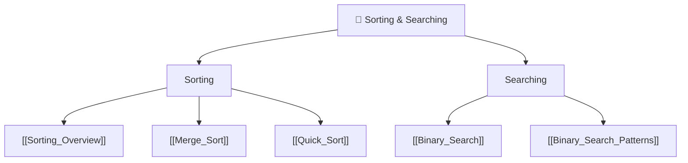

# 🔀 Sorting & Searching — Map of Content

> [!abstract] What This Section Covers
> Sorting and searching are the workhorses of algorithmic problem-solving. This section covers the two most interview-critical comparison-based sorts (merge sort and quicksort), a broad reference overview of all sorting algorithms, and binary search in both its classic and generalised "binary search on answer" form. Understanding when a problem is secretly a binary search problem — even when no sorted array is visible — is one of the highest-leverage skills in competitive programming and interviews.

## Concept Map

## Learning Path

1. [[Sorting_Overview]] — Reference table: all major sorts, their complexities, stability, and use cases
2. [[Binary_Search]] — Classic binary search; left/right boundary variants; pitfalls with overflow
3. [[Merge_Sort]] — Divide & conquer; stable, O(n log n); preferred for linked lists and external sort
4. [[Quick_Sort]] — In-place partitioning; average O(n log n); degradation and randomisation
5. [[Binary_Search_Patterns]] — "Binary search on answer"; monotonic predicate; template patterns

## All Notes at a Glance

| Note | Summary | Difficulty |
|------|---------|------------|
| [[Sorting_Overview]] | Comparison of all major sorting algorithms | Beginner (reference) |
| [[Binary_Search]] | Classic search on sorted array; O(log n) | Beginner |
| [[Merge_Sort]] | Stable divide-and-conquer sort; O(n log n) guaranteed | Intermediate |
| [[Quick_Sort]] | In-place sort; O(n log n) average, O(n²) worst case | Intermediate |
| [[Binary_Search_Patterns]] | Generalised patterns: search on answer, rotated arrays | Intermediate |

## Key Questions This Section Answers

- When does quicksort degrade to O(n²) and how do randomisation / median-of-three prevent it?
- Why is merge sort preferred for sorting linked lists but not arrays?
- What is "binary search on the answer" and how do you identify this pattern in a problem?
- How do you write binary search without off-by-one errors? (Left vs right boundary variants)
- What makes a sort stable, and when does stability matter?
- How do you binary-search a rotated sorted array?

## Related Sections

- [[_MOC_DSA_Master|↑ DSA Master MOC]]
- [[_MOC_Arrays]] — Most sorting is applied to arrays; two-pointer techniques complement binary search
- [[_MOC_Competitive_Programming]] — Advanced use of binary search on answer in CP contexts

#MOC #DSA #sorting #searching
