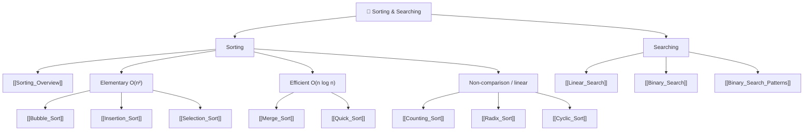

# 🔀 Sorting & Searching — Map of Content

> [!abstract] What This Section Covers
> Sorting and searching are the workhorses of algorithmic problem-solving. This section spans the full sorting spectrum — the elementary O(n²) sorts (bubble, selection, insertion), the efficient O(n log n) comparison sorts (merge sort, quicksort), the non-comparison linear sorts (counting, radix), and the index-placement cyclic sort — alongside a broad reference overview of all sorting algorithms. On the searching side it covers linear search and binary search in both its classic and generalised "binary search on answer" form. Understanding when a problem is secretly a binary search problem — even when no sorted array is visible — is one of the highest-leverage skills in competitive programming and interviews.

## Concept Map

## Learning Path

1. [[Sorting_Overview]] — Reference table: all major sorts, their complexities, stability, and use cases
2. [[Linear_Search]] — The O(n) baseline scan; when it beats binary search; sentinel trick
3. [[Bubble_Sort]] — Adjacent-swap sort; early-exit optimisation; the canonical "why O(n²) is slow" example
4. [[Selection_Sort]] — Repeatedly select the minimum; O(n²) always but O(n) swaps
5. [[Insertion_Sort]] — Build a sorted prefix; O(n) on nearly-sorted data; used inside Timsort/introsort
6. [[Binary_Search]] — Classic binary search; left/right boundary variants; pitfalls with overflow
7. [[Merge_Sort]] — Divide & conquer; stable, O(n log n); preferred for linked lists and external sort
8. [[Quick_Sort]] — In-place partitioning; average O(n log n); degradation and randomisation
9. [[Counting_Sort]] — Non-comparison, O(n + k) via a frequency table; stable; the engine inside radix sort
10. [[Radix_Sort]] — Digit-by-digit non-comparison sort using counting sort as a stable subroutine; O(d·(n + k))
11. [[Cyclic_Sort]] — O(n) in-place placement for values in a known 1..n range; the "find the missing/duplicate" pattern
12. [[Binary_Search_Patterns]] — "Binary search on answer"; monotonic predicate; template patterns

## All Notes at a Glance

| Note | Summary | Difficulty |
|------|---------|------------|
| [[Sorting_Overview]] | Comparison of all major sorting algorithms | Beginner (reference) |
| [[Linear_Search]] | Sequential O(n) scan; baseline search; sentinel optimisation | Beginner |
| [[Bubble_Sort]] | Adjacent-swap O(n²) sort with early-exit; teaching baseline | Beginner |
| [[Selection_Sort]] | Select-min O(n²) sort; minimal (O(n)) swaps | Beginner |
| [[Insertion_Sort]] | Sorted-prefix build; O(n) on nearly-sorted; used in hybrid sorts | Beginner |
| [[Binary_Search]] | Classic search on sorted array; O(log n) | Beginner |
| [[Merge_Sort]] | Stable divide-and-conquer sort; O(n log n) guaranteed | Intermediate |
| [[Quick_Sort]] | In-place sort; O(n log n) average, O(n²) worst case | Intermediate |
| [[Counting_Sort]] | Non-comparison O(n + k) frequency-table sort; stable | Intermediate |
| [[Radix_Sort]] | Digit-wise O(d·(n + k)) sort built on counting sort | Intermediate |
| [[Cyclic_Sort]] | O(n) in-place placement for 1..n ranges; missing/duplicate pattern | Intermediate |
| [[Binary_Search_Patterns]] | Generalised patterns: search on answer, rotated arrays | Intermediate |

## Key Questions This Section Answers

- When does quicksort degrade to O(n²) and how do randomisation / median-of-three prevent it?
- Why is merge sort preferred for sorting linked lists but not arrays?
- What is "binary search on the answer" and how do you identify this pattern in a problem?
- How do you write binary search without off-by-one errors? (Left vs right boundary variants)
- What makes a sort stable, and when does stability matter?
- How do you binary-search a rotated sorted array?

## Related Sections

- [[_MOC_DSA_Master|↑ DSA Master MOC]]
- [[_MOC_Arrays]] — Most sorting is applied to arrays; two-pointer techniques complement binary search
- [[_MOC_Competitive_Programming]] — Advanced use of binary search on answer in CP contexts

#MOC #DSA #sorting #searching
