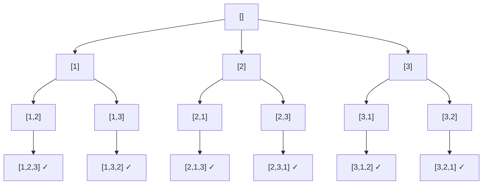

---
title: Backtracking
aliases: []
tags: [DSA, Backtracking]
domain: DSA
difficulty: Intermediate
created: 2026-07-26
related: []
status: complete
---

# 🔙 Backtracking

> [!abstract] TL;DR
> Backtracking = **systematic exhaustive search with pruning**. At each decision point, try all options; if a choice leads to a dead end (constraint violated), **undo it and try the next**. Template: **choose → explore → unchoose**. Worst case O(b^d) but pruning makes it practical.

---

## Intuition — Analogy First

Imagine navigating a **maze** by trying every direction at each junction. You pick a path and walk forward. If you hit a wall (dead end), you **backtrack** to the last junction and try the next direction. You keep doing this until you either find the exit or exhaust all paths.

The key insight: you never commit permanently to a choice. Every decision is tentative — you try it, explore its consequences, and undo it if it doesn't work. This is fundamentally different from greedy (commit once) or DP (cache and reuse).

**The three-step pattern at each node of the decision tree:**
1. **Choose** — pick an option (add to current solution, mark as visited, etc.)
2. **Explore** — recurse deeper with that choice
3. **Unchoose** — undo the choice (remove from solution, unmark, etc.)

---

## How It Works + Mermaid

### The Backtracking Template

```python
def backtrack(state, choices):
    if is_solution(state):          # goal check
        record(state)
        return
    
    for choice in choices:
        if is_valid(choice, state): # pruning: skip dead-end choices early
            make_choice(choice, state)      # choose
            backtrack(state, next_choices)  # explore
            undo_choice(choice, state)      # unchoose
```

### When to Prune
Pruning happens when you detect a constraint violation **before** recursing deeper. This is the difference between exponential and practical:
- N-Queens: if placing a queen attacks another, don't recurse that branch.
- Sudoku: if a digit repeats in row/col/box, skip it immediately.
- Combination sum: if remaining target < 0, stop recursing.

### Decision Tree for Permutations of [1,2,3]



Every leaf marked ✓ is a valid permutation. Backtracking explores this tree depth-first, undoing choices as it climbs back up.

### Three Problem Types

| Type | What it builds | Order matters? | Example |
|---|---|---|---|
| Permutations | All orderings | Yes | Arrange n items |
| Combinations | Choose k from n | No (pick subset) | k-element subsets |
| Subsets | Include/exclude each element | No | Power set |

---

## Complexity Analysis

| Problem | Time | Space |
|---|---|---|
| Permutations of n | O(n · n!) | O(n) call stack + O(n) current path |
| Subsets of n | O(2ⁿ) | O(n) |
| Combinations C(n,k) | O(C(n,k) · k) | O(k) |
| N-Queens | O(n!) worst, much less with pruning | O(n) |
| Sudoku | O(9^81) absolute worst, practically much less | O(81) |

**General formula**: O(b^d) where:
- b = branching factor (choices at each node)
- d = depth of decision tree (max recursion depth)

Pruning reduces the effective branching factor dramatically. A good prune can reduce O(n!) to near-polynomial in practice.

---

## Implementation (Python)

```python
from typing import List


# ── All Permutations ──────────────────────────────────────────────────────

def permutations(nums: List[int]) -> List[List[int]]:
    result = []
    
    def backtrack(path: List[int], used: List[bool]):
        if len(path) == len(nums):  # solution found
            result.append(path[:])  # copy! path is mutated
            return
        
        for i in range(len(nums)):
            if used[i]:
                continue            # skip already-chosen elements
            # choose
            used[i] = True
            path.append(nums[i])
            # explore
            backtrack(path, used)
            # unchoose
            path.pop()
            used[i] = False
    
    backtrack([], [False] * len(nums))
    return result


# ── Power Set (All Subsets) ───────────────────────────────────────────────

def subsets(nums: List[int]) -> List[List[int]]:
    result = []
    
    def backtrack(start: int, path: List[int]):
        result.append(path[:])      # every node is a valid subset
        
        for i in range(start, len(nums)):
            path.append(nums[i])    # choose
            backtrack(i + 1, path)  # explore (i+1 avoids re-using)
            path.pop()              # unchoose
    
    backtrack(0, [])
    return result


# ── Combinations of size k ────────────────────────────────────────────────

def combinations(n: int, k: int) -> List[List[int]]:
    result = []
    
    def backtrack(start: int, path: List[int]):
        if len(path) == k:          # solution found
            result.append(path[:])
            return
        
        # pruning: not enough numbers left to complete combination
        remaining = k - len(path)
        for i in range(start, n - remaining + 2):
            path.append(i)          # choose
            backtrack(i + 1, path)  # explore
            path.pop()              # unchoose
    
    backtrack(1, [])
    return result


# ── N-Queens ──────────────────────────────────────────────────────────────

def solve_n_queens(n: int) -> List[List[str]]:
    result = []
    # Track which columns and diagonals are under attack
    cols      = set()
    pos_diag  = set()   # row + col is constant on / diagonals
    neg_diag  = set()   # row - col is constant on \ diagonals
    board     = [['.' ] * n for _ in range(n)]
    
    def backtrack(row: int):
        if row == n:            # placed queens on all n rows
            result.append([''.join(r) for r in board])
            return
        
        for col in range(n):
            # pruning: skip if this position is under attack
            if col in cols or (row + col) in pos_diag or (row - col) in neg_diag:
                continue
            
            # choose: place queen
            board[row][col] = 'Q'
            cols.add(col)
            pos_diag.add(row + col)
            neg_diag.add(row - col)
            
            # explore
            backtrack(row + 1)
            
            # unchoose: remove queen
            board[row][col] = '.'
            cols.remove(col)
            pos_diag.remove(row + col)
            neg_diag.remove(row - col)
    
    backtrack(0)
    return result
```

---

## Dry Run / Example Trace

**`subsets([1, 2, 3])` — tracing the choose/unchoose rhythm:**

```
backtrack(start=0, path=[])  → record []
  choose 1: path=[1]
    backtrack(start=1, path=[1])  → record [1]
      choose 2: path=[1,2]
        backtrack(start=2, path=[1,2])  → record [1,2]
          choose 3: path=[1,2,3]
            backtrack(start=3, path=[1,2,3])  → record [1,2,3]
          unchoose 3: path=[1,2]
      unchoose 2: path=[1]
      choose 3: path=[1,3]
        backtrack(start=3, path=[1,3])  → record [1,3]
      unchoose 3: path=[1]
  unchoose 1: path=[]
  choose 2: path=[2]  ... (continues)
```

**Result**: `[], [1], [1,2], [1,2,3], [1,3], [2], [2,3], [3]` — all 2³ = 8 subsets.

**N-Queens(4) — first solution found:**
```
Row 0: try col 0 → place Q at (0,0)
Row 1: col 0 attack, col 1 diag attack → try col 2 → place Q at (1,2)
Row 2: col 2 attack, col 3 diag from (1,2), col 0 diag from (1,2) → try col... none work → BACKTRACK
Row 1: unchoose col 2 → try col 3 → place Q at (1,3)
Row 2: try col 1 → place Q at (2,1)
Row 3: try col 3 attack, col 0 → col 0 attack... try col 2... 
       (2+2)=4 in pos_diag? yes → skip → no valid → BACKTRACK
... (eventually finds) .Q.. / ...Q / Q... / ..Q.
```

---

## Patterns & LeetCode Applications

| LeetCode # | Problem | Pattern |
|---|---|---|
| LC 46 | Permutations | All orderings, used[] array |
| LC 78 | Subsets | Include/exclude, start index |
| LC 77 | Combinations | Choose k from n |
| LC 51 | N-Queens | Constraint satisfaction |
| LC 37 | Sudoku Solver | Constraint satisfaction |
| LC 79 | Word Search | Grid path with visited marking |
| LC 39 | Combination Sum | Combinations with repetition allowed |
| LC 40 | Combination Sum II | Duplicates — sort + skip same sibling |
| LC 131 | Palindrome Partitioning | Combinations of substrings |

---

## Common Pitfalls

1. **Not copying the result** — `result.append(path)` appends a reference; by the time you return, `path` has been mutated. Always use `path[:]` or `list(path)`.
2. **Forgetting to unchoose** — the "unchoose" step is what makes backtracking work. Without it you corrupt the state for sibling branches.
3. **Wrong start index for combinations** — not incrementing `start` to `i+1` causes duplicates and re-use of elements.
4. **Missing pruning** — backtracking without any pruning is just brute force. Look for constraints that eliminate branches early.
5. **Using `return` when you should `continue`** — if only one branch is invalid, use `continue` inside the loop; using `return` exits the entire function.
6. **Duplicate results** — for problems with duplicate input (e.g., Permutations II), sort the input and skip `nums[i] == nums[i-1]` when the previous sibling wasn't used.

---

## Related Concepts [[wikilinks]]

- [[_MOC_Recursion_Backtracking|↑ Section MOC]]
- [[Recursion_Fundamentals]] — backtracking is recursive by nature
- [[DFS]] — backtracking is DFS on the decision tree
- [[Pruning]] — the key optimization that makes backtracking practical
- [[Backtracking_Patterns]] — catalog of the 5 canonical patterns

---

## Review Questions (3)

1. **What does the "unchoose" step in the backtracking template do, and what goes wrong if you skip it?**
   *Answer: It undoes the state modification made in "choose" — removing from path, unmarking visited, etc. Without it, state from one branch bleeds into sibling branches, producing wrong or missing results.*

2. **In N-Queens, how do we check diagonal conflicts in O(1) without scanning the board?**
   *Answer: Cells on the same `/` diagonal share `row + col`; cells on the same `\` diagonal share `row - col`. Store these in two sets. A O(1) membership check replaces O(n) board scanning.*

3. **What is the time complexity of generating all permutations of n distinct elements, and why?**
   *Answer: O(n · n!). There are n! permutations and copying each takes O(n) time. The recursion tree has n! leaves and O(n) depth, giving n! total work at the leaves plus internal node work.*

---

## Sources

- Aziz, Lee, Prakash — *Elements of Programming Interviews*, Ch. 15 (Recursion)
- LeetCode Explore — Backtracking card
- [Backtracking Visualizer](https://algorithm-visualizer.org)
- Skiena, *The Algorithm Design Manual*, Ch. 7 — Combinatorial Search and Heuristic Methods

#DSA #Backtracking #Recursion #DFS #Permutations #Intermediate
