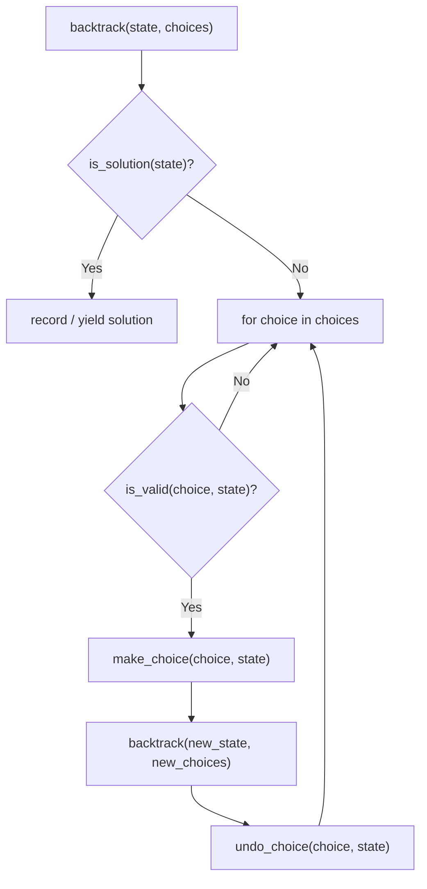

---
title: Backtracking Patterns
aliases: []
tags: [DSA, Backtracking, Patterns]
domain: DSA
difficulty: Intermediate
created: 2026-07-26
related: []
status: complete
---

# 🗺️ Backtracking Patterns

> [!abstract] TL;DR
> There are **5 canonical backtracking patterns**. Master the template for each and you can solve any backtracking problem by recognition. The patterns differ in: whether order matters, how to avoid duplicates, and what "choose" modifies.

---

## Intuition — Analogy First

A skilled locksmith doesn't try every possible key from scratch — they recognize the *shape* of a lock (spring, wafer, tumbler) and apply the matching technique. Similarly, every backtracking problem maps to one of five **lock shapes**. Once you identify the pattern, the code almost writes itself.

The five shapes:
1. **Permutations** — orderings of elements (lock with ordered pins)
2. **Combinations** — subsets of fixed size (lock with unordered pins)
3. **Subsets** — all possible include/exclude decisions (binary lock)
4. **Constraint satisfaction** — place & validate against rules (combination lock with dependencies)
5. **Grid path finding** — explore coordinates with visited tracking (maze lock)

---

## How It Works + Mermaid

### Universal Template Flowchart



---

## Pattern 1 — Permutations

**Canonical problem**: Generate all orderings of `nums`. Order matters — [1,2] ≠ [2,1].

**Key**: Use a `used[]` boolean array to track which elements are in the current path.

**Handling duplicates** (Permutations II, LC 47): Sort the input. Skip `nums[i]` if `nums[i] == nums[i-1]` and `not used[i-1]` (the previous sibling wasn't chosen — same value at same level).

```python
def permutations_with_dups(nums: list) -> list:
    nums.sort()                         # sort to group duplicates
    result, used = [], [False] * len(nums)
    
    def backtrack(path):
        if len(path) == len(nums):
            result.append(path[:])
            return
        for i in range(len(nums)):
            if used[i]:
                continue
            # skip duplicate: same value, same position in siblings
            if i > 0 and nums[i] == nums[i-1] and not used[i-1]:
                continue
            used[i] = True
            path.append(nums[i])
            backtrack(path)
            path.pop()
            used[i] = False
    
    backtrack([])
    return result
```

**Why `not used[i-1]`?** — If `used[i-1]` is True, we're in a deeper branch (nums[i-1] is an ancestor, not a sibling), so skipping would wrongly eliminate valid permutations. We only skip when the previous equal element is a *sibling* at the same recursion level.

---

## Pattern 2 — Combinations

**Canonical problem**: Choose k elements from 1..n (LC 77) or find all combinations summing to target (LC 39, 40).

**Key**: Pass a `start` index and only iterate from `start` onward — this prevents choosing the same element twice and avoids duplicate orderings.

**Combination Sum (LC 39)** — unlimited reuse: pass `i` (not `i+1`) as next start.
**Combination Sum II (LC 40)** — each element used once, duplicates in input: sort + skip `nums[i] == nums[i-1]` when `i > start`.

```python
def combination_sum(candidates: list, target: int) -> list:
    """LC 39: unlimited reuse, no duplicates in candidates."""
    candidates.sort()
    result = []
    
    def backtrack(start, path, remaining):
        if remaining == 0:
            result.append(path[:])
            return
        for i in range(start, len(candidates)):
            if candidates[i] > remaining:   # pruning: rest are too large
                break
            path.append(candidates[i])
            backtrack(i, path, remaining - candidates[i])  # i not i+1: reuse OK
            path.pop()
    
    backtrack(0, [], target)
    return result


def combination_sum_ii(candidates: list, target: int) -> list:
    """LC 40: each used once, may have duplicates."""
    candidates.sort()
    result = []
    
    def backtrack(start, path, remaining):
        if remaining == 0:
            result.append(path[:])
            return
        for i in range(start, len(candidates)):
            if candidates[i] > remaining:
                break
            # skip duplicate siblings (not ancestors)
            if i > start and candidates[i] == candidates[i-1]:
                continue
            path.append(candidates[i])
            backtrack(i + 1, path, remaining - candidates[i])  # i+1: no reuse
            path.pop()
    
    backtrack(0, [], target)
    return result
```

---

## Pattern 3 — Subsets (Power Set)

**Canonical problem**: Generate all subsets of `nums` (LC 78).

**Key**: Record the path at *every* node (not just leaves). Each element is either included (recurse with it) or excluded (loop continues).

**Alternative — binary representation**: For each number from 0 to 2ⁿ-1, the binary bits tell you which elements to include.

```python
def subsets_with_dups(nums: list) -> list:
    """LC 90: subsets of nums which may contain duplicates."""
    nums.sort()
    result = []
    
    def backtrack(start, path):
        result.append(path[:])          # every node is a valid subset
        for i in range(start, len(nums)):
            if i > start and nums[i] == nums[i-1]:  # skip duplicate siblings
                continue
            path.append(nums[i])
            backtrack(i + 1, path)
            path.pop()
    
    backtrack(0, [])
    return result
```

---

## Pattern 4 — Constraint Satisfaction

**Canonical problems**: Sudoku Solver (LC 37), N-Queens (LC 51).

**Key**: At each decision, validate against *all constraints* before recurse. Return `True`/`False` to signal success/failure upward. Prune aggressively.

```python
def solve_sudoku(board: list) -> None:
    """LC 37: modify board in-place."""
    
    def is_valid(row, col, num):
        char = str(num)
        box_r, box_c = 3 * (row // 3), 3 * (col // 3)
        for i in range(9):
            if board[row][i] == char:           return False  # row
            if board[i][col] == char:           return False  # col
            if board[box_r + i//3][box_c + i%3] == char: return False  # box
        return True
    
    def backtrack():
        for r in range(9):
            for c in range(9):
                if board[r][c] == '.':
                    for num in range(1, 10):
                        if is_valid(r, c, num):
                            board[r][c] = str(num)      # choose
                            if backtrack():
                                return True             # propagate success
                            board[r][c] = '.'           # unchoose
                    return False    # no digit worked → backtrack
        return True     # all cells filled
    
    backtrack()
```

---

## Pattern 5 — Grid Path Finding

**Canonical problem**: Word Search (LC 79) — find a word in a 2D grid, using each cell at most once.

**Key**: Mark cells as visited *in-place* (mutate the grid temporarily), then restore after recursion. The four directions are the choices.

```python
def exist(board: list, word: str) -> bool:
    """LC 79: check if word exists in board."""
    rows, cols = len(board), len(board[0])
    
    def backtrack(r, c, idx):
        if idx == len(word):
            return True                 # all characters matched
        if r < 0 or r >= rows or c < 0 or c >= cols:
            return False
        if board[r][c] != word[idx]:   # pruning: character mismatch
            return False
        
        temp = board[r][c]
        board[r][c] = '#'               # choose: mark visited
        
        found = (backtrack(r+1, c, idx+1) or
                 backtrack(r-1, c, idx+1) or
                 backtrack(r, c+1, idx+1) or
                 backtrack(r, c-1, idx+1))
        
        board[r][c] = temp              # unchoose: restore
        return found
    
    for r in range(rows):
        for c in range(cols):
            if backtrack(r, c, 0):
                return True
    return False
```

---

## Complexity Analysis

| Pattern | Time | Space | Key Variable |
|---|---|---|---|
| Permutations (n) | O(n · n!) | O(n) | n! orderings |
| Permutations II | O(n · n!) worst | O(n) | Pruning reduces count |
| Combinations C(n,k) | O(k · C(n,k)) | O(k) | n choose k paths |
| Combination Sum | O(n^(T/min)) | O(T/min) | Target T, min element |
| Subsets (n) | O(n · 2ⁿ) | O(n) | 2ⁿ subsets |
| N-Queens | O(n!) with pruning | O(n) | n columns |
| Sudoku | O(9^m) m=empty cells | O(m) | 9 choices per cell |
| Word Search | O(m · n · 4^L) | O(L) | Grid m×n, word length L |

---

## Patterns & LeetCode Applications

| Pattern | Easy/Medium | Hard |
|---|---|---|
| Permutations | LC 46, 784, 1079 | LC 60 (kth permutation) |
| Combinations | LC 77, 39, 216 | LC 40, 93 (restore IPs) |
| Subsets | LC 78, 90 | LC 698 (partition k subsets) |
| Constraint satisfaction | LC 51, 52, 37 | LC 212 (Word Search II with Trie) |
| Grid paths | LC 79, 200 | LC 980 (unique paths III) |

**Quick recognition guide:**
- "all possible" or "enumerate" → backtracking
- "at most once" → standard combinations/subsets
- "can reuse" → Combination Sum pattern (pass `i` not `i+1`)
- "has duplicates" → sort + skip sibling duplicates
- "in a grid" → Grid pattern with in-place visited marking

---

## Common Pitfalls

1. **Pattern 1 vs 2 confusion** — permutations use `used[]`; combinations use `start` index. Mixing them causes duplicates or misses.
2. **Reuse vs no-reuse** — for unlimited reuse, pass `i` as next start; for single use, pass `i+1`.
3. **Sibling duplicate check is position-sensitive** — the condition `i > start` (combinations) or `not used[i-1]` (permutations) is critical; getting it wrong causes wrong results.
4. **Grid boundary checks** — always check bounds before accessing `board[r][c]`. Short-circuit with `or` in exploration so bounds are checked first.
5. **Not restoring grid state** — in grid problems, `board[r][c] = '#'` must be restored to `temp` after recursion. Forgetting this corrupts sibling explorations.
6. **Sudoku `is_valid` is slow** — a 9-cell scan per placement is fine for practice, but production solvers use bitmasking for O(1) validity checks.

---

## Related Concepts [[wikilinks]]

- [[_MOC_Recursion_Backtracking|↑ Section MOC]]
- [[Backtracking]] — core concepts and three-step template
- [[DFS]] — backtracking is DFS on decision trees
- [[DP_Fundamentals]] — when backtracking overlaps subproblems, convert to DP

---

## Review Questions (3)

1. **You're given Combination Sum II (duplicates in input, each used once). What two changes do you make vs. Combination Sum I?**
   *Answer: (1) Pass `i+1` as the next start index (no reuse). (2) Sort the input and add `if i > start and candidates[i] == candidates[i-1]: continue` to skip duplicate siblings.*

2. **In the Word Search grid pattern, why do we restore `board[r][c]` to its original value after recursion instead of maintaining a separate `visited` set?**
   *Answer: In-place mutation + restoration avoids O(m×n) space for a visited set. It's the backtracking "unchoose" step — we temporarily claim a cell, explore, then un-claim it. This is both space-efficient and conceptually clean.*

3. **What does the condition `not used[i-1]` in Permutations II (duplicate handling) actually guard against, and why is `used[i-1] == True` a valid permutation we should keep?**
   *Answer: `not used[i-1]` means "the previous equal element is NOT an ancestor in the current path — it's a sibling at this level." If two siblings produce the same permutation, we skip the second. If `used[i-1]` is True, nums[i-1] is an ancestor (in the path), so nums[i-1] and nums[i] are in different positions → distinct permutation → keep it.*

---

## Sources

- LeetCode Explore — Backtracking card
- [NeetCode Backtracking Playlist](https://neetcode.io)
- Aziz, Lee, Prakash — *Elements of Programming Interviews*, Ch. 15
- [Backtracking Template Guide — LeetCode Discuss](https://leetcode.com/problems/combination-sum/discuss/16502/A-general-approach-to-backtracking-questions-in-Java)

#DSA #Backtracking #Patterns #Permutations #Combinations #Subsets #Intermediate
