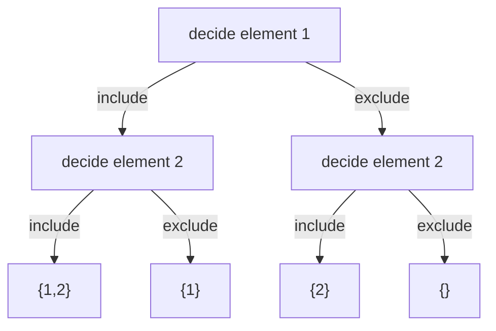
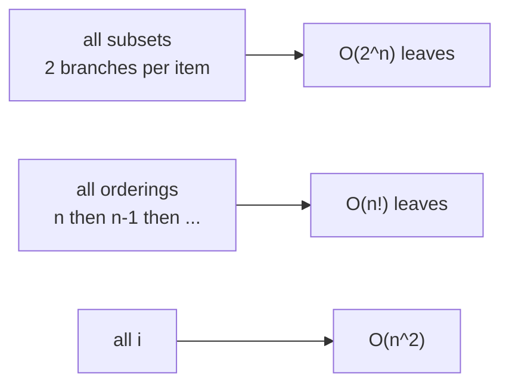

# 💪 Brute Force

> [!abstract] TL;DR
> Brute force means **try every possibility and check each one** — no cleverness, just exhaustive enumeration. It is the honest baseline for *any* problem: correct by construction, easy to reason about, and the thing every optimization is measured against. The catch is cost — enumerating all subsets is `O(2^n)`, all permutations is `O(n!)`, all pairs is `O(n²)`. The key skill is reading the **input constraints** (`n ≤ 20`? `n ≤ 10^5`?) to decide whether brute force *is* the intended solution or merely the starting point you then sharpen — with **pruning → backtracking**, a **cache → DP**, or a **better data structure**. Never skip writing the brute force: it's your correctness oracle.

---

## Intuition — Analogy First

Imagine a **combination padlock with 4 dials, 0–9 each**. You've forgotten the code. The brute-force approach is simply to try `0000`, `0001`, `0002`, … all the way to `9999` — every one of the 10,000 combinations, in order, until it opens. No insight, no shortcut, guaranteed to work eventually.

That's brute force in one image: **enumerate the entire space of candidates and test each**. It always finds the answer if one exists. Whether it's *acceptable* depends entirely on how big the space is. 10,000 tries? Instant. But add dials — a 12-dial lock has a trillion combinations, and the same honest method becomes hopeless. The whole art of algorithms is recognizing when the padlock is small enough to just try everything, and when you need a smarter attack.

---

## How It Works + Mermaid

The brute-force recipe has three moves:

1. **Enumerate** the entire candidate space (all subsets, all orderings, all pairs, all substrings, all placements…).
2. **Test** each candidate against the problem's condition.
3. **Keep** the ones that qualify (or the best one).

Enumeration is naturally recursive — at each element you branch on the choices available, forming a **decision tree** whose leaves are the complete candidates.



The shape of the tree tells you the cost:



**The optimization ladder.** Brute force is level 0. From there:
- Add **early termination when a partial candidate can't win** → **[[Backtracking]]** (prune whole subtrees).
- Notice **overlapping subproblems recomputed** → add memoization → **[[DP_Fundamentals|Dynamic Programming]]**.
- Notice a **linear scan doing repeated lookups** → swap in a hash map / heap / sorted structure to cut a factor of `n`.

Same skeleton, progressively less wasted work.

---

## When to Recognize This Pattern (signal keywords)

**Constraint signals that say "brute force is fine / intended":**

| Constraint on n | Feasible brute-force complexity | Typical intended approach |
|-----------------|--------------------------------|---------------------------|
| n ≤ 10–12 | O(n!) ~ up to ~5×10^8 | permutations, TSP-style full search |
| n ≤ 20 | O(2^n) ~ 10^6 | subsets / bitmask enumeration |
| n ≤ 40 | O(2^(n/2)) | meet-in-the-middle |
| n ≤ 500 | O(n^3) | Floyd–Warshall, interval DP |
| n ≤ 5,000 | O(n^2) | pairwise / DP tables |
| n ≤ 10^5 | O(n log n) | sort / heap / binary search — **not** O(n²) |
| n ≤ 10^6–10^8 | O(n) or O(n log n) | linear scan, sieve |

(Rule of thumb: a modern judge does ~10^8 simple operations per second, so aim for total work ≲ 10^8.)

**Verbal signals:** "generate **all** …", "list **every** …", "count the number of ways" with tiny `n`, "find **any** valid configuration", or a problem where you genuinely cannot see structure yet — write brute force first to *understand* the problem and to have a reference answer for testing.

---

## Python Implementation / Template

```python
from typing import List
from itertools import permutations, combinations

# ── 1. All subsets (power set) — O(2^n) ───────────────────────────────────────
def all_subsets(nums: List[int]) -> List[List[int]]:
    """Enumerate every subset via include/exclude recursion. 2^n leaves."""
    result = []

    def build(i: int, current: List[int]) -> None:
        if i == len(nums):
            result.append(current[:])       # a complete candidate -> record
            return
        build(i + 1, current)               # branch: exclude nums[i]
        current.append(nums[i])             # branch: include nums[i]
        build(i + 1, current)
        current.pop()                       # undo (restore state)

    build(0, [])
    return result


# ── 2. All permutations — O(n!) ───────────────────────────────────────────────
def all_permutations(nums: List[int]) -> List[List[int]]:
    """Every ordering. n * (n-1) * ... = n! leaves."""
    result = []
    used = [False] * len(nums)

    def build(current: List[int]) -> None:
        if len(current) == len(nums):
            result.append(current[:])
            return
        for i in range(len(nums)):
            if used[i]:
                continue
            used[i] = True
            current.append(nums[i])
            build(current)
            current.pop()                   # backtrack
            used[i] = False

    build([])
    return result


# ── 3. All pairs — O(n^2) (brute-force Two Sum) ───────────────────────────────
def two_sum_brute(nums: List[int], target: int) -> List[int]:
    """Check every i<j pair. O(n^2) — the baseline before the O(n) hash-map trick."""
    for i in range(len(nums)):
        for j in range(i + 1, len(nums)):
            if nums[i] + nums[j] == target:
                return [i, j]
    return []


# ── 4. Brute force as a correctness ORACLE for testing an optimized solution ──
def is_valid_optimized(fast_fn, slow_fn, cases) -> bool:
    """
    Run the (trusted, slow) brute force and the (fast, unproven) solution on the
    same inputs; any mismatch flags a bug in the fast one. Classic 'stress test'.
    """
    for case in cases:
        if fast_fn(*case) != slow_fn(*case):
            print("MISMATCH on", case)
            return False
    return True


# ── 5. Library shortcuts for enumeration (avoid re-rolling the recursion) ──────
def enumerate_with_itertools(nums: List[int]):
    subsets = [list(combinations(nums, r)) for r in range(len(nums) + 1)]  # all sizes
    perms = list(permutations(nums))                                       # all orderings
    return subsets, perms
```

---

## Dry Run / Trace

**`all_subsets([1, 2])` — the include/exclude decision tree** (2^2 = 4 leaves):

| Call | i | current | Action |
|------|---|---------|--------|
| build(0, []) | 0 | [] | branch exclude → build(1, []) |
| build(1, []) | 1 | [] | branch exclude → build(2, []) |
| build(2, []) | 2 | [] | leaf → record `[]` |
| build(1, []) | 1 | [] | branch include 2 → build(2, [2]) |
| build(2, [2]) | 2 | [2] | leaf → record `[2]` |
| build(0, []) | 0 | [] | branch include 1 → build(1, [1]) |
| build(1, [1]) | 1 | [1] | exclude → leaf `[1]`; include → leaf `[1,2]` |

Output: `[[], [2], [1], [1,2]]` — all 4 subsets. Doubling to `[1,2,3]` yields 8 subsets; the tree's leaf count is exactly `2^n`, which is why subset enumeration is only viable for small `n`.

---

## Patterns & LeetCode Applications

| Brute-force shape | Cost | Optimizes into | Example |
|-------------------|------|----------------|---------|
| All subsets (include/exclude) | O(2^n) | bitmask DP, meet-in-the-middle | Subsets (78), Subset Sum |
| All permutations | O(n!) | backtracking w/ pruning, Held–Karp DP | Permutations (46), TSP |
| All pairs (double loop) | O(n²) | hash map / two pointers → O(n) | Two Sum (1), 3Sum (15) |
| All substrings / subarrays | O(n²)–O(n³) | sliding window, prefix sums | Longest Substring (3) |
| Try every cell/placement | varies | backtracking w/ constraint pruning | N-Queens (51), Sudoku (37) |
| Simulate every step | input-bounded | greedy / DP / math shortcut | many |

The through-line: **write brute force to lock down correctness and understand the structure, then attack the dominant cost factor.**

---

## Common Pitfalls

1. **Reaching for cleverness before writing the baseline.** The brute force clarifies the problem and becomes your reference answer for stress-testing. Skipping it is how subtle optimized-solution bugs slip through.
2. **Misreading the constraints.** `n ≤ 20` all but shouts "exponential is intended"; `n ≤ 10^5` forbids O(n²). Always size your brute force against the constraint *before* coding.
3. **Confusing "brute force" with "wrong."** For small inputs, exhaustive search is often the **correct and expected** answer — not a placeholder. Don't over-engineer a problem the constraints let you brute-force.
4. **Exponential blow-up sneaking up on you.** `O(2^n)` is fine at n=20 (~10^6) but hopeless at n=40 (~10^12). Know where the cliff is.
5. **Recomputing the same subproblem.** If your recursion revisits identical states, that's the signal to memoize — brute force with overlapping subproblems is a DP in disguise.
6. **Forgetting to backtrack (undo state).** In recursive enumeration, `append`/mark must be paired with `pop`/unmark, or shared state leaks across branches.
7. **Generating with mutable-reference bugs.** Appending `current` (not `current[:]`) stores a reference that later mutations overwrite. Always snapshot the candidate.

---

## Related Concepts

- [[_MOC_Recursion_Backtracking|↑ Section MOC]]
- [[Backtracking]] — brute force plus pruning: abandon partial candidates that can't succeed
- [[Recursion_Fundamentals]] — the mechanism that enumerates the candidate space
- [[Problem_Patterns_Index]] — the map from constraint sizes to intended techniques
- [[Memoization_vs_Tabulation]] — brute force + a cache becomes dynamic programming
- [[Meet_in_the_Middle]] — halves an O(2^n) brute force into O(2^(n/2))

---

## Review Questions (3)

1. A problem gives `n ≤ 18` and asks for the minimum-cost assignment. What does the constraint imply about the intended complexity, and why is a `O(2^n · n)` bitmask solution reasonable while `O(n!)` might not be?
2. Explain how the *same* recursive brute force over subsets becomes (a) backtracking and (b) dynamic programming. What specific observation triggers each transformation?
3. Describe "stress testing": how you use a slow brute force to find bugs in a fast solution, and why random small inputs are effective at surfacing edge-case errors.

---

## Sources

- CLRS — Introduction to Algorithms (exhaustive search, growth of functions)
- Competitive Programmer's Handbook (Laaksonen) — Complete Search chapter
- LeetCode 78 — [Subsets](https://leetcode.com/problems/subsets/), 46 — [Permutations](https://leetcode.com/problems/permutations/)
- roadmap.sh — DSA "Problem Solving Techniques"

#DSA #Patterns #brute-force #exhaustive-search #complexity #recursion #baseline
