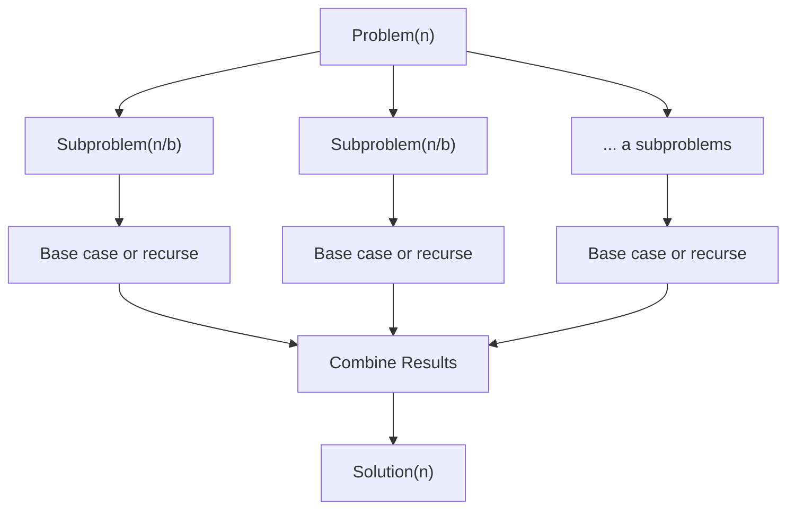

---
title: Divide and Conquer
aliases: []
tags: [DSA, DivideAndConquer]
domain: DSA
difficulty: Intermediate
created: 2026-07-26
related: []
status: complete
---

# ⚔️ Divide and Conquer

> [!abstract] TL;DR
> Divide and Conquer splits a problem into **independent** subproblems, solves each recursively, then **combines** the results. The recurrence T(n) = aT(n/b) + f(n) governs complexity — plug into the **Master Theorem** to read the answer directly.

---

## Intuition — Analogy First

Imagine a **manager delegating a huge project** to a team. The manager takes the full project, splits it into independent workstreams, assigns each to a sub-team, and when everyone finishes, the manager combines all reports into a final deliverable. No sub-team waits for another — they work in parallel (in spirit). The manager's coordination cost is the `combine` step.

This is Divide and Conquer:
- **Divide**: Split the problem into `a` subproblems, each of size `n/b`.
- **Conquer**: Solve each subproblem recursively (or directly if small enough).
- **Combine**: Merge subproblem solutions into the final answer.

The sub-teams work on **independent** subproblems — this is the key difference from Dynamic Programming, where subproblems overlap.

---

## How It Works + Mermaid

### The D&C Template

```python
def divide_and_conquer(problem):
    if is_small_enough(problem):        # base case
        return solve_directly(problem)
    
    subproblems = divide(problem)       # split into independent parts
    solutions = [divide_and_conquer(sub) for sub in subproblems]
    return combine(solutions)           # merge results
```

### Strategy Diagram



### Master Theorem

For T(n) = aT(n/b) + f(n) where a ≥ 1, b > 1:

Let the **watershed function** be n^(log_b(a)).

| Case | Condition | Result |
|---|---|---|
| Case 1 | f(n) = O(n^(log_b(a) - ε)) — divide cost dominates | T(n) = Θ(n^log_b(a)) |
| Case 2 | f(n) = Θ(n^(log_b(a)) · log^k(n)) | T(n) = Θ(n^log_b(a) · log^(k+1)(n)) |
| Case 3 | f(n) = Ω(n^(log_b(a) + ε)) — combine cost dominates | T(n) = Θ(f(n)) |

**Applying to Merge Sort** T(n) = 2T(n/2) + O(n):
- a=2, b=2 → log_b(a) = log₂(2) = **1**
- f(n) = O(n) = O(n¹) = Θ(n^1) → **Case 2** (k=0)
- Result: T(n) = **Θ(n log n)**

**Applying to Binary Search** T(n) = 1·T(n/2) + O(1):
- a=1, b=2 → log₂(1) = **0** → n^0 = 1
- f(n) = O(1) → **Case 2** (k=0)
- Result: T(n) = **Θ(log n)**

**Applying to Strassen** T(n) = 7T(n/2) + O(n²):
- a=7, b=2 → log₂(7) ≈ **2.807**
- f(n) = O(n²), and n^2.807 dominates n² → **Case 1**
- Result: T(n) = **Θ(n^2.807)** (vs O(n³) naive matrix multiply)

---

## Complexity Analysis

| Algorithm | Recurrence | Time | Space |
|---|---|---|---|
| Binary Search | T(n)=T(n/2)+O(1) | O(log n) | O(log n) recursive |
| Merge Sort | T(n)=2T(n/2)+O(n) | O(n log n) | O(n) merge buffer |
| Quick Sort (avg) | T(n)=2T(n/2)+O(n) | O(n log n) | O(log n) stack |
| Quick Sort (worst) | T(n)=T(n-1)+O(n) | O(n²) | O(n) stack |
| Pow(x,n) | T(n)=T(n/2)+O(1) | O(log n) | O(log n) |
| Strassen | T(n)=7T(n/2)+O(n²) | O(n^2.807) | O(n²) |

---

## Implementation (Python)

```python
from typing import List


# ── Merge Sort ────────────────────────────────────────────────────────────

def merge_sort(arr: List[int]) -> List[int]:
    """O(n log n) time, O(n) space."""
    if len(arr) <= 1:           # base case: single element is sorted
        return arr
    
    mid = len(arr) // 2
    left  = merge_sort(arr[:mid])   # conquer left half
    right = merge_sort(arr[mid:])   # conquer right half
    return merge(left, right)       # combine

def merge(left: List[int], right: List[int]) -> List[int]:
    """Merge two sorted arrays in O(n) time."""
    result = []
    i = j = 0
    while i < len(left) and j < len(right):
        if left[i] <= right[j]:
            result.append(left[i]); i += 1
        else:
            result.append(right[j]); j += 1
    result.extend(left[i:])
    result.extend(right[j:])
    return result


# ── Binary Search as D&C ──────────────────────────────────────────────────

def binary_search(arr: List[int], target: int, lo: int, hi: int) -> int:
    """Returns index of target or -1. O(log n) time, O(log n) space."""
    if lo > hi:
        return -1                       # base case: not found
    mid = lo + (hi - lo) // 2
    if arr[mid] == target:
        return mid                      # base case: found
    elif arr[mid] < target:
        return binary_search(arr, target, mid + 1, hi)  # conquer right
    else:
        return binary_search(arr, target, lo, mid - 1)  # conquer left


# ── Fast Exponentiation (Pow(x,n)) ────────────────────────────────────────

def my_pow(x: float, n: int) -> float:
    """O(log n) time. D&C: split exponent in half each step."""
    if n == 0:
        return 1.0
    if n < 0:
        return 1.0 / my_pow(x, -n)
    
    half = my_pow(x, n // 2)   # conquer: solve for n/2
    if n % 2 == 0:
        return half * half      # combine: even exponent
    return x * half * half      # combine: odd exponent


# ── Maximum Subarray (D&C approach) ──────────────────────────────────────

def max_subarray_dc(arr: List[int], lo: int, hi: int) -> int:
    """O(n log n) D&C solution. (Kadane's is O(n) but D&C shows the pattern.)"""
    if lo == hi:
        return arr[lo]                  # single element
    
    mid = (lo + hi) // 2
    left_max  = max_subarray_dc(arr, lo, mid)       # max in left half
    right_max = max_subarray_dc(arr, mid + 1, hi)   # max in right half
    cross_max = max_crossing(arr, lo, mid, hi)       # max crossing mid
    return max(left_max, right_max, cross_max)

def max_crossing(arr: List[int], lo: int, mid: int, hi: int) -> int:
    left_sum = float('-inf')
    s = 0
    for i in range(mid, lo - 1, -1):
        s += arr[i]
        left_sum = max(left_sum, s)
    
    right_sum = float('-inf')
    s = 0
    for i in range(mid + 1, hi + 1):
        s += arr[i]
        right_sum = max(right_sum, s)
    
    return left_sum + right_sum
```

---

## Dry Run / Example Trace

**Merge Sort on [5, 2, 4, 6, 1, 3]:**

```
merge_sort([5,2,4,6,1,3])
├─ merge_sort([5,2,4])
│    ├─ merge_sort([5])          → [5]
│    └─ merge_sort([2,4])
│         ├─ merge_sort([2])     → [2]
│         └─ merge_sort([4])     → [4]
│         merge([2],[4])         → [2,4]
│    merge([5],[2,4])            → [2,4,5]
└─ merge_sort([6,1,3])
     ├─ merge_sort([6])          → [6]
     └─ merge_sort([1,3])
          ├─ merge_sort([1])     → [1]
          └─ merge_sort([3])     → [3]
          merge([1],[3])         → [1,3]
     merge([6],[1,3])            → [1,3,6]
merge([2,4,5],[1,3,6])           → [1,2,3,4,5,6]
```

**Fast Exponentiation `my_pow(2, 10)`:**

| Call | n | Result |
|---|---|---|
| pow(2, 10) | 10 (even) | half² where half=pow(2,5) |
| pow(2, 5) | 5 (odd) | 2·half² where half=pow(2,2) |
| pow(2, 2) | 2 (even) | half² where half=pow(2,1) |
| pow(2, 1) | 1 (odd) | 2·1·1 = **2** |
| → | unwind | 4→32→1024 |

---

## Patterns & LeetCode Applications

| Problem | D&C Insight |
|---|---|
| LC 912 — Sort an Array | Classic merge sort |
| LC 50 — Pow(x, n) | Halve exponent each step |
| LC 53 — Maximum Subarray | Cross-midpoint subarray |
| LC 4 — Median of Two Sorted Arrays | Binary search on partition |
| LC 315 — Count of Smaller Numbers | Modified merge sort (count inversions) |
| LC 932 — Beautiful Array | D&C construction |

**Pattern recognition cues:**
- Problem can be split into independent halves? → D&C.
- Involves sorting or searching? → D&C likely.
- Recurrence T(n) = 2T(n/2) + O(n log n) or similar? → Master Theorem it.

---

## Common Pitfalls

1. **Confusing D&C with DP** — D&C subproblems are *independent* (no overlap). If the same subproblem is solved twice, you need DP (memoization).
2. **Off-by-one in mid calculation** — always use `mid = lo + (hi - lo) // 2` to avoid integer overflow (matters in languages like Java/C++).
3. **Incorrect merge** — forgetting to append remaining elements after one pointer exhausts its array.
4. **Worst-case quicksort** — picking the first/last element as pivot on an already-sorted array degrades to O(n²). Use random pivot or median-of-three.
5. **Forgetting the combine step cost** — the combine step's complexity directly shapes the recurrence. A merge that takes O(n log n) instead of O(n) changes the overall complexity drastically.
6. **Space for merge sort** — unlike quicksort, merge sort requires O(n) extra space for the merge buffer.

---

## Related Concepts [[wikilinks]]

- [[_MOC_Recursion_Backtracking|↑ Section MOC]]
- [[Merge_Sort]] — the canonical D&C sorting algorithm
- [[Quick_Sort]] — D&C with in-place partitioning
- [[Recursion_Fundamentals]] — the foundation of D&C
- [[Master_Theorem]] — the complexity analysis tool for D&C recurrences

---

## Review Questions (3)

1. **What is the key structural difference between Divide and Conquer and Dynamic Programming? Why does that difference matter for algorithm choice?**
   *Answer: D&C subproblems are independent (no overlap), so each is solved once. DP subproblems overlap — the same sub-instance appears multiple times. If you use pure D&C on overlapping subproblems (e.g., naive Fibonacci), you get exponential redundancy. Use DP instead.*

2. **Apply the Master Theorem to T(n) = 3T(n/4) + O(n). What is the time complexity?**
   *Answer: a=3, b=4, log₄(3) ≈ 0.792. f(n)=O(n)=O(n¹). Since 1 > 0.792+ε, Case 3 applies → T(n) = Θ(n).*

3. **Why does fast exponentiation `pow(x, n)` run in O(log n) instead of O(n)?**
   *Answer: Instead of multiplying x by itself n times, we square the result each step: pow(x,n) = pow(x,n/2)². Each step halves n, so we need only log₂(n) multiplications.*

---

## Sources

- CLRS Ch. 4 — Divide-and-Conquer (Master Theorem proof)
- Skiena, *The Algorithm Design Manual*, Ch. 4
- Knuth, *The Art of Computer Programming* Vol. 2 — Seminumerical Algorithms (fast exponentiation)
- [Merge Sort Visualizer](https://visualgo.net/en/sorting)

#DSA #DivideAndConquer #MasterTheorem #MergeSort #Recursion #Intermediate
