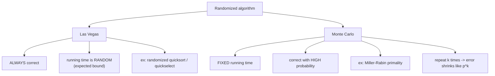
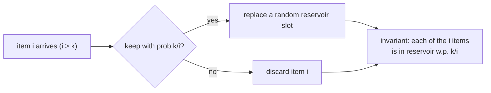
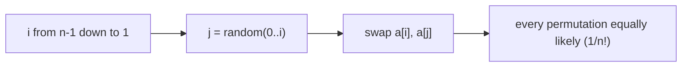

# 🎲 Randomized Algorithms

> [!abstract] TL;DR
> A randomized algorithm **flips coins during execution** — its behavior depends on random choices, not just the input. Two flavors: **Las Vegas** algorithms are *always correct* but have *random running time* (e.g., randomized quicksort/quickselect — a random pivot makes adversarial worst cases vanishingly unlikely); **Monte Carlo** algorithms have *fixed running time* but are *correct only with high probability* (e.g., Miller–Rabin primality — a "probably prime" you can drive to near-certainty by repeating). Randomness buys **simplicity, speed, and adversary-resistance**: it converts "worst case over inputs" into "expected case over coin flips," which no fixed input can force. Core toolkit: randomized pivot, **reservoir sampling** (k random items from an unknown-length stream in O(n)/O(k)), and the **Fisher–Yates shuffle** (unbiased permutation in O(n)).

---

## Intuition — Analogy First

A deterministic algorithm is a chef who **always chops vegetables in the same order** — great, until a prankster hands them the one arrangement that makes that exact order take forever (the adversarial worst case). A randomized algorithm is a chef who **shuffles the vegetables before chopping**. Now no prankster can pre-arrange the input to be pathological, because the chef re-randomizes it anyway. The prankster is beaten not by a smarter fixed strategy but by **unpredictability**: to be slow, the *coin flips* would have to conspire, and the chef controls the coins, not the adversary.

Two ways to spend randomness:
- **Las Vegas** = "I refuse to serve a wrong dish; I'll just take a random amount of time." (Randomized quicksort: output is always sorted; *how long* varies.)
- **Monte Carlo** = "I'll finish in exactly 10 minutes, and I'm *almost surely* right — repeat me a few times to be as sure as you like." (Miller–Rabin: fast, tiny error probability, shrinks geometrically per repeat.)

---

## How It Works + Mermaid

**Las Vegas vs Monte Carlo — the fundamental trade:**



**Reservoir sampling** — choose `k` items uniformly from a stream whose length you don't know, in one pass and O(k) memory. Keep the first `k` in a reservoir. For the `i`-th item (`i > k`), keep it with probability `k/i`; if kept, it evicts a uniformly random reservoir slot. The magic invariant: **after processing `i` items, every item seen so far is in the reservoir with probability `k/i`.**



**Fisher–Yates shuffle** — produce a uniformly random permutation. Walk from the last index down to 1; at position `i`, swap `a[i]` with `a[j]` where `j` is a uniform random index in `[0, i]`. Each of the `n!` permutations is equally likely, in O(n) time and O(1) extra space.



---

## When to Recognize This Pattern (signal keywords)

- "**Pick a random** element / **random pivot** to avoid the worst case."
- "**Sample k items** from a **stream** of **unknown / very large** size" → reservoir sampling.
- "**Shuffle** an array **uniformly** / random permutation" → Fisher–Yates.
- "**Probabilistic** primality," "test if a huge number is prime fast" → Miller–Rabin (Monte Carlo).
- "**Expected** O(...) time," "with **high probability**," "**randomized** algorithm."
- Needing **adversary resistance** (e.g., hashing with random seeds to defeat hash-flooding).
- "**Quickselect** the k-th element in expected O(n)."
- Approximation / counting where an exact answer is expensive but a probabilistic estimate suffices.

---

## Python Implementation / Template

```python
import random
from typing import List, Optional

# ── 1. Fisher–Yates shuffle — unbiased permutation, O(n), O(1) extra ──────────
def fisher_yates(a: List[int]) -> None:
    """
    In-place uniform shuffle: each of n! orderings equally likely.
    Correctness: at step i, a[i] gets a uniformly random element from a[0..i].
    """
    for i in range(len(a) - 1, 0, -1):
        j = random.randint(0, i)          # inclusive 0..i  (the KEY: include i itself)
        a[i], a[j] = a[j], a[i]


# ── 2. Reservoir sampling — k random items from a stream of unknown length ────
def reservoir_sample(stream, k: int) -> List[int]:
    """
    Single pass, O(n) time, O(k) space. Every item ends up in the sample
    with probability k/n, uniformly.
    """
    reservoir: List[int] = []
    for i, item in enumerate(stream):
        if i < k:
            reservoir.append(item)                 # fill the reservoir first
        else:
            j = random.randint(0, i)               # 0..i inclusive
            if j < k:                              # keep with probability k/(i+1)
                reservoir[j] = item                # evict a uniformly random slot
    return reservoir


# ── 2b. Reservoir sampling, k = 1 (LeetCode 382 — random node in linked list) ──
def random_pick_single_pass(stream) -> Optional[int]:
    """Pick ONE uniformly random item without knowing the length."""
    chosen = None
    for i, item in enumerate(stream):
        if random.randint(0, i) == 0:              # keep item i with prob 1/(i+1)
            chosen = item
    return chosen


# ── 3. Randomized QuickSelect — expected O(n) k-th smallest ───────────────────
def quickselect(nums: List[int], k: int) -> int:
    """
    Return the k-th smallest (1-indexed). Random pivot => expected O(n),
    worst O(n^2) but adversary cannot force it. Las Vegas: answer always correct.
    """
    def partition(lo: int, hi: int) -> int:
        p = random.randint(lo, hi)                 # RANDOM pivot beats sorted-input worst case
        nums[p], nums[hi] = nums[hi], nums[p]
        pivot, store = nums[hi], lo
        for i in range(lo, hi):
            if nums[i] < pivot:
                nums[store], nums[i] = nums[i], nums[store]
                store += 1
        nums[store], nums[hi] = nums[hi], nums[store]
        return store

    lo, hi, target = 0, len(nums) - 1, k - 1
    while lo <= hi:
        p = partition(lo, hi)
        if p == target:
            return nums[p]
        elif p < target:
            lo = p + 1
        else:
            hi = p - 1
    return -1


# ── 4. Randomized quicksort — random pivot, expected O(n log n) ───────────────
def quicksort(nums: List[int], lo: int = 0, hi: Optional[int] = None) -> None:
    if hi is None:
        hi = len(nums) - 1
    if lo >= hi:
        return
    p = random.randint(lo, hi)                     # random pivot -> expected n log n
    nums[p], nums[hi] = nums[hi], nums[p]
    pivot, store = nums[hi], lo
    for i in range(lo, hi):
        if nums[i] < pivot:
            nums[store], nums[i] = nums[i], nums[store]
            store += 1
    nums[store], nums[hi] = nums[hi], nums[store]
    quicksort(nums, lo, store - 1)
    quicksort(nums, store + 1, hi)


# ── 5. Miller–Rabin — Monte Carlo primality (fixed time, tiny error) ──────────
def is_probable_prime(n: int, rounds: int = 20) -> bool:
    """
    Monte Carlo: 'composite' answers are always correct; 'prime' answers are
    correct with probability >= 1 - 4^(-rounds). More rounds -> less error.
    """
    if n < 2:
        return False
    for p in (2, 3, 5, 7, 11, 13, 17, 19, 23, 29, 31):
        if n % p == 0:
            return n == p
    d, r = n - 1, 0
    while d % 2 == 0:                               # n-1 = d * 2^r, d odd
        d //= 2; r += 1
    for _ in range(rounds):
        a = random.randrange(2, n - 1)             # random witness
        x = pow(a, d, n)
        if x in (1, n - 1):
            continue
        for _ in range(r - 1):
            x = x * x % n
            if x == n - 1:
                break
        else:
            return False                           # a is a witness -> definitely composite
    return True                                    # probably prime
```

---

## Dry Run / Trace

**Reservoir sampling with `k = 1` over stream `[A, B, C, D]`** — verify each item ends up chosen with probability 1/4.

| i (0-idx) | item | keep prob = 1/(i+1) | reasoning |
|-----------|------|---------------------|-----------|
| 0 | A | 1/1 | A always taken initially |
| 1 | B | 1/2 | B replaces A w.p. 1/2 |
| 2 | C | 1/3 | C replaces current w.p. 1/3 |
| 3 | D | 1/4 | D replaces current w.p. 1/4 |

P(final = D) = 1/4 directly. P(final = C) = (keep C at i=2) × (reject D at i=3) = 1/3 × 3/4 = 1/4. P(final = B) = 1/2 × 2/3 × 3/4 = 1/4. P(final = A) = 1 × 1/2 × 2/3 × 3/4 = 1/4. **All four equal 1/4** — uniform, exactly as the invariant `k/i` promises.

---

## Patterns & LeetCode Applications

| Technique | Type | Guarantee | Where it shows up |
|-----------|------|-----------|-------------------|
| Randomized quicksort | Las Vegas | expected O(n log n), always sorted | general sorting, avoids sorted-input worst case |
| Randomized quickselect | Las Vegas | expected O(n) | Kth Largest (215), medians/order stats |
| Reservoir sampling | (streaming) | uniform k of n in O(n)/O(k) | Linked List Random Node (382), Random Pick Index (398) |
| Fisher–Yates shuffle | (sampling) | uniform 1/n! in O(n) | Shuffle an Array (384) |
| Random pivot / random seed | technique | adversary resistance | hashing, treaps, skip lists |
| Miller–Rabin | Monte Carlo | error ≤ 4^(-k) | big-integer / crypto primality |
| [[Rabin_Karp\|Rabin–Karp]] fingerprint | Monte Carlo | rare hash collisions | substring search |

---

## Common Pitfalls

1. **Biased shuffle.** The classic bug is `j = random.randint(0, n-1)` for every position (the "naive shuffle"), which produces `n^n` equally likely execution paths mapping non-uniformly onto `n!` permutations — some orderings become more likely. Fisher–Yates must draw `j` from `[0, i]` **including `i`**, shrinking the range each step.
2. **Reservoir off-by-one.** The keep-probability at the `i`-th (0-indexed) item is `k/(i+1)`; using `k/i` skews the distribution and can divide by zero at the first element.
3. **Treating Monte Carlo output as certain.** Miller–Rabin says "probably prime." For cryptographic use, run enough rounds (or use deterministic witness sets for bounded `n`). A single round is not proof.
4. **Which side is the reliable answer.** For Miller–Rabin, a **"composite"** verdict is always correct (you found a witness); only **"prime"** carries error. Know which direction your Monte Carlo algorithm can err.
5. **Forgetting to randomize the pivot.** Quicksort/quickselect with a fixed (first/last) pivot degrades to O(n²) on sorted or adversarial input. The random pivot is the whole point — without it you have a Las Vegas guarantee in name only.
6. **Reusing a predictable PRNG against a real adversary.** For security-sensitive randomness (defeating hash-flooding, crypto), a seedable/predictable RNG can be reverse-engineered. Use a cryptographically secure source when the threat model requires it.
7. **Confusing expected vs worst case.** "Expected O(n)" does not forbid an occasional slow run; it means *averaged over the coin flips*. Don't quote it as a hard worst-case bound.

---

## Related Concepts

- [[_MOC_Recursion_Backtracking|↑ Section MOC]]
- [[Quick_Sort]] — the random-pivot version is the canonical Las Vegas algorithm
- [[Divide_and_Conquer]] — quicksort/quickselect are randomized divide-and-conquer
- [[Miller_Rabin_Primality]] — the canonical Monte Carlo primality test
- [[Top_K_Pattern]] — quickselect powers the O(n)-average k-th element solution
- [[String_Hashing]] — Rabin–Karp / fingerprinting is Monte Carlo string matching

---

## Review Questions (3)

1. Precisely distinguish **Las Vegas** from **Monte Carlo** algorithms along the two axes of *correctness* and *running time*, and classify randomized quickselect and Miller–Rabin. For each, state which quantity is the random variable.
2. Prove the reservoir-sampling invariant for `k = 1`: after seeing `n` items, each item is the chosen one with probability exactly `1/n`. Show the telescoping product for an arbitrary item at position `i`.
3. Explain why the **naive shuffle** (swap each `a[i]` with a uniformly random index in `[0, n-1]`) is biased, while Fisher–Yates is uniform. Frame the argument in terms of counting execution paths (`n^n`) versus target permutations (`n!`).

---

## Sources

- CLRS — Introduction to Algorithms, Ch. 5 (Probabilistic Analysis and Randomized Algorithms), Ch. 7 (Quicksort)
- Motwani & Raghavan — *Randomized Algorithms*
- Vitter (1985) — "Random Sampling with a Reservoir"
- LeetCode 382 — [Linked List Random Node](https://leetcode.com/problems/linked-list-random-node/), 384 — [Shuffle an Array](https://leetcode.com/problems/shuffle-an-array/)

#DSA #Patterns #randomized #las-vegas #monte-carlo #reservoir-sampling #fisher-yates #quickselect #probability
