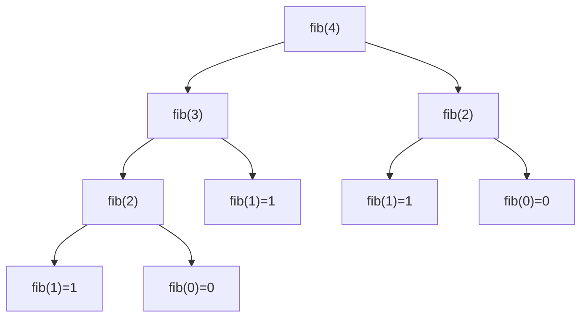

---
title: Recursion Fundamentals
aliases: [Call_Stack, Recursion Basics]
tags: [DSA, Recursion]
domain: DSA
difficulty: Beginner
created: 2026-07-26
related: []
status: complete
---

# 🌀 Recursion Fundamentals

> [!abstract] TL;DR
> Recursion is a function that calls itself with a smaller input until it hits a **base case** that stops the descent. Every recursive call occupies a stack frame; depth = space. Master the pattern: *identify base case → shrink the problem → trust the recursion*.

---

## Intuition — Analogy First

Think of a set of **Russian matryoshka dolls** (nesting dolls). You open a doll and find a slightly smaller one inside — and inside that, another, and so on — until you reach the tiniest solid doll that can't be opened. That's the **base case**. To count all the dolls, you count the smallest one (1) and add 1 for each outer shell as you close them back up. Each "closing" is a recursive call returning a value.

The key insight: **you never need to know the full depth upfront**. You just need to know:
1. When to stop (base case).
2. How to shrink the problem (recursive case).

---

## How It Works + Mermaid

### The Two Laws of Recursion
1. **Base case** — a condition where the function returns directly (no further call). Without it: infinite recursion → stack overflow.
2. **Recursive case** — the function calls itself with a *strictly smaller* input (closer to the base case).

### Call Stack Frames
Each call pushes a new **stack frame** onto the call stack containing: local variables, parameters, and the return address. When the base case is hit, frames pop off in reverse order (LIFO), accumulating results upward.

```
factorial(4)
  └── factorial(3)
        └── factorial(2)
              └── factorial(1)   ← base case: return 1
              returns 1
        returns 2*1 = 2
  returns 3*2 = 6
returns 4*6 = 24
```

### Recursion Tree for fibonacci(4)



Notice `fib(2)` is computed **twice** and `fib(1)` **three times** — this is the *overlapping subproblems* smell that motivates memoization.

### Recursion vs Iteration Trade-offs

| Factor | Recursion | Iteration |
|---|---|---|
| Code clarity | Often cleaner for tree/graph problems | Verbose for hierarchical problems |
| Stack overhead | O(depth) call stack frames | O(1) typically |
| Stack overflow risk | Yes, for deep recursion | No |
| Performance | Slightly slower (function call overhead) | Faster in practice |
| Tail recursion | Optimized by some compilers to O(1) stack | N/A |

### Tail Recursion
A recursive call is **tail-recursive** if it is the *last operation* in the function. Some languages/compilers (Scheme, Kotlin, Scala) optimize this into a loop (Tail Call Optimization, TCO). Python does **not** do TCO.

```python
# Not tail recursive — multiplication happens AFTER the call
def factorial(n):
    return n * factorial(n - 1)

# Tail recursive — accumulator carries the result
def factorial_tail(n, acc=1):
    if n <= 1:
        return acc
    return factorial_tail(n - 1, acc * n)  # last action is the call
```

### Mutual Recursion
Two functions that call each other:
```python
def is_even(n):
    if n == 0: return True
    return is_odd(n - 1)

def is_odd(n):
    if n == 0: return False
    return is_even(n - 1)
```
Useful for state machines and parsers.

### When Recursion is Natural
- **Trees** — every node is the root of a subtree.
- **Divide & Conquer** — split problem, solve halves, merge.
- **Backtracking** — explore a decision tree, undo choices.
- **Graph traversal** — DFS naturally recurses.

---

## Complexity Analysis

| Problem | Time | Space (call stack) |
|---|---|---|
| Factorial | O(n) | O(n) |
| Fibonacci (naive) | O(2ⁿ) | O(n) |
| Fibonacci (memoized) | O(n) | O(n) |
| Binary search (recursive) | O(log n) | O(log n) |
| Merge sort | O(n log n) | O(n) |

**Space complexity of recursion = O(maximum depth of call stack).**

Recurrence for naive Fibonacci:
```
T(n) = T(n-1) + T(n-2) + O(1)
     ≈ O(φⁿ) where φ ≈ 1.618 (golden ratio)
     = O(2ⁿ) (upper bound)
```

---

## Implementation (Python)

```python
# ── Factorial: iterative vs recursive ─────────────────────────────────────

def factorial_iterative(n: int) -> int:
    result = 1
    for i in range(2, n + 1):
        result *= i
    return result

def factorial_recursive(n: int) -> int:
    if n <= 1:          # base case
        return 1
    return n * factorial_recursive(n - 1)   # recursive case


# ── Fibonacci: naive O(2^n) ───────────────────────────────────────────────

def fib_naive(n: int) -> int:
    if n <= 1:
        return n
    return fib_naive(n - 1) + fib_naive(n - 2)


# ── Fibonacci: memoized O(n) ──────────────────────────────────────────────

from functools import lru_cache

@lru_cache(maxsize=None)
def fib_memo(n: int) -> int:
    if n <= 1:
        return n
    return fib_memo(n - 1) + fib_memo(n - 2)

# Manual memoization
def fib_memo_manual(n: int, memo: dict = {}) -> int:
    if n in memo:
        return memo[n]
    if n <= 1:
        return n
    memo[n] = fib_memo_manual(n - 1, memo) + fib_memo_manual(n - 2, memo)
    return memo[n]


# ── Power function: O(log n) via fast exponentiation ─────────────────────

def power(x: float, n: int) -> float:
    if n == 0:
        return 1
    if n < 0:
        return 1 / power(x, -n)
    half = power(x, n // 2)
    if n % 2 == 0:
        return half * half
    return x * half * half


# ── Recursive sum of a list ───────────────────────────────────────────────

def recursive_sum(arr: list, i: int = 0) -> int:
    if i == len(arr):   # base case: past the end
        return 0
    return arr[i] + recursive_sum(arr, i + 1)
```

---

## Dry Run / Example Trace

**Trace `factorial_recursive(4)`:**

| Call | n | Returns |
|---|---|---|
| factorial_recursive(4) | 4 | 4 × factorial(3) |
| factorial_recursive(3) | 3 | 3 × factorial(2) |
| factorial_recursive(2) | 2 | 2 × factorial(1) |
| factorial_recursive(1) | 1 | **1** ← base case |
| Unwinding | | 2×1=2, 3×2=6, 4×6=**24** |

**Trace `power(2, 10)`:**
```
power(2,10)
  half = power(2,5)
    half = power(2,2)
      half = power(2,1)
        half = power(2,0) = 1
        n=1 is odd → return 2*1*1 = 2
      n=2 is even → return 2*2 = 4
    n=5 is odd → return 2*4*4 = 32
  n=10 is even → return 32*32 = 1024
```
Only **4 multiplications** instead of 10 — that's the O(log n) win.

---

## Patterns & LeetCode Applications

| Pattern | Example Problem | Key Idea |
|---|---|---|
| Linear recursion | Reverse a linked list | One call per node |
| Binary recursion | Fibonacci, merge sort | Two calls per level |
| Tail recursion | Factorial with accumulator | Last action is the call |
| Tree recursion | Tree height, path sum | Recurse on children |
| Divide & Conquer | Binary search, merge sort | Split → solve → combine |

**LeetCode problems to build intuition (in order):**
1. LC 509 — Fibonacci Number (baseline)
2. LC 206 — Reverse Linked List (linear recursion)
3. LC 104 — Maximum Depth of Binary Tree (tree recursion)
4. LC 50 — Pow(x, n) (fast exponentiation)
5. LC 779 — K-th Symbol in Grammar (tricky base/recursive case)

---

## Common Pitfalls

1. **Missing or wrong base case** — function recurses forever and causes `RecursionError: maximum recursion depth exceeded`.
2. **Not shrinking the problem** — if the input doesn't get strictly smaller, you get infinite recursion.
3. **Mutable default argument for memo** — using `def f(n, memo={})` shares the dict across calls in Python. Prefer `@lru_cache` or pass `None` as default and initialize inside.
4. **Forgetting the return statement** — a common bug: `factorial(n-1)` instead of `return n * factorial(n-1)`. The function returns `None`.
5. **Stack overflow on large inputs** — Python's default recursion limit is 1000. For deep recursion, increase with `sys.setrecursionlimit(10000)` or convert to iterative.
6. **Confusing recursive case results** — always think "what does this call return?" before using it.

---

## Related Concepts [[wikilinks]]

- [[_MOC_Recursion_Backtracking|↑ Section MOC]]
- [[Divide_and_Conquer]] — recursion applied to splitting problems
- [[Backtracking]] — recursion over a decision tree
- [[DP_Fundamentals]] — recursion + memoization = dynamic programming
- [[Call_Stack]] — the underlying memory model

---

## Review Questions (3)

1. **What are the two required components of every recursive function, and what happens if either is missing?**
   *Answer: Base case (stops recursion) and recursive case (shrinks problem). Without base case: infinite loop. Without recursive case: trivial function, no recursion needed.*

2. **Naive Fibonacci has time complexity O(2ⁿ). How does memoization reduce this to O(n) and what is the trade-off?**
   *Answer: Memoization caches results of already-solved subproblems so each is computed once. The trade-off is O(n) extra space for the cache (plus O(n) call stack).*

3. **Why is `power(x, n)` implemented recursively as `power(x, n//2)` squared instead of `x * power(x, n-1)`? What is the complexity difference?**
   *Answer: Squaring halves the problem each step → O(log n) multiplications. The naive approach reduces n by 1 each step → O(n) multiplications.*

---

## Sources

- Skiena, *The Algorithm Design Manual*, Ch. 1 — Recursion and Induction
- CLRS, *Introduction to Algorithms*, Ch. 4 — Recurrences
- [Python Recursion Limit](https://docs.python.org/3/library/sys.html#sys.setrecursionlimit)
- LeetCode Explore — Recursion I & II cards

#DSA #Recursion #CallStack #Fibonacci #Beginner
