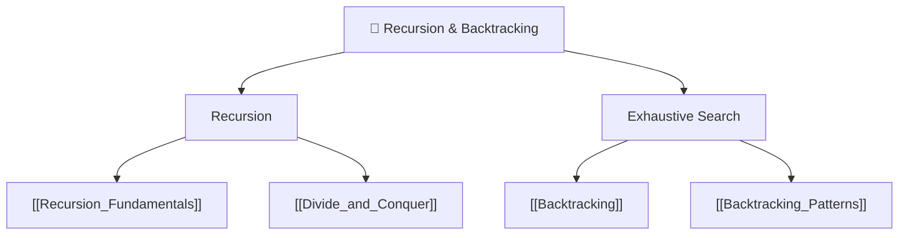

# 🔄 Recursion & Backtracking — Map of Content

> [!abstract] What This Section Covers
> Recursion is the foundation of a huge portion of DSA — without it, trees, divide-and-conquer, dynamic programming, and backtracking are all impossible to express cleanly. This section starts with the mental model of recursion itself, moves into divide-and-conquer as a design strategy, and then covers backtracking — the systematic exhaustive-search technique that underlies permutations, combinations, N-Queens, Sudoku, and many constraint-satisfaction problems. Mastering pruning here makes the difference between O(n!) and O(n · 2^n) or better.

## Concept Map

## Learning Path

1. [[Recursion_Fundamentals]] — Base cases, recursive calls, call stack, tail recursion, common pitfalls
2. [[Divide_and_Conquer]] — Split → solve subproblems → merge; master theorem; classic examples (merge sort, binary search)
3. [[Backtracking]] — State tree, choose / explore / unchoose template, termination conditions
4. [[Backtracking_Patterns]] — Pattern catalogue: subsets, permutations, combinations, constraint satisfaction

## All Notes at a Glance

| Note | Summary | Difficulty |
|------|---------|------------|
| [[Recursion_Fundamentals]] | Base cases, call stack mental model, memoisation intro | Beginner |
| [[Divide_and_Conquer]] | D&C design paradigm; recurrence relations; master theorem | Intermediate |
| [[Backtracking]] | Exhaustive search with undo; state-space tree | Intermediate |
| [[Backtracking_Patterns]] | Subsets, permutations, combinations, N-Queens patterns | Intermediate |

## Key Questions This Section Answers

- How is divide & conquer structurally different from backtracking?
- What makes a backtracking solution correct — how do you verify all paths are explored?
- How does pruning reduce exponential time, and how do you identify valid prune conditions?
- What is the master theorem and how do you apply it to get a recurrence's Big-O?
- When should you convert recursion to iteration (stack-based), and when is it unnecessary?
- How do subset and combination generation differ, and what controls the branching factor?

## Related Sections

- [[_MOC_DSA_Master|↑ DSA Master MOC]]
- [[_MOC_Dynamic_Programming]] — DP is memoised recursion; backtracking problems often have a DP optimisation
- [[_MOC_Trees]] — Tree traversal is inherently recursive; DFS on trees is backtracking

#MOC #DSA #recursion #backtracking
