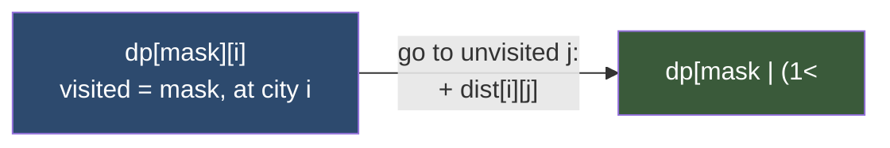

# 🎭 Bitmask DP

> [!abstract] TL;DR
> When a DP state must remember **which subset of a small set of items** has been used, encode that subset as an integer **bitmask** — bit `i` set means "item `i` is in the set". This collapses an exponential "remember the whole set" state into a single loop variable from `0` to `2^n − 1`. The killer application is the **Travelling Salesman Problem** in `O(2^n · n²)`: `dp[mask][i]` = min cost to have visited exactly the cities in `mask`, currently standing at city `i`. Works only for small `n` (typically **n ≤ 20**, since `2^20 ≈ 10^6`).

---

## Intuition — Analogy First

Think of a **hotel keycard with n little lights**, one per city you must visit on a business trip. Each light is either on (visited) or off (not yet). The entire state of your trip so far — *which* cities are done — is captured by the pattern of lights, and that pattern is just a binary number.

Instead of carrying around a `set{Paris, Tokyo}`, you carry the integer `...0110`. Turning a light on is `mask | (1 << city)`; checking a light is `mask & (1 << city)`. Because there are only `2^n` possible light patterns, you can make a table indexed by the pattern. Add "which city am I physically standing in right now" as a second index, and you can answer "cheapest way to have this exact set visited, ending here" — which is precisely what TSP needs.

The reason this is bounded: `n` must be tiny. With `n = 20` there are ~1 million masks; with `n = 40` there are a trillion — hopeless, which is exactly when you split the set in half and reach for [[Meet_in_the_Middle]].

---

## How It Works

- **State:** `mask` = subset of items already handled (an integer in `[0, 2^n)`). Often paired with a second dimension like "last item used".
- **Bit ops:** set membership `mask & (1<<i)`, add `mask | (1<<i)`, remove `mask & ~(1<<i)`, size `mask.bit_count()`.
- **Transition:** extend the current subset by one item, or split the subset.
- **Order:** iterate masks in increasing numeric order — a superset always has a larger integer value than its subsets, so subsets are ready before the sets that build on them.

### Mermaid — Adding a City to the Visited Mask (TSP transition)



### Submask Enumeration in O(3^n)

Sometimes you must iterate **every subset of every mask** (e.g. partition DP: assign a whole group at once). The idiom below visits each `(mask, submask)` pair exactly once. Total work is `O(3^n)` because each element is independently *out of mask*, *in mask but out of sub*, or *in sub* — three states across `n` elements.

```python
sub = mask
while sub > 0:
    process(sub)              # sub ranges over all non-empty submasks of mask
    sub = (sub - 1) & mask    # magic step to the next lower submask
# sub == 0 (the empty submask) handled separately if needed
```

---

## State Definition & Transition

**Travelling Salesman (min Hamiltonian cycle/path)**
- **State:** `dp[mask][i]` = minimum cost of a path that starts at city 0, visits **exactly** the set `mask`, and currently ends at city `i` (with bit `i` set in `mask`).
- **Transition:** `dp[mask | (1<<j)][j] = min(…, dp[mask][i] + dist[i][j])` for every unvisited `j`.
- **Base case:** `dp[1][0] = 0` (only city 0 visited, standing at city 0).
- **Order:** masks ascending.
- **Answer (closed tour):** `min over i of dp[FULL][i] + dist[i][0]`, where `FULL = (1<<n) - 1`.
- **Complexity:** `2^n` masks × `n` "current" cities × `n` "next" cities = **O(2^n · n²)** time, **O(2^n · n)** space.

**Assignment Problem (n tasks → n workers, min cost)**
- **State:** `dp[mask]` = min cost to assign the first `popcount(mask)` tasks using exactly the workers in `mask`.
- **Transition:** the next task index is `k = popcount(mask)`; assign it to any free worker `j`: `dp[mask | (1<<j)] = min(…, dp[mask] + cost[k][j])`.
- **Answer:** `dp[(1<<n) - 1]`. **Complexity:** O(2^n · n).

---

## Python Implementation

```python
from math import inf


# ─── 1. Travelling Salesman Problem — O(2^n · n^2) ───────────────────────────
def tsp(dist: list[list[int]]) -> int:
    """
    Minimum-cost Hamiltonian CYCLE starting and ending at city 0.
    dp[mask][i] = min cost to visit exactly `mask`, ending at city i.
    """
    n = len(dist)
    FULL = (1 << n) - 1
    dp = [[inf] * n for _ in range(1 << n)]
    dp[1][0] = 0                                  # start: only city 0 visited

    for mask in range(1 << n):
        for i in range(n):
            if dp[mask][i] == inf:                # unreachable state, skip
                continue
            if not (mask & (1 << i)):             # i must be inside mask
                continue
            for j in range(n):
                if mask & (1 << j):               # j already visited
                    continue
                nmask = mask | (1 << j)
                cand = dp[mask][i] + dist[i][j]
                if cand < dp[nmask][j]:
                    dp[nmask][j] = cand

    # close the tour: return to city 0
    return min(dp[FULL][i] + dist[i][0] for i in range(n))


# ─── 2. Assignment Problem — O(2^n · n) ──────────────────────────────────────
def min_assignment_cost(cost: list[list[int]]) -> int:
    """
    Assign task k to some worker; cost[k][w] = cost of task k done by worker w.
    dp[mask] = min cost to assign tasks 0..popcount(mask)-1 to the workers in mask.
    """
    n = len(cost)
    dp = [inf] * (1 << n)
    dp[0] = 0
    for mask in range(1 << n):
        if dp[mask] == inf:
            continue
        k = bin(mask).count("1")                  # next task index to assign
        if k == n:
            continue
        for w in range(n):
            if mask & (1 << w):                   # worker already used
                continue
            nmask = mask | (1 << w)
            dp[nmask] = min(dp[nmask], dp[mask] + cost[k][w])
    return dp[(1 << n) - 1]


# ─── 3. Count Hamiltonian Paths (any start, any end) ─────────────────────────
def count_hamiltonian_paths(adj: list[list[int]]) -> int:
    """
    Count simple paths visiting every vertex exactly once (directed adjacency).
    dp[mask][i] = number of Hamiltonian paths over `mask` ending at i.
    """
    n = len(adj)
    dp = [[0] * n for _ in range(1 << n)]
    for i in range(n):
        dp[1 << i][i] = 1                         # single-vertex path
    for mask in range(1 << n):
        for i in range(n):
            if not dp[mask][i]:
                continue
            for j in range(n):
                if (mask & (1 << j)) or not adj[i][j]:
                    continue
                dp[mask | (1 << j)][j] += dp[mask][i]
    FULL = (1 << n) - 1
    return sum(dp[FULL][i] for i in range(n))


# ─── 4. Submask enumeration demo — O(3^n) total ──────────────────────────────
def all_submasks(mask: int) -> list[int]:
    """Return every non-empty submask of `mask` (each visited once)."""
    out, sub = [], mask
    while sub > 0:
        out.append(sub)
        sub = (sub - 1) & mask                    # step to next lower submask
    return out


# ─── Quick test ──────────────────────────────────────────────────────────────
if __name__ == "__main__":
    D = [[0, 10, 15, 20],
         [10, 0, 35, 25],
         [15, 35, 0, 30],
         [20, 25, 30, 0]]
    print(tsp(D))                                 # 80  (0→1→3→2→0)

    C = [[9, 2, 7],
         [6, 4, 3],
         [5, 8, 1]]
    print(min_assignment_cost(C))                 # 9  (task0→w1=2, task1→w0=6, task2→w2=1)

    print(all_submasks(0b101))                    # [5, 4, 1] = {0,2},{2},{0}
```

---

## Dry Run / Trace

### TSP on 3 cities, `dist = [[0,1,4],[1,0,2],[4,2,0]]`

`FULL = 0b111 = 7`. Start `dp[001][0] = 0`.

| step | from state | action | new state | value |
|---|---|---|---|---|
| 1 | `dp[001][0]=0` | 0→1 (+1) | `dp[011][1]` | 1 |
| 2 | `dp[001][0]=0` | 0→2 (+4) | `dp[101][2]` | 4 |
| 3 | `dp[011][1]=1` | 1→2 (+2) | `dp[111][2]` | 3 |
| 4 | `dp[101][2]=4` | 2→1 (+2) | `dp[111][1]` | 6 |

Close the tour back to city 0:
- via city 2: `dp[111][2] + dist[2][0] = 3 + 4 = 7`
- via city 1: `dp[111][1] + dist[1][0] = 6 + 1 = 7`

Minimum tour cost = **7** (route `0→1→2→0`).

---

## Patterns & LeetCode Applications

| Problem | Bitmask meaning |
|---|---|
| **Find the Shortest Superstring** (LC 943) | `mask` = which strings merged; `dp[mask][i]` ends at string i — a TSP variant on overlap costs |
| **Shortest Path Visiting All Nodes** (LC 847) | `dp[mask][i]` [[BFS]]/DP over visited-node sets; may revisit nodes |
| **Maximum Students Taking Exam** (LC 1349) | `mask` = seating of one row; transition against previous row's mask (submask/compat check) |
| **Partition to K Equal Sum Subsets** (LC 698) | `mask` = which elements used; `dp[mask]` = current bucket fill |
| Number of Ways to Wear Different Hats (LC 1434) | bitmask over people, iterate hats |
| Minimum XOR Sum of Two Arrays (LC 1879) | assignment problem via `dp[mask]` |
| Campus Bikes II (LC 1066) | assign bikes to workers, `dp[mask]` over bikes |

**Recognition signal:** `n` is suspiciously small (≤ ~20), the problem screams "try all permutations / all subsets", and a state naturally is "which items are done".

---

## Common Pitfalls

1. **Using bitmask DP when `n` is too large.** `2^n` blows up past `n ≈ 20–22`. For `n ≈ 40`, split the set and use [[Meet_in_the_Middle]] instead.

2. **Off-by-one in `1 << i` vs `i`.** The *mask* is `1 << i`; the *index* is `i`. Mixing them (e.g. `dp[i][…]` where you meant `dp[1<<i][…]`) is the most common bug.

3. **Iterating masks in the wrong order.** For "extend a subset" transitions you must go **ascending** so every subset is finalised before its supersets. For "shrink"/submask DP the natural order differs — think about which direction your dependency points.

4. **Forgetting to close the TSP tour.** `dp[FULL][i]` is the best *path*; a cycle needs `+ dist[i][0]`. If the problem wants an open Hamiltonian *path*, skip the return edge.

5. **Skipping unreachable states.** Always `continue` when `dp[mask][i] == inf`; otherwise `inf + dist` overflows conceptually and pollutes downstream minima.

6. **Recomputing `popcount` inside hot loops.** For the assignment pattern, `popcount(mask)` gives the next task index; cache it or use `mask.bit_count()` (Python 3.10+) — but don't call it redundantly per worker.

---

## Related Concepts

- [[_MOC_Dynamic_Programming|↑ Section MOC]]
- [[Bit_Manipulation]] — the bit operations (set/clear/test/popcount) that power the mask
- [[Meet_in_the_Middle]] — the escape hatch when `n` is too big for `2^n` DP
- [[DP_Fundamentals]] — overlapping subproblems, here indexed by subset
- [[DP_Patterns]] — bitmask DP as a named family in the taxonomy
- [[Combinatorics]] — counting Hamiltonian paths and subset structure

---

## Review Questions

1. **Why is TSP `O(2^n · n²)` and not `O(n!)`?** Explain how memoising on `(mask, last_city)` merges the exponentially many permutations that share the same visited set and endpoint.

2. **Derive the `O(3^n)` cost of submask enumeration.** For each of the `n` elements, what are its three independent possibilities across the `(mask, submask)` pair?

3. **In the assignment DP, why does `popcount(mask)` correctly identify the next task to assign?** What invariant guarantees the number of set bits equals the number of tasks already placed?

---

## Sources

- [LeetCode 943 — Find the Shortest Superstring](https://leetcode.com/problems/find-the-shortest-superstring/)
- [LeetCode 847 — Shortest Path Visiting All Nodes](https://leetcode.com/problems/shortest-path-visiting-all-nodes/)
- [LeetCode 1349 — Maximum Students Taking Exam](https://leetcode.com/problems/maximum-students-taking-exam/)
- [LeetCode 698 — Partition to K Equal Sum Subsets](https://leetcode.com/problems/partition-to-k-equal-sum-subsets/)
- [CP-Algorithms — Submask enumeration & bitmask DP](https://cp-algorithms.com/algebra/all-submasks.html)

#dsa #dynamic-programming #bitmask #subsets #tsp #advanced
