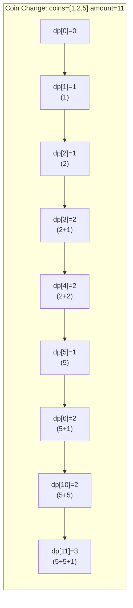

---
title: Coin Change (Unbounded Knapsack)
aliases: [Coin Change DP, Unbounded Knapsack Coin]
tags: [DSA, dynamic-programming, knapsack, unbounded-knapsack]
domain: DSA
difficulty: Intermediate
created: 2026-07-26
related: [Knapsack_Unbounded, DP_Fundamentals, DP_Patterns]
status: complete
---

# 🪙 Coin Change (Unbounded Knapsack)

> [!abstract] TL;DR
> Given coin denominations and a target amount, find the **minimum number of coins** to make that amount. Classic **unbounded knapsack** — each coin can be used infinitely. `dp[a] = min coins to make amount a`. Variant: **Coin Change II** counts the number of distinct ways (combinations, not permutations).

---

## Intuition — Analogy First

Imagine you're at a register trying to make **exact change for $11** using bills of $1, $2, and $5. You'd instinctively grab a $5, then another $5, then a $1 — that's **3 bills**. You wouldn't use eleven $1 bills if you could avoid it.

This greedy "grab the biggest bill" strategy works for standard denominations but **fails for arbitrary coins** — try making $6 with coins `[1, 3, 4]`: greedy gives $4+$1+$1 = 3 coins, but optimal is $3+$3 = 2 coins. Dynamic programming always finds the true minimum.

The DP builds up: *"to make $11, what's the best if I last used a $1? A $2? A $5?"* — and takes the best across all choices.

---

## How It Works

### Coin Change I — Minimum Coins

- `dp[a]` = minimum number of coins to make amount `a`
- **Base case:** `dp[0] = 0` (zero coins to make $0)
- **Init:** `dp[a] = infinity` for `a > 0` (impossible until proven otherwise)
- **Recurrence:** for each amount `a` from 1 to `amount`:

```
dp[a] = min over all coins c where c <= a of (dp[a - c] + 1)
```

Take each coin `c`, check if using it last gives a better (smaller) total.

### Coin Change II — Number of Ways (Combinations)

- `dp[a]` = number of ways to make amount `a`
- **Base case:** `dp[0] = 1` (one way to make $0: use no coins)
- **Key:** iterate **coins in outer loop**, amounts in inner loop → ensures each combination counted once (not permutations)

```
for coin in coins:
    for a in range(coin, amount + 1):
        dp[a] += dp[a - coin]
```

> [!warning] Loop Order Matters
> - **Outer=amounts, inner=coins** → counts **permutations** (ordered sequences)
> - **Outer=coins, inner=amounts** → counts **combinations** (unordered sets)
> Coin Change II wants combinations.

### Mermaid — dp Array Evolution



---

## Complexity Analysis

| Variant | Time | Space |
|---|---|---|
| Coin Change I (min coins) | O(amount × n) | O(amount) |
| Coin Change II (ways) | O(amount × n) | O(amount) |
| Exact change check | O(amount × n) | O(amount) |

- `n` = number of coin denominations
- Both variants use O(amount) space — the 1D DP array replaces any 2D formulation

---

## Implementation (Python)

```python
from math import inf
from typing import List


# ─── 1. Coin Change I — Minimum Number of Coins ──────────────────────────────
def coin_change(coins: List[int], amount: int) -> int:
    """
    Returns minimum coins needed to make 'amount', or -1 if impossible.
    LeetCode 322.
    """
    dp = [inf] * (amount + 1)
    dp[0] = 0

    for a in range(1, amount + 1):
        for coin in coins:
            if coin <= a:
                dp[a] = min(dp[a], dp[a - coin] + 1)

    return dp[amount] if dp[amount] != inf else -1


# ─── 2. Coin Change II — Number of Combinations ──────────────────────────────
def change(amount: int, coins: List[int]) -> int:
    """
    Returns number of distinct coin combinations summing to 'amount'.
    LeetCode 518. Outer loop = coins → combinations, not permutations.
    """
    dp = [0] * (amount + 1)
    dp[0] = 1   # one way to make 0: use nothing

    for coin in coins:          # outer = coin ensures no double-counting
        for a in range(coin, amount + 1):
            dp[a] += dp[a - coin]

    return dp[amount]


# ─── 3. Exact Change Boolean DP ──────────────────────────────────────────────
def can_make_change(coins: List[int], amount: int) -> bool:
    """Returns True if exact change for 'amount' is possible."""
    dp = [False] * (amount + 1)
    dp[0] = True
    for a in range(1, amount + 1):
        for coin in coins:
            if coin <= a and dp[a - coin]:
                dp[a] = True
                break
    return dp[amount]


# ─── 4. Perfect Squares (LeetCode 279) ───────────────────────────────────────
def num_squares(n: int) -> int:
    """
    Minimum number of perfect squares summing to n.
    Coin change with coins = [1, 4, 9, 16, ...].
    """
    squares = [i * i for i in range(1, int(n ** 0.5) + 1)]
    dp = [inf] * (n + 1)
    dp[0] = 0
    for a in range(1, n + 1):
        for sq in squares:
            if sq > a:
                break
            dp[a] = min(dp[a], dp[a - sq] + 1)
    return dp[n]


# ─── Quick test ──────────────────────────────────────────────────────────────
if __name__ == "__main__":
    print(coin_change([1, 2, 5], 11))      # 3  (5+5+1)
    print(coin_change([2], 3))             # -1 (impossible)
    print(change(5, [1, 2, 5]))            # 4  ways
    print(change(3, [2]))                  # 0  ways
    print(num_squares(12))                 # 3  (4+4+4)
    print(can_make_change([2, 5, 10], 3))  # False
```

---

## Dry Run / Example Trace

**Coin Change I:** `coins = [1, 2, 5]`, `amount = 6`

```
dp[0] = 0
dp[1] = min(inf, dp[1-1]+1) = min(inf, 0+1) = 1           (use coin 1)
dp[2] = min(inf, dp[2-1]+1, dp[2-2]+1) = min(2,1) = 1     (use coin 2)
dp[3] = min(dp[2]+1, dp[1]+1, -)  = min(2, 2) = 2         (1+2 or 1+1+1)
dp[4] = min(dp[3]+1, dp[2]+1, -)  = min(3, 2) = 2         (2+2)
dp[5] = min(dp[4]+1, dp[3]+1, dp[0]+1) = min(3,3,1) = 1   (use coin 5)
dp[6] = min(dp[5]+1, dp[4]+1, dp[1]+1) = min(2,3,2) = 2   (5+1 or 1+5)
```

Answer: **2 coins** (5 + 1).

**Coin Change II:** `coins = [1, 2, 5]`, `amount = 5`

Process coin=1: `dp = [1,1,1,1,1,1]`
Process coin=2: `dp[2]+=dp[0]=1→2, dp[3]+=dp[1]=1→2, dp[4]+=dp[2]=2→3, dp[5]+=dp[3]=2→3`
Process coin=5: `dp[5]+=dp[0]=1→4`

Answer: **4 ways** — {5}, {2+2+1}, {2+1+1+1}, {1+1+1+1+1}

---

## Patterns & LeetCode Applications

| Problem | Variant | Key Trick |
|---|---|---|
| **Coin Change** (LC 322) | Min coins | Standard unbounded knapsack |
| **Coin Change II** (LC 518) | Count ways (combos) | Outer=coins loop |
| **Perfect Squares** (LC 279) | Min squares | Coins = perfect squares |
| **Minimum Cost for Tickets** (LC 983) | Min cost with 1/7/30 day passes | DP over days with different jump sizes |
| **Combination Sum IV** (LC 377) | Count ways (perms) | Outer=amounts loop |
| **Partition Equal Subset Sum** (LC 416) | Boolean 0/1 knapsack | Each coin usable once |

### Unbounded vs 0/1 Knapsack
| Property | Unbounded | 0/1 |
|---|---|---|
| Item reuse | Unlimited | Once |
| Inner loop direction | Left → Right | Right → Left (to prevent reuse) |
| Canonical | Coin Change | Partition Equal Subset Sum |

---

## Common Pitfalls

1. **Permutations vs combinations** — swapping the loop order in Coin Change II gives permutations (LC 377) instead of combinations (LC 518). Remember: outer=coins → combinations.

2. **Initializing dp with 0 instead of infinity** — for min-coin problems, `dp[a] = 0` means "0 coins needed" which is wrong. Initialize all non-zero entries to `inf` (or `amount + 1` as a sentinel).

3. **Returning -1 vs infinity** — the problem returns -1 when impossible, but `dp[amount]` will be `inf`. Add `if dp[amount] == inf: return -1`.

4. **Off-by-one in range** — the inner loop should be `range(coin, amount + 1)` not `range(coin, amount)`. You need to update `dp[amount]` itself.

5. **Forgetting `dp[0] = 1` for counting variants** — there is exactly one way to make $0 (use no coins). This is the multiplicative identity that seeds the count propagation.

---

## Related Concepts

- [[_MOC_Dynamic_Programming|↑ Section MOC]]
- [[Knapsack_Unbounded]] — generalizes coin change to weighted items with values
- [[DP_Fundamentals]] — 1D DP array technique
- [[DP_Patterns]] — categorized under "Knapsack DP"
- [[Edit_Distance]] — another classic 1D/2D DP

---

## Review Questions

1. **Why does swapping the loop order in Coin Change II count permutations instead of combinations?** Walk through a small example (`coins=[1,2]`, `amount=3`) with both loop orders and count the distinct results.

2. **How would you solve Coin Change if each coin can only be used at most `k` times** (not infinitely)? What changes in the DP formulation?

3. **Prove that the unbounded knapsack inner loop must go left-to-right** (not right-to-left like 0/1 knapsack). What would happen if you iterated right-to-left?

---

## Sources

- [LeetCode 322 — Coin Change](https://leetcode.com/problems/coin-change/)
- [LeetCode 518 — Coin Change II](https://leetcode.com/problems/coin-change-ii/)
- [LeetCode 279 — Perfect Squares](https://leetcode.com/problems/perfect-squares/)
- [LeetCode 983 — Minimum Cost for Tickets](https://leetcode.com/problems/minimum-cost-for-tickets/)
- CLRS Chapter 16.1 — Activity-selection problem (knapsack backdrop)

#dsa #dynamic-programming #knapsack #unbounded-knapsack #coin-change #intermediate
