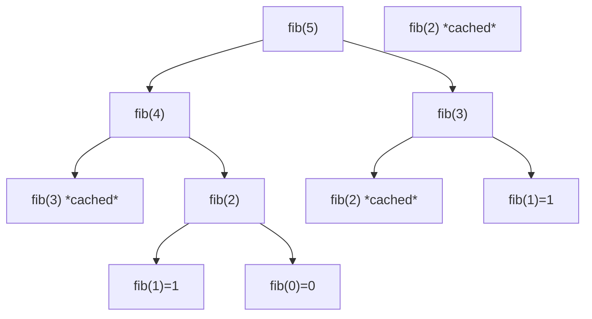

---
title: DP Fundamentals
aliases: []
tags: [DSA, DynamicProgramming]
domain: DSA
difficulty: Intermediate
created: 2026-07-26
related: []
status: complete
---

# 🏗️ DP Fundamentals

> [!abstract] TL;DR
> Dynamic Programming = **recursion + memoization** (or tabulation). It applies when a problem has **optimal substructure** (best solution uses best sub-solutions) and **overlapping subproblems** (same sub-instance computed repeatedly). Master the 5-step framework and you can derive any DP solution systematically.

---

## Intuition — Analogy First

Building a **skyscraper** floor by floor. You cannot build floor 5 without floors 1–4 already standing. Each floor's construction spec (the DP transition) tells you exactly how to build the next floor using the floors below. You never tear down a completed floor and rebuild it — once a floor is done, you reuse it.

That's DP in a nutshell:
- **Floors already built** = memoized/tabulated subproblem results
- **Construction spec** = the recurrence relation / transition
- **Ground floor** = base cases
- **Final floor** = the answer we want

The key difference from plain recursion: DP *caches* completed floors and *reuses* them instead of rebuilding. This turns exponential work into polynomial.

---

## How It Works + Mermaid

### Two Necessary Conditions

**1. Optimal Substructure**
The optimal solution to the problem *contains* optimal solutions to its subproblems.
- Shortest path: the shortest path from A to C through B = shortest path A→B + shortest path B→C.
- Counter-example: longest simple path does NOT have optimal substructure (detours can be beneficial for subpaths).

**2. Overlapping Subproblems**
The same subproblem is encountered multiple times during recursion.
- fib(5) → fib(4) + fib(3) → fib(3) + fib(2) + fib(2) + fib(1) → fib(2) computed 3×.
- Contrast with Divide & Conquer: merge sort subproblems are always *different* arrays.

### The 5-Step DP Framework

| Step | Question to answer |
|---|---|
| 1. Define state | What does dp[i] (or dp[i][j]) represent? |
| 2. Identify transitions | How is dp[i] computed from smaller states? |
| 3. Set base cases | What are the trivially known values? |
| 4. Determine order | In what order must we fill dp? (smaller → larger) |
| 5. Implement | Code it top-down (memo) or bottom-up (tabulation) |

### Subproblem DAG for Fibonacci(5)



Dashed nodes (marked *cached*) are looked up instead of recomputed. Without caching, the DAG becomes a full binary tree with exponential nodes.

---

## Complexity Analysis

| Approach | Fibonacci | Climb Stairs |
|---|---|---|
| Naive recursion | O(2ⁿ) time, O(n) space | O(2ⁿ) time |
| Memoization | O(n) time, O(n) space | O(n) time, O(n) space |
| Tabulation | O(n) time, O(n) space | O(n) time, O(n) space |
| Tabulation + space opt | O(n) time, O(1) space | O(n) time, O(1) space |

**General DP complexity**:
- Time = (number of distinct states) × (time to compute each transition)
- Space = (number of states stored) — often reducible if only previous row(s) needed

---

## Implementation (Python)

```python
# ── Fibonacci — 4 approaches ──────────────────────────────────────────────

# 1. Naive recursion: O(2^n) time — DO NOT use for large n
def fib_naive(n: int) -> int:
    if n <= 1: return n
    return fib_naive(n - 1) + fib_naive(n - 2)


# 2. Top-down memoization: O(n) time, O(n) space
from functools import lru_cache

@lru_cache(maxsize=None)
def fib_memo(n: int) -> int:
    if n <= 1: return n
    return fib_memo(n - 1) + fib_memo(n - 2)


# 3. Bottom-up tabulation: O(n) time, O(n) space
def fib_tab(n: int) -> int:
    if n <= 1: return n
    dp = [0] * (n + 1)
    dp[1] = 1
    for i in range(2, n + 1):
        dp[i] = dp[i-1] + dp[i-2]
    return dp[n]


# 4. Space-optimized: O(n) time, O(1) space
def fib_optimized(n: int) -> int:
    if n <= 1: return n
    prev2, prev1 = 0, 1
    for _ in range(2, n + 1):
        prev2, prev1 = prev1, prev1 + prev2
    return prev1


# ── Climb Stairs (LC 70) — canonical first DP problem ────────────────────
# Problem: n stairs, take 1 or 2 steps at a time. How many distinct ways?
# State: dp[i] = number of ways to reach step i
# Transition: dp[i] = dp[i-1] + dp[i-2]  (came from step i-1 or i-2)
# Base cases: dp[0]=1 (one way: do nothing), dp[1]=1

def climb_stairs(n: int) -> int:
    """O(n) time, O(1) space — same recurrence as Fibonacci."""
    if n <= 2: return n
    prev2, prev1 = 1, 2
    for _ in range(3, n + 1):
        prev2, prev1 = prev1, prev1 + prev2
    return prev1


# Annotated tabulation version showing the 5 steps:
def climb_stairs_explained(n: int) -> int:
    # Step 1: state — dp[i] = ways to reach stair i
    # Step 2: transition — dp[i] = dp[i-1] + dp[i-2]
    # Step 3: base cases
    # Step 4: fill left to right (smaller i before larger i)
    # Step 5: implement
    dp = [0] * (n + 1)
    dp[0] = 1   # 1 way to "reach" ground (do nothing)
    dp[1] = 1   # 1 way to reach step 1 (one step)
    for i in range(2, n + 1):
        dp[i] = dp[i-1] + dp[i-2]
    return dp[n]
```

---

## Dry Run / Example Trace

**`climb_stairs(5)` — bottom-up tabulation:**

| i | dp[i] | Why |
|---|---|---|
| 0 | 1 | base case |
| 1 | 1 | base case |
| 2 | 2 | dp[1]+dp[0] = 1+1 |
| 3 | 3 | dp[2]+dp[1] = 2+1 |
| 4 | 5 | dp[3]+dp[2] = 3+2 |
| 5 | **8** | dp[4]+dp[3] = 5+3 |

The answer is 8. You can verify: the 8 paths for n=4 are {1,1,1,1}, {1,1,2}, {1,2,1}, {2,1,1}, {2,2}, {1,1,1,2-from-above}... Fibonacci numbers appear naturally here.

**Why naive fib is O(2ⁿ):**
```
fib(5) makes 2 calls: fib(4), fib(3)
fib(4) makes 2 calls: fib(3), fib(2)
fib(3) makes 2 calls: fib(2), fib(1)
...
Total calls ≈ 2⁰ + 2¹ + 2² + ... + 2ⁿ = O(2ⁿ)
```
With memoization, each `fib(k)` is computed once → O(n) total calls.

---

## Patterns & LeetCode Applications

### DP Problem Categories

| Category | Key State Shape | Examples |
|---|---|---|
| 1D linear | dp[i] | Climbing Stairs, House Robber |
| 1D with choice | dp[i] = max of options | Jump Game, Coin Change |
| 2D grid | dp[i][j] | Unique Paths, Minimum Path Sum |
| 2D string | dp[i][j] = first i of s1, first j of s2 | LCS, Edit Distance |
| Knapsack | dp[i][w] = items, capacity | 0/1 Knapsack, Subset Sum |
| Interval | dp[i][j] = subarray i..j | Burst Balloons, Matrix Chain |
| Tree DP | dp on tree nodes | House Robber III |

**Beginner roadmap (do in order):**
1. LC 509 — Fibonacci Number
2. LC 70 — Climbing Stairs
3. LC 746 — Min Cost Climbing Stairs
4. LC 198 — House Robber
5. LC 322 — Coin Change
6. LC 1143 — Longest Common Subsequence

---

## Common Pitfalls

1. **Wrong state definition** — the most common mistake. The state must encode everything needed to compute the transition. If you're looking up values not in the state, the state is incomplete.
2. **Off-by-one in base cases** — e.g., `dp[0]` should represent "zero items" or "empty string", not "first item". Be precise about what `dp[0]` means.
3. **Wrong fill order** — bottom-up DP requires computing smaller states before larger ones. For 2D DP, verify which dimension to iterate first.
4. **Using mutable default arguments for memo** — `def fib(n, memo={})` shares across calls. Prefer `@lru_cache` or initialize in the function body.
5. **Confusing top-down and bottom-up** — memoization (top-down) has implicit order from recursion; tabulation (bottom-up) needs explicit order. Mix-ups cause `dp[i]` to be used before it's computed.
6. **Space optimization breaks logic** — when compressing 2D to 1D, iterate in the *correct direction*. Wrong direction re-uses updated values when you need old ones (see Knapsack 0/1 note).

---

## Related Concepts [[wikilinks]]

- [[_MOC_Dynamic_Programming|↑ Section MOC]]
- [[Memoization_vs_Tabulation]] — deep dive on top-down vs bottom-up trade-offs
- [[Backtracking]] — DP's relationship: when backtracking has overlapping subproblems, add memo
- [[Recursion_Fundamentals]] — DP is built on top of recursion

---

## Review Questions (3)

1. **What are the two conditions a problem must satisfy to be solvable with DP? Give a counter-example for each.**
   *Answer: Optimal substructure (e.g., counter-example: longest simple path in a graph — taking an optimal subpath may create a longer non-optimal path) and overlapping subproblems (e.g., counter-example: merge sort has subproblems that never repeat — different array halves each time).*

2. **Walk through the 5-step DP framework for Coin Change (LC 322): given coins and an amount, find the minimum number of coins.**
   *Answer: (1) State: dp[i] = min coins to make amount i. (2) Transition: dp[i] = min(dp[i], dp[i - coin] + 1) for each coin ≤ i. (3) Base: dp[0]=0, dp[1..amount]=infinity. (4) Order: i from 1 to amount. (5) Return dp[amount] (-1 if still infinity).*

3. **Why does memoization transform fib from O(2ⁿ) to O(n) while keeping O(n) space? What determines the space usage?**
   *Answer: Memoization ensures each subproblem fib(k) is computed once. There are n distinct subproblems, so O(n) time. Space = O(n) for the cache + O(n) for the call stack. The call stack depth equals the maximum recursion depth = n.*

---

## Sources

- CLRS Ch. 15 — Dynamic Programming
- Skiena, *The Algorithm Design Manual*, Ch. 8
- MIT 6.006 — Dynamic Programming lectures (Demaine)
- LeetCode Explore — Dynamic Programming card

#DSA #DynamicProgramming #Memoization #Tabulation #OptimalSubstructure #Intermediate
