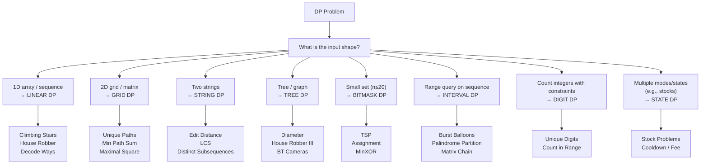

---
title: DP Patterns — The 8 Families
aliases: [DP Pattern Families, Dynamic Programming Patterns]
tags: [DSA, dynamic-programming, patterns, overview]
domain: DSA
difficulty: Intermediate
created: 2026-07-26
related: [DP_Fundamentals, Knapsack_01, LCS_and_LIS, Edit_Distance, Coin_Change, DP_on_Trees]
status: complete
---

# 🗺️ DP Patterns — The 8 Families

> [!abstract] TL;DR
> Dynamic programming problems fall into **8 recognizable families**. Identify the family first — the implementation follows naturally. Key recognition signals: the input shape (string, grid, tree, bitmask), the optimization objective (min/max/count), and the dependency structure (linear, interval, hierarchical).

---

## Intuition — Analogy First

A master locksmith doesn't pick every lock from scratch — they recognize the lock type (padlock, deadbolt, combination) and apply the corresponding technique. Similarly, an expert DP solver **recognizes the family first**, then applies the canonical template.

Memorizing 200 DP problems is unnecessary. Recognize the pattern → adapt the template → solve.

---

## The 8 DP Families

### Family 1 — Linear DP

**Signal:** 1D array input, state depends on previous few states.
**Template:** `dp[i] = f(dp[i-1], dp[i-2], ...)`

| Problem | Recurrence | Notes |
|---|---|---|
| Climbing Stairs (LC 70) | `dp[i] = dp[i-1] + dp[i-2]` | Fibonacci variant |
| House Robber (LC 198) | `dp[i] = max(dp[i-1], dp[i-2] + nums[i])` | Skip or rob |
| Decode Ways (LC 91) | `dp[i] = dp[i-1] (if valid 1-digit) + dp[i-2] (if valid 2-digit)` | Count paths |
| Max Subarray | `dp[i] = max(nums[i], dp[i-1] + nums[i])` | Kadane's |
| Word Break (LC 139) | `dp[i] = any(dp[j] and word[j:i] in dict)` | Set-based |

---

### Family 2 — Grid DP

**Signal:** 2D matrix input, move right/down (or all 4 directions).
**Template:** `dp[i][j] = f(dp[i-1][j], dp[i][j-1])` (top and left neighbors)

| Problem | Recurrence | Notes |
|---|---|---|
| Unique Paths (LC 62) | `dp[i][j] = dp[i-1][j] + dp[i][j-1]` | Count paths |
| Min Path Sum (LC 64) | `dp[i][j] = grid[i][j] + min(dp[i-1][j], dp[i][j-1])` | Shortest path |
| Dungeon Game (LC 174) | Fill **bottom-right to top-left** — min health needed | Reverse DP |
| Maximal Square (LC 221) | `dp[i][j] = min(dp[i-1][j], dp[i][j-1], dp[i-1][j-1]) + 1` | Square size |

---

### Family 3 — Interval DP

**Signal:** answer for a range `[i..j]` depends on subanswers for subranges.
**Template:** `dp[i][j] = min/max over all split points k of (dp[i][k] + dp[k+1][j] + cost)`
**Loop order:** increasing interval length (outer), then start (inner).

| Problem | Key Idea |
|---|---|
| Burst Balloons (LC 312) | Choose last balloon to burst in `[i..j]` |
| Palindromic Substrings (LC 647) / Palindrome Partitioning II | Expand palindromes, count/cost splits |
| Matrix Chain Multiplication | Classic textbook: minimize multiply operations |
| Minimum Score Triangulation (LC 1039) | Split polygon by choosing triangle vertex |
| Strange Printer (LC 664) | `dp[i][j]` = min turns to print `s[i..j]` |

---

### Family 4 — Bitmask DP

**Signal:** small set of items (n ≤ 20), need to track subset visited/assigned.
**Template:** `dp[mask][v]` = best solution using items in `mask`, currently at `v`.

| Problem | Key Idea |
|---|---|
| Traveling Salesman (TSP) | `dp[mask][i]` = min cost to visit all in mask, ending at i |
| Assign Students to Tasks | `dp[mask]` = min cost assigning first `|mask|` students to tasks in mask |
| Minimum XOR Sum (LC 1879) | Bitmask over assignments |

---

### Family 5 — DP with States (Stock Problems)

**Signal:** multiple "modes" (e.g., holding/not holding), transitions between modes cost something.
**Template:** multiple DP arrays, one per state.

| Problem | States | Key Transition |
|---|---|---|
| Buy/Sell Stock I (LC 121) | — | Track `min_price`, one transaction |
| Buy/Sell Stock II (LC 122) | holding, not_holding | Infinite transactions |
| Buy/Sell Stock III (LC 123) | at most 2 transactions | 4 state variables |
| Buy/Sell Stock IV (LC 188) | at most k transactions | `dp[k][2]` |
| Buy/Sell with Cooldown (LC 309) | held, sold, rest | 3-state FSM |
| Buy/Sell with Fee (LC 714) | holding, not_holding | Fee on sell |

---

### Family 6 — DP on Strings

**Signal:** one or two strings, min-cost transform / longest common subsequence / palindromes.
**Template:** `dp[i][j]` = answer for `s1[0..i-1]` and `s2[0..j-1]`.

| Problem | Recurrence Type |
|---|---|
| Edit Distance (LC 72) | 3-operation transitions |
| LCS (LC 1143) | Match or skip one character |
| Longest Palindromic Subsequence (LC 516) | LCS of s and reversed s |
| Distinct Subsequences (LC 115) | Count matchings |
| Interleaving String (LC 97) | 2D boolean |

---

### Family 7 — DP on Trees

**Signal:** tree structure, answer at parent depends on children. See [[DP_on_Trees]].

| Problem | Pattern |
|---|---|
| Diameter / Max Path Sum | DFS returns, global max updated |
| House Robber III (LC 337) | Two states (rob/skip) per node |
| Binary Tree Cameras (LC 968) | Three states, greedy choice |
| Unique BSTs (LC 96) | Count via Catalan numbers |

---

### Family 8 — Digit DP

**Signal:** count integers in `[L, R]` satisfying digit-based constraints.
**Template:** `dp[pos][tight][state]` — process digit by digit, track "tight" bound.

| Problem | Constraint State |
|---|---|
| Count Numbers with Unique Digits (LC 357) | Count of digits used |
| Non-negative Integers without Consecutive Ones (LC 600) | Last digit |
| Numbers at Most N given Digit Set (LC 902) | Position + tight flag |
| Digit Count in Range (LC 1067) | Count of specific digit seen |

```python
# Generic Digit DP skeleton
from functools import lru_cache

def count_valid_numbers(n: int) -> int:
    digits = list(map(int, str(n)))

    @lru_cache(maxsize=None)
    def dp(pos: int, tight: bool, state) -> int:
        if pos == len(digits):
            return 1 if is_valid(state) else 0
        limit = digits[pos] if tight else 9
        result = 0
        for d in range(0, limit + 1):
            result += dp(pos + 1, tight and d == limit, next_state(state, d))
        return result

    return dp(0, True, initial_state)
```

---

## Mermaid — DP Pattern Classification Tree



---

## Complexity Analysis

| Family | Typical Time | Typical Space |
|---|---|---|
| Linear DP | O(n) or O(n²) | O(1) to O(n) |
| Grid DP | O(m × n) | O(m × n) or O(n) |
| Interval DP | O(n³) | O(n²) |
| Bitmask DP | O(2ⁿ × n) | O(2ⁿ × n) |
| State DP (stocks) | O(n × k) | O(k) |
| String DP | O(m × n) | O(m × n) or O(n) |
| Tree DP | O(n) | O(h) |
| Digit DP | O(log(N) × states) | O(log(N) × states) |

---

## Implementation (Python)

```python
# ─── Interval DP: Palindrome Partitioning II (LC 132) ────────────────────────
def min_cut(s: str) -> int:
    """Minimum cuts to partition s so each part is a palindrome."""
    n = len(s)
    # is_pal[i][j] = True if s[i..j] is a palindrome
    is_pal = [[False] * n for _ in range(n)]
    for i in range(n):
        is_pal[i][i] = True
    for length in range(2, n + 1):
        for i in range(n - length + 1):
            j = i + length - 1
            if s[i] == s[j]:
                is_pal[i][j] = (length == 2) or is_pal[i + 1][j - 1]

    # dp[i] = min cuts for s[0..i]
    dp = list(range(n))   # worst case: cut between every character
    for i in range(1, n):
        if is_pal[0][i]:
            dp[i] = 0
        else:
            for j in range(1, i + 1):
                if is_pal[j][i]:
                    dp[i] = min(dp[i], dp[j - 1] + 1)
    return dp[n - 1]


# ─── State DP: Buy-Sell Stock with Cooldown (LC 309) ─────────────────────────
def max_profit_cooldown(prices: list) -> int:
    """
    States: held (own stock), sold (just sold, in cooldown), rest (no stock, can buy).
    Transitions:
      held  → held (hold) or sold (sell)
      sold  → rest (cooldown ends)
      rest  → rest (wait) or held (buy)
    """
    held, sold, rest = float('-inf'), 0, 0

    for price in prices:
        prev_held, prev_sold, prev_rest = held, sold, rest
        held = max(prev_held, prev_rest - price)   # hold or buy
        sold = prev_held + price                    # sell (triggers cooldown)
        rest = max(prev_rest, prev_sold)            # wait or come off cooldown
    return max(sold, rest)


# ─── Grid DP: Unique Paths (LC 62) ────────────────────────────────────────────
def unique_paths(m: int, n: int) -> int:
    """Count paths from top-left to bottom-right moving only right or down."""
    dp = [1] * n   # first row: only one path to each cell (go right)
    for _ in range(1, m):
        for j in range(1, n):
            dp[j] += dp[j - 1]   # from top (dp[j]) + from left (dp[j-1])
    return dp[n - 1]


# ─── Quick test ──────────────────────────────────────────────────────────────
if __name__ == "__main__":
    print(min_cut("aab"))              # 1 ("aa" | "b")
    print(max_profit_cooldown([1, 2, 3, 0, 2]))  # 3
    print(unique_paths(3, 7))          # 28
```

---

## Dry Run / Example Trace

### Stock with Cooldown: `prices = [1, 2, 3, 0, 2]`

```
Start: held=-inf, sold=0, rest=0

price=1: held=max(-inf, 0-1)=-1, sold=-inf+1=-inf→-inf, rest=max(0,0)=0
         → held=-1, sold=0, rest=0   (Note: sold=prev_held+price = -inf+1)

price=2: held=max(-1, 0-2)=-1, sold=-1+2=1, rest=max(0,0)=0
         → held=-1, sold=1, rest=0

price=3: held=max(-1, 0-3)=-1, sold=-1+3=2, rest=max(0,1)=1
         → held=-1, sold=2, rest=1

price=0: held=max(-1, 1-0)=1, sold=-1+0=-1, rest=max(1,2)=2
         → held=1, sold=-1, rest=2

price=2: held=max(1, 2-2)=1, sold=1+2=3, rest=max(2,-1)=2
         → held=1, sold=3, rest=2

Answer: max(sold=3, rest=2) = 3
```

---

## Patterns & LeetCode Applications

### Quick Reference by Pattern

```
Pattern → Canonical → Variations
──────────────────────────────────────────────
Linear  → House Robber → Decode Ways, Word Break
Grid    → Unique Paths → Min Path Sum, Maximal Square
Interval→ Burst Balloons → Matrix Chain, Palindrome Partition II
Bitmask → TSP → Assignment, Min XOR Sum
State   → Stock w/ Cooldown → Stock I/II/III/IV/Fee
String  → Edit Distance → LCS, Distinct Subsequences
Tree    → Max Path Sum → House Robber III, Cameras
Digit   → Unique Digits → Count Numbers w/ Constraints
```

---

## Common Pitfalls

1. **Misidentifying interval vs linear DP** — interval DP needs a split point `k` in `[i..j]`. If your recurrence never needs a split point, it's not interval DP.

2. **Wrong loop order in interval DP** — ALWAYS iterate by **increasing length** first, then by start index. Never iterate by start then end — you'll reference dp values that haven't been computed yet.

3. **Bitmask DP: confusing subset iteration** — iterating `mask` from 0 to `2^n-1` is fine for most problems. For subset-sum over subsets, use `for sub in range(mask, -1, -1): sub &= mask` or the classic `sub = mask; while sub: sub = (sub-1)&mask`.

4. **Digit DP: forgetting the "leading zeros" flag** — numbers like `007` must be treated as `7`. Track a `started` flag that flips True when the first non-zero digit is placed.

5. **State DP stocks: initializing held=0 instead of -inf** — before any purchase, `held` (value with stock in hand) is meaningfully negative (you spent money). Init to `-inf` to prevent using it before a valid buy.

---

## Related Concepts

- [[_MOC_Dynamic_Programming|↑ Section MOC]]
- [[DP_Fundamentals]] — core DP building blocks
- [[Knapsack_01]] — 0/1 knapsack is the parent of many state DPs
- [[LCS_and_LIS]] — canonical string/sequence DP
- [[Edit_Distance]] — string DP deep dive
- [[Coin_Change]] — canonical unbounded knapsack
- [[DP_on_Trees]] — tree DP deep dive

---

## Review Questions

1. **Given a new DP problem, what 3 questions would you ask to identify its family?** (Hint: input shape, dependency direction, constraint type)

2. **Why does interval DP require O(n³) time in the worst case?** Account for the three nested loops: interval length, start position, and split point.

3. **In the stock problem state machine (held → sold → rest), draw the state transition diagram.** Which transitions are possible, which are forbidden, and what is the cost/gain of each transition?

---

## Sources

- [LeetCode Patterns — Coin Seng](https://seanprashad.com/leetcode-patterns/)
- [LeetCode 309 — Best Time to Buy and Sell Stock with Cooldown](https://leetcode.com/problems/best-time-to-buy-and-sell-stock-with-cooldown/)
- [LeetCode 132 — Palindrome Partitioning II](https://leetcode.com/problems/palindrome-partitioning-ii/)
- CLRS Chapter 15 — Dynamic Programming
- "Dynamic Programming Patterns" — LeetCode Discuss by aatalyk

#dsa #dynamic-programming #patterns #overview #intermediate #meta
