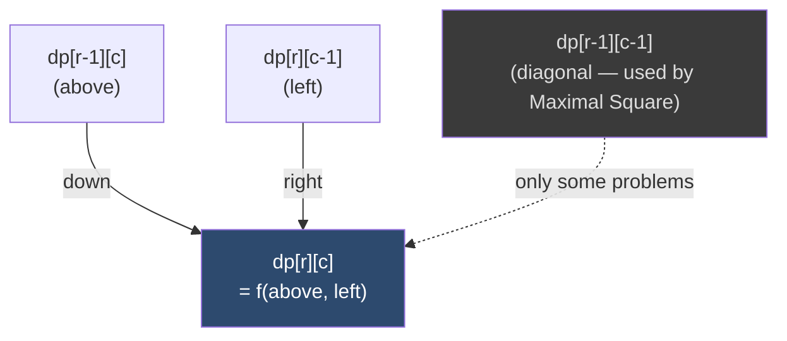

# 🗺️ DP on Grids

> [!abstract] TL;DR
> Grid DP uses a cell `(r, c)` as the state and builds each cell from its **neighbours you already computed** — almost always the cell **above** and the cell to the **left**. Master the template once and you unlock counting paths (Unique Paths), optimising paths (Min Path Sum), local-shape problems (Maximal Square), memoised [[DFS]] on a grid (Longest Increasing Path), and the mind-bending **reverse fill** (Dungeon Game, computed backward from the goal). Rolling-row space optimisation drops memory from O(mn) to O(n).

---

## Intuition — Analogy First

Imagine you are a delivery courier standing on a city grid of one-way streets: you may only move **right** or **down**. You want to know how many distinct routes reach the bottom-right depot, or the cheapest route by toll cost.

To reach any intersection, you must have arrived **either from the block above** or **the block to your left** — those are the only two legal predecessors. So the answer at an intersection is built *entirely* from its top and left neighbours. If you fill the grid **top-to-bottom, left-to-right**, both predecessors are already solved by the time you reach any cell. That "fill in reading order, look up and left" motion is the heartbeat of grid DP.

The twist in **Dungeon Game** is that you cannot decide how much health you need at a cell until you know how bad the *future* is. So you flip the courier around: start at the destination and fill **backward**, looking **down and right** instead. Same template, mirrored.

---

## How It Works

A grid DP has four moving parts:

1. **State** — one entry per cell: `dp[r][c]`.
2. **Transition** — combine already-solved neighbours. Forward problems read `dp[r-1][c]` (above) and `dp[r][c-1]` (left). Reverse problems read `dp[r+1][c]` (below) and `dp[r][c+1]` (right).
3. **Base case** — the first row / first column (or the goal cell for reverse DP).
4. **Order** — forward = top-left → bottom-right; reverse = bottom-right → top-left.

### Mermaid — Forward Transition (read from top and left)



### The Six Canonical Variants

| Problem | Transition | Direction |
|---|---|---|
| Unique Paths (62) | `dp = up + left` (count) | forward |
| Unique Paths w/ Obstacles (63) | same, but obstacle cell = 0 | forward |
| Minimum Path Sum (64) | `dp = grid + min(up, left)` | forward |
| Maximal Square (221) | `dp = min(up, left, diag) + 1` | forward |
| Longest Increasing Path (329) | DFS + memo, 4 directions | none (memoised recursion) |
| Dungeon Game (174) | `dp = max(1, min(down, right) - grid)` | **reverse** |

---

## State Definition & Transition

**Unique Paths (LC 62)** — count-of-ways
- **State:** `dp[r][c]` = number of paths from `(0,0)` to `(r,c)`.
- **Transition:** `dp[r][c] = dp[r-1][c] + dp[r][c-1]`.
- **Base case:** `dp[0][*] = dp[*][0] = 1` (only one straight-line path along an edge).
- **Order:** top-left → bottom-right.
- **Answer:** `dp[m-1][n-1]`.
- **Closed form:** every path is a sequence of exactly `(m-1)` downs and `(n-1)` rights, so the count is the number of ways to choose which of the `m+n-2` moves are downs: **`C(m+n-2, m-1)`**.

**Minimum Path Sum (LC 64)**
- **State:** `dp[r][c]` = min cost to reach `(r,c)`.
- **Transition:** `dp[r][c] = grid[r][c] + min(dp[r-1][c], dp[r][c-1])`.
- **Answer:** `dp[m-1][n-1]`.

**Maximal Square (LC 221)**
- **State:** `dp[r][c]` = side length of the largest all-`1` square whose **bottom-right corner** is `(r,c)`.
- **Transition:** if `matrix[r][c] == '1'`: `dp[r][c] = min(dp[r-1][c], dp[r][c-1], dp[r-1][c-1]) + 1`, else `0`. The `min` of three neighbours is the bottleneck — a square can only grow as large as its weakest supporting corner.
- **Answer:** `max(dp)² ` (area).

**Dungeon Game (LC 174)** — reverse DP
- **State:** `dp[r][c]` = minimum health needed **when entering** `(r,c)` to survive to the princess.
- **Transition:** `need = min(dp[r+1][c], dp[r][c+1]) - dungeon[r][c]; dp[r][c] = max(1, need)` (health must never drop below 1).
- **Base:** fill from the goal cell backward.
- **Answer:** `dp[0][0]`.

---

## Python Implementation

```python
from math import comb, inf
from functools import lru_cache


# ─── 1. Unique Paths (LC 62) — tabulation + closed form ──────────────────────
def unique_paths(m: int, n: int) -> int:
    """Count paths from top-left to bottom-right moving only right/down."""
    dp = [[1] * n for _ in range(m)]      # first row & col are all 1
    for r in range(1, m):
        for c in range(1, n):
            dp[r][c] = dp[r - 1][c] + dp[r][c - 1]
    return dp[m - 1][n - 1]


def unique_paths_closed_form(m: int, n: int) -> int:
    """C(m+n-2, m-1): choose which moves are 'down' out of all moves."""
    return comb(m + n - 2, m - 1)


# ─── 2. Unique Paths with Obstacles (LC 63) ──────────────────────────────────
def unique_paths_obstacles(grid: list[list[int]]) -> int:
    """grid[r][c] == 1 means an obstacle (unreachable, contributes 0 paths)."""
    if not grid or grid[0][0] == 1:
        return 0
    m, n = len(grid), len(grid[0])
    dp = [[0] * n for _ in range(m)]
    dp[0][0] = 1
    for r in range(m):
        for c in range(n):
            if grid[r][c] == 1:
                dp[r][c] = 0                    # blocked cell = 0 paths
                continue
            if r > 0:
                dp[r][c] += dp[r - 1][c]
            if c > 0:
                dp[r][c] += dp[r][c - 1]
    return dp[m - 1][n - 1]


# ─── 3. Minimum Path Sum (LC 64) — ROLLING ROW, O(n) space ───────────────────
def min_path_sum(grid: list[list[int]]) -> int:
    """
    Cheapest top-left → bottom-right cost.
    Space optimisation: we only ever need the previous row, so keep one row.
    dp[c] holds "current row so far"; before overwriting it still holds "row above".
    """
    m, n = len(grid), len(grid[0])
    dp = [inf] * n
    dp[0] = 0                                   # sentinel so first cell = grid[0][0]
    for r in range(m):
        for c in range(n):
            if c == 0:
                dp[c] = dp[c] + grid[r][c]      # only 'above' available
            else:
                # dp[c] currently = above, dp[c-1] = left (already updated this row)
                dp[c] = grid[r][c] + min(dp[c], dp[c - 1])
    return dp[n - 1]


# ─── 4. Maximal Square (LC 221) ──────────────────────────────────────────────
def maximal_square(matrix: list[list[str]]) -> int:
    """Largest all-'1' square area. dp = min(up, left, diag) + 1."""
    if not matrix:
        return 0
    m, n = len(matrix), len(matrix[0])
    dp = [[0] * (n + 1) for _ in range(m + 1)]  # padded row/col of zeros
    best = 0
    for r in range(1, m + 1):
        for c in range(1, n + 1):
            if matrix[r - 1][c - 1] == '1':
                dp[r][c] = min(dp[r - 1][c], dp[r][c - 1], dp[r - 1][c - 1]) + 1
                best = max(best, dp[r][c])
    return best * best                          # side → area


# ─── 5. Longest Increasing Path in a Matrix (LC 329) — DFS + memo ────────────
def longest_increasing_path(matrix: list[list[int]]) -> int:
    """
    Longest strictly-increasing path; can start anywhere, move in 4 directions.
    No fixed fill order (dependencies form a DAG), so memoised DFS is natural.
    """
    if not matrix:
        return 0
    m, n = len(matrix), len(matrix[0])

    @lru_cache(maxsize=None)
    def dfs(r: int, c: int) -> int:
        best = 1                                # the cell itself
        for dr, dc in ((1, 0), (-1, 0), (0, 1), (0, -1)):
            nr, nc = r + dr, c + dc
            if 0 <= nr < m and 0 <= nc < n and matrix[nr][nc] > matrix[r][c]:
                best = max(best, 1 + dfs(nr, nc))
        return best

    return max(dfs(r, c) for r in range(m) for c in range(n))


# ─── 6. Dungeon Game (LC 174) — REVERSE DP (fill from goal backward) ─────────
def calculate_minimum_hp(dungeon: list[list[int]]) -> int:
    """
    Min starting health so HP stays >= 1 the whole way to the bottom-right.
    Must fill backward: health need at a cell depends on the FUTURE, not the past.
    """
    m, n = len(dungeon), len(dungeon[0])
    # dp[r][c] = min HP needed on ENTERING (r,c). Pad with inf; goal exits need 1.
    dp = [[inf] * (n + 1) for _ in range(m + 1)]
    dp[m][n - 1] = dp[m - 1][n] = 1             # neighbours "past" the princess
    for r in range(m - 1, -1, -1):
        for c in range(n - 1, -1, -1):
            need = min(dp[r + 1][c], dp[r][c + 1]) - dungeon[r][c]
            dp[r][c] = max(1, need)             # never let HP fall below 1
    return dp[0][0]


# ─── Quick test ──────────────────────────────────────────────────────────────
if __name__ == "__main__":
    print(unique_paths(3, 7))                   # 28
    print(unique_paths_closed_form(3, 7))       # 28
    print(unique_paths_obstacles([[0, 0, 0],
                                  [0, 1, 0],
                                  [0, 0, 0]]))  # 2
    print(min_path_sum([[1, 3, 1],
                        [1, 5, 1],
                        [4, 2, 1]]))            # 7
    print(maximal_square([["1", "0", "1", "0", "0"],
                          ["1", "0", "1", "1", "1"],
                          ["1", "1", "1", "1", "1"],
                          ["1", "0", "0", "1", "0"]]))  # 4
    print(longest_increasing_path([[9, 9, 4],
                                   [6, 6, 8],
                                   [2, 1, 1]]))  # 4  (1→2→6→9)
    print(calculate_minimum_hp([[-2, -3, 3],
                                [-5, -10, 1],
                                [10, 30, -5]]))  # 7
```

---

## Dry Run / Trace

### Minimum Path Sum on the 3×3 grid `[[1,3,1],[1,5,1],[4,2,1]]`

Full `dp` table (each cell = grid value + cheaper of up/left):

```
grid            dp (min cost to reach)
1  3  1          1   4   5
1  5  1   -->    2   7   6
4  2  1          6   8   7   ← answer = 7
```

- `dp[0]` row: `1, 1+3=4, 4+1=5` (first row can only come from the left).
- `dp[1][0] = 1+1 = 2` (first column, only from above).
- `dp[1][1] = 5 + min(4, 2) = 7`.
- `dp[2][1] = 2 + min(7, 6) = 8`; `dp[2][2] = 1 + min(6, 8) = 7`. **Path `1→1→4→2→1`? No** — the true min path is `1→3→1→1→1` = 7 down the shape `right,right,down,down`. Answer **7**.

### Dungeon Game — why reverse

For `[[-2,-3,3],[-5,-10,1],[10,30,-5]]`, entering the princess cell `(2,2)=-5` you need `max(1, 1-(-5)) = 6` HP. Propagating backward, `dp[0][0] = 7`: you must start with 7 HP so that after the `-2` you have 5, and can survive the cheapest downstream route. A forward scan cannot know this because the required buffer is dictated by future damage.

---

## Patterns & LeetCode Applications

| Problem | Trick to remember |
|---|---|
| **Unique Paths** (LC 62) | count = up + left; closed form `C(m+n-2, m-1)` |
| **Unique Paths II** (LC 63) | obstacle cell contributes 0; seed `dp[0][0]` carefully |
| **Minimum Path Sum** (LC 64) | grid + min(up, left); rolling row → O(n) space |
| **Maximal Square** (LC 221) | `min(up, left, diag) + 1`; answer is side² |
| **Longest Increasing Path** (LC 329) | DFS + `lru_cache`, no fixed order (DAG) |
| **Dungeon Game** (LC 174) | reverse DP from goal; `max(1, min(down,right) - cost)` |
| Minimum Falling Path Sum (LC 931) | min of three cells in the row above |
| Cherry Pickup (LC 741) | two agents → 3-D/4-D grid state |
| Triangle (LC 120) | bottom-up rolling array on a triangular grid |

**When to reach for grid DP:** the input is a 2-D matrix, moves are restricted to a few directions, and you want a count / min / max over all paths or all sub-shapes.

---

## Common Pitfalls

1. **Wrong base-case seeding.** In Unique Paths *with obstacles*, the whole first row/column is 1 only until you hit an obstacle — after a blocked cell the rest of that edge becomes 0. Do not blanket-initialise edges to 1.

2. **Rolling-row confusion between "above" and "left".** When you reuse one row, `dp[c]` holds the *above* value **until** you overwrite it, and `dp[c-1]` (already overwritten this pass) holds the *left* value. Read them in that exact order; overwrite too early and you corrupt "above".

3. **Trying to fill Dungeon Game forward.** The required health at a cell depends on future damage, not past — you must iterate backward from the goal. Forward DP gives wrong answers on many cases.

4. **Forgetting the `max(1, …)` floor in Dungeon Game.** HP must stay ≥ 1 at every step; a cell with a big positive value can drop the *need* to 0 or negative, which you must clamp to 1.

5. **Maximal Square: reporting side length instead of area.** The DP stores the side; the answer LeetCode wants is `side * side`.

6. **Longest Increasing Path without memo.** Plain DFS is exponential; `lru_cache` (or an explicit memo grid) makes it O(mn) since each cell's best path length is fixed.

---

## Related Concepts

- [[_MOC_Dynamic_Programming|↑ Section MOC]]
- [[DP_Fundamentals]] — optimal substructure & overlapping subproblems that grid DP exploits
- [[Memoization_vs_Tabulation]] — grids show both styles: tabulation (Unique Paths) and memoised DFS (LIP)
- [[Edit_Distance]] — another 2-D table DP with an above/left/diagonal transition
- [[DP_Patterns]] — grid DP is one entry in the pattern taxonomy
- [[Combinatorics]] — the `C(m+n-2, m-1)` closed form for Unique Paths
- [[Recursion_Fundamentals]] — memoised DFS on the grid for Longest Increasing Path

---

## Review Questions

1. **Why can Unique Paths be solved with a closed-form binomial coefficient, but Minimum Path Sum cannot?** What structural property of the "count" objective enables `C(m+n-2, m-1)`?

2. **Explain the rolling-row optimisation for Minimum Path Sum.** At the moment you compute `dp[c]`, which value does `dp[c]` still hold and which does `dp[c-1]` hold?

3. **Dungeon Game is filled backward from the goal.** Describe a concrete 2×2 dungeon where a greedy forward "keep the most HP" choice would pick the wrong path, and explain why reverse DP fixes it.

---

## Sources

- [LeetCode 62 — Unique Paths](https://leetcode.com/problems/unique-paths/)
- [LeetCode 63 — Unique Paths II](https://leetcode.com/problems/unique-paths-ii/)
- [LeetCode 64 — Minimum Path Sum](https://leetcode.com/problems/minimum-path-sum/)
- [LeetCode 221 — Maximal Square](https://leetcode.com/problems/maximal-square/)
- [LeetCode 329 — Longest Increasing Path in a Matrix](https://leetcode.com/problems/longest-increasing-path-in-a-matrix/)
- [LeetCode 174 — Dungeon Game](https://leetcode.com/problems/dungeon-game/)

#dsa #dynamic-programming #grids #matrix-dp #path-counting #intermediate
