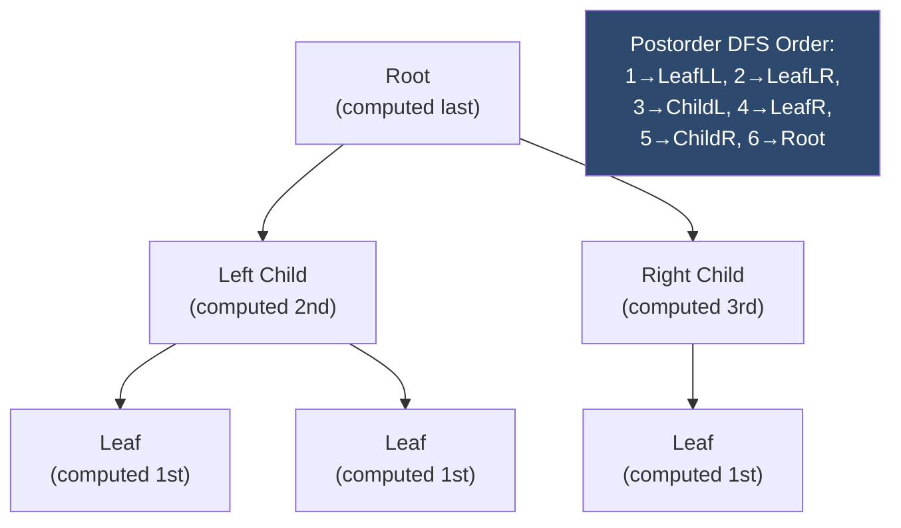

---
title: DP on Trees
aliases: [Tree DP, Rerooting DP, DP on Binary Tree]
tags: [DSA, dynamic-programming, trees, tree-dp, rerooting]
domain: DSA
difficulty: Advanced
created: 2026-07-26
related: [DP_Fundamentals, Binary_Tree_Fundamentals, Tree_Traversals, DP_Patterns]
status: complete
---

# 🌳 DP on Trees

> [!abstract] TL;DR
> DP on trees computes states **bottom-up (postorder)**: children solve their subproblems first, then the parent combines results. For problems where you need the answer **for every node as root**, use **rerooting** (two DFS passes). Key patterns: tree diameter, max path sum, house robber III, binary tree cameras.

---

## Intuition — Analogy First

Imagine **bottom-up project planning** at a company. A project manager (root) cannot estimate the total timeline until all team leads (children) report their subtask estimates. Each team lead waits for their individual contributors (leaves) to report first. The estimates bubble up: leaves → mid-managers → executives → CEO.

This is exactly postorder DFS: you compute the answer at a node **only after** recursing into all its children. The state at each node summarizes everything about its subtree.

For **rerooting**: imagine you want to know the total project cost *if any employee were the CEO*. One DFS gives you the "upward costs from each subtree." A second DFS propagates "the cost from above" down to each node.

---

## How It Works

### Pattern 1 — Single Root DFS (Postorder)

```
dp[v] = f(dp[child1], dp[child2], ..., own value of v)
```

1. DFS into all children first
2. Combine children's results to compute dp[v]
3. Return dp[v] to parent

### Pattern 2 — Multiple States per Node

Some problems require tracking **multiple choices** at each node:
- `rob[v]` = max value if we ROB v (can't rob children)
- `skip[v]` = max value if we SKIP v (can rob or skip children)

### Pattern 3 — Rerooting (Two DFS Passes)

When the answer depends on the **entire tree** relative to each node as root:
1. **DFS 1 (postorder):** compute `dp_down[v]` = answer restricted to v's subtree
2. **DFS 2 (preorder):** compute `dp_up[v]` = contribution from the "rest of the tree" (parent + siblings)
3. Answer for each node = combine `dp_down[v]` and `dp_up[v]`

### Mermaid — Postorder DP Computation Flow



---

## Complexity Analysis

| Problem | Time | Space |
|---|---|---|
| Diameter of Binary Tree | O(n) | O(h) stack |
| Max Path Sum | O(n) | O(h) stack |
| House Robber III | O(n) | O(h) stack |
| Binary Tree Cameras | O(n) | O(h) stack |
| Rerooting DP | O(n) | O(n) |

- `n` = number of nodes, `h` = tree height (O(log n) balanced, O(n) worst)
- All single-pass tree DPs run in O(n) — each node visited once

---

## Implementation (Python)

```python
from typing import Optional, Tuple
from math import inf


class TreeNode:
    def __init__(self, val=0, left=None, right=None):
        self.val = val
        self.left = left
        self.right = right


# ─── 1. Diameter of Binary Tree (LC 543) ─────────────────────────────────────
def diameter_of_binary_tree(root: Optional[TreeNode]) -> int:
    """
    Diameter = longest path between any two nodes (may not pass through root).
    dp[node] = max depth of node's subtree.
    At each node: diameter candidate = left_depth + right_depth.
    """
    max_diameter = [0]   # mutable container to update in closure

    def depth(node: Optional[TreeNode]) -> int:
        if not node:
            return 0
        left_d = depth(node.left)
        right_d = depth(node.right)
        # diameter passing through this node
        max_diameter[0] = max(max_diameter[0], left_d + right_d)
        return 1 + max(left_d, right_d)

    depth(root)
    return max_diameter[0]


# ─── 2. Binary Tree Maximum Path Sum (LC 124) ────────────────────────────────
def max_path_sum(root: Optional[TreeNode]) -> int:
    """
    Path can go through any node as the "peak" (bend point).
    dp[node] = max gain continuing UPWARD from this node (single path, no bend).
    At each node: candidate = node.val + left_gain + right_gain.
    """
    max_sum = [-inf]

    def max_gain(node: Optional[TreeNode]) -> int:
        if not node:
            return 0
        # Only take positive contributions from children
        left_gain = max(0, max_gain(node.left))
        right_gain = max(0, max_gain(node.right))
        # Best path with this node as the "peak"
        max_sum[0] = max(max_sum[0], node.val + left_gain + right_gain)
        # Return max single-direction gain to parent
        return node.val + max(left_gain, right_gain)

    max_gain(root)
    return max_sum[0]


# ─── 3. House Robber III (LC 337) ─────────────────────────────────────────────
def rob_tree(root: Optional[TreeNode]) -> int:
    """
    Rob/skip each node; can't rob adjacent nodes (parent & child).
    Returns (rob_val, skip_val) per node — O(n) with memoization via return values.
    """
    def dfs(node: Optional[TreeNode]) -> Tuple[int, int]:
        """Returns (max if we ROB node, max if we SKIP node)."""
        if not node:
            return (0, 0)

        left_rob, left_skip = dfs(node.left)
        right_rob, right_skip = dfs(node.right)

        # Rob this node: cannot rob children
        rob = node.val + left_skip + right_skip
        # Skip this node: children can be robbed or skipped (take best)
        skip = max(left_rob, left_skip) + max(right_rob, right_skip)

        return (rob, skip)

    rob, skip = dfs(root)
    return max(rob, skip)


# ─── 4. Binary Tree Cameras (LC 968) ─────────────────────────────────────────
def min_camera_cover(root: Optional[TreeNode]) -> int:
    """
    Place minimum cameras to cover all nodes.
    States per node:
      0 = node is NOT covered, no camera here
      1 = node has a camera
      2 = node is covered (by a child's camera), no camera here
    """
    cameras = [0]

    def dfs(node: Optional[TreeNode]) -> int:
        if not node:
            return 2   # null nodes are "covered" (don't need a camera)

        left = dfs(node.left)
        right = dfs(node.right)

        # Any child is uncovered → must place camera here
        if left == 0 or right == 0:
            cameras[0] += 1
            return 1   # this node has camera

        # Any child has a camera → this node is covered
        if left == 1 or right == 1:
            return 2   # covered, no camera needed here

        # Both children are covered but no child has camera → this node uncovered
        return 0

    # If root itself is uncovered, add a camera at root
    if dfs(root) == 0:
        cameras[0] += 1

    return cameras[0]


# ─── 5. Unique Binary Search Trees (LC 96) ────────────────────────────────────
def num_trees(n: int) -> int:
    """
    Count structurally unique BSTs with values 1..n.
    Catalan number: G(n) = sum over r=1..n of G(r-1) * G(n-r)
    dp[i] = number of unique BSTs with i nodes.
    """
    dp = [0] * (n + 1)
    dp[0] = 1   # empty tree
    dp[1] = 1   # single node

    for nodes in range(2, n + 1):
        for root in range(1, nodes + 1):
            left_count = root - 1        # nodes in left subtree
            right_count = nodes - root   # nodes in right subtree
            dp[nodes] += dp[left_count] * dp[right_count]

    return dp[n]


# ─── Quick test ──────────────────────────────────────────────────────────────
if __name__ == "__main__":
    # Build tree:     1
    #               /   \
    #              2     3
    #             / \
    #            4   5
    root = TreeNode(1,
                    TreeNode(2, TreeNode(4), TreeNode(5)),
                    TreeNode(3))

    print(diameter_of_binary_tree(root))   # 3 (path: 4-2-1-3 or 5-2-1-3)
    print(num_trees(3))                    # 5

    # Max path sum tree: -10 → 9 → 20 → {15, 7}
    t2 = TreeNode(-10,
                  TreeNode(9),
                  TreeNode(20, TreeNode(15), TreeNode(7)))
    print(max_path_sum(t2))                # 42 (15+20+7)
```

---

## Dry Run / Example Trace

### House Robber III

```
Tree:       3
           / \
          2   3
           \    \
            3    1
```

**DFS returns (rob, skip) at each node:**

- Node 3 (leaf, left-right child of 2): → `(3, 0)`
- Node 1 (leaf, right child of right-3): → `(1, 0)`
- Node 2 (has only right child with val 3):
  - `rob = 2 + skip(None) + skip(3) = 2 + 0 + 0 = 2`
  - `skip = max(0,0) + max(3,0) = 3`
  - Returns `(2, 3)`
- Node 3 (right child of root, has child 1):
  - `rob = 3 + 0 + 0 = 3`
  - `skip = 0 + max(1,0) = 1`
  - Returns `(3, 1)`
- Root 3:
  - `rob = 3 + skip(2) + skip(right-3) = 3 + 3 + 1 = 7`
  - `skip = max(2,3) + max(3,1) = 3 + 3 = 6`
  - Returns `(7, 6)`

Answer: `max(7, 6) = 7`

---

## Patterns & LeetCode Applications

| Problem | Pattern | State at each node |
|---|---|---|
| **Diameter of Binary Tree** (LC 543) | Single return, global max | max depth |
| **Binary Tree Maximum Path Sum** (LC 124) | Single return, global max | max one-sided gain |
| **House Robber III** (LC 337) | Two states (rob/skip) | (rob_val, skip_val) |
| **Binary Tree Cameras** (LC 968) | Three states (greedy DP) | 0=uncovered, 1=camera, 2=covered |
| **Unique BSTs** (LC 96) | 1D DP (Catalan) | count of trees |
| **Count Good Nodes in Tree** (LC 1448) | DFS with running max | count where val >= path_max |
| **Distribute Coins in BT** (LC 979) | Excess flow up | net excess per subtree |

### Rerooting Template
```python
# Pass 1: compute dp_down[v] for each subtree
def dfs1(node, parent):
    for child in adj[node]:
        if child != parent:
            dfs1(child, node)
            dp_down[node] = combine(dp_down[node], dp_down[child])

# Pass 2: propagate dp_up[v] from parent + siblings
def dfs2(node, parent):
    for child in adj[node]:
        if child != parent:
            # dp_up[child] = contribution from node's subtree excluding child
            dp_up[child] = compute_from(dp_up[node], dp_down[node], dp_down[child])
            dfs2(child, node)
```

---

## Common Pitfalls

1. **Returning partial result to parent when path can't bend** — in Max Path Sum, a path can only bend at one node. When returning to the parent, return `node.val + max(left_gain, right_gain)` (one direction only), not `node.val + left_gain + right_gain` (which is the local candidate, not returnable).

2. **Not handling null nodes** — always define a base case for `None`. For diameter, `depth(None) = 0`. For cameras, `dfs(None) = 2` (covered).

3. **Forgetting to check root's state in camera problem** — if the final `dfs(root)` returns 0 (uncovered), you must still add a camera there. The camera is not automatically added for the root.

4. **Stack overflow on skewed trees** — recursive tree DPs can hit Python's recursion limit (~1000) on skewed trees of 10^4+ nodes. Use iterative postorder with an explicit stack for safety.

5. **Rerooting: excluding one child's contribution** — when computing `dp_up[child]`, you need the parent's contribution *without* `child`'s subtree. If using a single aggregate, this requires either prefix/suffix aggregation or re-deriving without that child.

---

## Related Concepts

- [[_MOC_Dynamic_Programming|↑ Section MOC]]
- [[DP_Fundamentals]] — the general DP framework
- [[Binary_Tree_Fundamentals]] — tree node structure and traversal
- [[Tree_Traversals]] — postorder DFS is the backbone of tree DP
- [[DP_Patterns]] — categorized under "DP on Trees"
- [[Greedy_Fundamentals]] — binary tree cameras uses greedy reasoning inside DP

---

## Review Questions

1. **In Max Path Sum, why do you take `max(0, left_gain)` instead of just `left_gain`?** What would go wrong if a subtree's contribution is negative and you include it unconditionally?

2. **Describe the rerooting technique in your own words.** For the "sum of distances in tree" problem (LC 834), what does `dp_down[v]` store, and what does `dp_up[v]` represent?

3. **Why is the camera problem's state `0/1/2` (not just rob/skip)?** What does state 0 represent and why does a parent respond to it by placing a camera?

---

## Sources

- [LeetCode 543 — Diameter of Binary Tree](https://leetcode.com/problems/diameter-of-binary-tree/)
- [LeetCode 124 — Binary Tree Maximum Path Sum](https://leetcode.com/problems/binary-tree-maximum-path-sum/)
- [LeetCode 337 — House Robber III](https://leetcode.com/problems/house-robber-iii/)
- [LeetCode 968 — Binary Tree Cameras](https://leetcode.com/problems/binary-tree-cameras/)
- [LeetCode 834 — Sum of Distances in Tree](https://leetcode.com/problems/sum-of-distances-in-tree/)

#dsa #dynamic-programming #trees #tree-dp #rerooting #postorder #advanced
