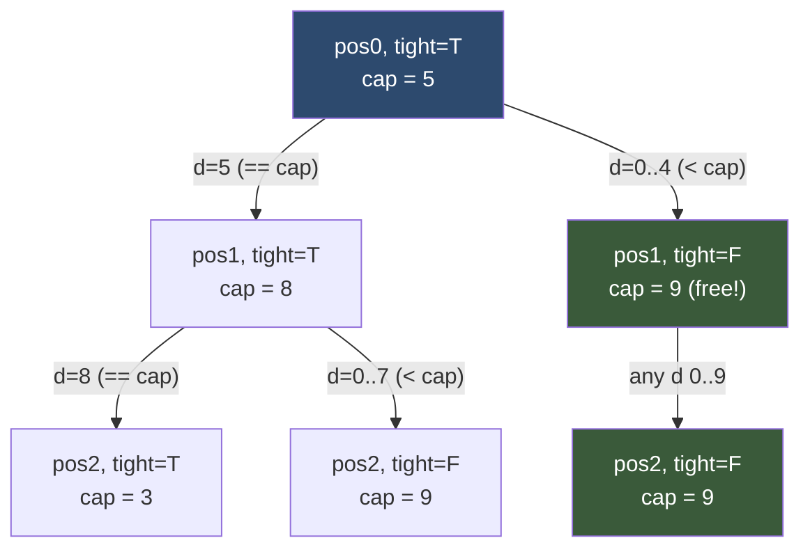

# 🔢 Digit DP

> [!abstract] TL;DR
> Digit DP counts how many integers in a range `[L, R]` satisfy some **property of their digits** (no two adjacent equal digits, digit sum divisible by k, contains no `4`, …) — without iterating one-by-one, which would be hopeless for `R` up to `10^18`. You build the number **digit by digit, left to right**, carrying a `tight` flag that says "so far my prefix equals the upper bound's prefix, so my next digit is capped". The range answer is `f(R) − f(L−1)` where `f(x)` counts valid numbers in `[0, x]`.

---

## Intuition — Analogy First

Imagine an **odometer you are dialing forward from all zeros**, and you may stop as soon as you have chosen every digit. You want to count how many of the reachable readings up to some ceiling `R = 5 8 3` have a certain property.

At the first wheel you can dial `0`, `1`, … up to `5` (the ceiling's first digit). Here's the key: if you dial exactly `5`, you are still "pressed against the ceiling" — the next wheel is now capped at `8`. But if you dial anything **less** than `5` (say `3`), you've dropped below the ceiling for good, and every remaining wheel is free to spin `0–9` because no matter what you pick, the whole number stays below `583`.

That single bit of memory — *am I still touching the ceiling?* — is the `tight` flag. Once you're "free" (`tight = False`), huge blocks of numbers share the same sub-count, and DP memoisation collapses them. You never enumerate the numbers; you enumerate *digit positions* (at most ~19 of them).

---

## How It Works

Process digits **most-significant first**. At each position you carry a small state:

- **`position`** — which digit slot you're filling (0-indexed from the left).
- **`tight`** — `True` if the prefix chosen so far exactly matches the upper bound's prefix. When `tight`, the current digit is capped at `bound[position]`; otherwise it may be `0–9`.
- **`started`** — `True` once a non-zero digit has appeared (used to correctly ignore *leading zeros*; needed when the property cares about digit adjacency or length).
- **property accumulator** — problem-specific: previous digit, running remainder mod k, count so far, etc.

### Mermaid — Digit Decision Tree with the Tight Boundary (bound = 583)



Green = "free" states: massively reused, which is where the DP speedup lives.

---

## State Definition & Transition

Generic template (property = "no two adjacent equal digits"):

- **State:** `dp[pos][prev][tight][started]` = count of valid completions of the number from `pos` onward.
- **Transition:** for each candidate digit `d` in `0 .. (bound[pos] if tight else 9)`:
  - skip if `started and d == prev` (would create adjacent equal digits),
  - recurse to `pos+1` with `prev' = d`, `tight' = tight and (d == bound[pos])`, `started' = started or (d > 0)`.
- **Base case:** `pos == len` → return `1` (a fully-formed valid number).
- **Order:** natural recursion depth = number length; memoise on `(pos, prev, started)` for the `tight = False` states (tight states are unique to one bound and needn't be cached, but caching them is harmless).
- **Answer for `[L, R]`:** `f(R) − f(L−1)`, where `f(x)` runs the DP on the digits of `x`.

The `f(R) − f(L−1)` trick works because "count valid numbers ≤ x" is a prefix-count; subtracting removes everything below `L`.

---

## Python Implementation

```python
from functools import lru_cache


# ─── Generic template: count integers in [0, N] with a digit property ────────
def count_no_adjacent_equal(N: int) -> int:
    """
    Count integers in [0, N] with NO two adjacent equal digits.
    State: (pos, prev_digit, tight, started).
    """
    if N < 0:
        return 0
    digits = list(map(int, str(N)))
    n = len(digits)

    @lru_cache(maxsize=None)
    def dp(pos: int, prev: int, tight: bool, started: bool) -> int:
        if pos == n:
            return 1                                   # a complete valid number
        cap = digits[pos] if tight else 9
        total = 0
        for d in range(0, cap + 1):
            if started and d == prev:                  # adjacent equal → invalid
                continue
            total += dp(
                pos + 1,
                d,
                tight and (d == cap),                  # stay tight only if we hit the cap
                started or (d > 0),                    # leading zeros don't "start" the number
            )
        return total

    dp.cache_clear()
    return dp(0, -1, True, False)                      # prev = -1 sentinel (no digit yet)


def count_no_adjacent_equal_range(L: int, R: int) -> int:
    """[L, R] answer via prefix subtraction."""
    return count_no_adjacent_equal(R) - count_no_adjacent_equal(L - 1)


# ─── Variant: digit sum divisible by k, in [0, N] ────────────────────────────
def count_digit_sum_div_k(N: int, k: int) -> int:
    digits = list(map(int, str(N)))
    n = len(digits)

    @lru_cache(maxsize=None)
    def dp(pos: int, rem: int, tight: bool) -> int:
        if pos == n:
            return 1 if rem == 0 else 0
        cap = digits[pos] if tight else 9
        total = 0
        for d in range(0, cap + 1):
            total += dp(pos + 1, (rem + d) % k, tight and (d == cap))
        return total

    dp.cache_clear()
    return dp(0, 0, True)


# ─── LC 233: Number of Digit One — count total '1' digits in [1, N] ──────────
def count_digit_one(N: int) -> int:
    """
    Sum of the number of '1' digits across all integers in [0, N]
    (0 contributes none, so this equals the total over [1, N]).
    Accumulator = number of ones placed so far; base case returns it.
    """
    if N < 0:
        return 0
    digits = list(map(int, str(N)))
    n = len(digits)

    @lru_cache(maxsize=None)
    def dp(pos: int, ones: int, tight: bool) -> int:
        if pos == n:
            return ones                                # total ones in this number
        cap = digits[pos] if tight else 9
        total = 0
        for d in range(0, cap + 1):
            total += dp(pos + 1, ones + (d == 1), tight and (d == cap))
        return total

    dp.cache_clear()
    return dp(0, 0, True)


# ─── LC 600: integers in [0, N] with NO consecutive ones (binary) ────────────
def find_integers(N: int) -> int:
    bits = bin(N)[2:]                                  # binary string, MSB first
    L = len(bits)

    @lru_cache(maxsize=None)
    def dp(pos: int, prev_one: bool, tight: bool) -> int:
        if pos == L:
            return 1
        cap = int(bits[pos]) if tight else 1
        total = 0
        for b in range(0, cap + 1):
            if b == 1 and prev_one:                    # two adjacent 1s → invalid
                continue
            total += dp(pos + 1, b == 1, tight and (b == cap))
        return total

    dp.cache_clear()
    return dp(0, False, True)


# ─── Quick test ──────────────────────────────────────────────────────────────
if __name__ == "__main__":
    print(count_no_adjacent_equal(21))        # 21  (only 11 fails in 0..21)
    print(count_no_adjacent_equal_range(10, 21))  # 11
    print(count_digit_sum_div_k(20, 3))       # 7  (0,3,6,9,12,15,18)
    print(count_digit_one(13))                # 6  (1,10,11(x2),12,13)
    print(find_integers(5))                   # 5  (0,1,2,4,5)
```

---

## Dry Run / Trace

### `find_integers(5)` — no consecutive ones, `bits = "101"`, `L = 3`

Start `dp(0, prev_one=False, tight=True)`, cap = `1`:

- **b = 0** → `dp(1, prev_one=False, tight=False)`  (dropped below bound)
  - cap = 1 (free). b=0 → `dp(2,F,F)`; b=1 → `dp(2,T,F)`
    - `dp(2,F,F)`: cap 1 → b=0→1, b=1→1 ⇒ **2**
    - `dp(2,T,F)`: cap 1 → b=0→1, b=1 skipped (prev one) ⇒ **1**
  - total = 2 + 1 = **3**
- **b = 1** → `dp(1, prev_one=True, tight=True)`, `bits[1]='0'`, cap = 0
  - only b=0 → `dp(2, prev_one=False, tight=True)`, `bits[2]='1'`, cap 1 → b=0→1, b=1→1 ⇒ **2**
  - total = **2**

Answer = 3 + 2 = **5** → numbers `0,1,2,4,5` (binary `0,1,10,100,101`). `3 = 11` is correctly excluded.

The two green "free" subtrees (`tight=False`) are exactly the states memoisation would share across a larger bound.

---

## Patterns & LeetCode Applications

| Problem | Property counted | Accumulator state |
|---|---|---|
| **Number of Digit One** (LC 233) | total count of digit `1` in `[1,N]` | ones-so-far |
| **Numbers At Most N Given Digit Set** (LC 902) | uses only an allowed digit set | started flag + allowed set |
| **Numbers With Repeated Digits** (LC 1012) | has ≥1 repeated digit (count complement, then subtract) | bitmask of used digits |
| **Non-negative Integers w/o Consecutive Ones** (LC 600) | binary rep has no `11` | previous bit |
| Count Numbers with Unique Digits (LC 357) | all digits distinct | bitmask of used digits |
| Count Stepping Numbers (various) | adjacent digits differ by 1 | previous digit |
| Rotated Digits (LC 788) | valid after 180° rotation | flag: contains a "good" digit |

**Recognition signal:** "how many numbers in `[L, R]` such that *(some condition on their digits)*", with `R` far too large (10^9–10^18) to loop over.

---

## Common Pitfalls

1. **Mishandling leading zeros.** For length- or adjacency-sensitive properties (distinct digits, stepping numbers, "no leading zero"), you *must* carry a `started` flag so that the zeros padding the front of a short number don't count as real digits.

2. **Forgetting `f(L−1)` instead of `f(L)`.** The range formula is `f(R) − f(L−1)`; using `f(L)` drops `L` itself from the count. Also handle `L = 0` so `L−1 = −1` returns 0.

3. **Caching across different bounds.** The `tight = True` states depend on the specific number's digits. If you reuse one memo table across two calls (different `N`), **clear the cache between calls** — the code above calls `dp.cache_clear()` before each run.

4. **Capping the digit wrong.** The upper digit is `bound[pos]` only when `tight`; otherwise it's `9` (or `1` in binary). Swapping these under-counts or over-counts.

5. **Updating `tight` incorrectly.** `tight` stays `True` for the child **only** when you place exactly the cap digit: `tight and (d == cap)`. Placing anything smaller must set it `False` permanently.

6. **Putting a large accumulator into the memo key.** Running remainders (`mod k`) or previous-digit are fine (tiny). But an unbounded accumulator (like the actual number) destroys memoisation — reformulate so the state stays small.

---

## Related Concepts

- [[_MOC_Dynamic_Programming|↑ Section MOC]]
- [[DP_Fundamentals]] — overlapping subproblems, here indexed by `(pos, tight, accumulator)`
- [[Memoization_vs_Tabulation]] — digit DP is almost always written top-down with `lru_cache`
- [[DP_Patterns]] — digit DP is a named family in the taxonomy
- [[Combinatorics]] — the free (`tight=False`) subtrees have closed-form counts you can cross-check
- [[Bit_Manipulation]] — variants keep a bitmask of used digits (unique-digit problems)

---

## Review Questions

1. **What does the `tight` flag encode, and why does turning it off unlock the DP speedup?** Describe what all the `tight = False` states at a given position have in common.

2. **Why is the range answer `f(R) − f(L−1)` rather than `f(R) − f(L)`?** What role does the `started` flag play when `L` has fewer digits than `R`?

3. **You need to count numbers in `[L, R]` whose digit sum is divisible by 7.** Give the full state tuple and the transition, and explain why the remainder (not the raw digit sum) belongs in the state.

---

## Sources

- [LeetCode 233 — Number of Digit One](https://leetcode.com/problems/number-of-digit-one/)
- [LeetCode 902 — Numbers At Most N Given Digit Set](https://leetcode.com/problems/numbers-at-most-n-given-digit-set/)
- [LeetCode 1012 — Numbers With Repeated Digits](https://leetcode.com/problems/numbers-with-repeated-digits/)
- [LeetCode 600 — Non-negative Integers without Consecutive Ones](https://leetcode.com/problems/non-negative-integers-without-consecutive-ones/)
- [Codeforces / CP-Algorithms — Digit DP tutorials](https://codeforces.com/blog/entry/53960)

#dsa #dynamic-programming #digit-dp #counting #number-theory #advanced
