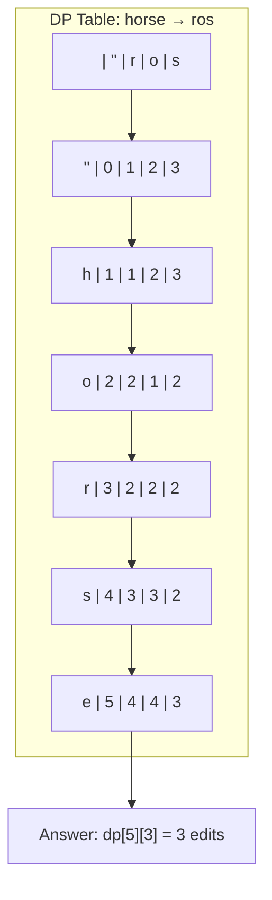

---
title: Edit Distance (Levenshtein Distance)
aliases: [Levenshtein Distance, String Edit Distance]
tags: [DSA, dynamic-programming, strings, dp-on-strings]
domain: DSA
difficulty: Intermediate
created: 2026-07-26
related: [LCS_and_LIS, DP_Fundamentals, DP_Patterns]
status: complete
---

# ✏️ Edit Distance (Levenshtein Distance)

> [!abstract] TL;DR
> Find the **minimum number of single-character edits** (insertions, deletions, replacements) needed to transform string `s1` into string `s2`. Classic 2D DP on strings — `dp[i][j]` = min edits to turn `s1[0..i-1]` into `s2[0..j-1]`. Can be space-optimized to O(min(m,n)).

---

## Intuition — Analogy First

Imagine you're a spell-checker correcting the typo `"horse"` to the intended word `"ros"`. Each key you press costs one action:
- **Insert** a character you forgot
- **Delete** a character you typed by mistake
- **Replace** a character you hit wrong

You want to fix the word with the **fewest total keystrokes**. The edit distance tells you that minimum cost.

The key insight: at every position `(i, j)`, the characters either **match** (no cost, inherit the diagonal) or **don't match** (pay 1 and take the cheapest of three sub-problems: delete from s1, insert into s1, or replace).

---

## How It Works

### DP Definition
- `dp[i][j]` = minimum edits to transform `s1[0..i-1]` into `s2[0..j-1]`
- **Base cases:**
  - `dp[0][j] = j` — transform empty string into `s2[0..j-1]` needs `j` insertions
  - `dp[i][0] = i` — transform `s1[0..i-1]` into empty string needs `i` deletions
- **Recurrence:**

```
If s1[i-1] == s2[j-1]:
    dp[i][j] = dp[i-1][j-1]          # characters match, no extra cost
Else:
    dp[i][j] = 1 + min(
        dp[i-1][j],    # delete from s1 (move up)
        dp[i][j-1],    # insert into s1 (move left)
        dp[i-1][j-1]   # replace (move diagonal)
    )
```

### What each transition means
| Transition | Operation | Meaning |
|---|---|---|
| `dp[i-1][j] + 1` | Delete | Remove `s1[i-1]`, now match `s1[0..i-2]` to `s2[0..j-1]` |
| `dp[i][j-1] + 1` | Insert | Insert `s2[j-1]` into s1, now match `s1[0..i-1]` to `s2[0..j-2]` |
| `dp[i-1][j-1] + 1` | Replace | Replace `s1[i-1]` with `s2[j-1]` |

### Mermaid — DP Table for "horse" → "ros"



> The answer `dp[5][3] = 3` means 3 edits: delete 'h', delete 'r', replace 'e'→'s' (or equivalently: replace 'h'→'r', delete 'r', delete 'e').

---

## Complexity Analysis

| Approach | Time | Space |
|---|---|---|
| 2D DP (standard) | O(m × n) | O(m × n) |
| Space-optimized (1 row) | O(m × n) | O(min(m, n)) |
| One-edit-distance check | O(m + n) | O(1) |

- `m = len(s1)`, `n = len(s2)`
- **Space optimization** is possible because each row only depends on the previous row and the current row's left neighbor.

---

## Implementation (Python)

```python
# ─── 1. Standard 2D DP ───────────────────────────────────────────────────────
def edit_distance(s1: str, s2: str) -> int:
    m, n = len(s1), len(s2)
    # dp[i][j] = min edits to convert s1[:i] to s2[:j]
    dp = [[0] * (n + 1) for _ in range(m + 1)]

    # Base cases
    for i in range(m + 1):
        dp[i][0] = i          # delete all of s1[:i]
    for j in range(n + 1):
        dp[0][j] = j          # insert all of s2[:j]

    # Fill table
    for i in range(1, m + 1):
        for j in range(1, n + 1):
            if s1[i - 1] == s2[j - 1]:
                dp[i][j] = dp[i - 1][j - 1]   # characters match
            else:
                dp[i][j] = 1 + min(
                    dp[i - 1][j],      # delete s1[i-1]
                    dp[i][j - 1],      # insert s2[j-1]
                    dp[i - 1][j - 1]   # replace s1[i-1] with s2[j-1]
                )
    return dp[m][n]


# ─── 2. Space-Optimized 1D DP ────────────────────────────────────────────────
def edit_distance_optimized(s1: str, s2: str) -> int:
    # Make s2 the shorter string to minimize space
    if len(s1) < len(s2):
        s1, s2 = s2, s1
    m, n = len(s1), len(s2)

    prev = list(range(n + 1))   # represents dp[i-1][*]

    for i in range(1, m + 1):
        curr = [i] + [0] * n   # curr[0] = i (delete all of s1[:i])
        for j in range(1, n + 1):
            if s1[i - 1] == s2[j - 1]:
                curr[j] = prev[j - 1]
            else:
                curr[j] = 1 + min(prev[j], curr[j - 1], prev[j - 1])
        prev = curr

    return prev[n]


# ─── 3. One Edit Distance Check (LeetCode 161) ───────────────────────────────
def is_one_edit_distance(s: str, t: str) -> bool:
    """Return True if s and t differ by exactly one edit."""
    m, n = len(s), len(t)
    if abs(m - n) > 1:
        return False
    if m > n:
        return is_one_edit_distance(t, s)   # ensure len(s) <= len(t)

    for i in range(m):
        if s[i] != t[i]:
            if m == n:
                return s[i + 1:] == t[i + 1:]   # replace
            else:
                return s[i:] == t[i + 1:]        # insert into s
    return m + 1 == n   # all matched, t has one extra char at end


# ─── Quick test ──────────────────────────────────────────────────────────────
if __name__ == "__main__":
    print(edit_distance("horse", "ros"))         # 3
    print(edit_distance_optimized("horse", "ros"))  # 3
    print(edit_distance("intention", "execution"))  # 5
    print(is_one_edit_distance("ab", "acb"))     # True (insert 'c')
    print(is_one_edit_distance("ab", "ab"))      # False (0 edits)
```

---

## Dry Run / Example Trace

**Input:** `s1 = "horse"`, `s2 = "ros"`

Build the DP table row by row:

```
     ""  r  o  s
""  [ 0, 1, 2, 3 ]
h   [ 1, 1, 2, 3 ]   ← 'h'≠'r': min(dp[0][1],dp[1][0],dp[0][0])+1 = min(1,1,0)+1=1
o   [ 2, 2, 1, 2 ]   ← 'o'='o': dp[1][1]=1 (diagonal)
r   [ 3, 2, 2, 2 ]   ← 'r'='r': dp[2][0]=2? No wait — dp[2][1]: 'r'='r' → dp[1][0]=1+1=2? 
                       Actually 'r'='r' → dp[i-1][j-1]=dp[2][0]=2, min with others → 2
s   [ 4, 3, 3, 2 ]   ← 's'='s' at (4,3): dp[3][2]=2, no extra cost → 2
e   [ 5, 4, 4, 3 ]   ← final answer dp[5][3] = 3
```

**Three edits:** replace `h→r`, delete `r`, delete `e`  →  `horse → rorse → rose → ros`... actually: delete `r`, delete `e`, replace `h→nothing` — the DP finds the optimal automatically.

---

## Patterns & LeetCode Applications

| Problem | Key Insight |
|---|---|
| **Edit Distance** (LC 72) | Direct application of the recurrence |
| **One Edit Distance** (LC 161) | O(n) scan — find first diff, check suffix equality |
| **Delete Operation for Two Strings** (LC 583) | Only deletions: `m + n - 2 * LCS_length` |
| **Minimum ASCII Delete Sum** (LC 712) | Weighted deletion: replace cost with ASCII value |
| **Longest Common Subsequence** (LC 1143) | Edit distance with only insert/delete and match cost 0 |
| **Shortest Common Supersequence** (LC 1092) | Reconstruct: m + n - LCS, or edit distance path |

### Pattern Recognition
- Two strings, minimum-cost transformation → **2D string DP**
- Only deletions → reduce to **LCS** (`cost = m + n - 2*LCS`)
- Restricted edits (no replace) → modify transitions
- Need to reconstruct operations → **backtrack** the DP table from `dp[m][n]`

---

## Common Pitfalls

1. **Off-by-one errors** — `dp[i][j]` represents `s1[:i]` and `s2[:j]` (exclusive end), so `s1[i-1]` is the current character. Forgetting this causes index misalignment.

2. **Forgetting base cases** — `dp[0][j] = j` (insert j chars) and `dp[i][0] = i` (delete i chars) are essential. Leaving them at 0 corrupts the entire table.

3. **Wrong operation count when only deletes allowed** — if the problem restricts to only deletions (no inserts/replaces), the answer is NOT `dp[m][n]` of standard edit distance. Use `m + n - 2 * LCS(s1, s2)`.

4. **Space optimization overwriting prev values** — when using 1D optimization, the diagonal `dp[i-1][j-1]` is `prev[j-1]` which gets overwritten left-to-right. Save it before updating: `diag = prev[j-1]` before `prev[j] = ...`.

5. **Not making shorter string the column** — in space-optimized version, columns = `len(s2)`. Put shorter string as s2 to save memory.

---

## Related Concepts

- [[_MOC_Dynamic_Programming|↑ Section MOC]]
- [[LCS_and_LIS]] — LCS is edit distance with only insert/delete (no replace)
- [[DP_Fundamentals]] — 2D DP table building technique
- [[DP_Patterns]] — categorized under "DP on Strings"
- [[DP_on_Trees]] — different DP state formulation
- [[Coin_Change]] — another canonical 1D/2D DP problem

---

## Review Questions

1. **Why does `dp[i][j] = dp[i-1][j-1]` (no +1) when characters match?** Think about what the diagonal represents — if the last characters are the same, converting `s1[:i]` to `s2[:j]` costs the same as converting `s1[:i-1]` to `s2[:j-1]` since the matching chars need no edit.

2. **How would you reconstruct the actual sequence of edit operations** (not just the count) from the filled DP table? Describe the backtracking path from `dp[m][n]` to `dp[0][0]`.

3. **Prove that the space-optimized 1D approach is correct.** Which values from the previous row are needed to compute `dp[i][j]`, and how do you preserve the diagonal value before it gets overwritten?

---

## Sources

- [LeetCode 72 — Edit Distance](https://leetcode.com/problems/edit-distance/)
- [LeetCode 161 — One Edit Distance](https://leetcode.com/problems/one-edit-distance/)
- [LeetCode 583 — Delete Operation for Two Strings](https://leetcode.com/problems/delete-operation-for-two-strings/)
- Levenshtein, V. I. (1966). *Binary codes capable of correcting deletions, insertions, and reversals.*
- CLRS Chapter 15.3 — Elements of dynamic programming

#dsa #dynamic-programming #strings #edit-distance #levenshtein #dp-on-strings #intermediate
