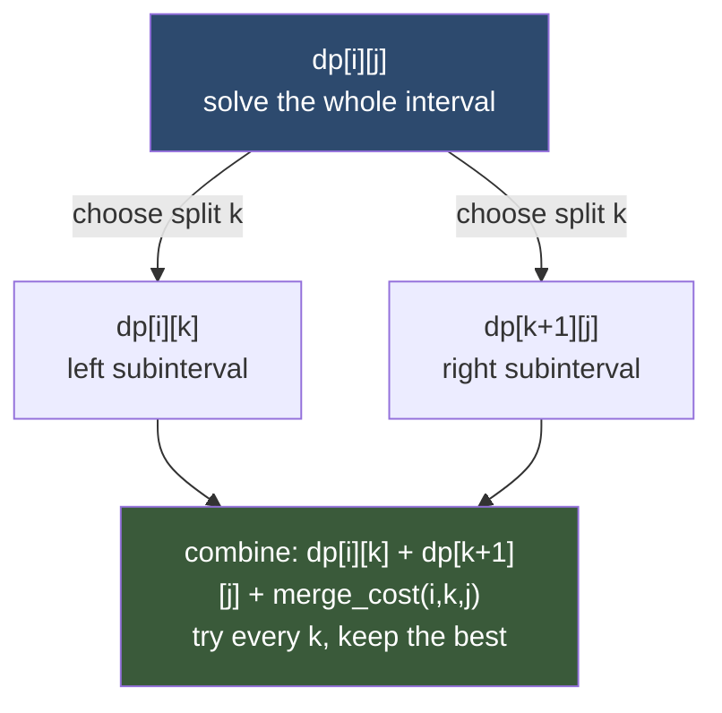

# 📐 Interval DP

> [!abstract] TL;DR
> Interval DP solves a range `[i, j]` by **splitting it at some point `k`** and combining the answers for the two smaller ranges — `dp[i][j] = best over k of ( dp[i][k] + dp[k+1][j] + cost of merging )`. Because every subproblem is a contiguous interval, you iterate by **increasing interval length** so shorter intervals are ready first. Canonical members: Matrix Chain Multiplication `O(n³)`, Longest Palindromic Subsequence, Burst Balloons (the trick: reason about the **last** balloon to pop), Optimal BST, and stone-merging games.

---

## Intuition — Analogy First

Imagine you have a **long paper strip with `n` beads glued in a row**, and you must repeatedly **combine adjacent groups** — merging two neighbouring stone piles, parenthesising a chain of matrix multiplications, cutting a stick. Every operation you ever perform acts on a **contiguous run** of the original strip, never a scattered subset. That is the defining feature: the world of subproblems is exactly the set of contiguous intervals `[i, j]`.

To find the best plan for a whole interval, ask: *"where is the final split?"* Some point `k` divides `[i, j]` into the left piece `[i, k]` and the right piece `[k+1, j]`, each already optimally solved. Trying every split `k` and taking the best is the recurrence.

For **Burst Balloons** the analogy flips in a subtle, beautiful way: don't ask which balloon to pop *first* (its neighbours keep changing) — ask which balloon is popped **last** in the interval. That balloon's neighbours are fixed (the interval's boundaries), so the two sides become independent subintervals. Choosing the *last* action instead of the *first* is the signature move of hard interval DP.

---

## How It Works

- **State:** `dp[i][j]` = optimal value for the contiguous interval from `i` to `j`.
- **Transition:** iterate a split/pivot `k` inside `[i, j]`; combine `dp[i][k]` and `dp[k+1][j]` (or `dp[i][k-1]` and `dp[k+1][j]` for the "last element = k" formulation) plus a merge cost.
- **Base case:** length-1 (or length-0) intervals — often `0` or the element itself.
- **Order:** by **increasing length** `L = 1, 2, …, n`, and for each length slide `i` across, setting `j = i + L − 1`. This guarantees all shorter intervals are computed.
- **Answer:** `dp[0][n−1]` (the whole range).
- **Complexity:** `O(n²)` states × `O(n)` splits = **O(n³)** typical.

### Mermaid — Splitting Interval [i, j] at Pivot k



---

## State Definition & Transition

**Matrix Chain Multiplication (MCM)**
- Given dimensions `p[0..n]` where matrix `i` is `p[i-1] × p[i]`.
- **State:** `dp[i][j]` = min scalar multiplications to compute the product `A_i · … · A_j`.
- **Transition:** `dp[i][j] = min over k in [i, j-1] of ( dp[i][k] + dp[k+1][j] + p[i-1]*p[k]*p[j] )`. The last term is the cost of the final multiply of the two resulting matrices.
- **Base:** `dp[i][i] = 0` (a single matrix needs no multiply).
- **Answer:** `dp[1][n]`. **Complexity:** O(n³).

**Longest Palindromic Subsequence (LC 516)**
- **State:** `dp[i][j]` = length of the LPS within `s[i..j]`.
- **Transition:** if `s[i] == s[j]`: `dp[i][j] = 2 + dp[i+1][j-1]`; else `dp[i][j] = max(dp[i+1][j], dp[i][j-1])`.
- **Base:** `dp[i][i] = 1`. **Answer:** `dp[0][n-1]`.

**Burst Balloons (LC 312)** — "last to burst"
- Pad the array with `1` at both ends. **State:** `dp[i][j]` = max coins bursting all balloons strictly **between** `i` and `j` (open interval).
- **Transition:** pick the **last** balloon `k` to burst in `(i, j)`: `dp[i][j] = max over k of ( dp[i][k] + nums[i]*nums[k]*nums[j] + dp[k][j] )`. Since `k` bursts last, its neighbours are the fixed boundaries `i` and `j`.
- **Answer:** `dp[0][n+1]` on the padded array.

---

## Python Implementation

```python
from math import inf


# ─── 1. Matrix Chain Multiplication — O(n^3) ─────────────────────────────────
def matrix_chain_order(p: list[int]) -> int:
    """
    p has length n+1; matrix i (1-indexed) is p[i-1] x p[i].
    dp[i][j] = min multiplications to compute product A_i .. A_j.
    """
    n = len(p) - 1                                  # number of matrices
    dp = [[0] * (n + 1) for _ in range(n + 1)]      # dp[i][i] = 0 already

    for length in range(2, n + 1):                  # interval length (# matrices)
        for i in range(1, n - length + 2):
            j = i + length - 1
            dp[i][j] = inf
            for k in range(i, j):                   # split between k and k+1
                cost = dp[i][k] + dp[k + 1][j] + p[i - 1] * p[k] * p[j]
                dp[i][j] = min(dp[i][j], cost)
    return dp[1][n]


# ─── 2. Longest Palindromic Subsequence (LC 516) ─────────────────────────────
def longest_palindromic_subsequence(s: str) -> int:
    n = len(s)
    dp = [[0] * n for _ in range(n)]
    for i in range(n):
        dp[i][i] = 1                                # single char is a palindrome
    for length in range(2, n + 1):
        for i in range(n - length + 1):
            j = i + length - 1
            if s[i] == s[j]:
                dp[i][j] = 2 + (dp[i + 1][j - 1] if length > 2 else 0)
            else:
                dp[i][j] = max(dp[i + 1][j], dp[i][j - 1])
    return dp[0][n - 1]


# ─── 3. Burst Balloons (LC 312) — think LAST balloon to burst ────────────────
def max_coins(nums: list[int]) -> int:
    """
    dp[i][j] = max coins from bursting all balloons strictly between i and j.
    Pad both ends with 1. k = the LAST balloon burst in (i, j), so its
    neighbours are the fixed boundaries i and j.
    """
    balloons = [1] + nums + [1]
    n = len(balloons)
    dp = [[0] * n for _ in range(n)]

    for length in range(2, n):                      # gap between i and j
        for i in range(0, n - length):
            j = i + length
            for k in range(i + 1, j):               # k burst last
                coins = balloons[i] * balloons[k] * balloons[j]
                dp[i][j] = max(dp[i][j], dp[i][k] + coins + dp[k][j])
    return dp[0][n - 1]


# ─── 4. Optimal BST — min expected search cost ───────────────────────────────
def optimal_bst(freq: list[int]) -> int:
    """
    keys sorted; freq[i] = access frequency of key i.
    dp[i][j] = min weighted cost of a BST built from keys i..j.
    Making key k the root adds (sum of freq in [i,j]) because every node's
    depth increases by 1 when placed under a new root.
    """
    n = len(freq)
    if n == 0:
        return 0
    dp = [[0] * n for _ in range(n)]
    prefix = [0] * (n + 1)
    for i in range(n):
        prefix[i + 1] = prefix[i] + freq[i]
        dp[i][i] = freq[i]

    for length in range(2, n + 1):
        for i in range(0, n - length + 1):
            j = i + length - 1
            window = prefix[j + 1] - prefix[i]      # sum of freqs in [i, j]
            dp[i][j] = inf
            for k in range(i, j + 1):               # k = root
                left = dp[i][k - 1] if k > i else 0
                right = dp[k + 1][j] if k < j else 0
                dp[i][j] = min(dp[i][j], left + right + window)
    return dp[0][n - 1]


# ─── 5. Minimum Score Triangulation of Polygon (LC 1039) ─────────────────────
def min_score_triangulation(values: list[int]) -> int:
    """dp[i][j] = min triangulation score of the polygon on vertices i..j."""
    n = len(values)
    dp = [[0] * n for _ in range(n)]
    for length in range(2, n):
        for i in range(0, n - length):
            j = i + length
            dp[i][j] = inf
            for k in range(i + 1, j):               # apex triangle (i, k, j)
                dp[i][j] = min(dp[i][j],
                               dp[i][k] + values[i] * values[k] * values[j] + dp[k][j])
    return dp[0][n - 1]


# ─── Quick test ──────────────────────────────────────────────────────────────
if __name__ == "__main__":
    print(matrix_chain_order([40, 20, 30, 10, 30]))   # 26000
    print(longest_palindromic_subsequence("bbbab"))   # 4  ("bbbb")
    print(max_coins([3, 1, 5, 8]))                    # 167
    print(optimal_bst([34, 8, 50]))                   # 142
    print(min_score_triangulation([1, 2, 3]))         # 6
```

---

## Dry Run / Trace

### Matrix Chain `p = [40, 20, 30, 10, 30]` → 4 matrices

`A1: 40×20, A2: 20×30, A3: 30×10, A4: 10×30`. Fill by increasing length.

**Length 2** (adjacent pairs):
- `dp[1][2] = 40*20*30 = 24000`
- `dp[2][3] = 20*30*10 = 6000`
- `dp[3][4] = 30*10*30 = 9000`

**Length 3:**
- `dp[1][3] = min( dp[1][1]+dp[2][3]+40*20*10=6000+8000=14000, dp[1][2]+dp[3][3]+40*30*10=24000+12000=36000 ) = 14000`
- `dp[2][4] = min( dp[2][2]+dp[3][4]+20*30*30=9000+18000=27000, dp[2][3]+dp[4][4]+20*10*30=6000+6000=12000 ) = 12000`

**Length 4 (answer):**
- `k=1: dp[1][1]+dp[2][4]+40*20*30 = 12000+24000 = 36000`
- `k=2: dp[1][2]+dp[3][4]+40*30*30 = 24000+9000+36000 = 69000`
- `k=3: dp[1][3]+dp[4][4]+40*10*30 = 14000+12000 = 26000` ✅
- `dp[1][4] = 26000` — parenthesise as `(A1 (A2 A3)) A4`.

The correct answer emerges only because length-2 and length-3 intervals were finalised **before** the length-4 computation touched them.

---

## Patterns & LeetCode Applications

| Problem | `dp[i][j]` meaning | Pivot choice |
|---|---|---|
| **Burst Balloons** (LC 312) | max coins in open interval `(i,j)` | `k` = **last** balloon burst |
| **Longest Palindromic Subsequence** (LC 516) | LPS length in `s[i..j]` | ends match or not |
| **Minimum Cost to Merge Stones** (LC 1000) | min cost to merge `[i,j]` into piles | split respecting `(len-1) % (K-1)` |
| **Min Score Triangulation** (LC 1039) | min triangulation of vertices `i..j` | `k` = apex vertex |
| **Guess Number Higher or Lower II** (LC 375) | min worst-case cost over `[i,j]` | `k` = number you guess |
| Matrix Chain Multiplication (classic) | min multiplies for `A_i..A_j` | split between `k`, `k+1` |
| Strange Printer (LC 664) | min turns to print `s[i..j]` | match `s[i]` with a later `s[k]` |
| Remove Boxes (LC 546) | needs a 3rd dimension (trailing equal count) | — |

**Recognition signal:** operations act on **contiguous ranges**, combining adjacent pieces; you want an optimum over all ways to parenthesise / split / order the merges.

---

## Common Pitfalls

1. **Wrong iteration order.** You *must* loop by increasing interval length (not by `i` then `j` in row order). Otherwise `dp[i][k]` or `dp[k+1][j]` may be unfilled when you read them.

2. **Burst Balloons: reasoning about the first pop.** If you pick the *first* balloon to burst, the two sides are **not** independent because bursting changes neighbours. Reformulate around the **last** balloon so the boundaries stay fixed.

3. **Boundary padding.** Burst Balloons and polygon/triangulation problems need sentinel `1`s (or use open intervals). Forgetting the padding corrupts the edge multiplications.

4. **Off-by-one in the split range.** For the "split between `k` and `k+1`" form use `k in [i, j-1]`; for the "`k` is the chosen element/apex" form use `k in (i, j)` with children `dp[i][k]` and `dp[k][j]`. Mixing the two conventions is the classic bug.

5. **Optimal BST: forgetting to add the window sum.** Every time you nest keys under a new root, all their depths increase by one, so you add the total frequency of the interval — not just the root's frequency.

6. **Assuming O(n³) is always necessary.** Some interval DPs (Optimal BST, MCM) admit the **Knuth–Yao / divide-and-conquer optimisation** to `O(n²)` when the optimal split is monotonic; know it exists for large `n`.

---

## Related Concepts

- [[_MOC_Dynamic_Programming|↑ Section MOC]]
- [[DP_Fundamentals]] — optimal substructure over contiguous subproblems
- [[LCS_and_LIS]] — Longest Palindromic Subsequence is LCS of `s` and `reverse(s)` (an alternate route)
- [[DP_on_Trees]] — Burst Balloons / triangulation build an implicit binary tree of merges
- [[DP_Patterns]] — interval DP is a named family in the taxonomy
- [[Recursion_Fundamentals]] — the top-down memoised form of the same recurrence

---

## Review Questions

1. **Why must interval DP iterate by increasing interval length?** Give a concrete `dp[i][j]` read that would be wrong if you filled the table in plain row-major `(i, j)` order.

2. **Explain the "last balloon" reformulation in Burst Balloons.** Why does choosing the last balloon to burst make the left and right subintervals independent, while choosing the first does not?

3. **Longest Palindromic Subsequence can be solved two ways** — as an interval DP, or as LCS of `s` and `reverse(s)`. State the interval-DP recurrence and explain why the two approaches give the same answer.

---

## Sources

- [LeetCode 312 — Burst Balloons](https://leetcode.com/problems/burst-balloons/)
- [LeetCode 516 — Longest Palindromic Subsequence](https://leetcode.com/problems/longest-palindromic-subsequence/)
- [LeetCode 1000 — Minimum Cost to Merge Stones](https://leetcode.com/problems/minimum-cost-to-merge-stones/)
- [LeetCode 1039 — Minimum Score Triangulation of Polygon](https://leetcode.com/problems/minimum-score-triangulation-of-polygon/)
- [LeetCode 375 — Guess Number Higher or Lower II](https://leetcode.com/problems/guess-number-higher-or-lower-ii/)

#dsa #dynamic-programming #interval-dp #range-dp #matrix-chain #advanced
