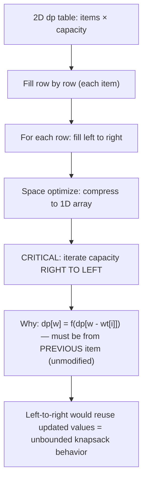

---
title: 0/1 Knapsack
aliases: []
tags: [DSA, DynamicProgramming, Knapsack]
domain: DSA
difficulty: Intermediate
created: 2026-07-26
related: []
status: complete
---

# 🎒 0/1 Knapsack

> [!abstract] TL;DR
> Classic DP: choose items to **maximize value** within a weight limit, using each item **at most once** (0 or 1 times). `dp[i][w]` = max value using first `i` items with capacity `w`. Space-optimize to 1D by iterating weights **in reverse**. The subset/partition variants swap "value" for a boolean or target sum.

---

## Intuition — Analogy First

You're packing a **backpack for a hiking trip**. You have a list of items — each with a weight and a value (how much you want it). Your backpack can hold at most W kg. You want to maximize the total value of what you pack. Crucially: **you can't split items** (no half a tent) and **you only have one of each item** (hence 0/1).

At each item, you face a binary decision:
- **Leave it** — take the best value possible from the remaining items with the full capacity.
- **Take it** — add its value to the best value possible from the remaining items with reduced capacity.

You choose whichever is better. DP stores these decisions in a table so you never re-examine the same (item, capacity) pair twice.

---

## How It Works + Mermaid

### Recurrence

```
dp[i][w] = max value using items 1..i with capacity w

Base cases:
  dp[0][w] = 0  ∀w  (no items → 0 value)
  dp[i][0] = 0  ∀i  (0 capacity → 0 value)

Transition (for item i with weight wt[i] and value val[i]):
  if wt[i] > w:
    dp[i][w] = dp[i-1][w]              # can't include item i, skip it
  else:
    dp[i][w] = max(
        dp[i-1][w],                    # exclude item i
        dp[i-1][w - wt[i]] + val[i]   # include item i
    )
```

The key: when including item i, we look at `dp[i-1][...]` — the **previous row** — because each item can only be used once.

### DP Table Fill Order + Space Optimization



---

## Complexity Analysis

| Approach | Time | Space |
|---|---|---|
| 2D DP | O(n × W) | O(n × W) |
| 1D space-optimized | O(n × W) | O(W) |
| Subset sum (boolean) | O(n × target) | O(target) |

Where n = number of items, W = knapsack capacity.

**Pseudo-polynomial complexity**: O(n × W) is polynomial in the *input size* only if W is not exponentially large. Since W can be represented in log(W) bits, this is technically pseudo-polynomial.

---

## Implementation (Python)

```python
from typing import List


# ── 2D Knapsack — O(nW) time, O(nW) space ────────────────────────────────

def knapsack_2d(weights: List[int], values: List[int], capacity: int) -> int:
    """Classic 0/1 Knapsack. Returns max value achievable."""
    n = len(weights)
    # dp[i][w] = max value using first i items with capacity w
    dp = [[0] * (capacity + 1) for _ in range(n + 1)]
    
    for i in range(1, n + 1):
        wt  = weights[i - 1]
        val = values[i - 1]
        for w in range(capacity + 1):
            # Option 1: exclude item i
            dp[i][w] = dp[i-1][w]
            # Option 2: include item i (if it fits)
            if wt <= w:
                dp[i][w] = max(dp[i][w], dp[i-1][w - wt] + val)
    
    return dp[n][capacity]


# ── 1D Space-Optimized Knapsack — O(nW) time, O(W) space ─────────────────

def knapsack_1d(weights: List[int], values: List[int], capacity: int) -> int:
    """Space-optimized. MUST iterate capacity in reverse (right to left)."""
    dp = [0] * (capacity + 1)
    
    for i in range(len(weights)):
        wt  = weights[i]
        val = values[i]
        # Reverse iteration: ensures we use dp[w - wt] from BEFORE this item
        # Forward iteration would allow item i to be used multiple times
        for w in range(capacity, wt - 1, -1):
            dp[w] = max(dp[w], dp[w - wt] + val)
    
    return dp[capacity]


# ── Subset Sum — can we reach exactly target? ─────────────────────────────
# Variant: instead of maximizing value, check if a subset sums to target.
# dp[w] = True if some subset of items seen so far sums to w.

def subset_sum(nums: List[int], target: int) -> bool:
    """Can any subset of nums sum to target? O(n × target) time, O(target) space."""
    dp = [False] * (target + 1)
    dp[0] = True    # empty subset sums to 0
    
    for num in nums:
        # Reverse to avoid reusing the same element
        for w in range(target, num - 1, -1):
            dp[w] = dp[w] or dp[w - num]
    
    return dp[target]


# ── Partition Equal Subset Sum (LC 416) ───────────────────────────────────
# Can we split nums into two subsets with equal sum?
# Reduce to: does any subset sum to total/2?

def can_partition(nums: List[int]) -> bool:
    total = sum(nums)
    if total % 2 != 0:
        return False        # odd total can't be halved
    return subset_sum(nums, total // 2)


# ── Target Sum (LC 494) — count assignments with + or - ──────────────────
# Assign + or - to each num so the expression equals target.
# Mathematical reduction: let P = subset assigned +, N = subset assigned -
# P - N = target, P + N = total → P = (total + target) / 2
# Count subsets summing to (total + target) // 2

def find_target_sum_ways(nums: List[int], target: int) -> int:
    total = sum(nums)
    if (total + target) % 2 != 0 or abs(target) > total:
        return 0
    
    goal = (total + target) // 2
    # dp[w] = number of subsets summing to w
    dp = [0] * (goal + 1)
    dp[0] = 1   # one way to make sum 0: empty subset
    
    for num in nums:
        for w in range(goal, num - 1, -1):
            dp[w] += dp[w - num]
    
    return dp[goal]
```

---

## Dry Run / Example Trace

**`knapsack_1d(weights=[2,3,4,5], values=[3,4,5,6], capacity=5)`:**

Initial dp: `[0, 0, 0, 0, 0, 0]`

**Item 0: wt=2, val=3** (iterate w=5 down to 2):
- w=5: dp[5] = max(0, dp[3]+3) = max(0, 3) = **3**
- w=4: dp[4] = max(0, dp[2]+3) = **3**
- w=3: dp[3] = max(0, dp[1]+3) = **3**
- w=2: dp[2] = max(0, dp[0]+3) = **3**

dp: `[0, 0, 3, 3, 3, 3]`

**Item 1: wt=3, val=4** (iterate w=5 down to 3):
- w=5: dp[5] = max(3, dp[2]+4) = max(3, 7) = **7**
- w=4: dp[4] = max(3, dp[1]+4) = max(3, 4) = **4**
- w=3: dp[3] = max(3, dp[0]+4) = **4**

dp: `[0, 0, 3, 4, 4, 7]`

**Item 2: wt=4, val=5** (iterate w=5 down to 4):
- w=5: dp[5] = max(7, dp[1]+5) = max(7, 5) = **7**
- w=4: dp[4] = max(4, dp[0]+5) = **5**

dp: `[0, 0, 3, 4, 5, 7]`

**Item 3: wt=5, val=6** (iterate w=5 down to 5):
- w=5: dp[5] = max(7, dp[0]+6) = max(7, 6) = **7**

dp: `[0, 0, 3, 4, 5, 7]`

**Answer: 7** (items 0 and 1: weight 2+3=5, value 3+4=7).

---

## Patterns & LeetCode Applications

| LeetCode # | Problem | Knapsack Variant |
|---|---|---|
| LC 416 | Partition Equal Subset Sum | Subset sum to total/2 |
| LC 494 | Target Sum | Count subsets (math reduction) |
| LC 1049 | Last Stone Weight II | Minimize difference = partition variant |
| LC 474 | Ones and Zeroes | 2D knapsack (m zeros, n ones) |
| LC 879 | Profitable Schemes | 2D knapsack with profit constraint |
| LC 322 | Coin Change | Unbounded knapsack (see Knapsack_Unbounded) |

**Recognition cues for 0/1 Knapsack:**
- "Each item used at most once" + "maximize value" + "weight/capacity constraint"
- "Can we reach exactly target sum?" (Subset Sum)
- "Split array into two equal halves" (Partition)

---

## Common Pitfalls

1. **Iterating capacity forward in 1D** — forward iteration means `dp[w - wt]` may already be updated for item `i`, effectively allowing unlimited use. Always iterate **right to left** for 0/1 Knapsack.
2. **Using 0-indexed weights/values** — when translating from 1-indexed DP formula (`dp[i]` = first i items), adjust to `weights[i-1]` and `values[i-1]`.
3. **Not checking feasibility in Target Sum** — if `(total + target)` is odd or `|target| > total`, there are 0 solutions. Skip this check and you'll get an incorrect result or index error.
4. **Confusing 0/1 with Unbounded Knapsack** — the only code difference is the iteration direction. Right-to-left = 0/1 (each item once). Left-to-right = Unbounded (items reusable). This asymmetry trips up many practitioners.
5. **Forgetting dp[0] = True/1** in subset sum variants — the base case "empty subset sums to 0" is essential. Without it, no combination can ever be built.

---

## Related Concepts [[wikilinks]]

- [[_MOC_Dynamic_Programming|↑ Section MOC]]
- [[DP_Fundamentals]] — the 5-step DP framework
- [[Knapsack_Unbounded]] — what changes when items can be reused
- [[Memoization_vs_Tabulation]] — trade-offs between top-down and bottom-up for knapsack

---

## Review Questions (3)

1. **Why must we iterate the capacity (weight) dimension from right to left when using the 1D space-optimized knapsack? What goes wrong with left-to-right?**
   *Answer: In 0/1 Knapsack, each item can be used once. `dp[w]` should be computed using `dp[w - wt]` from the **previous item's state**. Right-to-left ensures we haven't yet updated `dp[w - wt]` for the current item. Left-to-right overwrites `dp[w - wt]` before using it, meaning item i can be counted multiple times → degrades to Unbounded Knapsack.*

2. **How do you reduce "Partition Equal Subset Sum" to a standard Subset Sum problem?**
   *Answer: If total sum is odd, immediately return False. Otherwise, target = total/2. Ask: does any subset sum to total/2? If yes, the remaining elements also sum to total/2 (since total - total/2 = total/2). Run subset_sum(nums, total//2).*

3. **In the 2D Knapsack table, what does `dp[i-1][w - wt[i]]` represent and why do we look at row `i-1` instead of row `i`?**
   *Answer: `dp[i-1][w - wt[i]]` = maximum value achievable using the first `i-1` items (items 1 through i-1) with remaining capacity `w - wt[i]`. We use row `i-1` because item i is being included in the current decision — we must not count it again in the sub-result, so we exclude it from the sub-problem by looking at the row before item i was considered.*

---

## Sources

- CLRS Ch. 16 — Greedy Algorithms (Knapsack variants)
- Skiena, *The Algorithm Design Manual*, Ch. 8
- LeetCode Discuss — "A Comprehensive Guide to Subset Sum / Knapsack"
- [KnapSack Problem Visualization](https://visualgo.net)

#DSA #DynamicProgramming #Knapsack #SubsetSum #Partition #Intermediate
