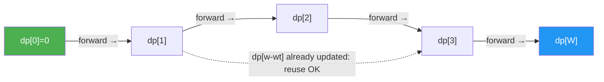

---
title: Unbounded Knapsack
aliases: []
tags: [DSA, DynamicProgramming, Knapsack]
domain: DSA
difficulty: Intermediate
created: 2026-07-26
related: []
status: complete
---

# ♾️ Unbounded Knapsack

> [!abstract] TL;DR
> Like 0/1 Knapsack but **each item can be used unlimited times**. The only code change: iterate capacity **left to right** (forward) so updated values feed back into the same item. Covers Coin Change (minimize coins), Coin Change II (count ways), and Perfect Squares.

---

## Intuition — Analogy First

Imagine a **vending machine** where you can buy the same snack as many times as you want, as long as you have coins. You want to maximize snack value (or count the ways to spend exactly $N). Unlike the hiking backpack (each item once), the vending machine lets you buy 5 bags of chips if that's the best use of your money.

The mathematical insight: because items are reusable, when deciding whether to include item `i` with weight `wt`, we use `dp[w - wt]` from the **current item's own row** (already updated), not the previous item's row. This is why forward iteration works — we want to reuse the item we just considered.

---

## How It Works + Mermaid

### Recurrence

```
dp[w] = max value achievable with capacity exactly w (or at most w)

Base case:
  dp[0] = 0   (0 capacity → 0 value)

Transition:
  for each item i with weight wt[i] and value val[i]:
    dp[w] = max(dp[w], dp[w - wt[i]] + val[i])   for w from wt[i] to W
```

**Critical difference from 0/1**: iterate `w` from **small to large** (left to right). When we compute `dp[w]` and look up `dp[w - wt[i]]`, that value has already been updated for item `i` in this same pass — meaning item `i` can be used again.

### 1D Array Update Order



Compare with 0/1 Knapsack's right-to-left sweep. That's the only code difference — it changes the semantics from "each item once" to "unlimited use."

---

## Complexity Analysis

| Problem | Time | Space |
|---|---|---|
| Unbounded Knapsack | O(n × W) | O(W) |
| Coin Change (min) | O(n × amount) | O(amount) |
| Coin Change II (ways) | O(n × amount) | O(amount) |
| Perfect Squares | O(n × amount) | O(amount) |
| Rod Cutting | O(n²) | O(n) |

Where n = number of item types, W = capacity/amount.

**Same asymptotic complexity as 0/1 Knapsack** — the difference is semantic (reuse vs no-reuse), not computational.

---

## Implementation (Python)

```python
from typing import List
import math


# ── Unbounded Knapsack — O(nW) time, O(W) space ───────────────────────────

def unbounded_knapsack(weights: List[int], values: List[int], capacity: int) -> int:
    """Maximize value; each item can be used unlimited times."""
    dp = [0] * (capacity + 1)
    
    for w in range(1, capacity + 1):
        for i in range(len(weights)):
            if weights[i] <= w:
                # dp[w - weights[i]] may already reflect item i being used → reuse OK
                dp[w] = max(dp[w], dp[w - weights[i]] + values[i])
    
    return dp[capacity]

# Alternative loop order (same result — can iterate items outer, capacity inner):
def unbounded_knapsack_v2(weights: List[int], values: List[int], capacity: int) -> int:
    dp = [0] * (capacity + 1)
    for i in range(len(weights)):
        wt, val = weights[i], values[i]
        for w in range(wt, capacity + 1):   # LEFT TO RIGHT: key difference
            dp[w] = max(dp[w], dp[w - wt] + val)
    return dp[capacity]


# ── Coin Change (LC 322) — Minimize number of coins ──────────────────────
# Each coin can be used unlimited times. Find min coins to make amount.
# This is unbounded knapsack where "value" = -1 (minimize cost).

def coin_change(coins: List[int], amount: int) -> int:
    dp = [float('inf')] * (amount + 1)
    dp[0] = 0               # 0 coins needed for amount 0
    
    for coin in coins:
        for w in range(coin, amount + 1):   # forward: coins reusable
            if dp[w - coin] != float('inf'):
                dp[w] = min(dp[w], dp[w - coin] + 1)
    
    return dp[amount] if dp[amount] != float('inf') else -1


# ── Coin Change II (LC 518) — Count number of ways ───────────────────────
# How many distinct combinations of coins sum to amount?
# Note: order doesn't matter ([1,2] == [2,1] is ONE combination).
# To avoid counting orderings: iterate coins OUTER, amount INNER.

def change(amount: int, coins: List[int]) -> int:
    """Count combinations (not permutations) that sum to amount."""
    dp = [0] * (amount + 1)
    dp[0] = 1       # one way to make 0: use no coins
    
    # Outer loop over coins ensures each coin denomination considered in order
    # This prevents [1,2] and [2,1] from being counted separately
    for coin in coins:
        for w in range(coin, amount + 1):
            dp[w] += dp[w - coin]
    
    return dp[amount]

# CONTRAST: if you swap the loops (amount outer, coins inner), you count
# PERMUTATIONS (order matters): [1,2] and [2,1] counted separately.
def coin_change_permutations(amount: int, coins: List[int]) -> int:
    """Counts ordered ways — permutations, not combinations."""
    dp = [0] * (amount + 1)
    dp[0] = 1
    for w in range(1, amount + 1):
        for coin in coins:
            if coin <= w:
                dp[w] += dp[w - coin]
    return dp[amount]


# ── Perfect Squares (LC 279) ──────────────────────────────────────────────
# Min number of perfect square numbers that sum to n.
# Same as Coin Change with coins = [1, 4, 9, 16, ...] up to sqrt(n).

def num_squares(n: int) -> int:
    squares = [i * i for i in range(1, int(math.isqrt(n)) + 1)]
    dp = [float('inf')] * (n + 1)
    dp[0] = 0
    
    for sq in squares:
        for w in range(sq, n + 1):
            dp[w] = min(dp[w], dp[w - sq] + 1)
    
    return dp[n]


# ── Rod Cutting ───────────────────────────────────────────────────────────
# Given a rod of length n and price[i] for a rod of length i (1-indexed),
# find max revenue from cutting. Each piece can be cut multiple times.

def rod_cutting(prices: List[int], n: int) -> int:
    """prices[i] = revenue for a rod of length i+1 (0-indexed)."""
    dp = [0] * (n + 1)
    
    for length in range(1, n + 1):          # each possible cut length
        for total in range(length, n + 1):  # forward: cut reusable
            dp[total] = max(dp[total], dp[total - length] + prices[length - 1])
    
    return dp[n]
```

---

## Dry Run / Example Trace

**`coin_change(coins=[1, 2, 5], amount=11)`:**

Initial dp: `[0, ∞, ∞, ∞, ∞, ∞, ∞, ∞, ∞, ∞, ∞, ∞]`

**Coin = 1** (iterate w=1 to 11, each reduces by 1 coin):
dp: `[0, 1, 2, 3, 4, 5, 6, 7, 8, 9, 10, 11]`

**Coin = 2** (iterate w=2 to 11):
- w=2: min(2, dp[0]+1)=1
- w=3: min(3, dp[1]+1)=2
- w=4: min(4, dp[2]+1)=2 (now dp[2]=1 from this pass: reuse coin 2!)
- ...
dp: `[0, 1, 1, 2, 2, 3, 3, 4, 4, 5, 5, 6]`

**Coin = 5** (iterate w=5 to 11):
- w=5: min(3, dp[0]+1)=1
- w=6: min(3, dp[1]+1)=2
- w=7: min(4, dp[2]+1)=2 (dp[2]=1, so 1+1=2)
- w=10: min(5, dp[5]+1)=2 (dp[5]=1, so 1+1=2)
- w=11: min(6, dp[6]+1)=3 (dp[6]=2, so 2+1=3)
dp: `[0, 1, 1, 2, 2, 1, 2, 2, 3, 3, 2, 3]`

**Answer: dp[11] = 3** (coins: 5+5+1).

**`change(amount=5, coins=[1,2,5])` — combinations:**

dp starts: `[1, 0, 0, 0, 0, 0]`

**Coin = 1** (only 1s):
dp: `[1, 1, 1, 1, 1, 1]`   (only one way with just 1s)

**Coin = 2**:
- w=2: dp[2] += dp[0] → 1+1=2  (ways: {1,1}, {2})
- w=3: dp[3] += dp[1] → 1+1=2  ({1,1,1}, {1,2})
- w=4: dp[4] += dp[2] → 1+2=3  ({1,1,1,1}, {1,1,2}, {2,2})
- w=5: dp[5] += dp[3] → 1+2=3

dp: `[1, 1, 2, 3, 3, 3+1=?]` — let's finish:

**Coin = 5**:
- w=5: dp[5] += dp[0] → 3+1=4  (+{5})

**Answer: 4** ways: {1,1,1,1,1}, {1,1,1,2}, {1,2,2}, {5}.

---

## Patterns & LeetCode Applications

| LeetCode # | Problem | Unbounded Variant |
|---|---|---|
| LC 322 | Coin Change | Min coins (minimize count) |
| LC 518 | Coin Change II | Count combinations |
| LC 279 | Perfect Squares | Min squares (squares are "coins") |
| LC 343 | Integer Break | Maximize product of parts |
| LC 1235 | Max Profit in Job Scheduling | Interval scheduling DP |
| LC 139 | Word Break | Words are reusable "items" |

**Combinations vs Permutations — loop order matters:**

| Goal | Outer loop | Inner loop | Result |
|---|---|---|---|
| Count combinations | Coins (items) | Amounts (capacity) | Each coin denomination considered in order |
| Count permutations | Amounts (capacity) | Coins (items) | All orderings of the same coins counted |

---

## Common Pitfalls

1. **Iterating right-to-left (0/1 behavior)** — if you copy the 0/1 Knapsack code and forget to change the iteration direction, each "coin" is used at most once. Your Coin Change solution silently returns wrong answers.
2. **Combinations vs Permutations loop order confusion** — for LC 518 (count combinations), coins must be the outer loop. Swapping loops gives a different (larger) answer — the permutations count.
3. **Integer overflow in counting problems** — in Python this is fine (arbitrary precision), but in Java/C++ you may need `% MOD` at each step for problems asking for count modulo 10⁹+7.
4. **Not initializing `dp[0] = 1` for counting problems** — `dp[0] = 1` means "one way to achieve sum 0: use nothing." Without it, all dp values stay 0 and the answer is always 0.
5. **Forgetting the `if dp[w - coin] != inf` guard** — in minimization problems, if `dp[w - coin]` is still infinity, `inf + 1` overflows in languages with fixed integers. In Python it's fine, but be aware.
6. **Perfect Squares: not precomputing the squares list** — recomputing squares inside the inner loop is O(√n) overhead per cell vs O(1) with a precomputed list.

---

## Related Concepts [[wikilinks]]

- [[_MOC_Dynamic_Programming|↑ Section MOC]]
- [[Knapsack_01]] — the bounded (one use) version; only iteration direction differs
- [[DP_Fundamentals]] — the 5-step framework and conditions for DP

---

## Review Questions (3)

1. **Explain why iterating capacity left-to-right in the 1D unbounded knapsack allows unlimited item reuse, while right-to-left enforces single use.**
   *Answer: Left-to-right: when computing `dp[w]`, we look up `dp[w - wt]`. Since we've already processed smaller capacities in this same item-pass, `dp[w - wt]` already reflects item i being used. So item i can be "stacked" multiple times. Right-to-left: when computing `dp[w]`, `dp[w - wt]` has NOT yet been updated for this item — it reflects only previous items → each item used at most once.*

2. **In Coin Change II, why must coins be the outer loop to count combinations (not permutations)?**
   *Answer: By fixing the outer loop to coins, we process denominations in a fixed order. At any point, `dp[w]` counts ways using only coin denominations seen so far. So [1,2] and [2,1] are never considered separately — 2 is only added after 1 has been fully processed. Swapping loops means for every target amount, we consider all coins — allowing different orderings of the same set to be counted as distinct.*

3. **Coin Change (minimize coins) and Coin Change II (count combinations) are both "unbounded knapsack." What is the key difference in their DP arrays and transitions?**
   *Answer: Coin Change uses `dp = [∞, ∞, ..., ∞]` with `dp[0]=0` and `dp[w] = min(dp[w], dp[w-coin]+1)` — minimizing count. Coin Change II uses `dp = [0, 0, ..., 0]` with `dp[0]=1` and `dp[w] += dp[w-coin]` — counting combinations. The base case semantics differ: ∞ means "impossible" for min; 1 means "one way" (empty set) for count.*

---

## Sources

- CLRS Ch. 15 — Extended Knapsack problems
- LeetCode Discuss — [Coin Change II: Combinations vs Permutations explained](https://leetcode.com/problems/coin-change-ii/discuss/99212/)
- Skiena, *The Algorithm Design Manual*, Ch. 8
- GeeksForGeeks — Unbounded Knapsack Problem

#DSA #DynamicProgramming #UnboundedKnapsack #CoinChange #Intermediate
