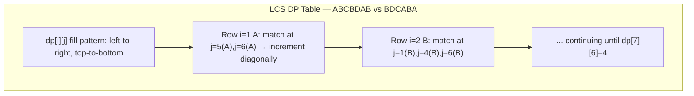

---
title: LCS and LIS
aliases: []
tags: [DSA, DynamicProgramming, Sequences]
domain: DSA
difficulty: Intermediate
created: 2026-07-26
related: []
status: complete
---

# 📈 LCS and LIS

> [!abstract] TL;DR
> **LCS** (Longest Common Subsequence): find the longest subsequence common to two strings. O(mn) DP, compressible to O(n) space. **LIS** (Longest Increasing Subsequence): find the longest strictly increasing subsequence. O(n²) DP or O(n log n) via patience sorting. Both are foundational — Edit Distance, diff algorithms, and Russian Doll Envelopes build directly on these.

---

## Intuition — Analogy First

**LCS — two books with a shared storyline**: You have two books. You want to find the longest sequence of scenes that appear in both books *in the same relative order*, even if other scenes appear between them. The subsequence doesn't have to be contiguous — just preserve order.
- Book 1: A-B-C-B-D-A-B
- Book 2: B-D-C-A-B-A
- Shared story: B-C-A-B or B-D-A-B (length 4)

**LIS — climbing a mountain range**: You're given elevation readings across a mountain range. Find the longest sequence of peaks where each peak is strictly higher than the previous one — a "consistent uphill climb" through the range, not necessarily adjacent readings.

---

## How It Works + Mermaid

### LCS Recurrence

```
dp[i][j] = length of LCS of s1[0..i-1] and s2[0..j-1]

Base cases:
  dp[0][j] = 0   ∀j   (empty s1 → LCS = 0)
  dp[i][0] = 0   ∀i   (empty s2 → LCS = 0)

Transition:
  if s1[i-1] == s2[j-1]:          # characters match
    dp[i][j] = dp[i-1][j-1] + 1  # extend LCS by 1
  else:                            # no match
    dp[i][j] = max(dp[i-1][j],    # skip s1[i-1]
                   dp[i][j-1])    # skip s2[j-1]
```

### LCS DP Table for "ABCBDAB" vs "BDCABA"



**Full table** (s1=ABCBDAB rows, s2=BDCABA cols, 0-indexed outer):

|   | "" | B | D | C | A | B | A |
|---|---|---|---|---|---|---|---|
| **""** | 0 | 0 | 0 | 0 | 0 | 0 | 0 |
| **A** | 0 | 0 | 0 | 0 | 1 | 1 | 1 |
| **B** | 0 | 1 | 1 | 1 | 1 | 2 | 2 |
| **C** | 0 | 1 | 1 | 2 | 2 | 2 | 2 |
| **B** | 0 | 1 | 1 | 2 | 2 | 3 | 3 |
| **D** | 0 | 1 | 2 | 2 | 2 | 3 | 3 |
| **A** | 0 | 1 | 2 | 2 | 3 | 3 | 4 |
| **B** | 0 | 1 | 2 | 2 | 3 | 4 | 4 |

**LCS length = 4** (one LCS: "BCBA" or "BDAB").

### LIS — Patience Sorting Intuition

Patience sorting: maintain "piles" of cards. Place each new card on the leftmost pile whose top card is ≥ the new card (keeps each pile's top increasing). If no pile works, start a new pile. The number of piles = LIS length.

```
nums = [10, 9, 2, 5, 3, 7, 101, 18]

Process 10: piles = [[10]]
Process 9:  9 < 10, replace top of pile 0 → piles = [[9]]
Process 2:  2 < 9, replace → piles = [[2]]
Process 5:  5 > 2, new pile → piles = [[2], [5]]
Process 3:  3 < 5 but > 2, replace pile 1 top → piles = [[2], [3]]
Process 7:  7 > 3, new pile → piles = [[2], [3], [7]]
Process 101: 101 > 7, new pile → piles = [[2], [3], [7], [101]]
Process 18:  18 < 101, replace pile 3 top → piles = [[2], [3], [7], [18]]

Number of piles = 4 → LIS length = 4
```

The piles' tops are always sorted (invariant), enabling binary search for O(log n) per element.

---

## Complexity Analysis

| Algorithm | Time | Space |
|---|---|---|
| LCS 2D DP | O(mn) | O(mn) |
| LCS space-optimized | O(mn) | O(n) |
| LIS O(n²) DP | O(n²) | O(n) |
| LIS O(n log n) patience | O(n log n) | O(n) |

Where m=len(s1), n=len(s2) for LCS; n=len(nums) for LIS.

**LCS → Edit Distance connection**: Edit Distance uses the same 2D DP table structure. The relationship: Edit Distance ≤ (m + n - 2 × LCS) for substitution-cost-2 variants.

---

## Implementation (Python)

```python
from typing import List
import bisect


# ── LCS — 2D Tabulation ───────────────────────────────────────────────────

def lcs_length(s1: str, s2: str) -> int:
    """O(mn) time, O(mn) space."""
    m, n = len(s1), len(s2)
    dp = [[0] * (n + 1) for _ in range(m + 1)]
    
    for i in range(1, m + 1):
        for j in range(1, n + 1):
            if s1[i-1] == s2[j-1]:
                dp[i][j] = dp[i-1][j-1] + 1    # characters match: extend
            else:
                dp[i][j] = max(dp[i-1][j], dp[i][j-1])  # take best skip
    
    return dp[m][n]


def lcs_string(s1: str, s2: str) -> str:
    """Reconstruct the actual LCS string by backtracking through the table."""
    m, n = len(s1), len(s2)
    dp = [[0] * (n + 1) for _ in range(m + 1)]
    
    for i in range(1, m + 1):
        for j in range(1, n + 1):
            if s1[i-1] == s2[j-1]:
                dp[i][j] = dp[i-1][j-1] + 1
            else:
                dp[i][j] = max(dp[i-1][j], dp[i][j-1])
    
    # Backtrack to find the LCS string
    result = []
    i, j = m, n
    while i > 0 and j > 0:
        if s1[i-1] == s2[j-1]:
            result.append(s1[i-1])
            i -= 1; j -= 1
        elif dp[i-1][j] > dp[i][j-1]:
            i -= 1
        else:
            j -= 1
    
    return ''.join(reversed(result))


# ── LCS — Space-Optimized to O(n) ────────────────────────────────────────

def lcs_optimized(s1: str, s2: str) -> int:
    """O(mn) time, O(n) space — only keep two rows."""
    m, n = len(s1), len(s2)
    prev = [0] * (n + 1)
    
    for i in range(1, m + 1):
        curr = [0] * (n + 1)
        for j in range(1, n + 1):
            if s1[i-1] == s2[j-1]:
                curr[j] = prev[j-1] + 1
            else:
                curr[j] = max(prev[j], curr[j-1])
        prev = curr
    
    return prev[n]


# ── LIS — O(n²) DP ───────────────────────────────────────────────────────

def lis_n2(nums: List[int]) -> int:
    """O(n²) time, O(n) space. dp[i] = LIS ending at index i."""
    if not nums: return 0
    n = len(nums)
    dp = [1] * n    # every element is an LIS of length 1 by itself
    
    for i in range(1, n):
        for j in range(i):
            if nums[j] < nums[i]:           # strictly increasing
                dp[i] = max(dp[i], dp[j] + 1)
    
    return max(dp)


def lis_n2_with_sequence(nums: List[int]) -> List[int]:
    """Returns the actual LIS, not just its length."""
    if not nums: return []
    n = len(nums)
    dp   = [1] * n
    parent = [-1] * n   # parent[i] = previous index in LIS ending at i
    
    for i in range(1, n):
        for j in range(i):
            if nums[j] < nums[i] and dp[j] + 1 > dp[i]:
                dp[i] = dp[j] + 1
                parent[i] = j
    
    # Find the end of the longest LIS
    end_idx = max(range(n), key=lambda i: dp[i])
    
    # Backtrack to reconstruct
    lis = []
    idx = end_idx
    while idx != -1:
        lis.append(nums[idx])
        idx = parent[idx]
    
    return list(reversed(lis))


# ── LIS — O(n log n) Patience Sorting ────────────────────────────────────

def lis_nlogn(nums: List[int]) -> int:
    """O(n log n) time, O(n) space. tails[i] = smallest tail of all IS of length i+1."""
    tails = []                  # tails[i] = smallest tail element for IS of length i+1
    
    for num in nums:
        pos = bisect.bisect_left(tails, num)    # find leftmost position where tails[pos] >= num
        if pos == len(tails):
            tails.append(num)   # num is larger than all tails → extend LIS
        else:
            tails[pos] = num    # replace: better (smaller) tail for IS of length pos+1
    
    return len(tails)


def lis_nlogn_with_sequence(nums: List[int]) -> List[int]:
    """O(n log n) with reconstruction using parent tracking."""
    if not nums: return []
    n = len(nums)
    tails   = []
    indices = []        # indices[i] = original index where tails[i] currently sits
    parent  = [-1] * n  # parent[i] = predecessor of nums[i] in LIS
    
    for i, num in enumerate(nums):
        pos = bisect.bisect_left(tails, num)
        if pos == len(tails):
            tails.append(num)
            indices.append(i)
        else:
            tails[pos] = num
            indices[pos] = i
        
        if pos > 0:
            parent[i] = indices[pos - 1]   # predecessor is the last element of shorter IS
    
    # Backtrack from end of LIS
    lis, idx = [], indices[-1]
    while idx != -1:
        lis.append(nums[idx])
        idx = parent[idx]
    
    return list(reversed(lis))
```

---

## Dry Run / Example Trace

**LIS O(n²): `nums = [10, 9, 2, 5, 3, 7, 101, 18]`**

| i | nums[i] | j values where nums[j] < nums[i] | dp[i] |
|---|---|---|---|
| 0 | 10 | — | 1 |
| 1 | 9 | — | 1 |
| 2 | 2 | — | 1 |
| 3 | 5 | j=2 (2<5): dp[2]+1=2 | **2** |
| 4 | 3 | j=2 (2<3): dp[2]+1=2 | **2** |
| 5 | 7 | j=2(2<7):2, j=3(5<7):3, j=4(3<7):3 | **3** |
| 6 | 101 | all j: max dp is dp[5]=3 → 3+1 | **4** |
| 7 | 18 | j=2,3,4,5: max dp[5]=3 → 3+1 | **4** |

`max(dp) = 4`, LIS = [2, 5, 7, 101] or [2, 3, 7, 18].

**LIS O(n log n): patience sorting for same array:**

| num | bisect_left position | tails after |
|---|---|---|
| 10 | 0 (new) | [10] |
| 9 | 0 (replace) | [9] |
| 2 | 0 (replace) | [2] |
| 5 | 1 (new) | [2, 5] |
| 3 | 1 (replace 5) | [2, 3] |
| 7 | 2 (new) | [2, 3, 7] |
| 101 | 3 (new) | [2, 3, 7, 101] |
| 18 | 3 (replace 101) | [2, 3, 7, 18] |

`len(tails) = 4`. Note: tails = [2,3,7,18] is NOT an actual LIS — it's just a tracking array. The actual LIS is recovered via parent tracking.

---

## Patterns & LeetCode Applications

| LeetCode # | Problem | Connection |
|---|---|---|
| LC 1143 | Longest Common Subsequence | Direct LCS |
| LC 72 | Edit Distance | Same DP structure as LCS |
| LC 300 | Longest Increasing Subsequence | Direct LIS O(n log n) |
| LC 354 | Russian Doll Envelopes | 2D LIS (sort by width, LIS on height) |
| LC 673 | Number of LIS | LIS + count array |
| LC 1048 | Longest String Chain | LCS variant on word pairs |
| LC 583 | Delete Ops for Two Strings | min deletions = m + n - 2×LCS |
| LC 712 | Min ASCII Delete Sum | Weighted LCS variant |

**Russian Doll Envelopes (LC 354) — reduction to LIS:**
Sort envelopes by width ascending, then by **height descending** (for equal widths). Then LIS on heights alone. The descending height sort for equal widths prevents using two envelopes of the same width.

---

## Common Pitfalls

1. **Off-by-one in LCS indexing** — `s1[i-1]` not `s1[i]` in the 1-indexed DP table. The `i` in `dp[i][j]` refers to "first i characters," so the actual character is `s1[i-1]`.
2. **Backtracking LCS incorrectly** — when `dp[i-1][j] == dp[i][j-1]`, you can go either direction. Both may lead to valid LCS strings of equal length, but you must pick one consistently.
3. **LIS: bisect_left vs bisect_right** — `bisect_left` finds the first position ≥ num (for strictly increasing). For non-decreasing (≥), use `bisect_right`. Mixing them changes the semantics.
4. **Confusing tails array with an actual subsequence** — the `tails` array in O(n log n) LIS is a tracking construct, not a real subsequence. Its elements may not appear consecutively in the original array. To get the actual LIS, you must use parent tracking.
5. **Russian Doll sort order** — forgetting to sort equal-width envelopes by height *descending* means two envelopes with the same width could form an IS, which is invalid (one must strictly contain the other).
6. **LCS space optimization invalidates backtracking** — once you compress to 2 rows, you can no longer backtrack to find the actual LCS string. Use full 2D table if the string is needed.

---

## Related Concepts [[wikilinks]]

- [[_MOC_Dynamic_Programming|↑ Section MOC]]
- [[Edit_Distance]] — uses the same 2D DP table as LCS with different transitions
- [[DP_Fundamentals]] — the 5-step framework applied to sequence problems
- [[Memoization_vs_Tabulation]] — LCS can be done top-down, but tabulation is standard

---

## Review Questions (3)

1. **Derive the LCS recurrence from first principles. Why does a character match extend the diagonal, while a mismatch takes the max of up/left?**
   *Answer: If s1[i-1] == s2[j-1], both characters belong to the LCS — we add 1 to the LCS of the remaining prefixes (dp[i-1][j-1]). If they don't match, neither character can simultaneously be the "last" character of the LCS, so we try skipping s1's last character (dp[i-1][j]) or s2's last character (dp[i][j-1]) and take the better option.*

2. **Why does the O(n log n) LIS algorithm use `bisect_left` (find leftmost ≥ target) and replace instead of append when the position exists?**
   *Answer: `bisect_left` finds where num would be inserted to keep `tails` sorted, specifically at the position of the first element ≥ num. Replacing `tails[pos]` with num improves the tail — smaller tail means more room for future extensions. Appending (when pos == len) means num is larger than all tails, extending the LIS length. This maintains the invariant: `tails[i]` = smallest possible tail of all increasing subsequences of length i+1.*

3. **Explain the reduction of Russian Doll Envelopes to a 1D LIS problem and why equal widths must be sorted by height descending.**
   *Answer: Sort by width ascending so that "envelopes seen so far" are all narrow enough. Then find LIS on heights — an envelope fits inside another iff both width AND height are strictly less. The height descending sort for equal widths ensures that two envelopes of the same width are never part of the same LIS (since a later equal-width envelope has smaller height, bisect replaces rather than extends), which correctly models the constraint that equal-width envelopes can't nest.*

---

## Sources

- CLRS Ch. 15.4 — Longest Common Subsequence
- [LIS patience sorting — Algorithmist](https://en.wikipedia.org/wiki/Patience_sorting)
- LeetCode Discuss — [LCS comprehensive guide](https://leetcode.com/problems/longest-common-subsequence/discuss/)
- LeetCode Discuss — [LIS O(n log n) with visual explanation](https://leetcode.com/problems/longest-increasing-subsequence/discuss/74824/)
- Hunt & Szymanski (1977) — original O(n log n) LCS algorithm (used in Unix `diff`)

#DSA #DynamicProgramming #LCS #LIS #Sequences #PatienceSorting #Intermediate
