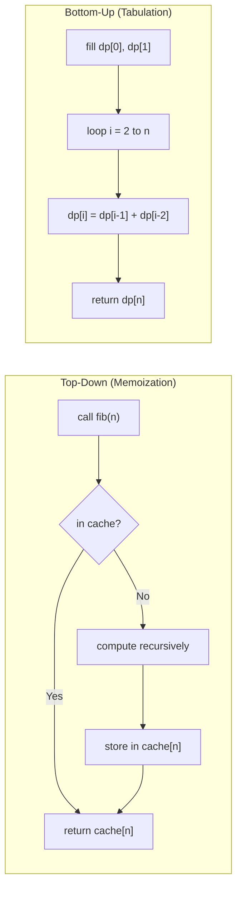

---
title: Memoization vs Tabulation
aliases: []
tags: [DSA, DynamicProgramming, Memoization, Tabulation]
domain: DSA
difficulty: Intermediate
created: 2026-07-26
related: []
status: complete
---

# 📋 Memoization vs Tabulation

> [!abstract] TL;DR
> **Memoization** (top-down) = recursive + cache. Natural to write, only computes needed states, has call-stack overhead. **Tabulation** (bottom-up) = iterative + DP table. No recursion overhead, easy to space-optimize. Both are O(states × transition), but tabulation is usually faster in practice due to no function-call overhead.

---

## Intuition — Analogy First

Writing a **research paper** in two ways:

**Top-down (Memoization)**: You write the paper and look up references *only when you need them*. If you cited the same paper before, you grab the cached PDF instead of re-reading it. Natural flow — you write in the order ideas emerge, only fetching what's needed.

**Bottom-up (Tabulation)**: You first read *all* foundational papers in a systematic order (Chapter 1, 2, 3...), building a comprehensive reference library before writing. Every paper is read exactly once. When you write, every lookup is already in the library.

Both produce the same paper. Top-down is more natural but requires juggling open tabs (call stack). Bottom-up is more systematic and the library (DP table) can sometimes be compressed after use.

---

## How It Works + Mermaid

### Side-by-Side Comparison



### Detailed Comparison Table

| Dimension | Memoization (Top-Down) | Tabulation (Bottom-Up) |
|---|---|---|
| Direction | Start from answer, recurse to base cases | Start from base cases, build to answer |
| Code style | Recursive | Iterative |
| States computed | Only what's needed | All states in fill order |
| Call stack | O(max recursion depth) extra space | None (no recursion) |
| Ease of writing | Often more natural | Requires explicit iteration order |
| Performance | Slightly slower (function call overhead) | Slightly faster |
| Space optimization | Harder to compress | Easy to reduce to O(1) or O(n) |
| Stack overflow risk | Yes, for very deep recursion | No |
| When to prefer | State space is large but sparse | State space is dense; need max performance |

---

## Complexity Analysis

| Problem | States | Transition | Total Time |
|---|---|---|---|
| Fibonacci | n | O(1) | O(n) |
| Coin Change | amount | O(coins) | O(amount × coins) |
| LCS | m × n | O(1) | O(mn) |
| Edit Distance | m × n | O(1) | O(mn) |
| Word Break | n | O(n) | O(n²) |

**Both approaches have the same asymptotic complexity** — the difference is constant factors and space for the call stack.

Space optimization rule: if `dp[i]` depends only on `dp[i-1]` (and maybe `dp[i-2]`), you can compress the array to O(1). If `dp[i][j]` depends only on the previous row, compress 2D to O(n).

---

## Implementation (Python)

```python
from functools import lru_cache
from typing import List


# ── Word Break (LC 139) — Top-Down Memoization ───────────────────────────
# Problem: can s be segmented into dictionary words?
# State: can_break(i) = can we segment s[i:]?

def word_break_memo(s: str, wordDict: List[str]) -> bool:
    word_set = set(wordDict)
    
    @lru_cache(maxsize=None)
    def can_break(start: int) -> bool:
        if start == len(s):
            return True             # base case: used all characters
        for end in range(start + 1, len(s) + 1):
            if s[start:end] in word_set and can_break(end):
                return True
        return False
    
    return can_break(0)


# ── Coin Change (LC 322) — Bottom-Up Tabulation ──────────────────────────
# State: dp[i] = min coins to make amount i
# Transition: dp[i] = min(dp[i - c] + 1) for each coin c <= i
# Base: dp[0] = 0

def coin_change_tab(coins: List[int], amount: int) -> int:
    dp = [float('inf')] * (amount + 1)
    dp[0] = 0                           # base case: 0 coins for amount 0
    
    for i in range(1, amount + 1):
        for coin in coins:
            if coin <= i:
                dp[i] = min(dp[i], dp[i - coin] + 1)
    
    return dp[amount] if dp[amount] != float('inf') else -1


# ── Coin Change — Space already O(amount), cannot reduce further ──────────
# (the full 1D array is needed since dp[i] depends on dp[i-coin] for variable coin)


# ── LCS — 2D Tabulation with Space Optimization ──────────────────────────
# Full 2D: O(mn) space
def lcs_full(s1: str, s2: str) -> int:
    m, n = len(s1), len(s2)
    dp = [[0] * (n + 1) for _ in range(m + 1)]
    
    for i in range(1, m + 1):
        for j in range(1, n + 1):
            if s1[i-1] == s2[j-1]:
                dp[i][j] = dp[i-1][j-1] + 1
            else:
                dp[i][j] = max(dp[i-1][j], dp[i][j-1])
    
    return dp[m][n]


# Space-optimized LCS: O(n) space — only keep current and previous row
def lcs_optimized(s1: str, s2: str) -> int:
    m, n = len(s1), len(s2)
    prev = [0] * (n + 1)    # dp[i-1]
    curr = [0] * (n + 1)    # dp[i]
    
    for i in range(1, m + 1):
        for j in range(1, n + 1):
            if s1[i-1] == s2[j-1]:
                curr[j] = prev[j-1] + 1
            else:
                curr[j] = max(prev[j], curr[j-1])
        prev, curr = curr, [0] * (n + 1)   # slide window
    
    return prev[n]


# ── When only one variable: O(1) space via two scalars ───────────────────
def fib_o1(n: int) -> int:
    if n <= 1: return n
    a, b = 0, 1
    for _ in range(2, n + 1):
        a, b = b, a + b
    return b


# ── Comparison: which to choose? ─────────────────────────────────────────
def which_approach(problem_notes: str) -> str:
    """
    Use memoization when:
    - The state space is large but only a small fraction of states are reachable
    - The recursion is natural (tree/graph problems)
    - You want to write code quickly (contests)
    
    Use tabulation when:
    - You need max performance (no function-call overhead)
    - You need to space-optimize (compress dp dimensions)
    - Recursion depth could exceed Python's stack limit
    - You want to avoid @lru_cache's overhead for simple problems
    """
    return "Choose based on state sparsity, recursion depth, and space needs."
```

---

## Dry Run / Example Trace

**Coin Change — tabulation for `coins=[1,2,5], amount=6`:**

| i | dp[i] | Best coin used |
|---|---|---|
| 0 | 0 | — |
| 1 | 1 | coin=1: dp[0]+1=1 |
| 2 | 1 | coin=2: dp[0]+1=1 |
| 3 | 2 | coin=1: dp[2]+1=2 |
| 4 | 2 | coin=2: dp[2]+1=2 |
| 5 | 1 | coin=5: dp[0]+1=1 |
| 6 | **2** | coin=1: dp[5]+1=2 or coin=5: dp[1]+1=2 |

Answer: 2 coins (5+1).

**LCS space optimization — "ABCD" vs "ACD":**

Before row 1 (s1[0]='A'):
```
prev = [0, 0, 0, 0]   # dp[0] = all zeros
```
Row i=1, s1[0]='A':
- j=1 s2[0]='A' match: curr[1] = prev[0]+1 = 1
- j=2 s2[1]='C' no match: curr[2] = max(prev[2]=0, curr[1]=1) = 1
- j=3 s2[2]='D' no match: curr[3] = max(prev[3]=0, curr[2]=1) = 1
```
prev = [0, 1, 1, 1]
```
Row i=2, s1[1]='B': no matches with 'A','C','D' → curr stays max of prev
```
prev = [0, 1, 1, 1]
```
Row i=3, s1[2]='C':
- j=2 s2[1]='C' match: curr[2] = prev[1]+1 = 2
- j=3 no match: curr[3] = max(prev[3]=1, curr[2]=2) = 2
```
prev = [0, 1, 2, 2]
```
Row i=4, s1[3]='D':
- j=3 s2[2]='D' match: curr[3] = prev[2]+1 = 3
```
prev = [0, 1, 2, 3]
```
Answer: `prev[3]` = **3** (LCS = "ACD").

---

## Patterns & LeetCode Applications

### Choosing the Approach for Common Problems

| Problem | Recommended | Why |
|---|---|---|
| Fibonacci | Tabulation O(1) | Dense, all states needed, trivial |
| Coin Change | Tabulation | Dense 1D state, iterative is clean |
| Word Break | Memoization | Start index is natural, recursion easy |
| Unique Paths | Tabulation | 2D grid, compress to 1D easily |
| LCS / Edit Distance | Tabulation | 2D dense, space compress to O(n) |
| Tree DP (House Robber III) | Memoization | Tree structure, recursion is natural |
| Bitmask DP | Memoization | State space often sparse |

---

## Common Pitfalls

1. **`@lru_cache` with mutable arguments** — `@lru_cache` requires hashable arguments. Lists/dicts must be converted to tuples/frozensets before use.
2. **Forgetting to handle the `inf` case** — in Coin Change, if `dp[amount]` is still `inf` after filling, return -1. Forgetting this returns a wrong answer.
3. **Wrong sliding window direction** — when compressing LCS from 2D to 1D, the single-row approach requires careful handling of `dp[j-1]` (diagonal) which gets overwritten. Use two arrays or process carefully.
4. **Stack overflow with deep memoization** — if `n=10000` and recursion depth hits Python's default limit (1000), use `sys.setrecursionlimit` or switch to tabulation.
5. **`@lru_cache` not cleared between test cases** — in competitive programming, if a function with `@lru_cache` is called across multiple test cases, call `func.cache_clear()` between them.
6. **Space optimization breaking correctness in 0/1 Knapsack** — in 0/1 Knapsack with 1D array, you MUST iterate weights in reverse to avoid re-using an item. Bottom-up iteration direction is critical.

---

## Related Concepts [[wikilinks]]

- [[_MOC_Dynamic_Programming|↑ Section MOC]]
- [[DP_Fundamentals]] — the 5-step framework and two conditions for DP
- [[Knapsack_01]] — canonical example where space optimization direction matters
- [[Edit_Distance]] — 2D DP with space optimization to O(n)

---

## Review Questions (3)

1. **Give one scenario where memoization is clearly preferable to tabulation, and explain why.**
   *Answer: Tree DP (e.g., House Robber III on a binary tree) — the subproblems follow the tree structure, which is naturally expressed as recursion. Tabulation would require a topological sort of tree nodes, which is more complex to implement. The recursion also only visits reachable nodes, making state space sparse.*

2. **When compressing LCS from O(mn) to O(n) space, why do we need two rows (prev, curr) instead of one?**
   *Answer: `dp[i][j]` depends on `dp[i-1][j-1]` (diagonal), `dp[i-1][j]` (above), and `dp[i][j-1]` (left). If we used one row, updating `curr[j]` overwrites `prev[j]`, which is still needed for `curr[j+1]`. Two rows keep the previous row intact until the current row is complete.*

3. **Both memoization and tabulation for Fibonacci are O(n) time, yet tabulation is typically faster in practice. Why?**
   *Answer: Function call overhead. Each recursive call in memoization pushes a stack frame (allocate memory, save registers, set up return address). Tabulation is a simple loop with array indexing — no function call overhead. For n=10⁶, this constant-factor difference is measurable.*

---

## Sources

- CLRS Ch. 15.3 — Elements of Dynamic Programming
- MIT 6.006 — DP lecture notes
- [Python `functools.lru_cache` docs](https://docs.python.org/3/library/functools.html#functools.lru_cache)
- LeetCode Explore — Dynamic Programming card

#DSA #DynamicProgramming #Memoization #Tabulation #SpaceOptimization #Intermediate
