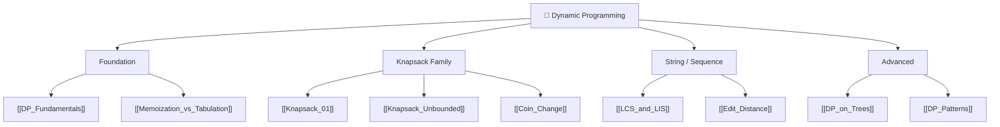

# 🧩 Dynamic Programming — Map of Content

> [!abstract] What This Section Covers
> Dynamic programming is the technique that converts exponential brute-force into polynomial time by recognising overlapping subproblems and storing their results. This section builds from the two prerequisites of DP (optimal substructure + overlapping subproblems) through both implementation styles (top-down memoisation and bottom-up tabulation), covers the canonical problem families that appear in interviews (knapsack variants, sequence problems, string edit problems), advances to DP on trees, and closes with a pattern-classification reference. Mastering DP requires pattern recognition more than memorisation — the reference note encodes that recognition system.

## Concept Map

## Learning Path

1. [[DP_Fundamentals]] — Optimal substructure, overlapping subproblems, recurrence definition
2. [[Memoization_vs_Tabulation]] — Top-down vs bottom-up; space optimisation; when each is cleaner
3. [[Knapsack_01]] — Classic 0/1 knapsack; backward iteration trick; why items can't repeat
4. [[Knapsack_Unbounded]] — Items can repeat; forward iteration; reduction to coin-change framing
5. [[Coin_Change]] — Minimum coins (unbounded knapsack); counting ways variant
6. [[LCS_and_LIS]] — Longest Common Subsequence (2D DP) and Longest Increasing Subsequence (1D + binary search O(n log n))
7. [[Edit_Distance]] — Levenshtein distance; 2D DP table; path reconstruction
8. [[DP_on_Trees]] — Rerooting technique; tree knapsack; subtree DP
9. [[DP_Patterns]] — Pattern taxonomy: linear, interval, bitmask, digit, probability DP

## All Notes at a Glance

| Note | Summary | Difficulty |
|------|---------|------------|
| [[DP_Fundamentals]] | Two DP prerequisites; recurrence writing; DP vs greedy | Intermediate |
| [[Memoization_vs_Tabulation]] | Top-down vs bottom-up; pros/cons; space tricks | Intermediate |
| [[Knapsack_01]] | Weight/value selection; backward fill; O(nW) | Intermediate |
| [[Knapsack_Unbounded]] | Unlimited item counts; forward fill | Intermediate |
| [[Coin_Change]] | Min-coins and count-ways variants of unbounded knapsack | Intermediate |
| [[LCS_and_LIS]] | 2D LCS table; LIS in O(n log n) via patience sorting | Intermediate |
| [[Edit_Distance]] | Levenshtein; 3 operations; 2D recurrence | Intermediate |
| [[DP_on_Trees]] | Subtree DP; rerooting; tree knapsack | Advanced |
| [[DP_Patterns]] | Classification of all DP families with templates | Intermediate (reference) |

## Key Questions This Section Answers

- What are the two conditions that make a problem solvable with DP?
- When is top-down memoisation cleaner than bottom-up tabulation, and vice versa?
- Why does 0/1 knapsack iterate the capacity dimension backward but unbounded knapsack iterates forward?
- How do you reconstruct the actual solution (not just the optimal value) from a DP table?
- What is the O(n log n) trick for LIS, and why does it work?
- How does rerooting avoid re-running tree DP for every possible root?

## Related Sections

- [[_MOC_DSA_Master|↑ DSA Master MOC]]
- [[_MOC_Recursion_Backtracking]] — DP is memoised recursion; many DP problems start as backtracking
- [[_MOC_Greedy]] — Greedy is a special case where the local optimum always yields the global optimum; DP is needed when it doesn't

#MOC #DSA #dynamic-programming
