---
title: Activity Selection & Interval Scheduling
aliases: [Interval Scheduling, Meeting Rooms, Merge Intervals]
tags: [DSA, greedy, intervals, sorting, sweep-line]
domain: DSA
difficulty: Intermediate
created: 2026-07-26
related: [Greedy_Fundamentals, Priority_Queue, Sorting_Overview, Greedy_Patterns]
status: complete
---

# 📅 Activity Selection & Interval Scheduling

> [!abstract] TL;DR
> **Activity Selection (interval scheduling):** sort by end time, greedily pick the earliest-ending non-overlapping interval — gives the maximum number of compatible activities in O(n log n). **Merge Intervals:** sort by start, scan and merge overlapping pairs. **Meeting Rooms II:** minimum rooms = maximum overlapping intervals at any point (solved with a min-heap or sweep line).

---

## Intuition — Analogy First

Imagine a teacher scheduling classes in a single classroom. The teacher's strategy: **always finish the current class as early as possible**, so the classroom is free for the next class sooner. Choosing the lecture that starts latest (seems "greedier") would block more future lectures.

This "finish early" principle is the core of interval scheduling. The intuition extends to multiple rooms (Meeting Rooms II) — you need as many rooms as the maximum number of overlapping classes at any moment.

---

## The Three Canonical Problems

### Problem 1 — Activity Selection (Maximum Non-Overlapping Intervals)

**Goal:** Choose the maximum number of non-overlapping intervals.

**Algorithm:**
1. Sort intervals by **end time** (ascending)
2. Greedily pick each interval if its start ≥ last chosen interval's end

**Why end time and not start time?** Sorting by start time doesn't work — `[1, 100]` would be chosen first, blocking everything. By end time, we always leave the most room for future intervals.

**Why this is correct (exchange argument):**
- Suppose OPT picks interval X as its first choice, but G picks interval Y (earlier ending, Y.end ≤ X.end).
- Replace X with Y in OPT — Y ends no later than X, so it's compatible with everything X was compatible with.
- OPT is no worse; therefore G's first choice is always safe. Repeat inductively.

---

### Problem 2 — Merge Intervals

**Goal:** Merge all overlapping intervals into their union.

**Algorithm:**
1. Sort by **start time**
2. Scan: if current interval overlaps with last merged (current.start ≤ last.end), extend last.end
3. Otherwise, push current as new merged interval

**Overlap definition:** `[1,3]` and `[2,4]` overlap; `[1,3]` and `[3,5]` overlap (touching counts); `[1,3]` and `[4,5]` do not.

---

### Problem 3 — Minimum Meeting Rooms (Meeting Rooms II)

**Goal:** Minimum number of conference rooms to hold all meetings without conflict.

**Key Insight:** The minimum rooms needed = the **maximum number of simultaneously overlapping meetings** at any point in time.

**Algorithm (min-heap):**
1. Sort by start time
2. Use a min-heap to track end times of ongoing meetings
3. For each new meeting: if the earliest-ending room is free (heap.top ≤ meeting.start), reuse it; otherwise add a new room
4. Answer = heap size at the end

**Algorithm (sweep line):**
1. Separate all start and end times into events
2. Sweep through events: `+1` for a start, `-1` for an end
3. Track the running sum — maximum running sum = minimum rooms

### Mermaid — Interval Timeline Visualization

```mermaid
gantt
    title Activity Selection Example
    dateFormat X
    axisFormat %s

    section Intervals
    A [1-4]   :a1, 1, 4
    B [3-5]   :a2, 3, 5
    C [0-6]   :a3, 0, 6
    D [5-7]   :a4, 5, 7
    E [8-9]   :a5, 8, 9
    F [5-9]   :a6, 5, 9

    section Selected (sort by end)
    A selected :crit, s1, 1, 4
    B selected :crit, s2, 5, 7
    E selected :crit, s3, 8, 9
```



> Sorted by end: A(4), B(5), C(6), D(7), F(9), E(9). Pick A → skip B (overlaps), skip C (overlaps) → pick D → pick E. Max 3 activities.

---

## Complexity Analysis

| Algorithm | Time | Space |
|---|---|---|
| Activity Selection (max non-overlap) | O(n log n) | O(1) |
| Min intervals to remove | O(n log n) | O(1) |
| Merge Intervals | O(n log n) | O(n) output |
| Meeting Rooms I (any overlap?) | O(n log n) | O(1) |
| Meeting Rooms II (min rooms, heap) | O(n log n) | O(n) |
| Meeting Rooms II (sweep line) | O(n log n) | O(n) |
| Insert Interval | O(n) | O(n) |

---

## Implementation (Python)

```python
from typing import List
import heapq


# ─── 1. Non-overlapping Intervals — Min Removals (LC 435) ────────────────────
def erase_overlap_intervals(intervals: List[List[int]]) -> int:
    """
    Minimum intervals to remove to make remainder non-overlapping.
    Equivalent to: n - (max non-overlapping intervals).
    """
    if not intervals:
        return 0
    intervals.sort(key=lambda x: x[1])   # sort by end time
    keep = 1
    last_end = intervals[0][1]
    for i in range(1, len(intervals)):
        if intervals[i][0] >= last_end:   # no overlap
            keep += 1
            last_end = intervals[i][1]
    return len(intervals) - keep


# ─── 2. Merge Intervals (LC 56) ───────────────────────────────────────────────
def merge_intervals(intervals: List[List[int]]) -> List[List[int]]:
    """Merge all overlapping intervals and return the result."""
    if not intervals:
        return []
    intervals.sort(key=lambda x: x[0])   # sort by start time
    merged = [intervals[0]]

    for start, end in intervals[1:]:
        if start <= merged[-1][1]:        # overlaps with last merged interval
            merged[-1][1] = max(merged[-1][1], end)   # extend
        else:
            merged.append([start, end])   # new disjoint interval

    return merged


# ─── 3. Meeting Rooms I — Any Overlap? (LC 252) ───────────────────────────────
def can_attend_meetings(intervals: List[List[int]]) -> bool:
    """Return True if a person can attend ALL meetings (no overlaps)."""
    intervals.sort(key=lambda x: x[0])
    for i in range(1, len(intervals)):
        if intervals[i][0] < intervals[i - 1][1]:
            return False
    return True


# ─── 4. Meeting Rooms II — Min Rooms (LC 253) ─────────────────────────────────
def min_meeting_rooms(intervals: List[List[int]]) -> int:
    """
    Minimum conference rooms needed.
    Use a min-heap of end times; reuse room if top <= new start.
    """
    if not intervals:
        return 0
    intervals.sort(key=lambda x: x[0])   # sort by start
    heap = []   # min-heap of end times

    for start, end in intervals:
        if heap and heap[0] <= start:
            heapq.heapreplace(heap, end)  # reuse earliest-ending room
        else:
            heapq.heappush(heap, end)     # need a new room

    return len(heap)


def min_meeting_rooms_sweep(intervals: List[List[int]]) -> int:
    """
    Sweep line approach: +1 at start, -1 at end.
    Maximum running sum = minimum rooms needed.
    """
    events = []
    for start, end in intervals:
        events.append((start, 1))    # meeting starts
        events.append((end, -1))     # meeting ends

    # Sort: at a tie, ends before starts (room frees before next one needs it)
    events.sort(key=lambda x: (x[0], x[1]))

    max_rooms = 0
    current = 0
    for _, change in events:
        current += change
        max_rooms = max(max_rooms, current)
    return max_rooms


# ─── 5. Insert Interval (LC 57) ───────────────────────────────────────────────
def insert_interval(intervals: List[List[int]], new_interval: List[int]) -> List[List[int]]:
    """
    Insert new_interval into sorted non-overlapping intervals list.
    O(n) — no sorting needed, already sorted.
    """
    result = []
    i = 0
    n = len(intervals)

    # Add all intervals that come entirely BEFORE new_interval
    while i < n and intervals[i][1] < new_interval[0]:
        result.append(intervals[i])
        i += 1

    # Merge all overlapping intervals with new_interval
    while i < n and intervals[i][0] <= new_interval[1]:
        new_interval[0] = min(new_interval[0], intervals[i][0])
        new_interval[1] = max(new_interval[1], intervals[i][1])
        i += 1
    result.append(new_interval)

    # Add all intervals that come entirely AFTER new_interval
    while i < n:
        result.append(intervals[i])
        i += 1

    return result


# ─── 6. Min Arrows to Burst Balloons (LC 452) ─────────────────────────────────
def find_min_arrow_shots(points: List[List[int]]) -> int:
    """
    Shoot arrows vertically — burst all balloons with fewest arrows.
    Same as max non-overlapping intervals (each arrow = one group).
    Sort by end, greedily shoot at each balloon's end when it's the last chance.
    """
    points.sort(key=lambda x: x[1])
    arrows = 1
    arrow_pos = points[0][1]

    for start, end in points[1:]:
        if start > arrow_pos:     # balloon not burst by current arrow
            arrows += 1
            arrow_pos = end
    return arrows


# ─── Quick test ──────────────────────────────────────────────────────────────
if __name__ == "__main__":
    print(erase_overlap_intervals([[1,2],[2,3],[3,4],[1,3]]))      # 1
    print(merge_intervals([[1,3],[2,6],[8,10],[15,18]]))           # [[1,6],[8,10],[15,18]]
    print(can_attend_meetings([[0,30],[5,10],[15,20]]))            # False
    print(min_meeting_rooms([[0,30],[5,10],[15,20]]))              # 2
    print(min_meeting_rooms_sweep([[0,30],[5,10],[15,20]]))        # 2
    print(insert_interval([[1,3],[6,9]], [2,5]))                   # [[1,5],[6,9]]
    print(find_min_arrow_shots([[10,16],[2,8],[1,6],[7,12]]))      # 2
```

---

## Dry Run / Example Trace

### Meeting Rooms II: `[[0,30],[5,10],[15,20]]`

Sorted by start: `[[0,30],[5,10],[15,20]]`

```
Process [0,30]:  heap empty → push 30.       heap=[30]     rooms=1
Process [5,10]:  heap[0]=30 > 5 → new room, push 10. heap=[10,30] rooms=2
Process [15,20]: heap[0]=10 <= 15 → reuse! replace 10 with 20. heap=[20,30] rooms=2

Answer: len(heap) = 2
```

### Insert Interval: `intervals=[[1,3],[6,9]]`, `new=[2,5]`

```
Phase 1 (before): [1,3].end=3 < 2? No → stop. result=[]
Phase 2 (overlap): [1,3].start=1 <= 5? Yes → new=[min(2,1),max(5,3)]=[1,5]. i=1
                   [6,9].start=6 <= 5? No → stop.
result.append([1,5]) → result=[[1,5]]
Phase 3 (after): append [6,9] → result=[[1,5],[6,9]]
```

---

## Patterns & LeetCode Applications

| Problem | Sort Key | Core Operation |
|---|---|---|
| **Non-overlapping Intervals** (LC 435) | End time | Greedy selection |
| **Meeting Rooms I** (LC 252) | Start time | Adjacent overlap check |
| **Meeting Rooms II** (LC 253) | Start time | Min-heap of end times |
| **Merge Intervals** (LC 56) | Start time | Extend or append |
| **Insert Interval** (LC 57) | Already sorted | Three-phase scan |
| **Min Arrows to Burst Balloons** (LC 452) | End time | Same as max non-overlap |
| **Partition Labels** (LC 763) | Last occurrence | Extend to furthest last-seen |
| **Car Pooling** (LC 1094) | Time event | Sweep line with capacity |

### The Key Equivalences
```
Max non-overlapping intervals = n - min removals
Min arrows to burst balloons  = max non-overlapping intervals  
Min meeting rooms              = max overlap at any time = max depth
```

---

## Common Pitfalls

1. **Sorting by start instead of end for maximum selection** — sorting by start and greedily picking produces suboptimal results. The exchange argument only holds when sorted by end time.

2. **Off-by-one in overlap definition** — `[1,3]` and `[3,5]`: do they overlap? In LC 435 (remove intervals), they do NOT overlap (open/closed interpretation matters). In LC 452 (arrows), `[3,5]` and `[3,6]` CAN be burst by one arrow at x=3. Read the problem carefully.

3. **Merge Intervals: forgetting to extend end** — when merging, update `merged[-1][1] = max(merged[-1][1], end)`. If you just set it to `end`, you might shrink a previously extended interval.

4. **Meeting Rooms: heap[0] ≤ start vs < start** — if a meeting ends exactly when another starts (`[0,10]` and `[10,20]`), they do NOT conflict. Use `<=` (the room becomes free at end time).

5. **Sweep line tie-breaking** — when a meeting starts and another ends at the same time, process the END first (sort by `(time, change)` where end=-1 < start=+1). This reflects that a room becomes available before it's needed.

---

## Related Concepts

- [[_MOC_Greedy|↑ Section MOC]]
- [[Greedy_Fundamentals]] — the exchange argument proof for activity selection
- [[Priority_Queue]] — min-heap for Meeting Rooms II
- [[Sorting_Overview]] — the sort step is always the key
- [[Greedy_Patterns]] — interval scheduling is Pattern 1

---

## Review Questions

1. **Prove that sorting by end time (not start time) is correct for maximum activity selection.** Use the exchange argument: take any optimal solution that doesn't use the interval with the earliest end time, and show you can swap it in without losing activities.

2. **In Meeting Rooms II, why does the min-heap size at the end equal the minimum rooms needed?** What does each element in the heap represent at any point during the scan?

3. **How would you solve "minimum number of groups to partition intervals such that no two intervals in a group overlap" in O(n log n)?** (This is equivalent to Meeting Rooms II — explain why.)

---

## Sources

- [LeetCode 435 — Non-overlapping Intervals](https://leetcode.com/problems/non-overlapping-intervals/)
- [LeetCode 56 — Merge Intervals](https://leetcode.com/problems/merge-intervals/)
- [LeetCode 253 — Meeting Rooms II](https://leetcode.com/problems/meeting-rooms-ii/)
- [LeetCode 57 — Insert Interval](https://leetcode.com/problems/insert-interval/)
- [LeetCode 452 — Minimum Number of Arrows to Burst Balloons](https://leetcode.com/problems/minimum-number-of-arrows-to-burst-balloons/)
- CLRS Chapter 16.1 — An activity-selection problem

#dsa #greedy #intervals #activity-selection #sweep-line #meeting-rooms #intermediate
