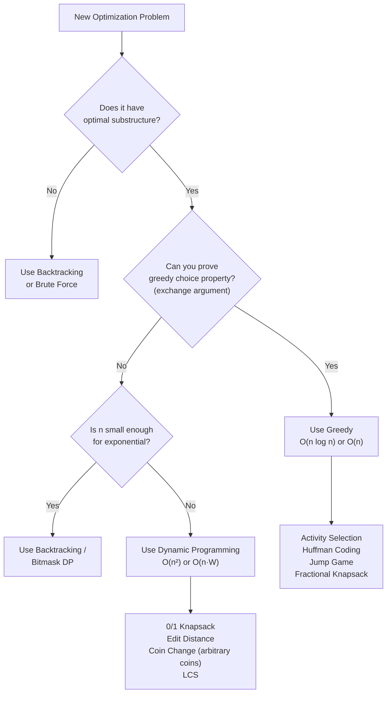

---
title: Greedy Fundamentals
aliases: [Greedy Algorithm Basics, Greedy Choice Property]
tags: [DSA, greedy, fundamentals, algorithms]
domain: DSA
difficulty: Intermediate
created: 2026-07-26
related: [DP_Fundamentals, Backtracking, Activity_Selection, Greedy_Patterns]
status: complete
---

# 🏔️ Greedy Fundamentals

> [!abstract] TL;DR
> A greedy algorithm makes the **locally optimal choice at each step**, hoping to reach a global optimum without backtracking. It works when two conditions hold: **greedy choice property** (local optimal is globally safe) and **optimal substructure**. Proving correctness requires an exchange argument or a "staying ahead" argument.

---

## Intuition — Analogy First

Imagine **hiking to a mountain summit** by always stepping in the steepest uphill direction. On a perfectly convex hill, this gets you to the top every time — the locally best step is always globally optimal.

But on a mountain range with valleys, this strategy traps you on a local peak — you'll miss the true summit because you never allow a temporarily downhill step.

This is the essence of greedy: **it works on "convex" problem structures** (where local choices never foreclose global optima) but fails on "jagged" landscapes (where you need to temporarily sacrifice to win globally — that's when you need DP or backtracking).

---

## Two Conditions for Correctness

### Condition 1: Greedy Choice Property
> The globally optimal solution can always be constructed by making locally optimal (greedy) choices.

In other words: you will **never regret** a greedy decision. Making the locally best choice at step `i` does not prevent you from reaching the global optimum.

**Proof technique — Exchange Argument:**
1. Assume there exists an optimal solution OPT that differs from the greedy solution G.
2. Find the first position where they differ.
3. Show that you can "exchange" OPT's choice for G's choice without worsening the solution.
4. Conclude G is at least as good as OPT, so G is optimal.

### Condition 2: Optimal Substructure
> The optimal solution to the whole problem contains optimal solutions to subproblems.

This is the same condition DP needs — but greedy is stronger: it doesn't just need optimal substructure, it needs to be able to determine which subproblem to solve *without* exploring alternatives first.

---

## Greedy vs DP — When to Use Which

| Criterion | Greedy | Dynamic Programming |
|---|---|---|
| **Decision reversibility** | No — commit and move on | Yes — explore all options |
| **Proof of correctness** | Exchange argument required | Optimal substructure sufficient |
| **Explores alternatives?** | No — one path | Yes — all subproblems |
| **Time complexity** | Usually O(n log n) or O(n) | Usually O(n²) or O(n × amount) |
| **When to try first** | Problem has obvious "best" local choice | When greedy fails on a counterexample |

### Counterexample — When Greedy Fails
```
Coins: [1, 3, 4], Amount: 6
Greedy: 4 + 1 + 1 = 3 coins
Optimal: 3 + 3   = 2 coins   ← greedy is WRONG
```

Greedy fails here because choosing the largest coin (4) forecloses the better combination.

### When Greedy Works
```
Coins: [1, 5, 10, 25] (standard US denominations), Amount: 41
Greedy: 25 + 10 + 5 + 1 = 4 coins   ← OPTIMAL
```

Standard denominations have the property that each coin is a multiple of all smaller ones, making greedy provably correct.

---

## How It Works

### Greedy Algorithm Template
```
Sort (or otherwise order) items by some criterion
result = empty
for each item in order:
    if item is compatible with result:
        add item to result
return result
```

The hardest part: **choosing the right ordering criterion** and **proving it's correct**.

### Mermaid — Decision Diagram: Greedy vs DP



---

## Complexity Analysis

| Algorithm | Time | Space |
|---|---|---|
| Activity Selection | O(n log n) — sorting | O(1) |
| Jump Game I | O(n) | O(1) |
| Jump Game II | O(n) | O(1) |
| Fractional Knapsack | O(n log n) — sorting | O(1) |
| Huffman Coding | O(n log n) — heap | O(n) |

---

## Implementation (Python)

```python
from typing import List


# ─── 1. Activity Selection — Maximum Non-Overlapping Intervals ────────────────
def erase_overlap_intervals(intervals: List[List[int]]) -> int:
    """
    LeetCode 435: Return min intervals to remove to make rest non-overlapping.
    Greedy: sort by END time, always keep the earliest-ending compatible interval.
    """
    if not intervals:
        return 0
    intervals.sort(key=lambda x: x[1])   # sort by end time
    count = 0          # count of intervals removed
    last_end = intervals[0][1]

    for i in range(1, len(intervals)):
        if intervals[i][0] < last_end:
            # Overlap: remove this interval (keep the earlier-ending one)
            count += 1
        else:
            # No overlap: keep this interval, update last_end
            last_end = intervals[i][1]

    return count


# ─── 2. Jump Game I (LC 55) — Can You Reach the End? ─────────────────────────
def can_jump(nums: List[int]) -> bool:
    """
    Greedy: track the farthest reachable index.
    At each position, if we can reach it, update the farthest reach.
    """
    max_reach = 0
    for i, jump in enumerate(nums):
        if i > max_reach:
            return False   # can't even reach position i
        max_reach = max(max_reach, i + jump)
    return True


# ─── 3. Jump Game II (LC 45) — Minimum Jumps to Reach End ────────────────────
def jump_game_ii(nums: List[int]) -> int:
    """
    BFS-like greedy: process each "level" (range reachable in k jumps),
    extend the frontier greedily until we cover the last index.
    """
    jumps = 0
    current_end = 0   # farthest index reachable with 'jumps' jumps
    farthest = 0      # farthest index reachable from any position so far

    for i in range(len(nums) - 1):   # don't jump from the last position
        farthest = max(farthest, i + nums[i])
        if i == current_end:          # exhausted current level → must jump
            jumps += 1
            current_end = farthest
            if current_end >= len(nums) - 1:
                break
    return jumps


# ─── 4. Gas Station (LC 134) ─────────────────────────────────────────────────
def can_complete_circuit(gas: List[int], cost: List[int]) -> int:
    """
    Greedy: if total gas >= total cost, a solution exists.
    The starting station is the one after the last "tank went negative" point.
    """
    total_surplus = 0
    current_surplus = 0
    start = 0

    for i in range(len(gas)):
        total_surplus += gas[i] - cost[i]
        current_surplus += gas[i] - cost[i]
        if current_surplus < 0:
            # Can't start from anywhere in [start..i]; reset
            start = i + 1
            current_surplus = 0

    return start if total_surplus >= 0 else -1


# ─── Quick test ──────────────────────────────────────────────────────────────
if __name__ == "__main__":
    print(erase_overlap_intervals([[1,2],[2,3],[3,4],[1,3]]))  # 1
    print(can_jump([2, 3, 1, 1, 4]))  # True
    print(can_jump([3, 2, 1, 0, 4]))  # False
    print(jump_game_ii([2, 3, 1, 1, 4]))  # 2
    print(can_complete_circuit([1,2,3,4,5], [3,4,5,1,2]))  # 3
```

---

## Dry Run / Example Trace

### Jump Game II: `nums = [2, 3, 1, 1, 4]`

```
jumps=0, current_end=0, farthest=0

i=0: farthest=max(0, 0+2)=2, i==current_end → jump! jumps=1, current_end=2
i=1: farthest=max(2, 1+3)=4, i≠current_end (1≠2)
i=2: farthest=max(4, 2+1)=4, i==current_end → jump! jumps=2, current_end=4
     current_end(4) >= len-1(4) → break

Answer: 2 jumps
```

### Activity Selection: `intervals = [[1,2],[2,3],[3,4],[1,3]]`

Sorted by end: `[[1,2],[1,3],[2,3],[3,4]]`
```
last_end=2 (keep [1,2])
[1,3]: start=1 < last_end=2 → REMOVE (count=1)
[2,3]: start=2 >= last_end=2 → keep, last_end=3
[3,4]: start=3 >= last_end=3 → keep, last_end=4

Removed: 1
```

---

## Patterns & LeetCode Applications

| Problem | Greedy Key | Why It Works |
|---|---|---|
| **Jump Game** (LC 55) | Track max reach | Reaching further never hurts |
| **Jump Game II** (LC 45) | BFS level by level | Fewest jumps = fewest levels |
| **Gas Station** (LC 134) | Reset start after deficit | If total≥0, a valid start exists |
| **Non-overlapping Intervals** (LC 435) | Sort by end, keep earliest-ending | Exchange arg: earlier end = more room |
| **Hand of Straights** (LC 846) | Greedily assign from smallest | Starting from the smallest is forced |
| **Partition Labels** (LC 763) | Track last occurrence | Extend partition to last seen char |

---

## Common Pitfalls

1. **Applying greedy without proof** — the most dangerous pitfall. Always find a counterexample or prove the exchange argument before committing. The fractional knapsack is greedy; 0/1 knapsack is not.

2. **Forgetting to sort** — most greedy algorithms require a specific sort order. Applying greedy logic without sorting first gives wrong answers.

3. **Confusing minimum-removal with maximum-selection** — "minimum intervals to remove" (LC 435) equals `n - maximum non-overlapping intervals`. They're equivalent; just be careful which direction you're counting.

4. **Gas station: checking individual stations** — greedily checking if each individual `gas[i] >= cost[i]` is wrong. You need cumulative surplus tracking.

5. **Jump Game: returning True prematurely** — `max_reach >= last_index` is the condition, but you can also exit as soon as `max_reach >= n-1`. Don't return True just because the current jump is large.

---

## Related Concepts

- [[_MOC_Greedy|↑ Section MOC]]
- [[DP_Fundamentals]] — DP is the fallback when greedy choice property doesn't hold
- [[Backtracking]] — exhaustive search when neither greedy nor DP fits
- [[Activity_Selection]] — deep dive into interval scheduling
- [[Greedy_Patterns]] — catalog of all greedy families
- [[Huffman_Coding]] — a beautiful greedy proof by exchange argument

---

## Review Questions

1. **State the two conditions required for a greedy algorithm to be correct.** Give a concrete example of a problem that satisfies both conditions and one that satisfies only optimal substructure (requiring DP instead).

2. **Outline the exchange argument proof for Activity Selection** (sorting by end time and always picking the earliest-ending compatible interval). Be specific about what "exchanging" means and why the resulting solution is no worse.

3. **Why does Coin Change (with arbitrary denominations) require DP but Coin Change with US denominations (1, 5, 10, 25) work with greedy?** What structural property of US denominations enables the greedy approach?

---

## Sources

- [LeetCode 55 — Jump Game](https://leetcode.com/problems/jump-game/)
- [LeetCode 45 — Jump Game II](https://leetcode.com/problems/jump-game-ii/)
- [LeetCode 435 — Non-overlapping Intervals](https://leetcode.com/problems/non-overlapping-intervals/)
- CLRS Chapter 16 — Greedy Algorithms
- Kleinberg & Tardos, *Algorithm Design* Chapter 4 — Greedy Algorithms

#dsa #greedy #fundamentals #exchange-argument #intermediate
