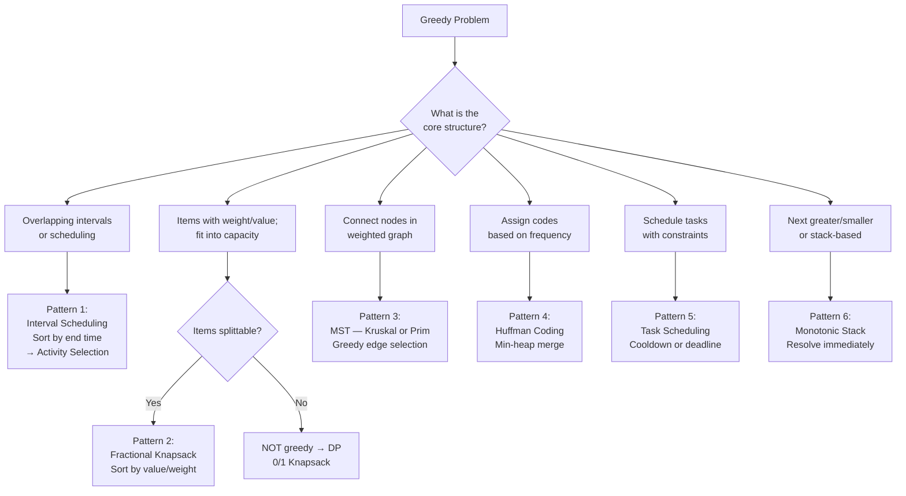

---
title: Greedy Patterns — The 6 Families
aliases: [Greedy Pattern Families, Greedy Algorithm Patterns]
tags: [DSA, greedy, patterns, overview, algorithms]
domain: DSA
difficulty: Intermediate
created: 2026-07-26
related: [Greedy_Fundamentals, Activity_Selection, Minimum_Spanning_Tree, Monotonic_Stack, Huffman_Coding]
status: complete
---

# 🧭 Greedy Patterns — The 6 Families

> [!abstract] TL;DR
> Greedy problems fall into **6 recognizable families**. Identify the family using: "What is being optimized? What is the natural ordering?" The exchange argument is your proof tool — if you can prove "swapping the greedy choice with any alternative is never beneficial," your algorithm is correct. If you can't prove it, use DP.

---

## Intuition — Analogy First

An experienced chess player doesn't analyze every possible game tree — they recognize **patterns** (pin, fork, discovered attack) and apply the right tactical idea. Similarly, a greedy expert recognizes "this looks like an interval scheduling problem" or "this is fractional knapsack disguised" — and applies the canonical solution.

The decision guide: **Can you prove an exchange argument?** If swapping your greedy choice with any other choice never helps (and sometimes hurts), your greedy is correct.

---

## The 6 Greedy Families

### Pattern 1 — Interval Scheduling

**Signal:** non-overlapping selection, meeting scheduling, event coverage.
**Key:** sort by **end time**, always pick the earliest-ending compatible item.
**Why:** finishing early leaves the most room for future selections.

| Variant | Sort Key | Goal |
|---|---|---|
| Max non-overlapping | End time | Max intervals selected |
| Min removals | End time | n - max non-overlapping |
| Min meeting rooms | Start time + heap | Max simultaneous overlap |
| Min arrows | End time | Same as max non-overlapping |

See [[Activity_Selection]] for the full deep dive.

---

### Pattern 2 — Fractional Knapsack

**Signal:** maximize value subject to a weight constraint; items can be **split**.
**Key:** sort by **value/weight ratio** (descending), take greedily until full.
**Why:** taking the highest ratio first maximizes value per unit of weight used.

**Important:** fractional knapsack works with greedy; **0/1 knapsack does NOT** (use DP).

```python
def fractional_knapsack(items: list, capacity: int) -> float:
    """
    items = [(value, weight), ...]
    Returns max value that fits in capacity (items splittable).
    """
    # Sort by value/weight ratio descending
    items.sort(key=lambda x: x[0] / x[1], reverse=True)
    total_value = 0.0
    remaining = capacity

    for value, weight in items:
        if remaining <= 0:
            break
        if weight <= remaining:
            total_value += value
            remaining -= weight
        else:
            # Take fraction of this item
            total_value += value * (remaining / weight)
            remaining = 0

    return total_value
```

| Problem | Greedy? | Why |
|---|---|---|
| Fractional Knapsack | Yes | Items splittable → exchange arg holds |
| 0/1 Knapsack | No | Items indivisible → must try all subsets |
| Scheduling to minimize lateness | Yes | Sort by deadline |

---

### Pattern 3 — Minimum Spanning Tree

**Signal:** connect all nodes in a weighted graph with minimum total edge weight.
**Two greedy algorithms, both provably optimal:**

**Kruskal's Algorithm:**
1. Sort all edges by weight ascending
2. Greedily add edge if it doesn't create a cycle (Union-Find)
3. Stop when `n-1` edges added

**Prim's Algorithm:**
1. Start from any node
2. Greedily add the cheapest edge connecting a visited node to an unvisited node (min-heap)
3. Repeat until all nodes visited

```python
# Kruskal's MST using Union-Find
def kruskal_mst(n: int, edges: list) -> int:
    """edges = [(weight, u, v)]. Returns total MST weight."""
    edges.sort()
    parent = list(range(n))
    rank = [0] * n

    def find(x):
        while parent[x] != x:
            parent[x] = parent[parent[x]]   # path compression
            x = parent[x]
        return x

    def union(x, y):
        rx, ry = find(x), find(y)
        if rx == ry:
            return False   # same component — would create cycle
        if rank[rx] < rank[ry]:
            rx, ry = ry, rx
        parent[ry] = rx
        if rank[rx] == rank[ry]:
            rank[rx] += 1
        return True

    total = 0
    edges_used = 0
    for weight, u, v in edges:
        if union(u, v):
            total += weight
            edges_used += 1
            if edges_used == n - 1:
                break
    return total
```

---

### Pattern 4 — Huffman Encoding

**Signal:** assign variable-length codes to minimize total encoded bits, given frequencies.
**Key:** min-heap merge — always merge two lowest-frequency nodes.

See [[Huffman_Coding]] for the full deep dive.

**Related disguises:**
- "Minimum cost to connect sticks" (LC 1167) = Huffman directly
- "Minimum cost to merge files" = Huffman

---

### Pattern 5 — Task Scheduling

**Signal:** schedule tasks with deadlines/penalties/cooldowns to optimize throughput or minimize lateness.

**Two sub-patterns:**

**5a. Minimize Maximum Lateness (sort by deadline):**
- Jobs have deadlines and processing times; no preemption
- Sort by deadline ascending → minimize maximum lateness (exchange arg proof)

**5b. CPU Task Scheduler with Cooldown (frequency-based):**
- Tasks must have ≥ k idle slots between same-task repeats
- Fill most-frequent tasks first in each "frame"
- Answer = max(total tasks, (max_freq - 1) * (k+1) + count of tasks with max_freq)

```python
from collections import Counter

def task_scheduler(tasks: list, n: int) -> int:
    """
    LeetCode 621: Min time to execute all tasks with cooldown n.
    Key insight: most frequent task determines the frame structure.
    """
    freq = Counter(tasks)
    max_freq = max(freq.values())
    count_max = sum(1 for v in freq.values() if v == max_freq)

    # Frame-based: (max_freq-1) full frames + last frame
    min_time = (max_freq - 1) * (n + 1) + count_max
    return max(min_time, len(tasks))   # can't be less than total tasks


def reorganize_string(s: str) -> str:
    """
    LeetCode 767: Rearrange so no two adjacent chars are same.
    Greedy: always place the most frequent remaining character.
    """
    freq = Counter(s)
    import heapq
    heap = [(-cnt, char) for char, cnt in freq.items()]
    heapq.heapify(heap)

    result = []
    prev_cnt, prev_char = 0, ""

    while heap:
        cnt, char = heapq.heappop(heap)
        result.append(char)
        if prev_cnt < 0:   # previous char can be re-added
            heapq.heappush(heap, (prev_cnt, prev_char))
        prev_cnt, prev_char = cnt + 1, char   # decrement count (negative)

    return "".join(result) if len(result) == len(s) else ""
```

---

### Pattern 6 — Monotonic Stack (Greedy)

**Signal:** "next greater/smaller element," "largest rectangle," "water trapping," temperature problems.
**Key:** maintain a stack that is always monotonically increasing or decreasing; pop when the invariant breaks.
**Why greedy:** when we find an element larger than the stack top, we've found the "next greater" for all stack elements that are smaller — we process them immediately (greedy decision: resolve now, no need to wait).

```python
def daily_temperatures(temperatures: list) -> list:
    """
    LeetCode 739: For each day, how many days until a warmer day?
    Monotonic stack: decreasing temperature stack.
    Greedy: resolve as soon as we find a warmer day.
    """
    n = len(temperatures)
    result = [0] * n
    stack = []   # indices, temperatures[stack[-1]] is decreasing

    for i, temp in enumerate(temperatures):
        # Pop all days that are colder than today
        while stack and temperatures[stack[-1]] < temp:
            idx = stack.pop()
            result[idx] = i - idx   # days until warmer
        stack.append(i)

    return result


def largest_rectangle_in_histogram(heights: list) -> int:
    """
    LeetCode 84: Largest rectangle in histogram.
    Greedy: process bar when we find a shorter bar to its right.
    """
    stack = []   # indices, heights[stack[-1]] is increasing
    max_area = 0
    heights.append(0)   # sentinel to flush remaining bars

    for i, h in enumerate(heights):
        while stack and heights[stack[-1]] > h:
            height = heights[stack.pop()]
            width = i if not stack else i - stack[-1] - 1
            max_area = max(max_area, height * width)
        stack.append(i)

    return max_area
```

See [[Monotonic_Stack]] for the full deep dive.

---

## Mermaid — Greedy Pattern Classification Flowchart



---

## Complexity Analysis

| Pattern | Time | Space | Key Structure |
|---|---|---|---|
| Interval Scheduling | O(n log n) | O(1) | Sort + scan |
| Fractional Knapsack | O(n log n) | O(1) | Sort by ratio |
| Kruskal's MST | O(E log E) | O(V) | Sort + Union-Find |
| Prim's MST | O(E log V) | O(V) | Min-heap |
| Huffman Coding | O(n log n) | O(n) | Min-heap |
| Task Scheduler | O(n) | O(1) | Math formula |
| Monotonic Stack | O(n) | O(n) | Stack |

---

## Implementation (Python)

```python
from collections import Counter
import heapq

# ─── Task Scheduler (LC 621) — already shown above ───────────────────────────

# ─── Rearrange String K Distance Apart (LC 358) ──────────────────────────────
def rearrange_string_k_distance(s: str, k: int) -> str:
    """
    Rearrange characters so same chars are at least k apart.
    Greedy: always pick the most frequent char not in cooldown.
    """
    if k == 0:
        return s
    freq = Counter(s)
    heap = [(-cnt, char) for char, cnt in freq.items()]
    heapq.heapify(heap)

    result = []
    cooldown = []   # (release_time, count, char)

    i = 0
    while heap or cooldown:
        # Release characters whose cooldown has expired
        if cooldown and cooldown[0][0] <= i:
            _, cnt, char = heapq.heappop(cooldown)
            heapq.heappush(heap, (cnt, char))

        if not heap:
            return ""   # impossible

        cnt, char = heapq.heappop(heap)
        result.append(char)
        cnt += 1   # decrement (negative count)
        if cnt < 0:
            heapq.heappush(cooldown, (i + k, cnt, char))
        i += 1

    return "".join(result)


# ─── Minimum Spanning Tree — Prim's ──────────────────────────────────────────
def prim_mst(n: int, edges: list) -> int:
    """
    Prim's MST using adjacency list + min-heap.
    edges = [(u, v, weight)]. Returns total MST weight.
    """
    from collections import defaultdict
    adj = defaultdict(list)
    for u, v, w in edges:
        adj[u].append((w, v))
        adj[v].append((w, u))

    visited = set()
    heap = [(0, 0)]   # (weight, node), start from node 0
    total = 0

    while heap and len(visited) < n:
        weight, node = heapq.heappop(heap)
        if node in visited:
            continue
        visited.add(node)
        total += weight
        for w, neighbor in adj[node]:
            if neighbor not in visited:
                heapq.heappush(heap, (w, neighbor))

    return total if len(visited) == n else -1   # -1 if graph disconnected


# ─── Quick test ──────────────────────────────────────────────────────────────
if __name__ == "__main__":
    print(task_scheduler(["A","A","A","B","B","B"], 2))  # 8
    print(reorganize_string("aab"))                       # "aba"
    print(reorganize_string("aaab"))                      # ""

    # MST: 4 nodes, edges with weights
    edges = [(0, 1, 10), (0, 2, 6), (0, 3, 5), (1, 3, 15), (2, 3, 4)]
    print(kruskal_mst(4, [(w, u, v) for u, v, w in edges]))  # 19
```

---

## Dry Run / Example Trace

### Task Scheduler: `tasks = ["A","A","A","B","B","B"]`, `n = 2`

```
freq = {A: 3, B: 3}
max_freq = 3, count_max = 2 (both A and B appear 3 times)

Frame-based calculation:
  Frames = max_freq - 1 = 2 full frames
  Each frame size = n + 1 = 3
  Full frames: 2 × 3 = 6 slots → [A,B,_] [A,B,_]
  Last partial frame: count_max = 2 → [A,B]
  Total = 6 + 2 = 8

Verify with total tasks = 6 ≤ 8

Schedule: A B _ A B _ A B   (length 8, _ = idle)
```

### Monotonic Stack Trace: `temperatures = [73, 74, 75, 71, 69, 72, 76, 73]`

```
i=0, T=73: stack=[] → push 0.    stack=[0]
i=1, T=74: 73<74 → pop 0, result[0]=1-0=1. push 1. stack=[1]
i=2, T=75: 74<75 → pop 1, result[1]=2-1=1. push 2. stack=[2]
i=3, T=71: 75>71 → just push 3. stack=[2,3]
i=4, T=69: 71>69 → just push 4. stack=[2,3,4]
i=5, T=72: 69<72 → pop 4, result[4]=5-4=1.
           71<72 → pop 3, result[3]=5-3=2.
           75>72 → stop. push 5. stack=[2,5]
i=6, T=76: 72<76 → pop 5, result[5]=6-5=1.
           75<76 → pop 2, result[2]=6-2=4.
           stack empty. push 6. stack=[6]
i=7, T=73: 76>73 → just push 7. stack=[6,7]

result = [1, 1, 4, 2, 1, 1, 0, 0]
```

---

## Patterns & LeetCode Applications

### Quick Reference by Pattern

```
Pattern 1 (Intervals) → Non-overlapping Intervals (435), Meeting Rooms II (253)
Pattern 2 (Frac. Knapsack) → Fractional Knapsack, Assign Cookies (455)
Pattern 3 (MST) → Min Cost to Connect Points (1584), Redundant Connection (684)
Pattern 4 (Huffman) → Connect Sticks (1167), Huffman Coding
Pattern 5 (Task Sched) → Task Scheduler (621), Reorganize String (767)
Pattern 6 (Mono Stack) → Daily Temperatures (739), Largest Rectangle (84)
```

### Exchange Argument Decision Guide

| Can you prove... | → Use |
|---|---|
| Swapping any two choices (when greedy differs from some OPT) leaves the solution no worse | Greedy |
| Greedy fails for a small example | DP |
| All items are identical and the choice is a threshold | Greedy (binary search) |
| You need to "undo" a past decision | Backtracking |

---

## Common Pitfalls

1. **Applying greedy to 0/1 knapsack** — the fractional knapsack works greedily, but 0/1 knapsack (items cannot be split) requires DP. The value/weight sorting argument breaks when you can't take a fraction.

2. **MST vs Shortest Path confusion** — MST minimizes total edge weight to connect all nodes. Dijkstra finds the shortest path from one source. They solve different problems; don't conflate them.

3. **Task Scheduler: using the wrong formula** — the answer is `max(len(tasks), (max_freq - 1) * (n + 1) + count_max)`. The "max" ensures you never return less than the total number of tasks (when tasks fill all idle slots naturally).

4. **Monotonic stack: mixing up increasing vs decreasing** — for "next greater element," maintain a **decreasing** stack (pop when you find something larger). For "next smaller element," maintain an **increasing** stack. Getting this backwards gives wrong results.

5. **Reorganize String: not re-adding cooled-down chars** — the most common bug is forgetting to re-add a character to the heap after its cooldown expires. Without this, valid solutions might return empty string incorrectly.

---

## Related Concepts

- [[_MOC_Greedy|↑ Section MOC]]
- [[Greedy_Fundamentals]] — conditions, proofs, greedy vs DP decision guide
- [[Activity_Selection]] — Pattern 1 deep dive
- [[Huffman_Coding]] — Pattern 4 deep dive
- [[Minimum_Spanning_Tree]] — Pattern 3 deep dive (Kruskal, Prim, Union-Find)
- [[Monotonic_Stack]] — Pattern 6 deep dive

---

## Review Questions

1. **For each of the 6 patterns, name one problem where the greedy works and one related problem where the greedy fails (requiring DP or backtracking).** What specifically breaks the greedy choice property in the failing cases?

2. **Prove the correctness of Task Scheduler's formula** `(max_freq - 1) * (n + 1) + count_max`. Draw the "frame" picture. Why does taking `max(formula, len(tasks))` handle the case where tasks are dense?

3. **Why does Kruskal's algorithm produce a minimum spanning tree?** State the cut property of MSTs and explain how it guarantees that each greedily added edge is always in some MST.

---

## Sources

- [LeetCode 621 — Task Scheduler](https://leetcode.com/problems/task-scheduler/)
- [LeetCode 767 — Reorganize String](https://leetcode.com/problems/reorganize-string/)
- [LeetCode 739 — Daily Temperatures](https://leetcode.com/problems/daily-temperatures/)
- [LeetCode 84 — Largest Rectangle in Histogram](https://leetcode.com/problems/largest-rectangle-in-histogram/)
- CLRS Chapter 16 — Greedy Algorithms
- Kleinberg & Tardos, *Algorithm Design* Chapter 4

#dsa #greedy #patterns #overview #intermediate #meta #task-scheduling #monotonic-stack
