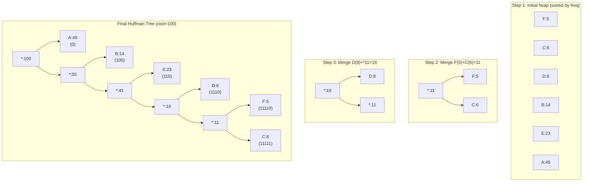

---
title: Huffman Coding
aliases: [Huffman Encoding, Huffman Tree, Optimal Prefix-Free Code]
tags: [DSA, greedy, huffman, compression, prefix-free-codes, binary-heap]
domain: DSA
difficulty: Intermediate
created: 2026-07-26
related: [Greedy_Fundamentals, Binary_Heap, Priority_Queue, Greedy_Patterns]
status: complete
---

# 🗜️ Huffman Coding

> [!abstract] TL;DR
> Huffman coding builds an **optimal prefix-free variable-length encoding** by repeatedly merging the two lowest-frequency symbols into a binary tree. High-frequency symbols get short codes; rare symbols get long codes. Time: O(n log n) using a min-heap. Proven optimal among all prefix-free codes by exchange argument. Used in ZIP, GZIP, JPEG, and MP3.

---

## Intuition — Analogy First

Imagine assigning **parking spaces** to employees based on how often they come to the office:

- The employee who comes **every day** gets the **closest spot** — just steps from the door (short code: `0`).
- The employee who comes **once a week** gets the second-closest spot (code: `10`).
- The employee who comes **once a month** parks at the **far end of the lot** (long code: `1100`).

You're minimizing the total walking distance (total bits transmitted) across all visits (all characters encoded). The greedy insight: **always merge the two least frequent nodes** — the rarest symbols will naturally sink to the deepest leaves of the resulting tree.

---

## Key Concepts

### Prefix-Free Codes
A code is **prefix-free** if no codeword is a prefix of another codeword. This guarantees unambiguous decoding — you never need to "look ahead" to know where one code ends and another begins.

Examples:
- `{a=0, b=10, c=11}` is prefix-free ✓
- `{a=0, b=01, c=10}` is NOT prefix-free — `a`'s code `0` is a prefix of `b`'s code `01`

### Why a Binary Tree?
Any prefix-free code corresponds to a binary tree where:
- Left edge = `0`, Right edge = `1`
- Each symbol is a **leaf** (no symbol is an ancestor of another → prefix-free)
- The code for a symbol = path from root to its leaf

### Expected Code Length
For a code with symbol frequencies `f_i` and code depths `d_i`:

```
Expected bits per symbol = ∑ (f_i × d_i)
```

Huffman minimizes this sum. Equivalently, it minimizes total bits for encoding a message of fixed length.

---

## How It Works

### Algorithm
1. Create a leaf node for each symbol, store in a **min-heap** keyed by frequency
2. While heap has more than 1 node:
   a. Extract the two nodes with **lowest frequency** (`left`, `right`)
   b. Create a new **internal node** with frequency = `freq(left) + freq(right)`
   c. Insert the new node back into the heap
3. The remaining node is the **Huffman tree root**
4. Traverse the tree: left edge = `0`, right edge = `1` → assign codes to leaves

### Why Greedy is Optimal (Exchange Argument Sketch)
- Suppose OPT assigns the two rarest symbols to different depths, not the deepest.
- We can swap them toward the deepest positions without increasing total cost (rarer symbols × longer codes = same or less than more frequent symbols × those longer codes).
- Therefore, the two rarest symbols should always be at the deepest level — exactly what Huffman does by merging them first.

### Mermaid — Huffman Tree Construction



> Character frequencies: A=45, B=14, C=6, D=8, E=23, F=5 (from CLRS example)

---

## Complexity Analysis

| Step | Time | Space |
|---|---|---|
| Build initial heap | O(n) | O(n) |
| Extract/insert loop (n-1 merges) | O(n log n) | O(n) |
| Code assignment (tree traversal) | O(n) | O(n) |
| **Total** | **O(n log n)** | **O(n)** |

- `n` = number of distinct symbols
- Each merge: 2 extractions + 1 insertion = O(log n) per merge, n-1 merges total

---

## Implementation (Python)

```python
import heapq
from typing import Dict, Optional


# ─── Huffman Tree Node ────────────────────────────────────────────────────────
class HuffmanNode:
    def __init__(self, char: Optional[str], freq: int,
                 left=None, right=None):
        self.char = char
        self.freq = freq
        self.left = left
        self.right = right

    def __lt__(self, other):
        return self.freq < other.freq   # for heap comparison


# ─── 1. Build Huffman Tree ────────────────────────────────────────────────────
def build_huffman_tree(freq_map: Dict[str, int]) -> HuffmanNode:
    """
    Build Huffman tree from character frequency map.
    Returns the root node.
    """
    heap = [HuffmanNode(char, freq) for char, freq in freq_map.items()]
    heapq.heapify(heap)   # O(n)

    while len(heap) > 1:
        left = heapq.heappop(heap)    # lowest frequency
        right = heapq.heappop(heap)   # second lowest
        merged = HuffmanNode(
            char=None,
            freq=left.freq + right.freq,
            left=left,
            right=right
        )
        heapq.heappush(heap, merged)

    return heap[0]   # root of Huffman tree


# ─── 2. Generate Codes (DFS) ─────────────────────────────────────────────────
def generate_codes(node: Optional[HuffmanNode],
                   code: str = "",
                   codes: Dict[str, str] = None) -> Dict[str, str]:
    """Traverse Huffman tree to assign binary codes to each leaf."""
    if codes is None:
        codes = {}
    if node is None:
        return codes
    if node.char is not None:          # leaf node
        codes[node.char] = code or "0"  # single-character edge case
        return codes
    generate_codes(node.left, code + "0", codes)
    generate_codes(node.right, code + "1", codes)
    return codes


# ─── 3. Encode ───────────────────────────────────────────────────────────────
def encode(text: str, codes: Dict[str, str]) -> str:
    """Encode text using Huffman codes. Returns binary string."""
    return "".join(codes[char] for char in text)


# ─── 4. Decode ───────────────────────────────────────────────────────────────
def decode(encoded: str, root: HuffmanNode) -> str:
    """Decode binary string using Huffman tree."""
    result = []
    node = root
    for bit in encoded:
        node = node.left if bit == "0" else node.right
        if node.char is not None:   # reached a leaf
            result.append(node.char)
            node = root             # reset to root
    return "".join(result)


# ─── 5. Compute Expected Code Length ─────────────────────────────────────────
def expected_code_length(codes: Dict[str, str],
                          freq_map: Dict[str, int]) -> float:
    """Average bits per character weighted by frequency."""
    total_freq = sum(freq_map.values())
    total_bits = sum(freq_map[c] * len(codes[c]) for c in freq_map)
    return total_bits / total_freq


# ─── Full pipeline ────────────────────────────────────────────────────────────
def huffman_encode_decode(text: str):
    """Full Huffman encode/decode demonstration."""
    # Step 1: count frequencies
    from collections import Counter
    freq_map = dict(Counter(text))

    # Step 2: build tree and codes
    root = build_huffman_tree(freq_map)
    codes = generate_codes(root)

    # Step 3: encode
    encoded = encode(text, codes)

    # Step 4: decode
    decoded = decode(encoded, root)

    print(f"Original:  {text}")
    print(f"Codes:     {codes}")
    print(f"Encoded:   {encoded}")
    print(f"Decoded:   {decoded}")
    print(f"Original bits: {len(text) * 8} (fixed 8-bit ASCII)")
    print(f"Huffman bits:  {len(encoded)}")
    print(f"Compression:   {len(encoded) / (len(text) * 8):.1%}")
    avg = expected_code_length(codes, freq_map)
    print(f"Avg code length: {avg:.2f} bits/char")
    return codes, encoded, decoded


# ─── Quick test ──────────────────────────────────────────────────────────────
if __name__ == "__main__":
    huffman_encode_decode("abracadabra")
    print()
    # CLRS example: A=45, B=14, C=6, D=8, E=23, F=5
    freq = {"A": 45, "B": 14, "C": 6, "D": 8, "E": 23, "F": 5}
    root = build_huffman_tree(freq)
    codes = generate_codes(root)
    print("CLRS codes:", codes)
    # Expected: A=0, B=101, C=1100, D=1101, E=111, F=1100 (or mirror)
```

---

## Dry Run / Example Trace

**Input:** `text = "aabbbcccc"` → frequencies: `{a:2, b:3, c:4}`

```
Initial heap (sorted by freq): [a:2, b:3, c:4]

Merge 1: Extract a(2) + b(3) → internal node *:5
         Heap: [c:4, *:5]

Merge 2: Extract c(4) + *:5 → root *:9
         Heap: [*:9]

Tree structure:
        *:9
       /   \
     c:4   *:5
           /  \
         a:2  b:3

Codes (left=0, right=1):
  c → 0
  a → 10
  b → 11

Encoding "aabbbcccc":
  a=10, a=10, b=11, b=11, b=11, c=0, c=0, c=0, c=0
  = "10 10 11 11 11 0 0 0 0" = 18 bits

Fixed 8-bit ASCII would use: 9 × 8 = 72 bits
Compression: 18/72 = 25% (75% reduction)
```

---

## Patterns & LeetCode Applications

| Problem | Connection |
|---|---|
| **Reorganize String** (LC 767) | Always pick the most frequent remaining char (greedy, not Huffman) |
| **Task Scheduler** (LC 621) | Idle slots depend on most frequent task — frequency-based greedy |
| **Minimum Cost to Connect Sticks** (LC 1167) | Directly = Huffman! Each merge costs freq(left)+freq(right) |
| **Top K Frequent Elements** (LC 347) | Frequency ranking — heapq used similarly |
| **Encode/Decode** general | Prefix-free code design |

### Minimum Cost to Connect Sticks (LC 1167)
This problem IS Huffman coding in disguise. You must merge sticks into one; each merge costs the sum of the two sticks merged. The Huffman algorithm minimizes total merge cost.

```python
def connect_sticks(sticks: list) -> int:
    heapq.heapify(sticks)
    total = 0
    while len(sticks) > 1:
        a = heapq.heappop(sticks)
        b = heapq.heappop(sticks)
        cost = a + b
        total += cost
        heapq.heappush(sticks, cost)
    return total
```

---

## Common Pitfalls

1. **Forgetting the single-character edge case** — if the alphabet has only one symbol, the Huffman tree has a single leaf with no path. Assign code `"0"` explicitly; otherwise `generate_codes` returns an empty string for it.

2. **Heap comparisons with equal frequencies** — Python's `heapq` requires a total ordering. When two nodes have equal frequency, comparing `HuffmanNode` objects fails unless `__lt__` is defined. Always define `__lt__` by frequency (and use a tiebreaker like insertion order if needed).

3. **Confusing prefix-free with uniquely decodable** — all prefix-free codes are uniquely decodable, but not all uniquely decodable codes are prefix-free. Huffman produces prefix-free codes (and thus uniquely decodable), but verifying general unique decodability is harder.

4. **Expecting the same Huffman tree always** — when two nodes have equal frequency, either can be chosen as left or right child. Different tie-breaking produces different (but equally optimal) trees. Don't compare your code with expected output when frequencies tie.

5. **Huffman is optimal for symbol-by-symbol coding only** — Huffman is optimal among prefix-free codes that encode **one symbol at a time**. Arithmetic coding can do better by encoding sequences as a whole.

---

## Related Concepts

- [[_MOC_Greedy|↑ Section MOC]]
- [[Greedy_Fundamentals]] — exchange argument proving Huffman's optimality
- [[Binary_Heap]] — min-heap is the core data structure
- [[Priority_Queue]] — heap operations: heappush, heappop, heapify
- [[Greedy_Patterns]] — Huffman is Pattern 4 in the greedy catalog

---

## Review Questions

1. **Prove informally (via exchange argument) that the two rarest symbols must occupy the deepest positions in an optimal prefix-free code tree.** Suppose they don't — show how swapping them downward reduces or maintains total expected code length.

2. **How would you decode a Huffman-encoded binary string if you only have the code table (not the tree)?** Describe the decoding procedure using only the code dictionary.

3. **Why is Huffman coding's optimality limited to prefix-free codes, and what techniques (like arithmetic coding) achieve better compression?** What does Huffman's expected code length converge to as input size grows?

---

## Sources

- [LeetCode 1167 — Minimum Cost to Connect Sticks](https://leetcode.com/problems/minimum-cost-to-connect-sticks/)
- Huffman, D. A. (1952). *A Method for the Construction of Minimum-Redundancy Codes.* Proceedings of the IRE.
- CLRS Chapter 16.3 — Huffman codes
- Cover & Thomas, *Elements of Information Theory*, Chapter 5

#dsa #greedy #huffman #compression #prefix-free-codes #min-heap #intermediate
