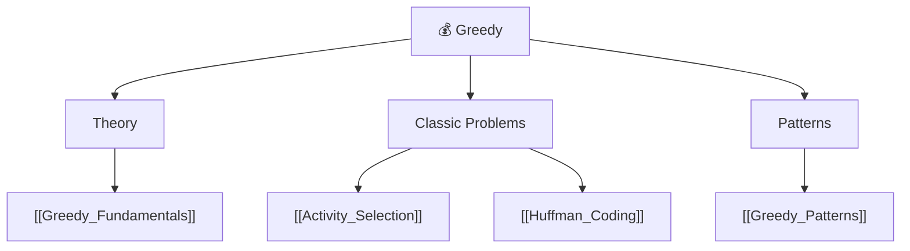

# 💰 Greedy — Map of Content

> [!abstract] What This Section Covers
> Greedy algorithms make the locally optimal choice at each step and never reconsider — when this strategy is provably correct, it yields elegant, efficient solutions. This section covers the theoretical foundation for proving correctness (exchange argument, greedy stays ahead), two canonical problems that demonstrate greedy reasoning (activity selection and Huffman coding), and a pattern reference for recognising greedy-solvable problems in the wild. Crucially, this section also explains when greedy fails and DP is required — a distinction that decides the entire approach to many interview problems.

## Concept Map

## Learning Path

1. [[Greedy_Fundamentals]] — Greedy choice property; optimal substructure; exchange argument proof technique
2. [[Activity_Selection]] — Interval scheduling; why sorting by end time is optimal; proof by exchange
3. [[Huffman_Coding]] — Variable-length prefix codes; priority-queue construction; optimality proof
4. [[Greedy_Patterns]] — Pattern catalogue: intervals, fractional problems, graph greedy (MST, Dijkstra)

## All Notes at a Glance

| Note | Summary | Difficulty |
|------|---------|------------|
| [[Greedy_Fundamentals]] | Greedy choice property; when greedy works vs fails | Intermediate |
| [[Activity_Selection]] | Max non-overlapping intervals by earliest end time | Intermediate |
| [[Huffman_Coding]] — | Optimal prefix code via min-heap greedy construction | Intermediate |
| [[Greedy_Patterns]] | Classification: intervals, assignments, graph, fractional | Intermediate (reference) |

## Key Questions This Section Answers

- What is the exchange argument and how do you use it to prove a greedy strategy is optimal?
- Why does sorting activity intervals by end time (not start time or duration) maximise the count?
- When does a greedy algorithm fail and you must use DP instead — what is the structural difference?
- How does Huffman coding guarantee minimum average code length?
- What makes Dijkstra and Kruskal's MST algorithm greedy algorithms?
- How do you identify "greedy works here" vs "I need DP" from a problem statement?

## Related Sections

- [[_MOC_DSA_Master|↑ DSA Master MOC]]
- [[_MOC_Dynamic_Programming]] — DP is the alternative when greedy cannot be proven optimal
- [[_MOC_Graphs]] — MST algorithms (Prim's, Kruskal's) and Dijkstra are greedy graph algorithms

#MOC #DSA #greedy
