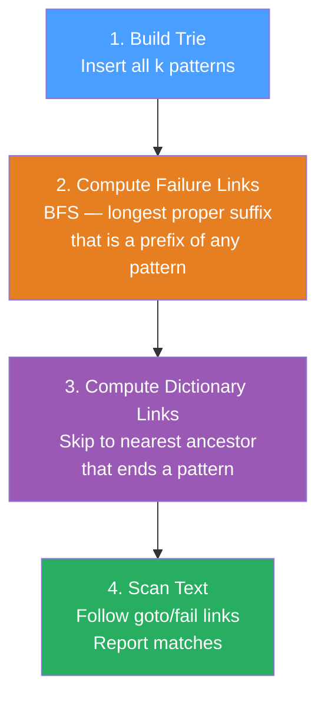

# Aho-Corasick Algorithm

> **Analogy:** KMP finds one pattern in O(n+m). Aho-Corasick is KMP generalised to k patterns simultaneously — it builds a "failure-link trie" that never backtracks, scanning the text exactly once regardless of how many patterns you search for.

## The Problem

Given a text of length n and k patterns with total length m, find all occurrences of every pattern. Naïve: O(n·m). KMP per pattern: O(n·k + m). Aho-Corasick: **O(n + m + output_size)**.

## Algorithm Structure



## Key Components

| Component | Purpose | Computed via |
|-----------|---------|-------------|
| **Trie (goto)** | Stores all patterns char by char | Insert each pattern |
| **Failure link** | Longest suffix = prefix of any trie node | BFS from root |
| **Output link** | Nearest ancestor that ends a pattern | Built alongside failure links |
| **goto function** | Next state for (state, char) — uses failure link on miss | Precomputed for all chars |

## Implementation (Python)

```python
from collections import deque

class AhoCorasick:
    def __init__(self):
        self.goto = [{}]   # goto[state][char] = next_state
        self.fail = [0]    # failure link
        self.output = [[]] # patterns ending at state

    def add_pattern(self, pattern, pid):
        state = 0
        for ch in pattern:
            if ch not in self.goto[state]:
                self.goto[state][ch] = len(self.goto)
                self.goto.append({})
                self.fail.append(0)
                self.output.append([])
            state = self.goto[state][ch]
        self.output[state].append(pid)

    def build(self):
        q = deque()
        # Depth-1 nodes: failure = root
        for ch, s in self.goto[0].items():
            self.fail[s] = 0
            q.append(s)
        while q:
            r = q.popleft()
            for ch, s in self.goto[r].items():
                q.append(s)
                state = self.fail[r]
                while state and ch not in self.goto[state]:
                    state = self.fail[state]
                self.fail[s] = self.goto[state].get(ch, 0)
                if self.fail[s] == s:
                    self.fail[s] = 0
                # merge output of failure link
                self.output[s] += self.output[self.fail[s]]

    def search(self, text):
        state, results = 0, []
        for i, ch in enumerate(text):
            while state and ch not in self.goto[state]:
                state = self.fail[state]
            state = self.goto[state].get(ch, 0)
            for pid in self.output[state]:
                results.append((i, pid))
        return results

# Usage
ac = AhoCorasick()
patterns = ["he", "she", "his", "hers"]
for i, p in enumerate(patterns):
    ac.add_pattern(p, i)
ac.build()
print(ac.search("ahishers"))
# → [(2,'his'), (3,'she'), (3,'he'), (7,'hers')]
```

## Complexity

| Phase | Time | Space |
|-------|------|-------|
| Build trie | O(m · |Σ|) | O(m · |Σ|) |
| Build failure links | O(m · |Σ|) | — |
| Search text | O(n + output) | O(m) |
| **Total** | **O(n + m + output)** | **O(m · |Σ|)** |

## Trade-offs vs Alternatives

| Algorithm | Patterns | Time | Notes |
|-----------|---------|------|-------|
| KMP | 1 | O(n+m) | Standard single-pattern |
| [[Z_Algorithm]] | 1 | O(n+m) | Alternative to KMP |
| [[String_Hashing]] | k | O(n·k) avg | Simpler, hash collisions |
| **Aho-Corasick** | **k** | **O(n+m)** | **Optimal multi-pattern** |
| [[Suffix_Array]] | k | O(m log m + k log m) | Better for offline queries |

## Classic CP Applications

1. **Dictionary matching** — find all dictionary words in a text
2. **DNA pattern scanning** — search k probes over a genome in one pass
3. **Spam filter** — scan a message for k banned phrases
4. **Competitive Programming** — "How many strings from set P appear in text T as substrings?"

## Review Questions

1. Why is the failure link analogous to KMP's failure function?
2. What does the output (dictionary) link optimise compared to just following failure links?
3. How does the `goto` function handle characters not in the trie? Why does this matter for O(n) scan?
4. What is the space cost if |Σ| = 26 and total pattern length m = 10,000?
5. When would you prefer Suffix Array over Aho-Corasick?

---

#DSA #Strings #PatternMatching #CompetitiveProgramming
