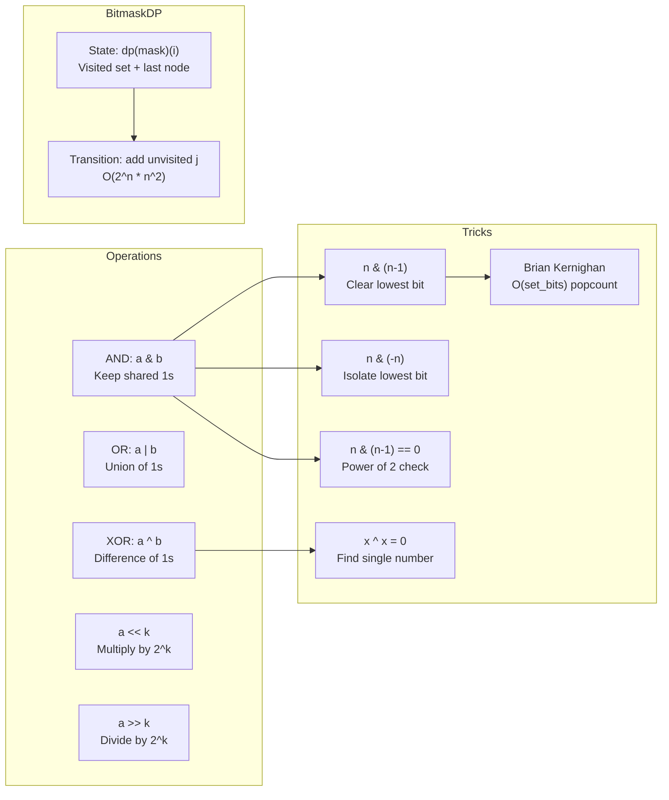

---
title: Bit Manipulation
aliases: [Bitwise Operations, Bitmask, Bitmask DP]
tags: [DSA, CompetitiveProgramming, BitManipulation, Bitmask]
domain: DSA
difficulty: Intermediate
created: 2026-07-26
related: [Number_Theory, DP_Patterns, CP_Setup_and_Tools]
status: complete
---

# 🔢 Bit Manipulation

> [!abstract] TL;DR
> Every integer is a compact array of on/off switches. Bitwise operations manipulate these switches in O(1) — letting you check membership, toggle flags, enumerate subsets, and represent state exponentially more compactly than arrays. Master the 10 core tricks and bitmask DP opens up.

## Intuition — analogy FIRST

Imagine a row of 32 light switches, numbered 0 to 31. An integer is just the on/off state of those switches read as binary. AND is "turn off any switch that is off in the mask." OR is "turn on any switch that is on in the mask." XOR is "toggle any switch that is on in the mask."

Once you see integers as switch boards, operations like "is switch k on?" or "turn off only the rightmost switch that's on" become physical manipulations you can picture immediately.

## How It Works — full explanation + mermaid

### Core Operations Table

| Operation | Syntax (Python/C++) | Effect |
|---|---|---|
| AND | `a & b` | 1 only where both are 1 |
| OR | `a \| b` | 1 where either is 1 |
| XOR | `a ^ b` | 1 where exactly one is 1 |
| NOT | `~a` | Flip all bits |
| Left shift | `a << k` | Multiply by $2^k$ |
| Right shift | `a >> k` | Integer divide by $2^k$ |
| Check bit k | `(n >> k) & 1` | 1 if bit k is set |
| Set bit k | `n \| (1 << k)` | Turn on bit k |
| Clear bit k | `n & ~(1 << k)` | Turn off bit k |
| Toggle bit k | `n ^ (1 << k)` | Flip bit k |
| Clear lowest set bit | `n & (n - 1)` | Removes rightmost 1 |
| Isolate lowest set bit | `n & (-n)` | Keeps only rightmost 1 |
| Is power of 2 | `n > 0 and (n & (n-1)) == 0` | True iff exactly one bit set |
| Count set bits | `bin(n).count('1')` | Popcount |

### Key Tricks Explained

**`n & (n-1)` — clear lowest set bit**: Subtracting 1 from n flips the trailing 0s to 1s and the rightmost 1 to 0. ANDing with n cancels all those trailing bits, leaving everything above the lowest set bit unchanged.

**Brian Kernighan's popcount**: Repeatedly apply `n = n & (n-1)` until n = 0. Number of iterations = number of set bits. O(set_bits), faster than O(32) when n is sparse.

**`n & (-n)` — isolate lowest set bit**: In two's complement, -n = ~n + 1. The +1 ripple-carries up to the first 1 bit, and AND with n keeps only that bit.

**XOR identity tricks**:
- `a ^ a = 0` (any value XOR itself is 0)
- `a ^ 0 = a` (XOR with 0 is identity)
- XOR is commutative and associative
- Used to find the single non-repeated number: XOR all elements, pairs cancel

### Bitmask Subset Enumeration

To enumerate all subsets of a set represented as bitmask `full`:

```
for mask in range(full + 1):
    if (mask & full) == mask:   # mask is a subset of full
        ...
```

Optimized enumeration of all subsets of `full`:
```
sub = full
while sub > 0:
    # process sub
    sub = (sub - 1) & full
```
This visits every subset of `full` in O(2^popcount(full)) time total.

### Bitmask DP

Represent a set of visited elements as a bitmask. State: `dp[mask][i]` = optimal cost/value when the visited set is `mask` and the last element was `i`.

Classic example: **Traveling Salesman Problem** with n ≤ 20:
- State: `dp[mask][i]` = min cost to visit all cities in `mask`, ending at city `i`
- Transition: `dp[mask | (1<<j)][j] = min(dp[mask][j] + cost[i][j])` for each unvisited `j`
- Total states: $2^n \times n$, transitions: $n$ → O($2^n \times n^2$) overall



## The Math

**Two's complement**: For a k-bit integer, $-n = 2^k - n = \overline{n} + 1$ (flip all bits then add 1). This explains why `n & (-n)` isolates the lowest set bit: the +1 carries up to the rightmost 1, and AND cancels everything else.

**XOR properties** (forms an abelian group):
$$a \oplus a = 0, \quad a \oplus 0 = a, \quad a \oplus b = b \oplus a, \quad (a \oplus b) \oplus c = a \oplus (b \oplus c)$$

**Finding two non-repeating numbers**: If array has two numbers x and y appearing once, all others twice:
1. XOR all → get `x ^ y` (non-zero since x ≠ y)
2. Find any set bit in `x ^ y` (use `n & (-n)`)
3. Partition array by that bit → XOR each partition separately → get x and y

**Subset count**: A set of k elements has exactly $2^k$ subsets. Enumerating all subsets of all subsets of [0..n-1] takes $O(3^n)$ time (each element is in/partially-in/out of outer/inner set).

## Template Code

```python
# ─── Core bit tricks ───────────────────────────────────────────────
def check_bit(n: int, k: int) -> bool:
    return bool((n >> k) & 1)

def set_bit(n: int, k: int) -> int:
    return n | (1 << k)

def clear_bit(n: int, k: int) -> int:
    return n & ~(1 << k)

def toggle_bit(n: int, k: int) -> int:
    return n ^ (1 << k)

def lowest_set_bit(n: int) -> int:
    return n & (-n)

def clear_lowest_set_bit(n: int) -> int:
    return n & (n - 1)

def is_power_of_two(n: int) -> bool:
    return n > 0 and (n & (n - 1)) == 0

def popcount_kernighan(n: int) -> int:
    """O(set_bits) — fast when n is sparse."""
    count = 0
    while n:
        n &= n - 1
        count += 1
    return count

def popcount(n: int) -> int:
    """Pythonic O(log n) via string."""
    return bin(n).count('1')

# ─── XOR tricks ────────────────────────────────────────────────────
def find_single_number(nums: list[int]) -> int:
    """All appear twice except one. XOR all → pairs cancel."""
    result = 0
    for x in nums:
        result ^= x
    return result

def find_two_single_numbers(nums: list[int]) -> tuple[int, int]:
    """Exactly two numbers appear once, rest appear twice."""
    xor_all = 0
    for x in nums:
        xor_all ^= x                   # = a ^ b
    diff_bit = xor_all & (-xor_all)    # any bit where a and b differ
    a = b = 0
    for x in nums:
        if x & diff_bit:
            a ^= x
        else:
            b ^= x
    return a, b

# ─── Subset enumeration ────────────────────────────────────────────
def enumerate_all_subsets(n: int):
    """Enumerate all 2^n subsets of {0, 1, ..., n-1}."""
    for mask in range(1 << n):
        elements = [i for i in range(n) if mask & (1 << i)]
        yield mask, elements

def enumerate_subsets_of(full: int):
    """Enumerate all subsets of bitmask 'full'. O(2^popcount(full))."""
    sub = full
    while sub:
        yield sub
        sub = (sub - 1) & full
    yield 0  # include empty subset

# ─── Bitmask DP: TSP ───────────────────────────────────────────────
def tsp(cost: list[list[int]]) -> int:
    """Minimum cost Hamiltonian cycle. O(2^n * n^2). n <= 20."""
    n = len(cost)
    INF = float('inf')
    dp = [[INF] * n for _ in range(1 << n)]
    dp[1][0] = 0  # start at city 0, visited = {0}

    for mask in range(1 << n):
        for u in range(n):
            if dp[mask][u] == INF:
                continue
            if not (mask >> u & 1):
                continue
            for v in range(n):
                if mask >> v & 1:
                    continue  # already visited
                new_mask = mask | (1 << v)
                dp[new_mask][v] = min(dp[new_mask][v], dp[mask][u] + cost[u][v])

    full = (1 << n) - 1
    return min(dp[full][u] + cost[u][0] for u in range(1, n))
```

## Worked Example — trace through a real problem

**Problem**: Find the single number in `[4, 1, 2, 1, 2]`.

```
XOR all: 4 ^ 1 ^ 2 ^ 1 ^ 2
       = 4 ^ (1^1) ^ (2^2)
       = 4 ^ 0 ^ 0
       = 4
```

**Binary trace**:
```
  0100   (4)
^ 0001   (1)
= 0101
^ 0010   (2)
= 0111
^ 0001   (1)
= 0110
^ 0010   (2)
= 0100   → 4 ✓
```

**Bitmask DP trace** for TSP with 3 cities, cost matrix:
```
cost = [[0,1,2],[1,0,3],[2,3,0]]

State: dp[mask][city] = min cost to visit 'mask' cities, ending at 'city'
Init:  dp[001][0] = 0

mask=001 (visited {0}):
  From 0 → 1: dp[011][1] = 0 + cost[0][1] = 1
  From 0 → 2: dp[101][2] = 0 + cost[0][2] = 2

mask=011 (visited {0,1}):
  From 1 → 2: dp[111][2] = 1 + cost[1][2] = 4

mask=101 (visited {0,2}):
  From 2 → 1: dp[111][1] = 2 + cost[2][1] = 5

mask=111 (all visited):
  Return to 0: min(dp[111][1] + cost[1][0], dp[111][2] + cost[2][0])
             = min(5+1, 4+2) = 6
```

## CP Problem Patterns

| Problem type | Bit technique |
|---|---|
| Find single non-repeated element | XOR all elements |
| Find two non-repeated elements | XOR all, split by differing bit |
| Subset sum / knapsack with n ≤ 20 | Enumerate all 2^n subsets |
| Shortest Hamiltonian path | Bitmask DP O(2^n · n²) |
| Count set bits across [1..n] | DP on bit positions |
| Assign n items to groups optimally | Bitmask DP on subsets |
| Check if n is power of 2 | `n & (n-1) == 0` |
| Multiply/divide by power of 2 | Shift left/right |

## Common Pitfalls & Edge Cases

- **Python `~n`**: In Python, `~n = -(n+1)` due to arbitrary precision integers. Use `n ^ ((1<<32)-1)` to flip only the lower 32 bits if needed.
- **C++ `1 << k` overflow**: `1` is a 32-bit int; `1 << 31` is undefined behavior. Use `1LL << k` for k ≥ 31.
- **Signed right shift in C++**: Behavior is implementation-defined for negative numbers. Use unsigned types or avoid shifting negatives.
- **Empty subset**: `enumerate_subsets_of` must explicitly yield 0 — the loop `while sub:` stops before processing sub=0.
- **TSP state init**: Only `dp[1<<0][0] = 0` (start at city 0). All other `dp[1][i]` for i≠0 should stay INF.
- **Bitmask DP memory**: `2^20 * 20 * 8 bytes = 160 MB` — close to the limit; use `int` not `long long` when possible.
- **XOR find-two pitfall**: If all numbers appear twice (no singles), `xor_all = 0` and `diff_bit = 0`, causing divide-by-zero. Check for this case.

## Related Concepts

- [[_MOC_Competitive_Programming|↑ Section MOC]]
- [[Number_Theory]]
- [[DP_Patterns]]
- [[CP_Setup_and_Tools]]
- [[Modular_Arithmetic]]

## Review Questions

1. Given `n = 0b10110100`, what is `n & (n-1)`? What does it represent, and how many times would you need to apply this operation until `n` becomes 0?
2. You have a set of 4 items `{A, B, C, D}` represented as bits 0–3. How do you enumerate all subsets that include item B (bit 1) using the "iterate submasks of a mask" technique?
3. Describe the bitmask DP state and transition for finding the minimum cost to visit all n cities exactly once (TSP). What is the time complexity and for what value of n does this become impractical?

## Sources / Problems

- LeetCode: 136 (Single Number), 137 (Single Number II), 260 (Single Number III)
- LeetCode: 191 (Number of 1 Bits), 231 (Power of Two), 338 (Counting Bits)
- LeetCode: 78 (Subsets), 1986 (Minimum Number of Work Sessions — bitmask DP)
- Codeforces: Problems tagged "bitmasks" at codeforces.com/problemset
- CP-algorithms.com: "Bit manipulation", "Bitmask DP"
- "Competitive Programmer's Handbook" — Chapter 10

#BitManipulation #Bitmask #BitmaskDP #XOR #TwoComplement #TSP
