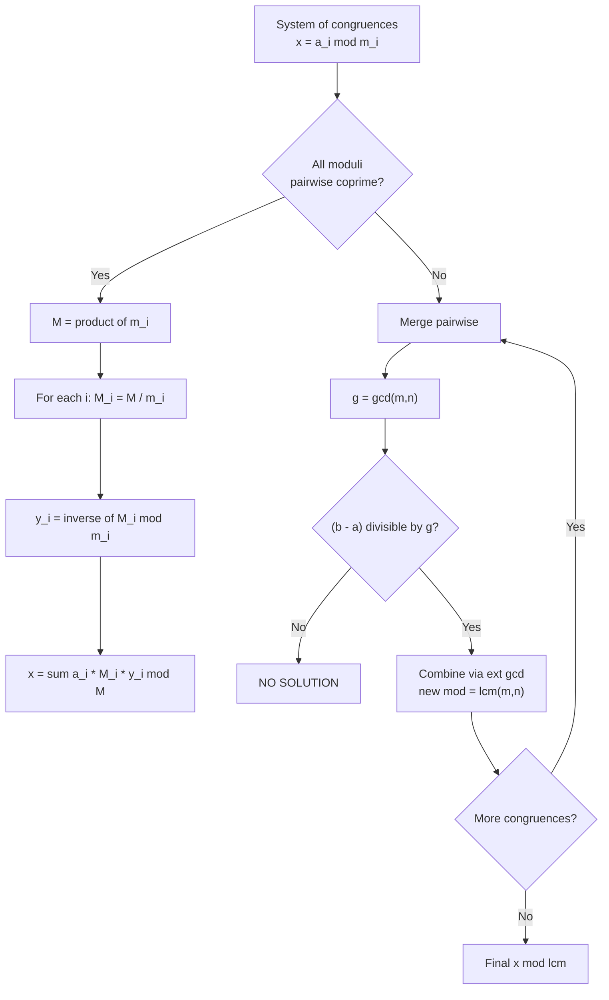

# 🧩 Chinese Remainder Theorem

> [!abstract] TL;DR
> Given a system `x ≡ a₁ (mod m₁)`, `x ≡ a₂ (mod m₂)`, … with **pairwise coprime** moduli, the CRT guarantees a **unique** solution modulo `M = ∏ mᵢ`. You reconstruct `x` from its residues by building weights `Mᵢ = M/mᵢ` and their modular inverses. When the moduli are **not** coprime, you merge congruences pairwise and add a consistency check — if any pair conflicts, no solution exists. CRT is the number-theory glue for "combine constraints living under different moduli."

## Intuition — analogy FIRST

Imagine three spinning gears with **3, 5, and 7 teeth**. Each gear has one tooth painted red. You spin them and someone tells you: gear-3 stopped `2` past red, gear-5 stopped `3` past red, gear-7 stopped `2` past red. Question: **how many total clicks** did the whole assembly turn?

Because 3, 5, 7 share no common factor, the combined pattern only repeats every `3 × 5 × 7 = 105` clicks. So within any window of 105 clicks there is **exactly one** click count that produces that specific triple of offsets. CRT is the machine that reads off "residue on each gear" and reconstructs the unique click count mod 105.

The everyday version: a calendar. "It's a Tuesday (mod 7) and the 3rd of the month" pins down far fewer days than combining "Tuesday AND day-of-year ≡ 12 (mod 365)." Each independent cycle multiplies the period you can uniquely address.

## How It Works + mermaid

**Coprime case (`gcd(mᵢ, mⱼ) = 1` for all i≠j):**

1. Compute `M = m₁ · m₂ · … · mₖ`.
2. For each i, let `Mᵢ = M / mᵢ` (product of *all other* moduli). Then `gcd(Mᵢ, mᵢ) = 1`.
3. Find `yᵢ = Mᵢ⁻¹ (mod mᵢ)` — the inverse of `Mᵢ` under `mᵢ`.
4. The solution is `x = Σ aᵢ · Mᵢ · yᵢ (mod M)`.

Why it works: the term `aᵢ · Mᵢ · yᵢ` is `≡ aᵢ (mod mᵢ)` because `Mᵢ·yᵢ ≡ 1`, and it is `≡ 0 (mod mⱼ)` for `j ≠ i` because `mⱼ | Mᵢ`. So each term "activates" exactly one congruence and vanishes for the rest — like a basis vector.

**General (non-coprime) case:** merge two congruences at a time. To merge `x ≡ a (mod m)` and `x ≡ b (mod n)`, let `g = gcd(m, n)`:
- **Solvable iff** `(b − a)` is divisible by `g`. Otherwise **no solution**.
- The merged modulus is `lcm(m, n)`, and the merged residue is found via the extended Euclidean algorithm.



## The Math

**Statement (coprime form).** Let `m₁, …, mₖ` be pairwise coprime positive integers and `M = ∏ mᵢ`. For any residues `a₁, …, aₖ`, the system

$$x \equiv a_i \pmod{m_i}, \quad i = 1,\dots,k$$

has a **unique** solution modulo `M`, given explicitly by

$$x \equiv \sum_{i=1}^{k} a_i \, M_i \, y_i \pmod{M}, \qquad M_i = \frac{M}{m_i}, \quad y_i \equiv M_i^{-1} \pmod{m_i}.$$

**Why unique.** If `x` and `x'` both solve the system, then `mᵢ ∣ (x − x')` for every i. Since the `mᵢ` are pairwise coprime, their product `M ∣ (x − x')`, hence `x ≡ x' (mod M)`. Existence + uniqueness means CRT is a **ring isomorphism**:

$$\mathbb{Z}/M\mathbb{Z} \;\cong\; \mathbb{Z}/m_1\mathbb{Z} \times \mathbb{Z}/m_2\mathbb{Z} \times \cdots \times \mathbb{Z}/m_k\mathbb{Z}.$$

**General merge.** To solve `x ≡ a (mod m)` and `x ≡ b (mod n)`, write `x = a + m·t`. Substituting:

$$a + m t \equiv b \pmod{n} \;\Longrightarrow\; m t \equiv (b - a) \pmod{n}.$$

Let `g = gcd(m, n)`. This linear congruence in `t` is solvable **iff** `g ∣ (b − a)`. Extended Euclid gives `p, q` with `m p + n q = g`; then

$$t \equiv \frac{b - a}{g} \cdot p \pmod{\tfrac{n}{g}}, \qquad x \equiv a + m t \pmod{\operatorname{lcm}(m, n)}.$$

## Python Implementation (clean, commented, runnable)

```python
from math import gcd, prod

# ─── Coprime CRT (direct construction) ─────────────────────────────
def crt_coprime(residues: list[int], moduli: list[int]) -> int:
    """
    Solve x = residues[i] mod moduli[i] assuming moduli are PAIRWISE COPRIME.
    Returns the unique x in [0, M) where M = product of moduli.
    """
    M = prod(moduli)
    x = 0
    for a_i, m_i in zip(residues, moduli):
        Mi = M // m_i               # product of all other moduli
        yi = pow(Mi, -1, m_i)       # Mi^{-1} mod m_i (Python 3.8+ pow)
        x = (x + a_i * Mi * yi) % M
    return x

# ─── General merge of two congruences (handles non-coprime) ────────
def crt_merge(a1: int, m1: int, a2: int, m2: int):
    """
    Merge  x = a1 (mod m1)  and  x = a2 (mod m2).
    Returns (a, m) meaning x = a (mod m), where m = lcm(m1, m2).
    Returns None if the two congruences are inconsistent.
    """
    g = gcd(m1, m2)
    if (a2 - a1) % g != 0:
        return None                 # inconsistent -> no solution
    lcm = m1 // g * m2
    # solve m1 * t = (a2 - a1) (mod m2) for t, scaled by g
    diff = (a2 - a1) // g
    mod = m2 // g
    t = (diff * pow(m1 // g, -1, mod)) % mod
    a = (a1 + m1 * t) % lcm
    return a % lcm, lcm

# ─── General CRT over a whole system (any moduli) ──────────────────
def crt_general(residues: list[int], moduli: list[int]):
    """Fold the whole system with crt_merge. Returns (x, M) or None."""
    a, m = residues[0] % moduli[0], moduli[0]
    for a_i, m_i in zip(residues[1:], moduli[1:]):
        merged = crt_merge(a, m, a_i % m_i, m_i)
        if merged is None:
            return None
        a, m = merged
    return a, m


if __name__ == "__main__":
    # Classic Sun Tzu problem: x=2 (mod 3), x=3 (mod 5), x=2 (mod 7)
    print(crt_coprime([2, 3, 2], [3, 5, 7]))     # 23
    print(crt_general([2, 3, 2], [3, 5, 7]))     # (23, 105)
    # Non-coprime, consistent: x=1 (mod 4), x=3 (mod 6) -> x=9 (mod 12)
    print(crt_general([1, 3], [4, 6]))           # (9, 12)
    # Non-coprime, inconsistent: x=1 (mod 4), x=2 (mod 6) -> None
    print(crt_general([1, 2], [4, 6]))           # None
```

## Template Code (ready-to-paste CP snippet)

```python
from math import gcd

def crt(rem, mod):
    """
    General CRT. rem[i] = residues, mod[i] = moduli (need NOT be coprime).
    Returns (x, M): x is the smallest non-negative solution, M = lcm of moduli.
    Returns (-1, -1) if the system has no solution.
    """
    a, m = 0, 1
    for r, mi in zip(rem, mod):
        r %= mi
        g = gcd(m, mi)
        if (r - a) % g != 0:
            return -1, -1
        lcm = m // g * mi
        a = (a + m * (((r - a) // g) * pow(m // g, -1, mi // g) % (mi // g))) % lcm
        m = lcm
    return a % m, m
```

## Dry Run / Trace

**System:** `x ≡ 2 (mod 3)`, `x ≡ 3 (mod 5)`, `x ≡ 2 (mod 7)` (coprime, `M = 105`).

| i | aᵢ | mᵢ | Mᵢ = M/mᵢ | Mᵢ mod mᵢ | yᵢ = Mᵢ⁻¹ | aᵢ·Mᵢ·yᵢ |
|---|----|----|-----------|-----------|-----------|-----------|
| 1 | 2  | 3  | 35        | 35 mod 3 = 2 | 2 (2·2=4≡1) | 2·35·2 = 140 |
| 2 | 3  | 5  | 21        | 21 mod 5 = 1 | 1           | 3·21·1 = 63  |
| 3 | 2  | 7  | 15        | 15 mod 7 = 1 | 1           | 2·15·1 = 30  |

Sum `= 140 + 63 + 30 = 233`, and `233 mod 105 = 23`. **x = 23.**

Verify: `23 mod 3 = 2` ✓, `23 mod 5 = 3` ✓, `23 mod 7 = 2` ✓.

**General merge trace** for `x ≡ 1 (mod 4)`, `x ≡ 3 (mod 6)`:
```
g = gcd(4,6) = 2;   (3 - 1) = 2 is divisible by 2  -> solvable
lcm = 12;  diff = 2/2 = 1;  mod = 6/2 = 3
t = 1 * inv(4/2=2, mod 3) = 1 * inv(2,3) = 1 * 2 = 2  (mod 3)
x = 1 + 4*2 = 9  (mod 12)
Check: 9 mod 4 = 1 ✓,  9 mod 6 = 3 ✓
```

## CP Problem Patterns

| Problem shape | How CRT applies |
|---|---|
| "Find smallest `x` with given remainders mod several numbers" | Direct coprime CRT, or general merge |
| Reconstruct a huge integer from its residues mod small primes | CRT over a prime basis (residue number system) |
| Compute `n! mod m` where `m` is composite (`m = ∏ pᵢᵏ`) | Solve mod each prime power, CRT-combine |
| Big modular result where modulus factors nicely | Split modulus, compute in parallel, merge |
| Calendar / periodic-event alignment (cycles align every lcm) | Model each cycle as a congruence |
| Lucas' theorem for `nCr mod pᵏ` combos | Per-prime-power results merged via CRT |
| "Values satisfying two arithmetic progressions simultaneously" | Merge two congruences → lcm progression |

## Common Pitfalls

- **Assuming coprimality.** The clean `Σ aᵢMᵢyᵢ` formula is **only** valid for pairwise coprime moduli. For arbitrary moduli you must use the general merge with the `g ∣ (b − a)` consistency check.
- **Forgetting the consistency check.** In the general case, an inconsistent pair (e.g. `x ≡ 1 (mod 4)` and `x ≡ 2 (mod 6)`) has **no solution** — silently returning a bogus value is a classic bug.
- **Overflow in C++.** `aᵢ · Mᵢ · yᵢ` can vastly exceed 64 bits even when the answer fits. Use `__int128`, or `mulmod` (multiplication via `__int128`/binary), or Python big integers.
- **Inverse doesn't exist.** `pow(Mi, -1, m_i)` raises `ValueError` in Python if `gcd(Mi, m_i) ≠ 1` — which happens precisely when the "coprime" precondition is violated.
- **Negative residues.** Always reduce `aᵢ % mᵢ` (Python `%` is non-negative; C++ needs `((a % m) + m) % m`) before feeding the algorithm.
- **`lcm` overflow.** Compute `m // g * mi`, never `m * mi // g`, to keep intermediates small.
- **Normalizing the answer.** The mathematically unique solution lives mod `M`; return it in `[0, M)`.

## Related Concepts

- [[_MOC_Competitive_Programming|↑ Section MOC]]
- [[Modular_Arithmetic]]
- [[Number_Theory]]
- [[Euler_Totient]]
- [[Sieve_of_Eratosthenes]]
- [[Combinatorics]]

## Review Questions

1. State the CRT for pairwise coprime moduli and prove the solution is unique modulo `M = ∏ mᵢ`. Where in the proof is coprimality essential?
2. You must solve `x ≡ 2 (mod 6)` and `x ≡ 8 (mod 15)`. Are these consistent? If so, give the merged congruence; if not, explain which check fails.
3. Explain how CRT lets you compute a modular result under a composite modulus `m = p₁ᵃ · p₂ᵇ` by working with the prime powers separately. What is the benefit for large exponents or Lucas-style binomial computations?

## Sources

- CP-algorithms.com: "Chinese Remainder Theorem", "Linear Congruence Equation"
- "Competitive Programmer's Handbook" (Laaksonen) — Chapter 21, number theory
- Codeforces: problems tagged "chinese remainder theorem", "math"
- Project Euler: problems 271, 531 (CRT-flavored)
- CLRS, Section 31.5 — The Chinese Remainder Theorem
- "Concrete Mathematics" (Graham, Knuth, Patashnik) — congruences chapter

#NumberTheory #CRT #ChineseRemainderTheorem #ModularArithmetic #Congruences #ExtendedEuclid
