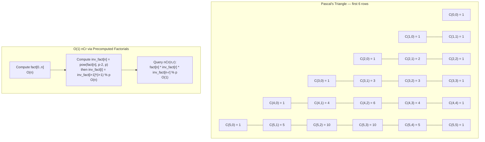

---
title: Combinatorics
aliases: [Combinations, Permutations, Pascal Triangle, Catalan Numbers, Stars and Bars]
tags: [DSA, CompetitiveProgramming, Combinatorics, nCr, Pascal, Catalan]
domain: DSA
difficulty: Intermediate
created: 2026-07-26
related: [Modular_Arithmetic, Number_Theory, DP_Patterns]
status: complete
---

# 🎲 Combinatorics

> [!abstract] TL;DR
> Combinatorics counts arrangements and selections. The two workhorses are permutations P(n,r) and combinations C(n,r). In CP, you precompute factorials and their modular inverses once in O(n), then answer any nCr query in O(1). Pascal's triangle is an alternative for small n. The inclusion-exclusion principle handles overcounting. Catalan numbers appear in parentheses, tree, and path-counting problems.

## Intuition — analogy FIRST

You have 10 colored balls and you want to pick 3 to give to friends. The order in which you hand them out matters for permutations (there are P(10,3) = 720 ways). The order does not matter for combinations — it's just "which 3 balls" (there are C(10,3) = 120 ways). Combinations are permutations with the ordering "divided out."

Pascal's triangle is the precomputed nCr table for small n: each entry is the sum of the two above it. It's like a counting pyramid where each level tells you how many ways you can reach that slot from the top (like paths on a grid).

## How It Works — full explanation + mermaid

### Permutations

$$P(n, r) = \frac{n!}{(n-r)!} = n \times (n-1) \times \cdots \times (n-r+1)$$

Counting ordered selections of r items from n distinct items.

### Combinations (Binomial Coefficients)

$$C(n, r) = \binom{n}{r} = \frac{n!}{r! \cdot (n-r)!}$$

Counting unordered selections of r items from n distinct items.

**Key identities**:
- $\binom{n}{0} = \binom{n}{n} = 1$
- $\binom{n}{r} = \binom{n}{n-r}$ (symmetry)
- $\binom{n}{r} = \binom{n-1}{r-1} + \binom{n-1}{r}$ (Pascal's rule — the recursion)
- $\sum_{r=0}^{n} \binom{n}{r} = 2^n$

### Precomputing nCr Modulo p

For large n (up to 10^6), precompute:
1. `fact[i] = i! mod p` for i = 0 to n
2. `inv_fact[i] = (i!)^{-1} mod p` for i = 0 to n (compute using Fermat: `inv_fact[n] = pow(fact[n], p-2, p)`, then work backwards: `inv_fact[i] = inv_fact[i+1] * (i+1) % p`)
3. Query: `nCr(n, r) = fact[n] * inv_fact[r] * inv_fact[n-r] % p`

Total: O(n) precomputation, O(1) per query.

### Pascal's Triangle (for small n)

Precompute `C[i][j]` using Pascal's rule for n up to ~2000:
```
C[i][0] = C[i][i] = 1
C[i][j] = C[i-1][j-1] + C[i-1][j]
```

Memory: O(n²). No modular inverse needed.

### Inclusion-Exclusion Principle

$$\left|\bigcup_{i=1}^{n} A_i\right| = \sum|A_i| - \sum|A_i \cap A_j| + \sum|A_i \cap A_j \cap A_k| - \cdots$$

Useful when it's easier to count "at least one bad property" than "no bad properties." Alternate signs: add singleton contributions, subtract pairwise, add triple, etc.

### Stars and Bars

Number of ways to distribute k identical items into n distinct bins (bins can be empty):

$$\binom{n + k - 1}{k} = \binom{n + k - 1}{n - 1}$$

If bins must be non-empty: first give 1 to each bin (use up n items), then distribute remaining k-n items freely:

$$\binom{k - 1}{n - 1}$$

### Catalan Numbers

$$C_n = \frac{1}{n+1}\binom{2n}{n} = \frac{(2n)!}{(n+1)! \cdot n!}$$

Recurrence: $C_0 = 1$, $C_n = \sum_{i=0}^{n-1} C_i \cdot C_{n-1-i}$

First values: 1, 1, 2, 5, 14, 42, 132, 429, ...

**Applications**:
- Number of valid parenthesization of n+1 factors
- Number of full binary trees with n+1 leaves
- Number of monotone paths (right/up) from (0,0) to (n,n) that do not cross above the diagonal
- Number of non-crossing partitions
- Number of BSTs with n keys



## The Math

**Pascal's rule derivation**: Consider whether element n is in our selection of r from {1..n}:
- If yes: choose r-1 from remaining n-1 → $\binom{n-1}{r-1}$ ways
- If no: choose r from remaining n-1 → $\binom{n-1}{r}$ ways

Adding: $\binom{n}{r} = \binom{n-1}{r-1} + \binom{n-1}{r}$. ∎

**Stars and bars**: Represent the distribution as a sequence of k stars and n-1 bars. The bars partition the stars into n groups. Total symbols: k + (n-1). Choose which k positions are stars: $\binom{k+n-1}{k}$.

**Catalan formula**: $C_n = \binom{2n}{n} - \binom{2n}{n+1} = \frac{1}{n+1}\binom{2n}{n}$

The term $\binom{2n}{n+1}$ subtracts the "bad" paths that cross the diagonal (via the reflection principle).

**Vandermonde's identity**: $\binom{m+n}{r} = \sum_{k=0}^{r} \binom{m}{k}\binom{n}{r-k}$

**Hockey stick identity**: $\sum_{i=0}^{r} \binom{n+i}{i} = \binom{n+r+1}{r}$

## Template Code

```python
MOD = 10**9 + 7

# ─── Precomputed factorials + inverse factorials ───────────────────
class Combinatorics:
    """
    Precomputes factorials and inverse factorials in O(n).
    Then answers nCr(n, r) in O(1) for any 0 <= r <= n <= MAXN.
    """
    def __init__(self, maxn: int, mod: int = MOD):
        self.mod = mod
        self.fact = [1] * (maxn + 1)
        self.inv_fact = [1] * (maxn + 1)

        for i in range(1, maxn + 1):
            self.fact[i] = self.fact[i - 1] * i % mod

        self.inv_fact[maxn] = pow(self.fact[maxn], mod - 2, mod)
        for i in range(maxn - 1, -1, -1):
            self.inv_fact[i] = self.inv_fact[i + 1] * (i + 1) % mod

    def nCr(self, n: int, r: int) -> int:
        """C(n, r) mod p. Returns 0 if r < 0 or r > n."""
        if r < 0 or r > n:
            return 0
        return self.fact[n] * self.inv_fact[r] % self.mod * self.inv_fact[n - r] % self.mod

    def nPr(self, n: int, r: int) -> int:
        """P(n, r) = n! / (n-r)! mod p."""
        if r < 0 or r > n:
            return 0
        return self.fact[n] * self.inv_fact[n - r] % self.mod

# ─── Pascal's Triangle (for small n, no modular inverse needed) ────
def pascal_triangle(maxn: int) -> list[list[int]]:
    """C[i][j] = C(i, j). O(n^2) time and space."""
    C = [[0] * (maxn + 1) for _ in range(maxn + 1)]
    for i in range(maxn + 1):
        C[i][0] = 1
        for j in range(1, i + 1):
            C[i][j] = C[i-1][j-1] + C[i-1][j]
    return C

def pascal_triangle_mod(maxn: int, mod: int = MOD) -> list[list[int]]:
    """Pascal's triangle with modular reduction."""
    C = [[0] * (maxn + 1) for _ in range(maxn + 1)]
    for i in range(maxn + 1):
        C[i][0] = 1
        for j in range(1, i + 1):
            C[i][j] = (C[i-1][j-1] + C[i-1][j]) % mod
    return C

# ─── Catalan numbers ───────────────────────────────────────────────
def catalan(n: int, comb: "Combinatorics") -> int:
    """C_n = C(2n, n) * inv(n+1) mod p."""
    return comb.nCr(2 * n, n) * pow(n + 1, comb.mod - 2, comb.mod) % comb.mod

def catalan_list(count: int, mod: int = MOD) -> list[int]:
    """Compute first 'count' Catalan numbers via DP."""
    cat = [0] * count
    if count > 0:
        cat[0] = 1
    for n in range(1, count):
        for i in range(n):
            cat[n] = (cat[n] + cat[i] * cat[n-1-i]) % mod
    return cat

# ─── Stars and bars ────────────────────────────────────────────────
def stars_and_bars(k: int, n: int, comb: "Combinatorics") -> int:
    """
    Number of ways to distribute k identical items into n distinct bins
    where bins can be empty. = C(k + n - 1, k).
    """
    return comb.nCr(k + n - 1, k)

# ─── Inclusion-exclusion example ───────────────────────────────────
def count_coprime_pairs(n: int, m: int, primes_of_m: list[int]) -> int:
    """
    Count integers in [1, n] coprime to m, where primes_of_m are the
    distinct prime factors of m. Uses inclusion-exclusion.
    """
    total = 0
    k = len(primes_of_m)
    for mask in range(1 << k):
        product = 1
        bits = bin(mask).count('1')
        for i in range(k):
            if mask & (1 << i):
                product *= primes_of_m[i]
        if bits % 2 == 0:
            total += n // product
        else:
            total -= n // product
    return total
```

## Worked Example — trace through a real problem

**Problem**: Count paths from (0,0) to (3,3) on a grid (only right and up moves).

Each path uses exactly 3 right (R) and 3 up (U) moves in some order.

Total paths = $\binom{6}{3} = \frac{6!}{3! \cdot 3!} = \frac{720}{6 \times 6} = 20$.

**Worked Catalan example**: How many valid sequences of 3 opening and 3 closing parentheses exist?

$C_3 = \frac{1}{4}\binom{6}{3} = \frac{20}{4} = 5$.

The 5 valid sequences: `((()))`, `(()())`, `(())()`, `()(())`, `()()()`.

**Inclusion-exclusion example**: How many integers in [1, 30] are divisible by 2 or 3?

$$|A_2 \cup A_3| = |A_2| + |A_3| - |A_2 \cap A_3| = 15 + 10 - 5 = 20$$

(15 multiples of 2, 10 of 3, 5 of 6 = LCM(2,3))

**Precomputed nCr trace** for C(5, 2) with MOD = 10^9 + 7:
```
fact = [1, 1, 2, 6, 24, 120]
inv_fact[5] = pow(120, MOD-2, MOD) = ...let's call it IF5
inv_fact[4] = IF5 * 5 % MOD
inv_fact[3] = inv_fact[4] * 4 % MOD
inv_fact[2] = inv_fact[3] * 3 % MOD

C(5,2) = fact[5] * inv_fact[2] * inv_fact[3] % MOD
       = 120 * inv_fact[2] * inv_fact[3] % MOD
       = 120 * (1/2) * (1/6) mod MOD    (conceptually)
       = 120 / 12 = 10 ✓
```

## CP Problem Patterns

| Problem | Combinatorics tool |
|---|---|
| Count paths on n×m grid | C(n+m-2, n-1) |
| Distribute k balls into n boxes (empty OK) | Stars and bars: C(k+n-1, k) |
| Choose k from n, order matters | P(n,k) = n!/(n-k)! |
| Choose k from n, order doesn't matter | C(n,k) using precomputed fact |
| Count valid bracket sequences of length 2n | Catalan number C_n |
| Count BSTs with n keys | Catalan number C_n |
| At least one bad element (overcounting) | Inclusion-exclusion |
| Derangements (no fixed points) | D_n = n! × sum(-1)^k/k! |
| nCr for large n, multiple queries | Precompute fact + inv_fact |
| nCr for very large n but small r | Multiplicative formula: n*(n-1)*...*(n-r+1)/r! |

## Common Pitfalls & Edge Cases

- **C(n, r) when r > n**: Returns 0 by definition. Always guard this in your nCr function.
- **C(n, 0) = 1**: Factorials approach requires `inv_fact[0] = 1`, `fact[0] = 1`. Verify initialization.
- **Pascal's triangle for large n**: O(n²) memory — for n = 10^4, that's 10^8 entries, which is MLE. Use factorial precomputation instead.
- **Catalan via C(2n,n)/(n+1)**: Division must be modular. Use `* pow(n+1, MOD-2, MOD)`.
- **Stars and bars when k = 0**: C(n-1, n-1) = 1 (one way: all bins empty). Make sure nCr(n-1, n-1) = 1 in your implementation.
- **Inclusion-exclusion sign**: Even number of sets in intersection → add; odd → subtract. The sign is `(-1)^|mask|`, not `(-1)^(|mask|+1)`.
- **Overflow in Pascal's triangle**: Without modular reduction, entries can grow enormous. Either use mod or use Python's arbitrary precision (slow for large n).
- **inv_fact backward recurrence**: Must start from `inv_fact[MAXN] = pow(fact[MAXN], MOD-2, MOD)` and work down. Going forward would require n separate Fermat calls.

## Related Concepts

- [[_MOC_Competitive_Programming|↑ Section MOC]]
- [[Modular_Arithmetic]]
- [[Number_Theory]]
- [[DP_Patterns]]
- [[Sieve_of_Eratosthenes]]

## Review Questions

1. A competition problem asks for the number of ways to distribute 10 identical candies among 4 children where each child gets at least 2. Apply stars and bars correctly, showing the substitution step.
2. Derive the time and space complexity of the precomputed factorial approach for answering nCr queries. Compare it with the Pascal's triangle approach and explain when each is preferable.
3. The 5th Catalan number is 42. Verify this using both the closed-form formula $C_n = \binom{2n}{n}/(n+1)$ and the recurrence $C_n = \sum_{i=0}^{n-1} C_i C_{n-1-i}$.

## Sources / Problems

- LeetCode: 62 (Unique Paths), 96 (Unique Binary Search Trees — Catalan), 1569 (Reorder Routes — combinatorics)
- Codeforces: problems tagged "combinatorics", "math"
- USACO: Gold problems involving counting
- CP-algorithms.com: "Binomial Coefficients", "Catalan Numbers", "Inclusion-Exclusion"
- "Competitive Programmer's Handbook" — Chapter 22
- Project Euler: 15 (Lattice Paths), 53 (Combinatoric Selections)

#Combinatorics #Permutations #Combinations #PascalTriangle #CatalanNumbers #StarsAndBars #InclusionExclusion #nCr
