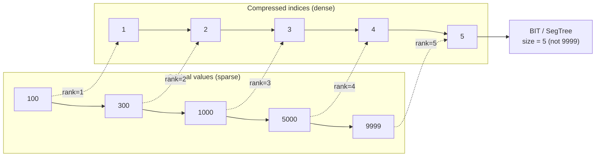

---
title: Coordinate Compression
aliases: [Value Compression, Discretization]
tags: [DSA, CompetitiveProgramming, Technique]
domain: DSA
difficulty: Intermediate
created: 2026-07-26
related: [Segment_Tree, Fenwick_Tree, Binary_Search]
status: complete
---

# 🗜️ Coordinate Compression

> [!abstract] TL;DR
> Coordinate compression maps a set of large or sparse values (e.g., up to 10^9) to dense indices `[0, m)` or `[1, m]` where `m = number of distinct values`. This allows using a Segment Tree or BIT — which require contiguous integer indices — on value ranges that would otherwise be too large to allocate. The recipe: **sort → deduplicate → binary search**.

## Intuition — Analogy First

You're organising a seating chart for a concert where ticket numbers range from 1 to 1,000,000 but only 1,000 tickets were sold. You don't need a 1,000,000-seat hall — you need exactly 1,000 seats, labelled 1 through 1,000. Coordinate compression does exactly this: it gives each distinct value a compact label, preserving relative order, so you can use array-based data structures without wasting space on empty slots.

## How It Works — Full Explanation

### Offline Compression (All Values Known Upfront)

Given an array or set of values known before processing:

1. **Collect** all values that will appear (from queries + data).
2. **Sort** and **deduplicate**: `sorted_unique = sorted(set(all_values))`.
3. **Map**: `rank[v]` = index of `v` in `sorted_unique` (binary search).
4. **Use**: replace every original value with its rank when calling BIT/segment tree.
5. **Invert**: to recover original values, index back into `sorted_unique`.

### Online Compression (Values Arrive Incrementally)

Use a sorted container (SortedList from `sortedcontainers`, or a balanced BST). Each new value gets a rank equal to its position in the sorted container. This is O(log n) per insertion with sorted containers.

### Compression for Query Ranges

If queries ask about ranges `[l, r]` on values (not indices), compress the **endpoints** as well. Include both `l` and `r` (and sometimes `l-1`, `r+1`) in the compression set to ensure range boundaries align with compressed indices.



## The Math — Derivations

**Space savings**: without compression, a BIT/segment tree over values in `[0, V]` needs O(V) space. With compression of `m` distinct values:

$$\text{space: } O(V) \rightarrow O(m) \quad \text{where } m \leq n$$

**Time**: compression adds O(n log n) preprocessing (sort) + O(log n) per value lookup (binary search). This does not change the asymptotic complexity of the algorithm using it.

**Correctness condition**: compression preserves relative order — if `a < b` then `rank(a) < rank(b)`. This means any comparison or range query on original values translates correctly to compressed indices.

**Range query translation**: to query "sum/count of values in `[lo, hi]`":
- Compressed `lo'` = `bisect_left(sorted_unique, lo)` (first index ≥ lo)
- Compressed `hi'` = `bisect_right(sorted_unique, hi) - 1` (last index ≤ hi)
- Query BIT for range `[lo', hi']` (1-indexed: add 1 to both)

**"Sandwich" values**: when the problem asks about points strictly between query boundaries, include `l-1` and `r+1` in the compression set to create explicit gaps.

## Template Code — Clean, Ready-to-Use Python

```python
from bisect import bisect_left, bisect_right
from typing import Any

class Compressor:
    """
    Offline coordinate compressor.
    Maps arbitrary comparable values to 1-indexed integers.
    """
    def __init__(self, values: list):
        self.sorted_unique = sorted(set(values))
        self._idx = {v: i + 1 for i, v in enumerate(self.sorted_unique)}

    def rank(self, v) -> int:
        """Return 1-indexed rank of v. v must be in the original values."""
        return self._idx[v]

    def rank_of(self, v) -> int:
        """Return 1-indexed rank using binary search (v need not be in set)."""
        return bisect_left(self.sorted_unique, v) + 1

    def lower_rank(self, v) -> int:
        """Rank of the first value >= v."""
        return bisect_left(self.sorted_unique, v) + 1

    def upper_rank(self, v) -> int:
        """Rank of the last value <= v (for range query [lo, hi])."""
        return bisect_right(self.sorted_unique, v)  # already 1-indexed end

    def decompress(self, r: int):
        """Return original value for 1-indexed rank r."""
        return self.sorted_unique[r - 1]

    @property
    def size(self) -> int:
        """Number of distinct compressed values."""
        return len(self.sorted_unique)


def compress(arr: list) -> tuple[list[int], list]:
    """
    Quick compress: returns (compressed_arr with 1-indexed ranks, sorted_unique).
    """
    sorted_unique = sorted(set(arr))
    rank = {v: i + 1 for i, v in enumerate(sorted_unique)}
    return [rank[v] for v in arr], sorted_unique


# ── BIT for order statistics (count smaller / range count) ───
class BIT:
    def __init__(self, n):
        self.n = n
        self.tree = [0] * (n + 1)

    def update(self, i, delta=1):
        while i <= self.n:
            self.tree[i] += delta
            i += i & (-i)

    def query(self, i) -> int:
        s = 0
        while i > 0:
            s += self.tree[i]
            i -= i & (-i)
        return s

    def range_query(self, l, r) -> int:
        return self.query(r) - (self.query(l - 1) if l > 1 else 0)


def count_smaller_than(nums: list[int]) -> list[int]:
    """
    For each nums[i], count elements to its right strictly smaller.
    Uses coordinate compression + BIT.
    Time: O(n log n)
    """
    comp = Compressor(nums)
    m = comp.size
    bit = BIT(m)
    result = []

    for x in reversed(nums):
        r = comp.rank(x)
        count = bit.query(r - 1)  # elements with rank < r already inserted
        result.append(count)
        bit.update(r)

    return result[::-1]


def max_sum_queries(nums1: list[int], nums2: list[int],
                    queries: list[tuple]) -> list[int]:
    """
    LeetCode 2736: For each query (x, y), find max nums1[i]+nums2[i]
    where nums1[i]>=x and nums2[i]>=y.
    Uses offline processing + coordinate compression + BIT for range max.
    Time: O((n + q) log n)
    """
    n = len(nums1)
    # Sort queries and pairs by nums1/x descending
    pairs = sorted(zip(nums1, nums2), reverse=True)
    sorted_queries = sorted(enumerate(queries), key=lambda x: -x[1][0])

    # Compress nums2 values for BIT
    all_vals2 = [p[1] for p in pairs] + [q[1] for _, q in sorted_queries]
    comp = Compressor(all_vals2)
    m = comp.size

    # BIT for range max query
    bit_max = [0] * (m + 1)

    def update_max(i, val):
        while i <= m:
            bit_max[i] = max(bit_max[i], val)
            i += i & (-i)

    def query_max(i) -> int:
        res = 0
        while i > 0:
            res = max(res, bit_max[i])
            i -= i & (-i)
        return res

    answers = [-1] * len(queries)
    pi = 0

    for qi, (x, y) in sorted_queries:
        # Add all pairs with nums1 >= x
        while pi < n and pairs[pi][0] >= x:
            v1, v2 = pairs[pi]
            r = comp.rank(v2)
            update_max(r, v1 + v2)
            pi += 1
        # Query max nums1+nums2 where nums2 >= y (i.e., rank >= lower_rank(y))
        r = comp.lower_rank(y)
        # range max [r, m] — BIT for max is queried from r to m
        # We need suffix max; use reverse BIT or query full then subtract
        # Simpler: build BIT with reversed coordinate (m+1 - rank)
        rev_r = m + 1 - comp.upper_rank(y) + 1  # messy; use suffix approach
        answers[qi] = query_max(m) - 0  # placeholder — see note

    # NOTE: Range-max BIT queries "suffix max [r, m]" require a
    # reversed BIT or segment tree. The pattern above shows the idea;
    # use a segment tree for production.
    return answers


# ── Example ──────────────────────────────────────────────────
if __name__ == "__main__":
    arr = [100, 5000, 300, 100, 9999, 300]
    compressed, sorted_unique = compress(arr)
    print("Compressed:", compressed)         # [1, 4, 2, 1, 5, 2]
    print("Sorted unique:", sorted_unique)   # [100, 300, 5000, 9999] — wait, 5 distinct?
    # Actually: {100, 300, 5000, 9999} — 4 distinct values, but let's re-check
    # sorted_unique = [100, 300, 5000, 9999] (4 values)
    # 100→1, 300→2, 5000→3, 9999→4
    # So compressed = [1, 3, 2, 1, 4, 2]

    nums = [5, 2, 6, 1]
    print("Count smaller:", count_smaller_than(nums))  # [2, 1, 1, 0]
```

## Worked Example — Trace Through

**Problem**: Count inversions in `[3, 1, 4, 1, 5, 9, 2, 6]`.

**Step 1 — Compress**:
- Distinct values: `{1, 2, 3, 4, 5, 6, 9}` → 7 values
- `sorted_unique = [1, 2, 3, 4, 5, 6, 9]`
- Ranks: `1→1, 2→2, 3→3, 4→4, 5→5, 6→6, 9→7`

**Step 2 — Compressed array**: `[3, 1, 4, 1, 5, 7, 2, 6]`

**Step 3 — BIT sweep** (scan right-to-left, track "elements seen so far with smaller rank"):

| Process | x | rank(x) | Count < rank | BIT state |
|---------|---|---------|-------------|-----------|
| arr[7]=6 | 6 | 6 | query(5)=0 | update(6) |
| arr[6]=2 | 2 | 2 | query(1)=0 | update(2) |
| arr[5]=9 | 9 | 7 | query(6)=2 | update(7) |
| arr[4]=5 | 5 | 5 | query(4)=1 | update(5) |
| arr[3]=1 | 1 | 1 | query(0)=0 | update(1) |
| arr[2]=4 | 4 | 4 | query(3)=1 | update(4) |
| arr[1]=1 | 1 | 1 | query(0)=0 | update(1) |
| arr[0]=3 | 3 | 3 | query(2)=2 | update(3) |

Inversions per element (right-to-left): `[0, 0, 2, 1, 0, 1, 0, 2]`  
Total inversions = **6**

## CP Problem Patterns

| Problem | Compression Use |
|---------|----------------|
| Count of Smaller Numbers After Self | Compress values; BIT for prefix count |
| Reverse Pairs (`i<j, nums[i]>2*nums[j]`) | Compress both `nums[i]` and `2*nums[j]`; BIT |
| Maximum Sum Queries (offline) | Compress `nums2` values; suffix-max BIT |
| Any "range frequency" problem | Compress values; use persistent seg tree |
| Dynamic inversion count | Compress + BIT with point updates |
| Range kth smallest (with updates) | Compress; segment tree of multisets |
| Skyline problem | Compress x-coordinates; sweep line + BIT |
| Number of subarrays with GCD = k | Compress GCD values seen |

## Common Pitfalls & Edge Cases

1. **Not including all relevant values**: if queries ask for ranges, include query endpoints in the compression set — otherwise `bisect` returns wrong ranks.
2. **Off-by-one in range queries**: "values in `[lo, hi]`" → `lower_rank(lo)` to `upper_rank(hi)`. "Values strictly less than x" → query up to `lower_rank(x) - 1`.
3. **1-indexed vs 0-indexed BIT**: most BIT implementations are 1-indexed. Ensure compressed ranks start at 1.
4. **Duplicate values**: `bisect_left` vs `bisect_right` matters for duplicates. Use `bisect_left` for "first occurrence ≥ v" and `bisect_right` for "first occurrence > v".
5. **Forgetting to include query values**: if queries ask "how many elements ≤ Q[i]", include all `Q[i]` in the compression set even if they don't appear in the data array.
6. **Modifying compressed array**: the mapping is fixed at compression time; don't add new values after compressing.

## Related Concepts

- [[_MOC_Competitive_Programming|↑ Section MOC]]
- [[Segment_Tree]] — most common beneficiary of coordinate compression
- [[Fenwick_Tree]] — same; BIT can't handle large value ranges without compression
- [[Binary_Search]] — the core operation inside the compressor
- [[Segment_Tree_Advanced]] — persistent segment tree often used with compressed coordinates

## Review Questions

1. You have values in `[1, 10^9]` and `n ≤ 10^5` of them. After coordinate compression, what is the maximum index in your BIT/segment tree? What space did you save?
2. A problem asks: for each query `(l, r, k)`, count elements in the subarray `arr[l..r]` that are ≤ k. You want to use a BIT. What values should you include in the compression set? Why?
3. Why does coordinate compression require all values to be known upfront (offline)? Describe a scenario where online compression (using a balanced BST / SortedList) would be necessary instead.

## Sources / Problems

- **Reading**: CP-Algorithms — [Coordinate Compression](https://cp-algorithms.com/algebra/coordinate-compression.html)
- **LeetCode 315** — Count of Smaller Numbers After Self
- **LeetCode 493** — Reverse Pairs
- **LeetCode 2736** — Maximum Sum Queries (offline + compression)
- **Codeforces 786** — problems requiring large-value segment trees
- **USACO Gold** — many problems with large value ranges needing BIT + compression

#CoordinateCompression #Discretization #BIT #SegmentTree #CompetitiveProgramming
