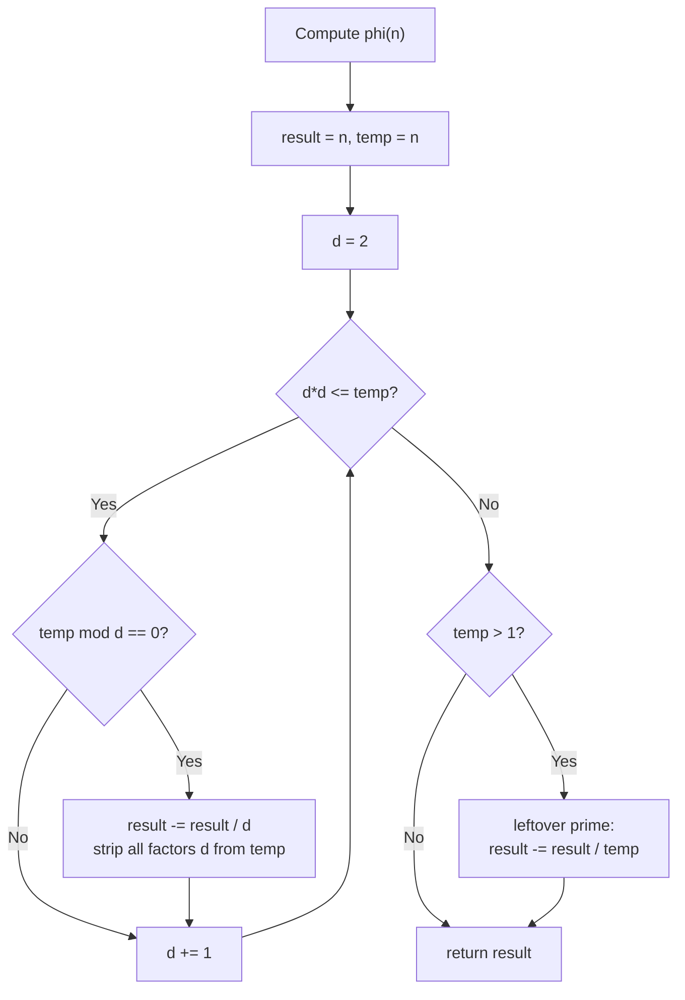

# 🔢 Euler's Totient Function

> [!abstract] TL;DR
> `φ(n)` counts the integers in `[1, n]` that are **coprime** to `n`. It factors beautifully: `φ(n) = n · ∏(1 − 1/p)` over the **distinct primes** `p ∣ n`. Euler's theorem — `a^φ(n) ≡ 1 (mod n)` whenever `gcd(a,n)=1` — generalizes Fermat's Little Theorem and gives modular inverses **even when the modulus isn't prime**. Compute a single `φ(n)` in `O(√n)` by factorizing; compute all of `φ(1..n)` with a totient sieve in `O(n log log n)`.

## Intuition — analogy FIRST

Picture a circular clock with `n` evenly spaced marks, numbered `0 … n−1`. Start at `0` and repeatedly step forward by `k` marks. If `gcd(k, n) = 1`, you eventually visit **every** mark before returning to `0` — the step size is a "generator." If `gcd(k, n) > 1`, you get stuck bouncing around a smaller sub-ring and never see all marks.

`φ(n)` is simply **how many step sizes `k` in `[1, n]` let you tour the whole clock**. For a 12-hour clock, the good step sizes are `1, 5, 7, 11` — exactly the numbers sharing no factor with 12 — so `φ(12) = 4`.

Another lens: `φ(n)` is the size of the "multiplicative universe" mod `n` — the count of residues that actually have inverses. That's why it shows up the moment you try to divide under a non-prime modulus.

## How It Works + mermaid

**Single value via factorization.** Factor `n = p₁^{e₁} · p₂^{e₂} · … · p_k^{e_k}`. Start `result = n`, and for each **distinct** prime `p`, multiply by `(1 − 1/p)` — implemented integer-safely as `result -= result // p`. This is `O(√n)` dominated by trial-division factorization.

**Totient sieve (all φ(1..n)).** Initialize `phi[i] = i`. Sweep `p = 2 … n`; whenever `phi[p] == p`, `p` is prime, so for every multiple `j` of `p` apply `phi[j] -= phi[j] // p`. Same shape as the [[Sieve_of_Eratosthenes]], same `O(n log log n)` cost.

Key properties that make it tick:
- `φ(p) = p − 1` for prime `p` (everything below a prime is coprime to it).
- `φ(pᵏ) = pᵏ − pᵏ⁻¹ = pᵏ⁻¹(p − 1)` (remove the multiples of `p`).
- **Multiplicative:** `φ(mn) = φ(m)·φ(n)` when `gcd(m, n) = 1`.



## The Math

**Product formula.** For `n = ∏ pᵢ^{eᵢ}`:

$$\varphi(n) = n \prod_{p \mid n} \left(1 - \frac{1}{p}\right) = \prod_{i=1}^{k} p_i^{e_i - 1}(p_i - 1).$$

*Derivation via inclusion–exclusion:* among `1..n`, subtract multiples of each prime `pᵢ` (there are `n/pᵢ`), add back multiples of each pair `pᵢpⱼ`, and so on. That alternating sum telescopes exactly into the product `n ∏(1 − 1/pᵢ)`.

**Euler's theorem.** If `gcd(a, n) = 1`, then

$$a^{\varphi(n)} \equiv 1 \pmod{n}.$$

Sketch: the residues coprime to `n` form a group of size `φ(n)` under multiplication mod `n`; by Lagrange's theorem the order of `a` divides `φ(n)`, so `a^{φ(n)} ≡ 1`.

**Fermat's Little Theorem is the special case** `n = p` prime, where `φ(p) = p − 1`:

$$a^{p-1} \equiv 1 \pmod{p}.$$

**Modular inverse for any modulus.** When `gcd(a, n) = 1`,

$$a^{-1} \equiv a^{\varphi(n) - 1} \pmod{n}.$$

This works even when `n` is **composite** — the trick Fermat can't do (Fermat needs a prime modulus).

**Divisor-sum identity** (useful in Möbius / Dirichlet problems):

$$\sum_{d \mid n} \varphi(d) = n.$$

## Python Implementation (clean, commented, runnable)

```python
# ─── Single value: phi(n) via factorization, O(sqrt(n)) ────────────
def euler_phi(n: int) -> int:
    """Count integers in [1, n] coprime to n."""
    result = n
    temp = n
    d = 2
    while d * d <= temp:
        if temp % d == 0:
            while temp % d == 0:      # strip every copy of prime d
                temp //= d
            result -= result // d     # multiply by (1 - 1/d), integer-safe
        d += 1
    if temp > 1:                      # a prime factor larger than sqrt(n)
        result -= result // temp
    return result

# ─── Totient sieve: phi[0..n] in O(n log log n) ────────────────────
def totient_sieve(n: int) -> list[int]:
    """phi[i] = Euler totient of i, for every i in [0, n]."""
    phi = list(range(n + 1))          # start phi[i] = i
    for p in range(2, n + 1):
        if phi[p] == p:               # p is prime (untouched so far)
            for j in range(p, n + 1, p):
                phi[j] -= phi[j] // p
    return phi

# ─── Modular inverse via Euler (works for composite modulus) ───────
def mod_inverse_euler(a: int, n: int) -> int:
    """Requires gcd(a, n) = 1. Returns a^{phi(n) - 1} mod n."""
    from math import gcd
    if gcd(a, n) != 1:
        raise ValueError("inverse does not exist: a and n not coprime")
    return pow(a, euler_phi(n) - 1, n)


if __name__ == "__main__":
    print(euler_phi(36))              # 12
    print(euler_phi(1))               # 1
    print(euler_phi(13))              # 12  (prime -> p-1)
    print(totient_sieve(12))          # [0,1,1,2,2,4,2,6,4,6,4,10,4]
    print(mod_inverse_euler(3, 10))   # 7   (3*7 = 21 = 1 mod 10)
    # divisor-sum identity: sum of phi(d) over d|n equals n
    divs = [d for d in range(1, 13) if 12 % d == 0]
    print(sum(euler_phi(d) for d in divs))   # 12
```

## Template Code (ready-to-paste CP snippet)

```python
def phi(n):
    """Euler totient of a single n, O(sqrt n)."""
    res, d = n, 2
    while d * d <= n:
        if n % d == 0:
            while n % d == 0:
                n //= d
            res -= res // d
        d += 1
    if n > 1:
        res -= res // n
    return res

def phi_sieve(N):
    """All totients phi[0..N] in O(N log log N)."""
    f = list(range(N + 1))
    for p in range(2, N + 1):
        if f[p] == p:                 # prime
            for j in range(p, N + 1, p):
                f[j] -= f[j] // p
    return f
```

## Dry Run / Trace

**Compute `φ(36)`**, `36 = 2² · 3²`.
```
result = 36, temp = 36
d = 2: 36 % 2 == 0  -> strip 2s: temp 36->18->9;  result -= 36//2 = 18 -> result = 18
d = 3: 9  % 3 == 0  -> strip 3s: temp 9->3->1;    result -= 18//3 = 6  -> result = 12
d*d > temp now; temp = 1 so no leftover
phi(36) = 12
```
Formula check: `36 · (1 − 1/2) · (1 − 1/3) = 36 · ½ · ⅔ = 12`. ✓
The 12 coprimes: `1, 5, 7, 11, 13, 17, 19, 23, 25, 29, 31, 35`.

**Totient sieve up to 12** (showing how index 12 gets built):
```
start phi[12] = 12
p = 2 prime: phi[12] -= 12 // 2 = 6  -> phi[12] = 6
p = 3 prime: phi[12] -= 6  // 3 = 2  -> phi[12] = 4
p = 4,6,... not prime (already reduced), skip 12's other primes
phi[12] = 4   (coprimes 1,5,7,11)
```

## CP Problem Patterns

| Problem shape | Totient tool |
|---|---|
| Count integers in `[1, n]` coprime to `n` | `φ(n)` directly |
| Sum of `gcd(i, n)` for `i` in `[1,n]` | `Σ_{d∣n} d · φ(n/d)` |
| Modular inverse when modulus is **not** prime | `a^{φ(n)−1} mod n` |
| Reduce a giant exponent: `a^b mod n` | `a^{b mod φ(n)} mod n` (Euler / with lifting-the-exponent care) |
| Order of an element mod `n` | order divides `φ(n)`; test divisors of `φ(n)` |
| Count fractions `p/q` in lowest terms with `q ≤ n` (Farey) | `Σ φ(k)` for `k = 1..n` |
| Number of generators of a cyclic group of size `n` | `φ(n)` |
| Many queries "coprime count up to N" | Precompute totient sieve, prefix sums |

## Common Pitfalls

- **Distinct primes only.** The product uses each prime **once**, regardless of exponent: `φ(12) = 12·(1−½)·(1−⅓)`, *not* including `(1−½)` twice for `2²`. The `while temp % d == 0` inner loop enforces this.
- **Integer-safe reduction.** Use `result -= result // p`, never floating `result * (1 - 1/p)` — floats lose precision for large `n`.
- **`φ(1) = 1`.** By definition, `1` is coprime to itself. The `√n` loop returns `1` correctly since `temp` stays `1`; just don't special-case it wrong.
- **Euler's theorem needs coprimality.** `a^{φ(n)} ≡ 1` **only** when `gcd(a, n) = 1`. If they share a factor, the identity fails and the "inverse" doesn't exist.
- **Exponent reduction caveat.** `a^b ≡ a^{b mod φ(n)}` requires `gcd(a, n) = 1`. For the general (non-coprime) case use the **generalized Euler / lifting-the-exponent** rule: `a^b ≡ a^{(b mod φ(n)) + φ(n)} (mod n)` when `b ≥ log₂ n`.
- **Sieve memory.** `phi[]` for `n = 10⁷` is fine, but `n = 10⁹` overflows RAM — factor a single value instead, or use a segmented approach.
- **C++ overflow.** `result` and intermediate products stay ≤ `n`, but if you build `φ` from the product form directly, `pᵉ⁻¹(p−1)` can overflow — accumulate carefully.

## Related Concepts

- [[_MOC_Competitive_Programming|↑ Section MOC]]
- [[Sieve_of_Eratosthenes]]
- [[Modular_Arithmetic]]
- [[Number_Theory]]
- [[Chinese_Remainder_Theorem]]
- [[Miller_Rabin_Primality]]
- [[Combinatorics]]

## Review Questions

1. Derive `φ(n) = n ∏(1 − 1/p)` from the inclusion–exclusion principle over the distinct prime factors of `n`. Why does the exponent of each prime not appear?
2. Show that Fermat's Little Theorem is a special case of Euler's theorem. Then use Euler's theorem to compute `3⁻¹ (mod 10)` and verify by direct multiplication.
3. Explain the totient sieve: why does the test `phi[p] == p` correctly identify primes, and why is the total cost `O(n log log n)` rather than `O(n √n)`?

## Sources

- CP-algorithms.com: "Euler's totient function", "Euler's theorem"
- "Competitive Programmer's Handbook" (Laaksonen) — Chapter 21
- CLRS, Section 31.3 & 31.6 — modular arithmetic, RSA / Euler's theorem
- "Concrete Mathematics" (Graham, Knuth, Patashnik) — number theory chapter
- Project Euler: problems 69, 70, 72, 214 (totient-heavy)
- Codeforces: problems tagged "number theory", "totient function"

#NumberTheory #EulerTotient #EulerTheorem #FermatsLittleTheorem #ModularInverse #Sieve
