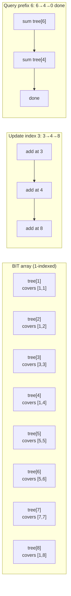

---
title: Fenwick Tree (Binary Indexed Tree)
aliases: [BIT, Binary Indexed Tree, Fenwick]
tags: [DSA, CompetitiveProgramming, DataStructures]
domain: DSA
difficulty: Advanced
created: 2026-07-26
related: [Segment_Tree, Prefix_Sum, Merge_Sort]
status: complete
---

# 🌲 Fenwick Tree (Binary Indexed Tree)

> [!abstract] TL;DR
> A Fenwick Tree (BIT) supports **point update** and **prefix sum query** both in **O(log n)** with extremely small constants and just a 1D array. The magic: `i & (-i)` (lowest set bit of `i`) tells each node exactly which range it covers. For range updates + range queries, use two BITs with a difference-array trick. Simpler and faster than a segment tree for sum-based queries.

## Intuition — Analogy First

Imagine a chain of managers in a company. Each manager oversees a team of varying size — the lowest-ranking manager oversees 1 person, the next oversees 2, then 4, then 8. When a new project lands, you report to your direct manager, who passes it up only if it falls under their jurisdiction. To tally total projects across a range, you climb up exactly the right managers and sum their counts. The clever part: each manager's "jurisdiction" is exactly their index's lowest set bit — no manager is redundant, and no query visits more than log n managers.

## How It Works — Full Explanation

### Core Operations

**BIT structure**: `tree[i]` covers the range `[i - lowbit(i) + 1, i]` where `lowbit(i) = i & (-i)`.

| Operation | Navigation | Rule |
|-----------|-----------|------|
| **Update** `add(i, delta)` | Move to parent | `i += i & (-i)` (add lowest bit) |
| **Prefix query** `sum(i)` | Move to responsible ancestor | `i -= i & (-i)` (remove lowest bit) |
| **Range query** `sum(l, r)` | Two prefix queries | `prefix(r) - prefix(l-1)` |

**Why `i & (-i)` works**: In two's complement, `-i` flips all bits then adds 1. So `i & (-i)` isolates exactly the lowest set bit of `i`. This bit's value equals the size of the range that `tree[i]` is responsible for.

### Range Update + Range Query BIT

Using two BITs `B1` and `B2`, a range add `[l, r] += v` and prefix sum `sum(i)` can both be done in O(log n):

$$\text{prefix\_sum}(i) = B_1.\text{query}(i) \cdot i - B_2.\text{query}(i)$$

**Range add `[l, r] += v`:**
- `B1.update(l, v)` ; `B1.update(r+1, -v)`
- `B2.update(l, v * (l-1))` ; `B2.update(r+1, -v * r)`

### 2D BIT

For a 2D grid: `update(x, y, delta)` and `prefix_sum(x, y)`. Outer loop over x, inner loop over y, both using the same lowbit navigation. O(log n · log m) per operation.



## The Math — Derivations

**Lowbit**:
$$\text{lowbit}(i) = i \mathbin{\&} (-i) = 2^{\nu_2(i)}$$
where $\nu_2(i)$ is the 2-adic valuation (number of trailing zeros in binary). This is also the size of the range that `tree[i]` covers.

**Update correctness**: adding to index `i` then jumping to `i + lowbit(i)` visits all ancestors in O(log n) — at most one node per bit position.

**Query correctness**: summing `tree[i]` then jumping to `i - lowbit(i)` collects non-overlapping ranges that together cover `[1, i]` exactly once.

**Range Update + Range Query derivation**:

The prefix sum after a range add `[l, r] += v` can be written as:

$$\text{prefix}(x) = v \cdot |\{j \in [l, \min(r, x)]\}| = \begin{cases} 0 & x < l \\ v(x - l + 1) & l \le x \le r \\ v(r - l + 1) & x > r \end{cases}$$

Rewriting: $\text{prefix}(x) = v \cdot x \cdot \mathbf{1}[x \ge l] - v(l-1) \cdot \mathbf{1}[x \ge l] - v \cdot x \cdot \mathbf{1}[x > r] + v \cdot r \cdot \mathbf{1}[x > r]$

This motivates maintaining $B_1$ for coefficients of $x$ and $B_2$ for constant offsets.

## Template Code — Clean, Ready-to-Use Python

```python
class BIT:
    """
    1-indexed Fenwick Tree for point update + prefix sum query.
    Time: O(log n) per operation  |  Space: O(n)
    """
    def __init__(self, n: int):
        self.n = n
        self.tree = [0] * (n + 1)

    def update(self, i: int, delta: int) -> None:
        """Add delta to position i (1-indexed)."""
        while i <= self.n:
            self.tree[i] += delta
            i += i & (-i)

    def prefix_query(self, i: int) -> int:
        """Return sum of [1, i]."""
        s = 0
        while i > 0:
            s += self.tree[i]
            i -= i & (-i)
        return s

    def range_query(self, l: int, r: int) -> int:
        """Return sum of [l, r] (both inclusive, 1-indexed)."""
        return self.prefix_query(r) - (self.prefix_query(l - 1) if l > 1 else 0)

    def point_query(self, i: int) -> int:
        """Return value at position i (when used with point updates)."""
        return self.range_query(i, i)


class RangeUpdateRangeQueryBIT:
    """
    Supports range add [l, r] += v and prefix/range sum queries.
    Uses two BITs with difference-array trick.
    Time: O(log n) per operation
    """
    def __init__(self, n: int):
        self.n = n
        self.b1 = BIT(n)  # stores v_i
        self.b2 = BIT(n)  # stores v_i * (i-1)

    def range_add(self, l: int, r: int, v: int) -> None:
        """Add v to all elements in [l, r] (1-indexed)."""
        self.b1.update(l, v)
        self.b1.update(r + 1, -v)
        self.b2.update(l, v * (l - 1))
        self.b2.update(r + 1, -v * r)

    def prefix_sum(self, i: int) -> int:
        """Return sum of [1, i]."""
        return self.b1.prefix_query(i) * i - self.b2.prefix_query(i)

    def range_sum(self, l: int, r: int) -> int:
        """Return sum of [l, r]."""
        return self.prefix_sum(r) - self.prefix_sum(l - 1)


class BIT2D:
    """
    2D Fenwick Tree for point update + 2D prefix sum.
    Time: O(log n * log m) per operation
    """
    def __init__(self, n: int, m: int):
        self.n, self.m = n, m
        self.tree = [[0] * (m + 1) for _ in range(n + 1)]

    def update(self, x: int, y: int, delta: int) -> None:
        i = x
        while i <= self.n:
            j = y
            while j <= self.m:
                self.tree[i][j] += delta
                j += j & (-j)
            i += i & (-i)

    def prefix_query(self, x: int, y: int) -> int:
        s = 0
        i = x
        while i > 0:
            j = y
            while j > 0:
                s += self.tree[i][j]
                j -= j & (-j)
            i -= i & (-i)
        return s

    def range_query(self, x1: int, y1: int, x2: int, y2: int) -> int:
        return (self.prefix_query(x2, y2)
                - self.prefix_query(x1 - 1, y2)
                - self.prefix_query(x2, y1 - 1)
                + self.prefix_query(x1 - 1, y1 - 1))


# ── Example: Count of Smaller Numbers After Self ──────────────
def count_smaller(nums: list[int]) -> list[int]:
    """
    For each element, count elements to its right that are smaller.
    Uses coordinate compression + BIT.
    Time: O(n log n)
    """
    # coordinate compress
    sorted_unique = sorted(set(nums))
    rank = {v: i + 1 for i, v in enumerate(sorted_unique)}
    m = len(sorted_unique)

    bit = BIT(m)
    result = []
    for x in reversed(nums):
        r = rank[x]
        count = bit.prefix_query(r - 1)  # elements already seen < x
        result.append(count)
        bit.update(r, 1)
    return result[::-1]


if __name__ == "__main__":
    bit = BIT(8)
    for i, v in enumerate([1, 3, 2, 5, 4, 8, 6, 7], start=1):
        bit.update(i, v)
    print("Sum [1,4]:", bit.range_query(1, 4))  # 1+3+2+5 = 11
    print("Sum [3,7]:", bit.range_query(3, 7))  # 2+5+4+8+6 = 25

    nums = [5, 2, 6, 1]
    print("Count smaller:", count_smaller(nums))  # [2, 1, 1, 0]
```

## Worked Example — Trace Through

**Array**: `[1, 3, 2, 5, 4]` (1-indexed)

After building BIT:
```
index:  1   2   3   4   5
value:  1   3   2   5   4

tree[1] = 1        (covers [1,1])
tree[2] = 1+3 = 4  (covers [1,2])
tree[3] = 2        (covers [3,3])
tree[4] = 1+3+2+5 = 11  (covers [1,4])
tree[5] = 4        (covers [5,5])
```

**Query prefix_sum(5)**:
- `i=5`: add `tree[5]=4`, `i -= 4 → i=4`
- `i=4`: add `tree[4]=11`, `i -= 4 → i=0`
- Total = **15** ✓

**Update index 3, delta=+7** (new value at 3 becomes 9):
- `i=3`: `tree[3] += 7 → 9`, `i += 1 → i=4`
- `i=4`: `tree[4] += 7 → 18`, `i += 4 → i=8 > 5`, stop

## CP Problem Patterns

| Problem Type | BIT Technique |
|-------------|---------------|
| Count inversions | Merge sort or BIT: for each element, query how many already-seen elements are larger |
| Count of Smaller Numbers After Self | Coordinate compress + BIT |
| Range Sum Query (mutable) | Standard BIT point update |
| Range Update + Range Sum | Two-BIT (RURQ) technique |
| Number of Reverse Pairs | Modified merge sort or offline BIT |
| Maximum Sum Queries (offline) | Sort + BIT for range max |
| 2D range sum (grid) | 2D BIT |
| Kth order statistic in stream | BIT binary search (find position where prefix ≥ k) |

## Common Pitfalls & Edge Cases

1. **1-indexing**: BIT must be 1-indexed. If your array is 0-indexed, add 1 to all indices.
2. **Size**: allocate `n + 1` for a BIT of size `n`.
3. **Negative values**: BIT works fine with negative deltas (for subtraction).
4. **Update vs query direction**: update goes `i += lowbit(i)` (toward n), query goes `i -= lowbit(i)` (toward 0). Swapping them is a common bug.
5. **RURQ formula**: the `B2.update(r+1, -v * r)` term uses `r`, not `r+1` — easy to get wrong.
6. **2D BIT boundary**: when querying `prefix(x1-1, y1-1)` where `x1=1` or `y1=1`, the subtraction gives 0 which is the base case — handled naturally.
7. **BIT vs Segment Tree**: BIT is faster in practice (no node struct, cache-friendly), but can only do sum (or XOR, or other group operations). Segment tree handles range min/max and lazy propagation.

## Related Concepts

- [[_MOC_Competitive_Programming|↑ Section MOC]]
- [[Segment_Tree]] — more general: supports range min/max, lazy propagation, but larger constant
- [[Prefix_Sum]] — O(1) query but no updates; BIT is the dynamic version
- [[Merge_Sort]] — alternative for inversion count problems
- [[Coordinate_Compression]] — prerequisite for using BIT on large-value ranges

## Review Questions

1. Explain why `tree[i]` covers exactly `lowbit(i)` elements. Trace through indices 1–8 in binary to verify.
2. How does the two-BIT technique achieve O(log n) range updates? Derive the formula for `prefix_sum(i)` in terms of B1 and B2.
3. How would you use a BIT to find the k-th smallest element in a dynamic multiset in O(log n)?

## Sources / Problems

- **Reading**: CP-Algorithms — [Fenwick Tree](https://cp-algorithms.com/data_structures/fenwick.html)
- **LeetCode 307** — Range Sum Query - Mutable
- **LeetCode 315** — Count of Smaller Numbers After Self
- **LeetCode 493** — Reverse Pairs
- **LeetCode 327** — Count of Range Sum
- **Codeforces 380C** — Sereja and Brackets (BIT with segment tree ideas)

#FenwickTree #BinaryIndexedTree #BIT #DataStructures #CompetitiveProgramming
