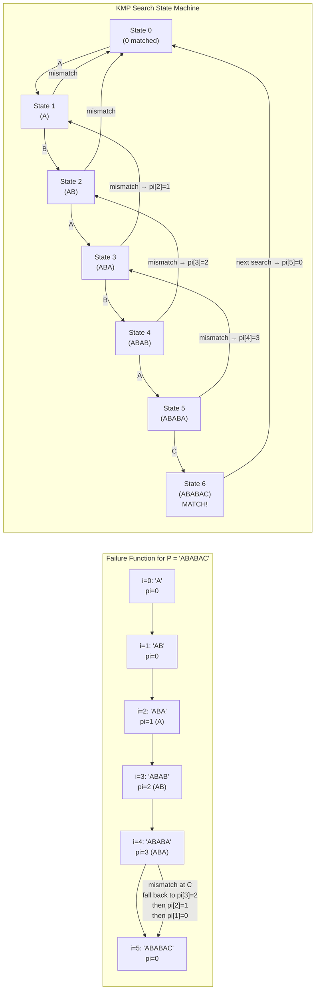

---
title: KMP Algorithm
aliases: [Knuth-Morris-Pratt, Failure Function, Pi Array, Partial Match Table]
tags: [DSA, CompetitiveProgramming, KMP, StringMatching, FailureFunction]
domain: DSA
difficulty: Advanced
created: 2026-07-26
related: [Z_Algorithm, String_Hashing, Suffix_Array]
status: complete
---

# 🔍 KMP Algorithm

> [!abstract] TL;DR
> Knuth-Morris-Pratt (KMP) finds all occurrences of a pattern P in a text T in O(n + m) time, where n = |T| and m = |P|. The key insight: when a mismatch occurs at position j in the pattern, we do not restart from position 0. Instead, we use the failure function (pi array) to jump to the longest prefix of P that still matches the suffix of what we've seen. This avoids revisiting characters, guaranteeing linear time.

## Intuition — analogy FIRST

Imagine reading a novel looking for the phrase "ABABC." You're matching letter by letter. You've matched "ABAB" and the next letter is 'D' — mismatch. Naively, you'd back up to position 1 in the novel and restart. But that's wasteful: you already know the last four characters you read were "ABAB." The first two of those ("AB") are a prefix of the pattern AND a suffix of what you matched. So instead of restarting at zero, you can pretend you're at position 2 in the pattern ("AB" already matched) and just continue forward from here. KMP computes this "safe rewind position" for every position in the pattern — that's the pi (failure function) array.

## How It Works — full explanation + mermaid

### The Pi (Failure Function) Array

For pattern P of length m, define:

$$\pi[i] = \text{length of the longest proper prefix of } P[0 \ldots i] \text{ that is also a suffix of } P[0 \ldots i]$$

"Proper" means not the entire string itself.

**Example for P = "ABABAC"**:
```
i = 0: "A"      → no proper prefix = suffix → pi[0] = 0
i = 1: "AB"     → "A" is not suffix "B"     → pi[1] = 0
i = 2: "ABA"    → "A" is a prefix and suffix → pi[2] = 1
i = 3: "ABAB"   → "AB" is prefix and suffix  → pi[3] = 2
i = 4: "ABABA"  → "ABA" is prefix and suffix → pi[4] = 3
i = 5: "ABABAC" → no match                   → pi[5] = 0
```

So `pi = [0, 0, 1, 2, 3, 0]`.

### Computing Pi — the Algorithm

The key observation: if `pi[i-1] = k` (meaning P[0..k-1] is a border of P[0..i-1]), then to find `pi[i]` we check if `P[k] == P[i]`:
- If yes: `pi[i] = k + 1`
- If no: fallback to `k = pi[k-1]` and retry (chain of fallbacks along previous pi values)
- If k becomes 0 and still no match: `pi[i] = 0`

This gives an amortized O(m) algorithm to compute all of pi.

### KMP Search

Build pi for the pattern P. Concatenate `P + '#' + T` (the '#' separator ensures no spurious matches across the boundary) and compute the pi array of this combined string. Any position where pi value equals m is a match.

Alternatively, use two pointers: `j` tracks how many pattern characters have been matched so far:

```
for each character text[i]:
    while j > 0 and text[i] != pattern[j]:
        j = pi[j-1]    # fall back using failure function
    if text[i] == pattern[j]:
        j += 1
    if j == m:          # full match found
        report match at text[i - m + 1]
        j = pi[j-1]    # reset for next potential match
```

### KMP as a Finite Automaton

The pi array defines a deterministic finite automaton (DFA) for the pattern. Each state = number of characters matched. On a match, advance state. On mismatch, follow the failure link (pi) to a smaller state. This automaton can be precomputed fully in O(m × alphabet_size) for O(1) transitions during search.



## The Math

**Pi amortized analysis**: Each character comparison either increases `j` by 1 or keeps `j` the same after a fallback. Total increases ≤ n (length of string). Each fallback strictly decreases `j`. Therefore total fallbacks ≤ total increases ≤ n. Total operations = O(n).

**Border of a string**: A string s has a border b if b is both a proper prefix and a proper suffix of s. pi[i] = length of the longest border of P[0..i]. The chain of fallbacks `pi[i] → pi[pi[i]-1] → ...` enumerates all borders of P[0..i] in decreasing order.

**Period via pi**: The shortest period of string s of length n is `n - pi[n-1]`. If `n % (n - pi[n-1]) == 0`, then s consists of that period repeated exactly.

**Match as border**: The concatenation trick works because `pi[len(P) + 1 + i]` for the combined string `P#T` can never exceed `len(P)` (since '#' blocks matches spanning the separator). When pi value equals `len(P)`, exactly the pattern has been found ending at position i in T.

## Template Code

```python
# ─── Compute failure function (pi array) ──────────────────────────
def compute_pi(pattern: str) -> list[int]:
    """
    pi[i] = length of longest proper prefix of pattern[0..i]
            that is also a suffix of pattern[0..i].
    O(m) time and space.
    """
    m = len(pattern)
    pi = [0] * m
    j = 0   # length of previous longest border
    for i in range(1, m):
        # Fall back until we find a match or reach start
        while j > 0 and pattern[i] != pattern[j]:
            j = pi[j - 1]
        if pattern[i] == pattern[j]:
            j += 1
        pi[i] = j
    return pi

# ─── KMP search: find all occurrences of pattern in text ──────────
def kmp_search(text: str, pattern: str) -> list[int]:
    """
    Returns list of all start positions (0-indexed) where pattern
    occurs in text. O(n + m) time.
    """
    n, m = len(text), len(pattern)
    if m == 0:
        return list(range(n + 1))
    if m > n:
        return []

    pi = compute_pi(pattern)
    matches = []
    j = 0   # number of pattern characters matched so far

    for i in range(n):
        while j > 0 and text[i] != pattern[j]:
            j = pi[j - 1]
        if text[i] == pattern[j]:
            j += 1
        if j == m:
            matches.append(i - m + 1)
            j = pi[j - 1]  # reset for next match

    return matches

# ─── Shortest period of a string ───────────────────────────────────
def shortest_period(s: str) -> int:
    """
    Returns the length of the shortest period of s.
    s is composed of this period repeated (possibly partially).
    Example: "ABABAB" → period 2 ("AB").
    """
    pi = compute_pi(s)
    n = len(s)
    period = n - pi[n - 1]
    # If period divides n evenly, s is a perfect repetition
    if n % period == 0:
        return period
    return n   # no proper period; the string itself is the period

# ─── Repeated string pattern check ────────────────────────────────
def is_repeated_pattern(s: str) -> bool:
    """
    Returns True if s can be constructed by repeating a substring.
    Equivalent to: shortest_period(s) < len(s) and len(s) % period == 0.
    LeetCode 459.
    """
    return shortest_period(s) < len(s)

# ─── Shortest palindrome (prepend minimum chars to make palindrome) -
def shortest_palindrome(s: str) -> str:
    """
    Find shortest palindrome by prepending to s.
    Use KMP on s + '#' + reverse(s) to find longest palindromic prefix.
    O(n) time.
    """
    rev = s[::-1]
    combined = s + '#' + rev
    pi = compute_pi(combined)
    longest_palindromic_prefix_len = pi[-1]
    suffix_to_prepend = s[longest_palindromic_prefix_len:][::-1]
    return suffix_to_prepend + s

# ─── Count occurrences using pi on concatenated string ────────────
def kmp_via_concat(text: str, pattern: str) -> list[int]:
    """
    Alternative: compute pi on 'pattern#text' and look for pi == len(pattern).
    Equivalent to kmp_search but uses concatenation approach.
    """
    m = len(pattern)
    combined = pattern + '#' + text
    pi = compute_pi(combined)
    return [i - 2 * m for i in range(2 * m + 1, len(combined))
            if pi[i] == m]
```

## Worked Example — trace through a real problem

**Problem**: Find all occurrences of pattern "ABAB" in text "ABABCABABD".

**Step 1: Compute pi for "ABAB"**:
```
i=0: 'A'    → pi[0] = 0
i=1: 'AB'   → 'B' ≠ 'A' → pi[1] = 0
i=2: 'ABA'  → pattern[2]='A' == pattern[0]='A' → pi[2] = 1
i=3: 'ABAB' → pattern[3]='B' == pattern[1]='B' → pi[3] = 2

pi = [0, 0, 1, 2]
```

**Step 2: Search through "ABABCABABD"**:

```
Text:    A  B  A  B  C  A  B  A  B  D
Index:   0  1  2  3  4  5  6  7  8  9
j:       0  1  2  3  4  2  3  4  5→MATCH  ...
```

Detailed trace:

| i | text[i] | pattern[j] | match? | action | j after |
|---|---|---|---|---|---|
| 0 | A | A (j=0) | Yes | j++ | 1 |
| 1 | B | B (j=1) | Yes | j++ | 2 |
| 2 | A | A (j=2) | Yes | j++ | 3 |
| 3 | B | B (j=3) | Yes | j++ | 4 = m → **MATCH at 0** |
| — | — | — | — | j = pi[3] = 2 | 2 |
| 4 | C | A (j=2) | No | j = pi[1] = 0, C≠A → j=0 | 0 |
| 5 | A | A (j=0) | Yes | j++ | 1 |
| 6 | B | B (j=1) | Yes | j++ | 2 |
| 7 | A | A (j=2) | Yes | j++ | 3 |
| 8 | B | B (j=3) | Yes | j++ | 4 = m → **MATCH at 5** |
| — | — | — | — | j = pi[3] = 2 | 2 |
| 9 | D | A (j=2) | No | j = pi[1] = 0, D≠A → j=0 | 0 |

**Result**: Matches at positions **0** and **5**.

## CP Problem Patterns

| Problem | KMP application |
|---|---|
| Find all occurrences of P in T | Direct KMP search |
| Does string S have a repeated pattern? | Period = n - pi[n-1]; check if divides n |
| Shortest string that contains S as suffix and is a palindrome | Reverse trick + pi on S+'#'+rev(S) |
| Minimum rotations to make S == T | KMP search for S in T+T |
| Lexicographically smallest rotation | KMP or suffix array |
| Count strings with pattern as subsequence | pi array on pattern, DP |
| How many prefixes of P appear in T? | Count positions with pi == 1..m |

## Common Pitfalls & Edge Cases

- **pi[0] = 0 always**: A single character has no proper prefix. The loop must start at i=1.
- **Forgetting to reset j after a match**: After finding a match, set `j = pi[m-1]` to allow overlapping matches. Omitting this misses overlapping occurrences.
- **Infinite loop in pi computation**: The while loop `while j > 0 and pattern[i] != pattern[j]: j = pi[j-1]` always terminates because j strictly decreases each iteration and stops at 0.
- **Concatenation separator**: When using the `P+'#'+T` approach, the separator must not appear in P or T. Use '#' for lowercase-letter strings, or `chr(0)` for general strings.
- **Off-by-one in match reporting**: Match ends at index i (0-indexed), so start index = `i - m + 1`.
- **Empty pattern**: Define behavior explicitly — typically matches everywhere.
- **pi for the entire search string**: When computing pi on the concatenated string `P#T`, pi values in the T portion that equal m indicate matches. pi values that equal numbers < m in the P prefix portion are just building up pi — don't confuse these as matches.
- **KMP is NOT the fastest in practice**: For very large texts and alphabets, Boyer-Moore or [[Aho_Corasick|Aho-Corasick]] may be preferred. KMP is O(n+m) worst case, which is optimal, but with a larger constant than Z-algorithm in practice.

## Related Concepts

- [[_MOC_Competitive_Programming|↑ Section MOC]]
- [[Z_Algorithm]]
- [[String_Hashing]]
- [[Suffix_Array]]
- [[CP_Setup_and_Tools]]

## Review Questions

1. Compute the full pi (failure function) array for the pattern "AABAABAAB" step by step. Verify that the shortest period of this string can be derived from `pi[n-1]`.
2. Explain why the pi computation algorithm is amortized O(m). Specifically, why can't the total number of iterations of the inner `while j > 0` loop exceed m?
3. A string S is called a rotation of T if S can be obtained by moving some prefix of T to the end. Given S and T of equal length n, describe how to check if S is a rotation of T using KMP, and explain why the search space `T + T` covers all rotations.

## Sources / Problems

- LeetCode: 28 (Find the Index of the First Occurrence), 459 (Repeated Substring Pattern)
- LeetCode: 214 (Shortest Palindrome — pi on reversed string), 1392 (Longest Happy Prefix)
- Codeforces: problems tagged "kmp", "string suffix structures"
- USACO: String problems at Silver/Gold level
- CP-algorithms.com: "Prefix Function / KMP"
- "Introduction to Algorithms" (CLRS) — Chapter 32 (String Matching)
- "Competitive Programmer's Handbook" — Chapter 26

#KMP #KnuthMorrisPratt #FailureFunction #PiArray #StringMatching #StringAlgorithms #PatternSearch
